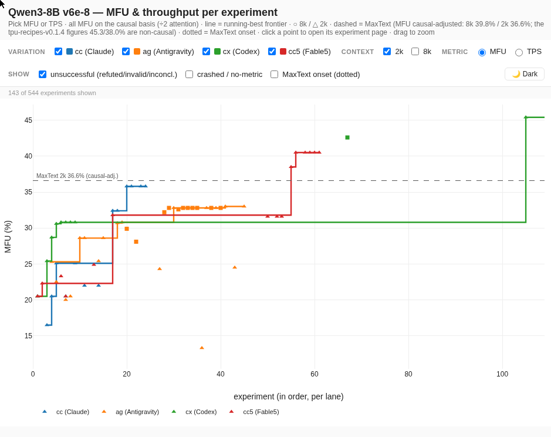
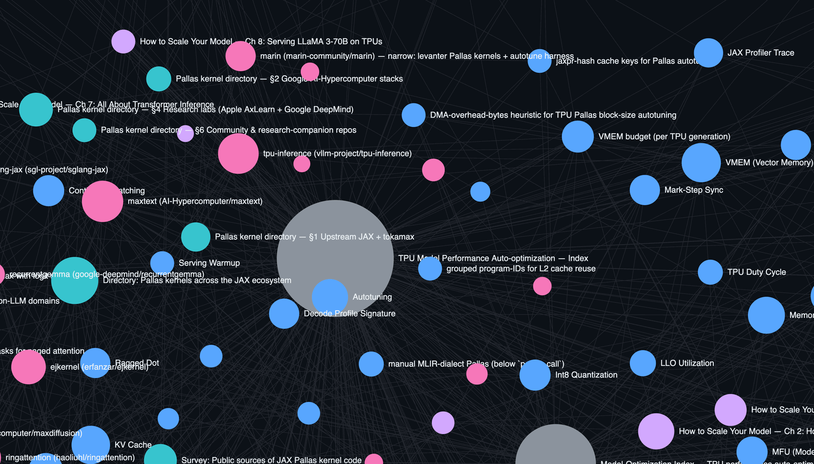
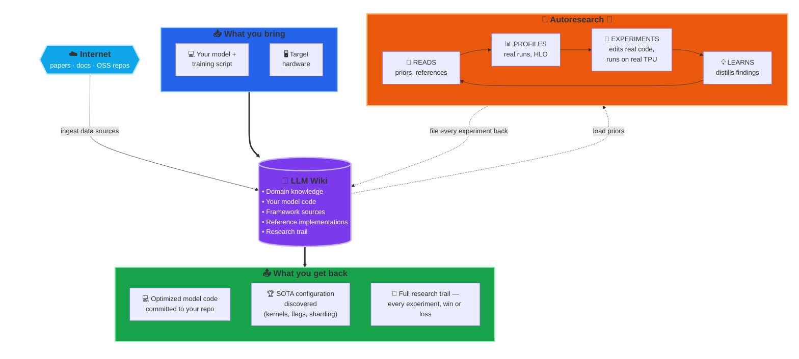

# 🤖 TPU Model Performance Auto-optimization

> **Model optimization that feels like cheating.**
> Point an LLM agent at your training script and hardware target, come back to a **state-of-the-art-capable configuration** with a fully documented research trail.

This repository is an experiment in **autonomous TPU model performance optimization**, end-to-end: profile analysis, hypothesis generation, experiment execution on real hardware, and result synthesis — all run by an LLM agent against a knowledge base it maintains itself.

The claim is structural, not incremental: **given a sufficiently capable LLM, the right profiling tools, and a knowledge base that includes the model's + framework's source, an autonomous agent can drive any (model, hardware) pair to state-of-the-art performance for that combination**. This isn't a replacement for performance engineers — it's a force multiplier. The primary goal is unchanged: a faster model. The engineer stays in charge of direction (picking targets, adjudicating contradictions, deciding which gains are worth keeping); the agent absorbs the legwork (reading code, generating hypotheses, running experiments, profiling, writeup).

> 📝 **Blog series:** a series of articles walks through this TPU auto-optimization work in depth — motivation, methodology, and case-study results. Read them at **[vlasenkoalexey.github.io/tags/autoresearch](https://vlasenkoalexey.github.io/tags/autoresearch/)**.


## Case study

Now auto-optimization works for Claude Code (Opus 4.8 and Fable 5), Codex (GPT-5.5), and Antigravity (Gemini 3.1 pro).
To demonstrate that we performed a side by side comparison of how each model + harness is able to handle auto-optimization fully autonomously — the only steering was eventually pointing each agent at the MaxText repo as a reference.

Click image below to explore experiments yourself.

[](https://vlasenkoalexey.github.io/tpu_performance_autoresearch_wiki/wiki/analyses/qwen3/mfu-explorer.html)

At least Codex GPT-5.5 and Fable 5 were able to autonomously achieve better results compared to the optimized MaxText version.

Explore original experiments for Llama3 8B here: https://vlasenkoalexey.github.io/tpu_performance_autoresearch_wiki/wiki/analyses/llama3/mfu-explorer.html

## The Core Components

### 🔁 Autoresearch — specialized to TPU perf

**Autoresearch** — introduced in [Andrej Karpathy's autoresearch github repo](https://github.com/karpathy/autoresearch) — is a methodology for letting an LLM agent run an open-ended research program: propose ranked hypotheses, run experiments, evaluate outcomes, revise priors, feed what it learned into the next round. The methodology is **domain-agnostic** — any question you can frame as a ranked set of falsifiable experiments with measurable outcomes is a candidate. Karpathy's original target was LLM pretraining *quality* (architectural and optimizer tweaks judged by loss); **this repository specializes the same loop to TPU model *performance*** — wall-clock step time, tokens/sec, MFU, memory budget.

Applied in this repo, the loop runs continuously: **hypothesis → minimal code diff → benchmark on real hardware → profile + HLO capture → op-by-op diff against the prior best → profile-grounded verdict → writeup + ledger row → next round.** Every experiment, winning or losing, is recorded as context for the next hypothesis and submitted to a separate git branch. Successful experiments are built on top of each other creating a hierarchical tree of ideas that play best together. The discipline is what makes the loop compound rather than oscillate — each experiment permanently improves the priors for the next one. The rest of this section describes the supporting components that make that discipline possible in the TPU-perf domain.

### 🔌 Xprof MCP — profiling as a first-class LLM capability

Autoresearch is a feedback loop: hypothesize → experiment → **observe** → revise. Without the *observe* step grounded in real signal, the loop collapses into flag-guessing. For TPU performance optimization, "real signal" means knowing where each millisecond of step time goes, which tensor sits where in HBM, and where every op lands on the roofline. The source of truth is [**XProf**](https://github.com/openxla/xprof), OpenXLA's official TPU profiler — step-time breakdown, per-HLO-op runtime + memory traffic, collective-overlap timing, roofline classification, memory timeline.

Raw XProf is a web UI, not something an LLM agent can use directly. We bridge the gap with [**xprof_mcp**](https://github.com/vlasenkoalexey/xprof-mcp), an [MCP](https://modelcontextprotocol.io/) server that turns XProf into a set of programmatic tools the LLM calls directly.

Besides analyzing profiles, it also exposes an API to access **HLO dumps** — produced when the trainer is launched with [`XLA_FLAGS="--xla_dump_to=<dir> --xla_dump_hlo_as_text"`](https://openxla.org/xla/flags_guidance) — which lets the LLM connect profile information back to the [**optimized HLO**](https://openxla.org/xla/architecture#xla_the_tensorflow_compiler_framework) (what XLA actually executes on the TPU, after layout assignment, fusion, scheduling, collective-fusion, and remat passes) and to the [**original HLO**](https://openxla.org/xla/operation_semantics) (the IR the framework — JAX or torchax — emitted before XLA's optimization passes ran). From there the LLM can backtrace the original HLO back to the line of model code that produced it.

### 🧠 LLM Wiki — collection of domain knowledge on TPU optimization

Out of the box, an LLM's knowledge of TPU performance is thin — it has a rough sense of FLOPs, attention, and general ML training, but not much sense of XLA optimization passes, VMEM budgets, splash attention's block-size knobs, how torchax dispatches through JAX, or the quirks of any particular Pallas kernel. The usual fix for this kind of gap is **RAG** — retrieve snippets from a vector database at query time. That works, but it's probabilistic (you hope the right chunk lands in the top-k), expensive to set up (embedding pipeline, vector store, rank tuning), and hard to audit after the fact.

A lighter alternative, popularized by Karpathy in his [**LLM wiki gist**](https://gist.github.com/karpathy/442a6bf555914893e9891c11519de94f), is to just build a wiki: plain markdown files on disk, with a schema, cross-linked by relative paths, backed by an `index.md` the LLM reads first on every task. Retrieval is `grep` — deterministic, auditable, near-free. No vector DB, no embeddings, no rank tuning. The LLM reads what it needs and writes what it learns, and because markdown is human-readable too, a person can open the wiki at any time and see exactly what the LLM "knows" about the domain.

In practice, using an LLM wiki is straightforward: you point the agent at a source — a paper, a doc page, a codebase — and ask it to summarize into the schema's page format, cross-linked to anything it touches. Ingestion can be as low-lift as *"find every public reference to Pallas TPU kernels, catalog them by repo, backend, stability, and claimed performance improvements, and add the result to the wiki"* — which is exactly how this repo's [Pallas kernel directory](wiki/analyses/2026-04-23-pallas-kernel-directory.md) was built, surveying ~200 kernels across ~30 OSS repos and indexing them by function. The payoff is leverage on every subsequent run: when the agent is scoring optimization hypotheses later, it already knows which Pallas kernels exist in the ecosystem, which are production-grade, and how to apply them — no re-discovery, no hallucinating kernels that don't exist.

**Bonus**: because the wiki is plain markdown with relative links, you can point [**Obsidian**](https://obsidian.md/) — a free, local-first markdown knowledge-base editor — at the wiki directory and immediately get a navigable graph view, backlinks, full-text search, and tag filtering on top of exactly the same files the LLM is reading and writing. 

Click image below for live visualization of what current wiki knowledge base looks like:

[](https://vlasenkoalexey.github.io/tpu_performance_autoresearch_wiki/tools/graph/index.html)


### 💻 Your model codebase — what LLM can actually change and optimize

The model code you want to optimize rarely exists in isolation — it lives inside a larger training framework your team owns or forks, like [TorchTitan](https://github.com/pytorch/torchtitan). The wiki structure adapts naturally: add the framework as a git submodule under `raw/code/<slug>`, pin the commit you ingested, and let the agent edit it in place on per-experiment branches. Each experiment is a real diff on a real branch — auditable, revertable, and tied back to the experiment page that produced it, the profile that justified it, and the verdict that accepted or rejected it.

This is the part that distinguishes this setup from "LLM as smart reader." The agent gets **write access** to the model code, not just read access. It can swap an attention kernel, tune a batch size, restructure remat, flip an XLA flag, and then measure whether it actually helped — all under the autoresearch protocol that makes the change reviewable. There are multiple ways to wire this up (submodule, sibling clone, monorepo subdir), and no single right way — pick the one that matches how your team already version-controls the model.

### 🏆 State of the art repos — optimization reference

The setup so far is enough for the agent to optimize your model on its own — but you can shortcut a lot of the search by handing it a working reference for what "fast on TPU" actually looks like. Ingest a state-of-the-art TPU codebase alongside your own and the optimization question changes shape: instead of *"explore the space of possible optimizations,"* it becomes *"figure out why this reference model is fast, why mine is slow, and close the gap."* That's a much narrower, much more tractable search.

Concrete references worth ingesting: for TPU training, [MaxText](https://github.com/AI-Hypercomputer/maxtext) and [MaxDiffusion](https://github.com/AI-Hypercomputer/maxdiffusion); for inference, [vLLM](https://github.com/vllm-project/vllm) and [SGLang](https://github.com/sgl-project/sglang) (both have first-class TPU backends). Once these are in the wiki — kernels cataloged, sharding strategies indexed, XLA flags noted — the agent has a concrete target to compare against, not just a space of abstract hypotheses.

And the agent can go further than reading code. It can actually **run** the reference model, profile it through the same xprof MCP it uses for your own model, and read its HLO and op-level breakdown side-by-side with yours. From there it can attribute the gap concretely — different attention kernels, different fusion patterns, different sharding or remat strategies, different XLA flags — and turn each gap item into a falsifiable hypothesis on your own model. That short-circuits a large chunk of the search: many "what should I try next?" decisions collapse into "do what the fast reference already does, and measure."

### ⚙️ Your framework's codebase — going even deeper

Optional, but useful: ingest the framework your model is built on. The dominant choice on TPU is [JAX](https://github.com/jax-ml/jax), but PyTorch-on-TPU paths matter too — [PyTorch/XLA](https://github.com/pytorch/xla), [torchax](https://github.com/pytorch/xla/tree/master/torchax), and the [TorchTPU](https://developers.googleblog.com/torchtpu-running-pytorch-natively-on-tpus-at-google-scale/) (coming soon) work. With the framework in the wiki, the agent can resolve crash stacktraces all the way down to the framework internals, reason about *why* a particular dispatch path emitted the HLO it did, and propose fixes that touch the framework boundary rather than just the model code. This is where the deeper bugs and the deeper wins tend to live — not in your model file, but in how your framework lowers it to XLA.

**Bonus** — if your model is in PyTorch, consider asking the LLM to port it to JAX as a stepping stone. The vast majority of public TPU optimization knowledge — kernels, sharding patterns, scaling recipes, reference trainers like MaxText — is JAX-native, so an agent has dramatically more priors to work with on the JAX side, and a PyTorch-only loop can stall on questions where the JAX-side answer is well-known. With the full model repo, the framework source on both sides, and a state-of-the-art JAX reference all in the wiki, porting is largely a mechanical exercise the agent can do on its own. Optimize there, then translate the wins back: a kernel choice becomes a torchax call, a sharding spec becomes a `torch.distributed` plan, a flag becomes an `XLA_FLAGS` line. JAX serves as the optimization playground; your PyTorch codebase remains the destination.

---

## Putting it all together

Combine these ingredients and you have an agent that knows your model and your codebase intimately, can run and profile the training script end-to-end, can pinpoint bottlenecks from a trace, can attribute every op on the profile back to the HLO that produced it and the line of model code that emitted that HLO, and can step into the framework when the answer lives below your model — all while recording every experiment, every verdict, and every prior it revised along the way.

And critically, this is a **self-learning, self-improving** agent. Every experiment it runs — winners *and* losers — is filed back into the wiki as a permanent piece of context: what was tried, what worked, what didn't, and *why*. The next hypothesis is scored against that growing record, so a refuted experiment in week one shapes the ranked list in week ten; a generalizable lesson extracted from one failed run ("scan-over-layers needs an internally-tiled attention kernel") becomes a prior the agent applies automatically the next time scan comes up. The longer it runs, the smarter it gets — not because the model is updating, but because the wiki is.



Point it at a model and act as reviewer — you approve hypotheses, arbitrate contradictions, and audit the trail; the agent does the reading, profiling, experimenting, and learning. Every cycle leaves the wiki smarter than before, so the next cycle starts from a better prior.

**Beyond TPU performance.** This repo extends the original autoresearch idea into a more general architecture: **autoresearch is an optimization loop** that proposes ranked, falsifiable experiments; **the wiki is a knowledge base** of domain information that informs hypothesis generation and experiment design (papers, codebases, concepts, and the running record of what's been tried); and **the MCP server is an observer** that grounds each iteration in real signal. The observer is the domain-specific piece — it's what raises the signal-to-noise of every measurement the loop makes, and without it the loop degenerates into flag-guessing.

## What this unlocks

- **Optimization that feels like cheating.** Describe a goal in a sentence. Come back to a configuration at or near the hardware's achievable ceiling, with a linked research trail showing every experiment that led there. The LLM picks the right experiments because it has read the right papers, studied the right code, and learned from every prior experiment it ran on this model.
- **Ask questions, let the LLM explore.** "Why are we OOM-ing at batch=4?" "What kernel would help the loop-fusion bucket?" "Does splash win at seq=2048?" — the LLM reads the profile, surfaces the relevant prior experiments, proposes the next hypothesis, runs it. You don't need to know what to ask next.
- **Dramatic ramp-up speedup.** An engineer new to TPU perf can browse `concepts/` → `analyses/` → `experiments/` and build a real mental model in hours instead of weeks. The wiki is a curriculum that **writes itself as it's used**.
- **Debug the framework, not just the model.** Most TPU perf issues aren't in your model — they're in torchax's dispatch, JAX's sharding plan, or a Pallas kernel's `shard_map` wrapping. With the framework source ingested, the LLM can read it. When torchax's `JittableModule` dedup produced a tied-weight crash (exp 2), the agent pinpointed the cause by grepping `raw/code/torchax/`. When scan-over-layers + XLA SDPA regressed −60 % (exp 51), it explained the mechanism by cross-referencing JAX's scan lowering with the attention code path.
- **Generalizable findings, written down.** A recent run discovered that **Pallas custom-calls only beat XLA when XLA wasn't already fusing the pattern** — confirmed twice independently (exp 33 Pallas RMSNorm, exp 47 levanter fused CE, both rejected at the same boundary tax). That insight now lives in [an analysis page](wiki/analyses/2026-04-24-gemma4-jax-ceiling-and-process-retrospective.md) and will guide every future Pallas hypothesis. Writing this down is what turns 50 experiments into leverage for the next 50.


## Repo layout

```
SCHEMA.md           single source of truth — page types, operations, rules.
CLAUDE.md           @SCHEMA.md pointer for Claude Code.
GEMINI.md           @SCHEMA.md pointer for Gemini CLI.
AGENTS.md           Codex project instructions; points Codex at SCHEMA.md and shared skills.
.claude/            canonical shared agent skills, scripts, Claude subagents, Claude hook.
.agents/skills      Codex + Antigravity/Gemini skill-discovery symlink to .claude/skills.
.codex/             Codex-only adapters: MCP config, custom-agent wrappers, hook wiring.
sample-program.md   template program.md — copy to wiki/experiments/<slug>/program.md and fill in placeholders.
wiki/               LLM-owned markdown (index, log, page types per schema).
  index.md          cross-section — updated on every write.
  log.md            append-only event log.
  sources/          ingested papers, docs, talks.
  codebases/        ingested repos (one page per repo, performance-relevant surfaces annotated).
  concepts/         techniques, hardware features, compiler flags, kernels.
  models/           each model under optimization.
  hypotheses/       ranked candidate optimizations.
  experiments/      runs — config, profile link, metrics, verdict.
  observations/     reusable findings pulled from profiles / runs.
  analyses/         syntheses, ceiling reports, directories.
raw/                immutable inputs — never modified.
  sources/          PDFs, HTML snapshots of papers.
  code/             ingested repos (git submodules) — model code + framework + kernels.
  profiles/         xprof traces, HLO dumps (gitignored, multi-GB per run).
  assets/           figures, plots.
```

---

## Get started

Clone with submodules (the `raw/code/` dir pulls ~26 codebases totalling a few GB; use `--depth` if that matters to you):

```bash
git clone --recurse-submodules https://github.com/vlasenkoalexey/tpu_performance_autoresearch_wiki
cd tpu_performance_autoresearch_wiki
```

Or on an existing clone:

```bash
git submodule update --init --recursive
```

Start an LLM agent session (Claude Code, Gemini CLI, Codex, etc.) in this directory. The agent reads [`SCHEMA.md`](SCHEMA.md) and [`wiki/index.md`](wiki/index.md) on first turn and knows how to operate the wiki.

For Codex specifically, the repo includes additive compatibility adapters: [`AGENTS.md`](AGENTS.md) for project instructions, `.agents/skills` as a symlink to the canonical `.claude/skills`, `.codex/agents/` wrappers for the two Claude subagents, and `.codex/config.toml` with an optional local XProf MCP endpoint at `http://localhost:8792/mcp`. Keep `.claude/` as the canonical shared source so Claude Code and Antigravity remain compatible.

To run the optimization loop against your own model:

1. Add the model's training repo as a submodule: `git submodule add <url> raw/code/<slug>`
2. Ask the agent to ingest it: *"Ingest raw/code/<slug> as a codebase page, highlighting performance-relevant surfaces."*
3. Create a model page under `wiki/models/<slug>.md` with baseline metrics and a hardware target.
4. Bootstrap a `program.md` from the template at [`sample-program.md`](sample-program.md): *"Copy `sample-program.md` to `wiki/experiments/<slug>/program.md`, fill in every `<PLACEHOLDER>` for `raw/code/<slug>` on my hardware, and adapt the model-specific Pallas tables. Refer to other experiments and documentation in this wiki for the model-specific values."*
5. Check your `program.md` file — the template marks every section as `<!-- GENERIC -->` (leave as-is unless your stack genuinely differs) or `<!-- MODEL-SPECIFIC -->` (must edit). Adjust as needed.
6. Ask the agent: *"Start model optimization in accordance with the protocol described in `wiki/experiments/<slug>/program.md`."*

The rest is iteration.

For a worked case study, see [`wiki/experiments/llama3_8B_autoresearch_optimization/`](wiki/experiments/llama3_8B_autoresearch_optimization/) — browse the experiment pages in chronological order to see the loop in action. The two existing program.md files ([Llama 3 8B](wiki/experiments/llama3_8B_autoresearch_optimization/program.md), [Gemma 4 E4B](wiki/experiments/gemma4_autoresearch_optimization/program.md)) are concrete instantiations of [`sample-program.md`](sample-program.md) — useful as cross-reference if a placeholder in the template is ambiguous.

Like autoresearch itself, this repo isn't meant to be used as-is — it provides a structure and starting point you adapt to your own model and codebase.

The optimization loop runs on either a [Cloud TPU VM](https://cloud.google.com/tpu/docs/create-tpu-vm) or a [GKE TPU cluster](https://cloud.google.com/kubernetes-engine/docs/how-to/tpus). If you're reading this, the assumption is that you're already familiar with those.

To teach your agent to use your GKE cluster, paste prompts like these:
- *"Use this cluster for experiments: name=... region=... project=..."*
- *"Check the cluster topology and number of slices available to see if you can run multiple experiments in parallel."*
- *"Save cluster information under the .env folder for future reference."*

---

## Add a new codebase to the wiki's working memory

```bash
git submodule add <repo-url> raw/code/<slug>
```

Then ask the agent to ingest it — see [`SCHEMA.md`](SCHEMA.md) → `INGEST-CODEBASE`. The agent will write a `wiki/codebases/<slug>.md` with a performance-relevant-surfaces table, generate concept stubs for any technique named that lacks a page, and propose new hypothesis candidates derived from the code.

---

## Ingested codebases (current)

The repos below are git submodules under `raw/code/` and have corresponding pages in `wiki/codebases/`. Together they cover the JAX stack, profiling, kernel libraries, reference trainers, inference engines, and research-lab artifacts.

### Foundation

- [jax](raw/code/jax) — JAX itself: transformations, sharding, `jax.profiler`, Pallas DSL, first-party TPU kernels (`flash_attention`, `splash_attention`, `paged_attention`, `ragged_paged_attention`, `megablox`, `matmul`, `all_gather`, `threefry`). Ground truth for everything downstream.
- [xprof](raw/code/xprof) — XProf profiler + TensorBoard plugin (OpenXLA). Profile capture + UI.
- [xprof-mcp](raw/code/xprof-mcp) — MCP server wrapping xprof for agent-driven analysis (the "profiling brain").
- [stablehlo](raw/code/stablehlo) — StableHLO op-set + MLIR dialect reference; consulted when reading HLO dumps.

### Frameworks

- [torchax](raw/code/torchax) — PyTorch-on-JAX interop layer (Google).
- [jax-huggingface](wiki/codebases/jax-huggingface.md) (under [learning-machine](raw/code/learning-machine)) — Qi Huang's JAX/ML tutorial series, including Llama-2 + SD2 on TPU.

### Kernels

- [tokamax](raw/code/tokamax) — OpenXLA custom TPU/GPU Pallas kernels (splash, GLU, layer_norm, ragged_dot, cross-entropy).
- [pallas-forge](raw/code/pallas-forge) — auto-tuning framework for Pallas kernels on TPU.
- [ejkernel](raw/code/ejkernel) — broadest community TPU Pallas surface (17 kernels).
- [ringattention](raw/code/ringattention) — canonical Pallas TPU ring-attention (Liu et al. 2023).
- [alphafold3](raw/code/alphafold3) (@ v3.0.1) — only public production Pallas fused GLU (GPU Triton-on-Pallas); kernels removed from `main` after v3.0.1.
- [recurrentgemma](raw/code/recurrentgemma) — DeepMind's canonical Mosaic-TPU LRU Pallas scan.
- [aqt](raw/code/aqt), [qwix](raw/code/qwix) — quantization frameworks; qwix is AQT's successor.

### Reference trainers & inference engines

- [maxtext](raw/code/maxtext) — AI-Hypercomputer reference JAX trainer for Gemma/Llama/DeepSeek/Qwen/Mistral/Kimi.
- [maxdiffusion](raw/code/maxdiffusion) — AI-Hypercomputer reference JAX diffusion trainer; first-class ring-attention integration.
- [tpu-inference](raw/code/tpu-inference) — vLLM's TPU inference backend; novel RPA v2/v3, MLA v1/v2, fused_moe v1, blockwise quantized_matmul, all_gather_matmul, GDN, SparseCore kernels.
- [sglang-jax](raw/code/sglang-jax) — SGLang's JAX port; ~2,000+ tuned block-size entries.
- [axlearn](raw/code/axlearn) — Apple's training framework; only public Pallas Mamba1 / Mamba2 / RAttention SSM kernels.
- [EasyDeL](raw/code/EasyDeL) — training/serving framework wrapping ejkernel.
- [marin](raw/code/marin) — vendors levanter; fused CE kernel with Gemma-style logit soft-cap + deployment-time autotune harness.
- [tpu-recipes](raw/code/tpu-recipes) — AI-Hypercomputer's reproducible recipes for training + inference on Cloud TPU (Trillium v6e and Ironwood v7x). Tuned per-(model, hardware, topology) MaxText configs (`remat_policy`, `decoder_layer_input: offload`, `query_proj`/`key_proj`/`value_proj` offload, FSDP sharding) for Llama 3.1, Gemma 3/4, Mixtral, DeepSeek 3, Qwen 3, GPT-OSS, Wan 2.1, GPT-3, plus diffusion (SDXL, Diffusion-2). Includes microbenchmarks for HBM bandwidth and matmul peak throughput.

### Other

- [autoresearch](raw/code/autoresearch) — Karpathy's autoresearch reference implementation.
- [scaling-book](raw/code/scaling-book) — "How To Scale Your Model" (DeepMind).
- [graphcast](raw/code/graphcast) — DeepMind weather-forecasting model; splash-wrapper non-LLM example.
- [simply](raw/code/simply) — DeepMind serving framework.
- [jaxite](raw/code/jaxite) — FHE Pallas kernels (only non-ML Pallas TPU reference).

---

## FAQ

**Is this production-ready?**
No. This is a research project. The loop works on the Gemma 4 E4B / v6e-4 example in this repo; it should generalize, but treat every number with engineer-grade skepticism: verify against your own profiles.

**Does it need a specific LLM?**
The wiki is plain markdown + MCP. Tested with Claude Code and Gemini CLI. Any agent that can run tools + read/write markdown + query MCP servers should work.

**Does it need Google Cloud?**
Only if your TPU lives there. The wiki, profiles, and analyses are just files.

**What if my framework / model / hardware isn't ingested yet?**
Add it as a submodule under `raw/code/` and ask the agent to ingest it. That's the whole onboarding flow — see `INGEST-CODEBASE` in [`SCHEMA.md`](SCHEMA.md).

**Can it change my model's semantics?**
The protocol explicitly forbids it. Any optimization that changes loss trajectory beyond bf16-reorder noise is marked `-invalid` and not reported as a win (see [`SCHEMA.md`](SCHEMA.md) rule #6).

---

## Authoritative contract

[`SCHEMA.md`](SCHEMA.md) defines page types, operations, frontmatter, naming, verdict suffixes, and behavioral rules. If anything in this README conflicts with `SCHEMA.md`, the schema wins.

---

*This repository is itself run by the autoresearch loop. The commit history is the research log. Browse [`wiki/analyses/`](wiki/analyses/) for the recurring retrospectives.*
