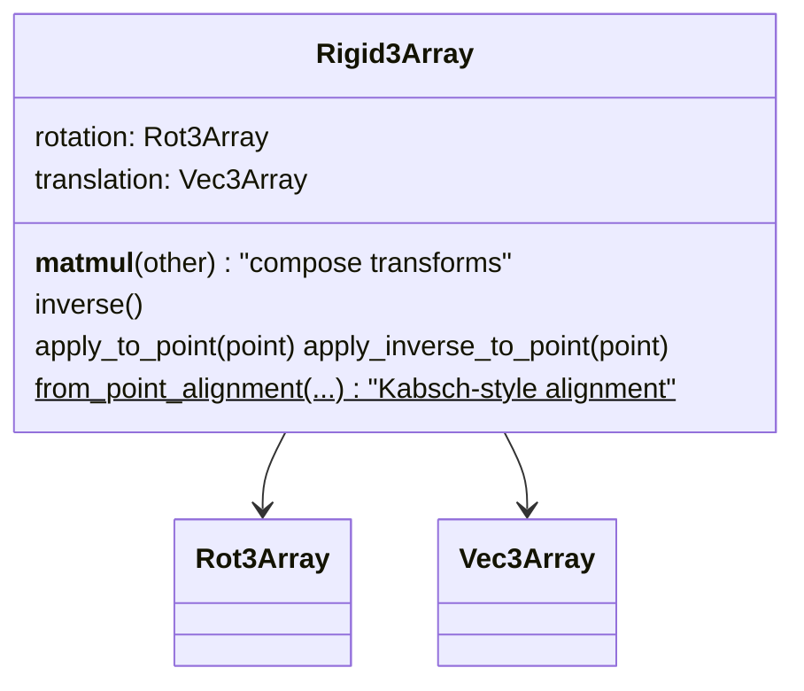

# alphafold3.jax.geometry.rigid_matrix_vector — Rigid3Array, rigid-body frames for AlphaFold3

## Overview

[`Rigid3Array`](../catalog/src/alphafold3/jax/geometry/rigid_matrix_vector.md#Rigid3Array) is an
element of the special Euclidean group SE(3) — a rotation plus a translation — composed directly
from [`Rot3Array`](../catalog/src/alphafold3/jax/geometry/rotation_matrix.md#Rot3Array) and
[`Vec3Array`](../catalog/src/alphafold3/jax/geometry/vector.md#Vec3Array), registered as a nested
struct-of-arrays via the same
[`StructOfArray`](../catalog/src/alphafold3/jax/geometry/struct_of_array.md#StructOfArray)
decorator. It is AlphaFold3's representation of a per-residue local reference frame, and
[`from_point_alignment`](../catalog/src/alphafold3/jax/geometry/rigid_matrix_vector.md#Rigid3Array.from_point_alignment)
implements weighted-Kabsch rigid alignment (via
[`_compute_covariance_matrix`](../catalog/src/alphafold3/jax/geometry/rigid_matrix_vector.md#_compute_covariance_matrix)
and [`Rot3Array.from_svd`](../catalog/src/alphafold3/jax/geometry/rotation_matrix.md#Rot3Array.from_svd)'s
quaternion-eigenvector solve) — the operation used to fit a rigid frame to a set of (possibly
noisy, weighted) 3D points, central to both the input-frame construction and the diffusion model's
denoising geometry.

## Diagram

## Design rationale (why it's built this way)

**`Rigid3Array` composes `Rot3Array`+`Vec3Array` rather than storing a single flattened
representation.** By nesting two already-struct-of-arrays types, `Rigid3Array` gets pytree
registration, shape/slicing semantics, and `jax.vmap` compatibility "for free" from the shared
[`StructOfArray`](../catalog/src/alphafold3/jax/geometry/struct_of_array.md#StructOfArray)
decorator — there is no separate flattened 12-scalar (9 rotation + 3 translation) representation to
keep in sync with the two component types.

**Transform composition and inversion are expressed purely in terms of the component types'
own operations, not re-derived.**
[`Rigid3Array.__matmul__`](../catalog/src/alphafold3/jax/geometry/rigid_matrix_vector.md#Rigid3Array.__matmul__)
computes `new_rotation = self.rotation @ other.rotation` and
`new_translation = self.apply_to_point(other.translation)` —
[`Rigid3Array.inverse`](../catalog/src/alphafold3/jax/geometry/rigid_matrix_vector.md#Rigid3Array.inverse)
similarly reuses [`Rot3Array.inverse`](../catalog/src/alphafold3/jax/geometry/rotation_matrix.md#Rot3Array.inverse)
and applies it to the negated translation — the standard SE(3) composition/inversion identities,
implemented by delegating to the already-correct rotation/vector primitives rather than
re-implementing the 4x4-homogeneous-matrix arithmetic.

**Weighted covariance computation explicitly guards against a zero-weight-sum division by zero.**
[`_compute_covariance_matrix`](../catalog/src/alphafold3/jax/geometry/rigid_matrix_vector.md#_compute_covariance_matrix)
adds `epsilon` to the weight-sum denominator specifically "to avoid NaN's when all weights are 0" —
since alignment weights can legitimately be all-zero for some batch elements (e.g. no aligned atoms
for a given residue), this keeps the covariance computation well-defined (producing a degenerate
but finite result) rather than propagating NaN through the downstream SVD/eigenvector solve.

## Entry points

- [`Rigid3Array.apply_to_point`](../catalog/src/alphafold3/jax/geometry/rigid_matrix_vector.md#Rigid3Array.apply_to_point) /
  [`apply_inverse_to_point`](../catalog/src/alphafold3/jax/geometry/rigid_matrix_vector.md#Rigid3Array.apply_inverse_to_point) —
  reached wherever a point must move between a local frame and the global/reference frame.
- [`Rigid3Array.from_point_alignment`](../catalog/src/alphafold3/jax/geometry/rigid_matrix_vector.md#Rigid3Array.from_point_alignment) —
  reached wherever a rigid frame must be fit to a (weighted) set of corresponding points, e.g.
  constructing per-residue frames from atom coordinates or during diffusion-model frame updates.
- [`Rigid3Array.__matmul__`](../catalog/src/alphafold3/jax/geometry/rigid_matrix_vector.md#Rigid3Array.__matmul__) /
  [`inverse`](../catalog/src/alphafold3/jax/geometry/rigid_matrix_vector.md#Rigid3Array.inverse) —
  reached to compose/invert rigid transforms when chaining frames.

## Mechanism (step-by-step)

1. **[`from_point_alignment`](../catalog/src/alphafold3/jax/geometry/rigid_matrix_vector.md#Rigid3Array.from_point_alignment)
   computes weighted centers** for both the source and target point sets (via
   [`utils.weighted_mean`](../catalog/src/alphafold3/jax/geometry/utils.md#weighted_mean)), then
   centers each set around its own mean.
2. **[`_compute_covariance_matrix`](../catalog/src/alphafold3/jax/geometry/rigid_matrix_vector.md#_compute_covariance_matrix)
   computes the weighted cross-covariance** `cov_xy = weighted_avg_i(row[i,x] * col[i,y])` between
   the two centered point sets, as a `[..., 3, 3]` array.
3. **[`Rot3Array.from_svd`](../catalog/src/alphafold3/jax/geometry/rotation_matrix.md#Rot3Array.from_svd)
   fits the optimal rotation** from that covariance matrix via the quaternion-eigenvector method
   (see [alphafold3-jax-geometry-rotation_matrix](alphafold3-jax-geometry-rotation_matrix.md)).
4. **The translation is derived from the fitted rotation and the two centers**, producing a
   [`Rigid3Array`](../catalog/src/alphafold3/jax/geometry/rigid_matrix_vector.md#Rigid3Array) that
   maps the source point set onto the target as closely as possible (in the weighted least-squares
   sense).
5. **Downstream, [`apply_to_point`](../catalog/src/alphafold3/jax/geometry/rigid_matrix_vector.md#Rigid3Array.apply_to_point)/
   [`apply_inverse_to_point`](../catalog/src/alphafold3/jax/geometry/rigid_matrix_vector.md#Rigid3Array.apply_inverse_to_point)
   move points into/out of the fitted frame** as needed by the surrounding model code (e.g.
   [`SingleTemplateEmbedding.construct_input`](../catalog/src/alphafold3/model/network/template_modules.md#SingleTemplateEmbedding.construct_input)).

## Key data structures

- **[`Rigid3Array`](../catalog/src/alphafold3/jax/geometry/rigid_matrix_vector.md#Rigid3Array)** —
  [`rotation`](../catalog/src/alphafold3/jax/geometry/rigid_matrix_vector.md#Rigid3Array.rotation)
  (a [`Rot3Array`](../catalog/src/alphafold3/jax/geometry/rotation_matrix.md#Rot3Array)),
  [`translation`](../catalog/src/alphafold3/jax/geometry/rigid_matrix_vector.md#Rigid3Array.translation)
  (a [`Vec3Array`](../catalog/src/alphafold3/jax/geometry/vector.md#Vec3Array)); pytree-registered,
  same-dtype-enforced across both components.

## Dynamics (design intent)

Because [`Rigid3Array`](../catalog/src/alphafold3/jax/geometry/rigid_matrix_vector.md#Rigid3Array)
nests two already-pytree-registered types, every leaf that ultimately flows through `jax.vmap`/
`jax.jit` is one of the twelve underlying scalar arrays (nine rotation + three translation) — no
part of the computation graph ever touches an actual `(..., 4, 4)` homogeneous transformation
matrix, keeping every operation in this geometry layer consistent with the TPU-small-matmul-avoidance
rationale documented in [alphafold3-jax-geometry-vector](alphafold3-jax-geometry-vector.md).

## Edge cases

- [`_compute_covariance_matrix`](../catalog/src/alphafold3/jax/geometry/rigid_matrix_vector.md#_compute_covariance_matrix)'s
  `epsilon` guard only prevents a NaN from the *division*; if all weights for a batch element are
  zero, the resulting covariance matrix is degenerate (effectively zero), and the subsequent SVD/
  eigenvector fit will return some rotation for that degenerate input rather than signaling that the
  alignment was undefined.

## Open questions

- Whether `from_point_alignment`'s behavior is validated against a reference (e.g. NumPy/SciPy
  Kabsch implementation) anywhere in the test suite outside this packet's cited subgraph is not
  addressed here.

## See also
- [alphafold3-jax-geometry-vector](alphafold3-jax-geometry-vector.md) — `Vec3Array`, the
  translation component and the struct-of-arrays discipline this module inherits.
- [alphafold3-jax-geometry-rotation_matrix](alphafold3-jax-geometry-rotation_matrix.md) —
  `Rot3Array`, the rotation component, including the `from_svd` quaternion-fitting this module's
  `from_point_alignment` depends on.
