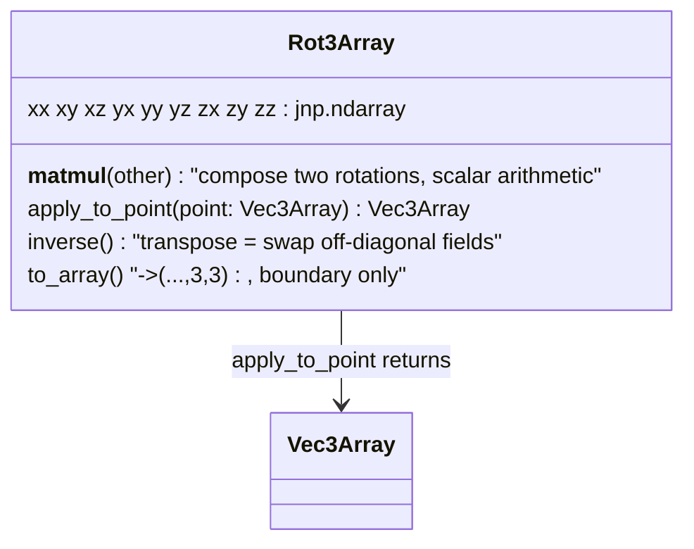

# alphafold3.jax.geometry.rotation_matrix — Rot3Array, 3x3 rotations as 9 scalar fields

## Overview

[`Rot3Array`](../catalog/src/alphafold3/jax/geometry/rotation_matrix.md#Rot3Array) extends
[alphafold3-jax-geometry-vector](alphafold3-jax-geometry-vector.md)'s struct-of-arrays discipline
from 3-vectors to 3x3 rotation matrices: instead of one `(..., 3, 3)`
array, a rotation is nine separate scalar fields
([`xx`](../catalog/src/alphafold3/jax/geometry/rotation_matrix.md#Rot3Array.xx)/
[`xy`](../catalog/src/alphafold3/jax/geometry/rotation_matrix.md#Rot3Array.xy)/.../
[`zz`](../catalog/src/alphafold3/jax/geometry/rotation_matrix.md#Rot3Array.zz)). Rotation
composition ([`__matmul__`](../catalog/src/alphafold3/jax/geometry/rotation_matrix.md#Rot3Array.__matmul__)),
point transformation ([`apply_to_point`](../catalog/src/alphafold3/jax/geometry/rotation_matrix.md#Rot3Array.apply_to_point)),
and [`inverse`](../catalog/src/alphafold3/jax/geometry/rotation_matrix.md#Rot3Array.inverse) are all
written out as explicit scalar arithmetic over these nine fields — never as a real 3x3 matrix
multiply — for the same reason [`Vec3Array`](../catalog/src/alphafold3/jax/geometry/vector.md#Vec3Array)
avoids stacking into `(..., 3)`: tiny matmuls are inefficient on TPU's MXU and force unwanted
mixed-precision arithmetic on physical coordinates.

## Diagram

## Design rationale (why it's built this way)

**[`inverse`](../catalog/src/alphafold3/jax/geometry/rotation_matrix.md#Rot3Array.inverse) is a
field permutation, not a matrix inversion.** Because a rotation matrix's inverse equals its
transpose, `inverse` simply constructs a new `Rot3Array` with the off-diagonal field pairs swapped
(`xy`↔`yx`, etc.) — an O(1) relabeling of which scalar array plays which role, with zero
floating-point computation.

**Composition ([`__matmul__`](../catalog/src/alphafold3/jax/geometry/rotation_matrix.md#Rot3Array.__matmul__))
is expressed via three calls to [`apply_to_point`](../catalog/src/alphafold3/jax/geometry/rotation_matrix.md#Rot3Array.apply_to_point),
reusing the same primitive rather than duplicating the 3x3-times-3x3 arithmetic.** `self @ other`
applies `self` to each column of `other` (reinterpreted as a
[`Vec3Array`](../catalog/src/alphafold3/jax/geometry/vector.md#Vec3Array)) and reassembles the
three resulting columns into a new `Rot3Array` — matrix-matrix multiplication is expressed purely
in terms of matrix-vector multiplication, so there is only one place
([`apply_to_point`](../catalog/src/alphafold3/jax/geometry/rotation_matrix.md#Rot3Array.apply_to_point))
where the actual 9-scalar arithmetic is written.

**[`from_svd`](../catalog/src/alphafold3/jax/geometry/rotation_matrix.md#Rot3Array.from_svd)'s
largest-eigenvector step uses a hand-derived custom JVP rather than differentiating through
`jnp.linalg.eigh` directly.** The module defines `largest_evec`/`largest_evec_jvp` with
`@jax.custom_jvp`, computing the eigenvector-perturbation formula explicitly (projecting the
tangent onto the other eigenvectors, weighted by eigenvalue gaps) — `jnp.linalg.eigh`'s default
autodiff rule is numerically fragile near degenerate eigenvalues, so this module supplies its own
derivative for the specific "largest eigenvector" quantity it actually needs, using
`jax.lax.Precision.HIGHEST` for the projection einsums to keep the rotation-fitting numerically
robust.

## Entry points

- [`Rot3Array.apply_to_point`](../catalog/src/alphafold3/jax/geometry/rotation_matrix.md#Rot3Array.apply_to_point) —
  reached wherever a rotation must transform a
  [`Vec3Array`](../catalog/src/alphafold3/jax/geometry/vector.md#Vec3Array), including from
  [`Rigid3Array.apply_to_point`](../catalog/src/alphafold3/jax/geometry/rigid_matrix_vector.md#Rigid3Array.apply_to_point).
- [`Rot3Array.__matmul__`](../catalog/src/alphafold3/jax/geometry/rotation_matrix.md#Rot3Array.__matmul__) —
  reached to compose two rotations, e.g. when chaining reference frames.
- [`Rot3Array.inverse`](../catalog/src/alphafold3/jax/geometry/rotation_matrix.md#Rot3Array.inverse) /
  [`apply_inverse_to_point`](../catalog/src/alphafold3/jax/geometry/rotation_matrix.md#Rot3Array.apply_inverse_to_point) —
  reached wherever a rotation must be undone, analogous to
  [`Rigid3Array.inverse`](../catalog/src/alphafold3/jax/geometry/rigid_matrix_vector.md#Rigid3Array.inverse)
  one level up.
- [`Rot3Array.from_svd`](../catalog/src/alphafold3/jax/geometry/rotation_matrix.md#Rot3Array.from_svd) —
  reached from
  [`Rigid3Array.from_point_alignment`](../catalog/src/alphafold3/jax/geometry/rigid_matrix_vector.md#Rigid3Array.from_point_alignment)
  to fit the best-aligning rotation between two point sets (Kabsch-style alignment).

## Mechanism (step-by-step)

1. **Point transformation** ([`apply_to_point`](../catalog/src/alphafold3/jax/geometry/rotation_matrix.md#Rot3Array.apply_to_point))
   computes the three output coordinates as `xx*point.x + xy*point.y + xz*point.z` (and the `y`/`z`
   analogues) — the literal matrix-vector product written elementwise.
2. **Composition** ([`__matmul__`](../catalog/src/alphafold3/jax/geometry/rotation_matrix.md#Rot3Array.__matmul__))
   packages each column of `other` as a
   [`Vec3Array`](../catalog/src/alphafold3/jax/geometry/vector.md#Vec3Array), applies `self` via
   [`apply_to_point`](../catalog/src/alphafold3/jax/geometry/rotation_matrix.md#Rot3Array.apply_to_point)
   to each, and reassembles the results into the nine fields of a new
   [`Rot3Array`](../catalog/src/alphafold3/jax/geometry/rotation_matrix.md#Rot3Array).
3. **[`inverse`](../catalog/src/alphafold3/jax/geometry/rotation_matrix.md#Rot3Array.inverse)
   swaps the six off-diagonal fields** (transpose), leaving the three diagonal fields untouched.
4. **[`from_svd`](../catalog/src/alphafold3/jax/geometry/rotation_matrix.md#Rot3Array.from_svd)**
   converts an input 3x3 matrix into a symmetric 4x4 matrix (via `make_matrix_svd_factors`'s
   precomputed linear map), extracts its largest eigenvector (a unit quaternion) via the
   custom-JVP `largest_evec`, and converts that quaternion into a `Rot3Array` — the standard
   quaternion-based approach to the orthogonal Procrustes / rotation-fitting problem.
5. **[`to_array`](../catalog/src/alphafold3/jax/geometry/rotation_matrix.md#Rot3Array.to_array)
   stacks the nine fields into a conventional `(..., 3, 3)` array** only at system boundaries.

## Key data structures

- **[`Rot3Array`](../catalog/src/alphafold3/jax/geometry/rotation_matrix.md#Rot3Array)** — nine
  `jnp.ndarray` fields
  ([`xx`](../catalog/src/alphafold3/jax/geometry/rotation_matrix.md#Rot3Array.xx)…
  [`zz`](../catalog/src/alphafold3/jax/geometry/rotation_matrix.md#Rot3Array.zz)), pytree-registered
  via the same struct-of-array decorator
  [alphafold3-jax-geometry-vector](alphafold3-jax-geometry-vector.md) uses.

## Dynamics (design intent)

`largest_evec`'s custom JVP explicitly projects the tangent only onto the *non-largest* eigenvectors
(`other_eigvecs`) weighted by `1 / (large_eigval - other_eigvals)` — this formula is only numerically
stable when the largest eigenvalue is well-separated from the rest, which the `jnp.maximum(...,
1e-6)` floor in the denominator defends against but cannot fully guarantee for genuinely degenerate
input matrices.

## Edge cases

- [`__array_ufunc__ = None`](../catalog/src/alphafold3/jax/geometry/rotation_matrix.md#Rot3Array)
  is set on the class — this disables NumPy's ufunc dispatch protocol for
  [`Rot3Array`](../catalog/src/alphafold3/jax/geometry/rotation_matrix.md#Rot3Array), preventing
  NumPy operators from silently trying (and failing, or doing the wrong thing) to broadcast over a
  dataclass that isn't itself array-like.

## Open questions

- Whether `from_svd`'s `use_quat_formula=False` path (an alternative to the quaternion-based
  eigenvector extraction) is numerically equivalent or a genuinely different algorithm is not
  addressed by this packet's cited subgraph.

## See also
- [alphafold3-jax-geometry-vector](alphafold3-jax-geometry-vector.md) — `Vec3Array`, the struct-of-
  arrays vector type `Rot3Array` operates on and is built from (via `from_two_vectors`).
- [alphafold3-jax-geometry-rigid_matrix_vector](alphafold3-jax-geometry-rigid_matrix_vector.md) —
  `Rigid3Array`, combining a `Rot3Array` with a translation into a full rigid-body transform.
