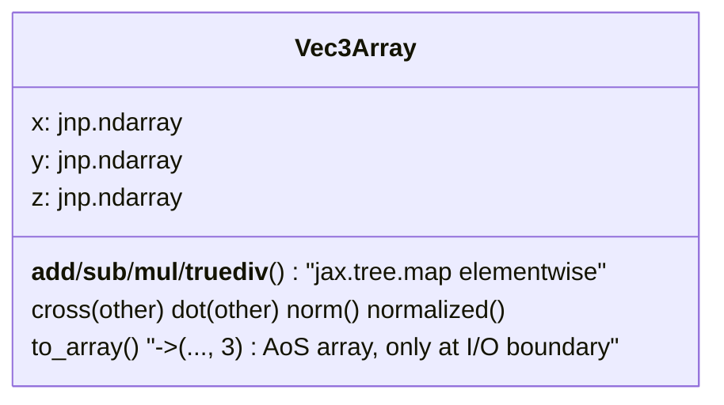

# alphafold3.jax.geometry.vector — Vec3Array, struct-of-arrays 3-vectors for TPU

## Overview

[`Vec3Array`](../catalog/src/alphafold3/jax/geometry/vector.md#Vec3Array) is AlphaFold3's 3D vector
type, and its representation choice is a direct, explicitly-documented TPU performance decision:
instead of storing an `(..., 3)`-shaped array (array-of-structs), it stores three separate scalar
arrays [`x`](../catalog/src/alphafold3/jax/geometry/vector.md#Vec3Array.x)/
[`y`](../catalog/src/alphafold3/jax/geometry/vector.md#Vec3Array.y)/
[`z`](../catalog/src/alphafold3/jax/geometry/vector.md#Vec3Array.z) (struct-of-arrays). The class
docstring states the reason directly: "small matrix multiplications are very suboptimal" on TPU and
"waste large compute resources," and matmuls on TPU run in mixed bfloat16/float32 precision, which
is undesirable for physical coordinates that need exact float32 arithmetic. Every vector operation
(`+`/`-`/`*`/[`cross`](../catalog/src/alphafold3/jax/geometry/vector.md#Vec3Array.cross)/
[`dot`](../catalog/src/alphafold3/jax/geometry/vector.md#Vec3Array.dot)) is therefore implemented as
plain elementwise arithmetic on the three scalar fields via `jax.tree.map`, never as a matmul against
a trailing size-3 axis.

## Diagram

## Design rationale (why it's built this way)

**Every arithmetic operator is `jax.tree.map` over the struct's own fields, not a vectorized
operation over a stacked array.** [`Vec3Array.__add__`](../catalog/src/alphafold3/jax/geometry/vector.md#Vec3Array)/
`__sub__`/`__mul__` each call `jax.tree.map(lambda x, y: x + y, self, other)` — since `Vec3Array`
is registered as a pytree (via the `struct_of_array.StructOfArray` decorator, not itself in this
packet's cited subgraph), `jax.tree.map` walks exactly the three scalar leaves
[`x`](../catalog/src/alphafold3/jax/geometry/vector.md#Vec3Array.x)/`y`/`z` and applies plain
elementwise addition to each — no 3-wide contraction ever happens.

**[`norm`](../catalog/src/alphafold3/jax/geometry/vector.md#norm) clips *before* the square root,
not after, specifically to avoid a NaN gradient at zero.** The method's own comment states: "To
avoid NaN on the backward pass, we must use maximum before the sqrt" — `d/dx sqrt(x)` is singular
at `x=0`, so [`Vec3Array.norm`](../catalog/src/alphafold3/jax/geometry/vector.md) computes
`norm2 = dot(self, self)`, clips it to at least `epsilon**2`, and only then takes the square root;
clipping the squared norm *before* `sqrt` (rather than clipping the final norm) is what keeps the
gradient well-defined for a zero-length vector during training.

**Free functions (`dot`, `cross`, `norm`, `normalized`) exist alongside the identically-named
methods.** [`dot`](../catalog/src/alphafold3/jax/geometry/vector.md#dot)/
[`cross`](../catalog/src/alphafold3/jax/geometry/vector.md#cross)/
[`norm`](../catalog/src/alphafold3/jax/geometry/vector.md#norm)/
[`normalized`](../catalog/src/alphafold3/jax/geometry/vector.md#normalized) are both instance methods
on [`Vec3Array`](../catalog/src/alphafold3/jax/geometry/vector.md#Vec3Array) and standalone module
functions — giving callers a choice between `v.dot(w)` (object-oriented, reads naturally in a chain
of geometric operations) and `dot(v, w)` (functional, composes naturally with `jax.vmap`/`jax.grad`
over a pair of arguments without needing a bound method).

## Entry points

- [`Vec3Array`](../catalog/src/alphafold3/jax/geometry/vector.md#Vec3Array) construction —
  reached wherever 3D coordinate data enters the geometry layer, e.g. atom positions produced by the
  diffusion model or read from a structure.
- [`Vec3Array.to_array`](../catalog/src/alphafold3/jax/geometry/vector.md#Vec3Array.to_array) —
  the boundary-crossing conversion back to a plain `(..., 3)` array, reached wherever a result must
  interoperate with code outside the struct-of-arrays geometry layer (e.g. exporting predicted
  coordinates).
- [`Vec3Array.normalized`](../catalog/src/alphafold3/jax/geometry/vector.md#normalized) /
  [`Vec3Array.cross`](../catalog/src/alphafold3/jax/geometry/vector.md#Vec3Array.cross) — reached by
  [`rotation_matrix.Rot3Array.from_two_vectors`](../catalog/src/alphafold3/jax/geometry/rotation_matrix.md#Rot3Array.from_two_vectors)
  and other geometry constructors that build orthonormal frames from raw vector data.

## Mechanism (step-by-step)

1. **Construction validates dtype/shape consistency.**
   [`Vec3Array.__post_init__`](../catalog/src/alphafold3/jax/geometry/vector.md#Vec3Array.__post_init__)
   raises `ValueError` if `x`/`y`/`z` don't share the same dtype and shape — every subsequent
   operation assumes this invariant holds.
2. **Arithmetic operators map over the three fields.** `+`/`-`/`*`/`/`/unary `-` each apply the
   scalar operator to
   [`x`/`y`/`z`](../catalog/src/alphafold3/jax/geometry/vector.md#Vec3Array.x) independently via
   `jax.tree.map`.
3. **[`cross`](../catalog/src/alphafold3/jax/geometry/vector.md#Vec3Array.cross)/[`dot`](../catalog/src/alphafold3/jax/geometry/vector.md#Vec3Array.dot)
   compute the standard 3D formulas directly in terms of the scalar fields** — e.g. `cross`'s
   `new_x = self.y * other.z - self.z * other.y` — rather than via any matrix/tensor contraction.
4. **[`norm`](../catalog/src/alphafold3/jax/geometry/vector.md#norm) computes
   [`dot`](../catalog/src/alphafold3/jax/geometry/vector.md#Vec3Array.dot)`(self, self)`, clips, then
   square-roots**; [`normalized`](../catalog/src/alphafold3/jax/geometry/vector.md#normalized)
   divides by that clipped norm.
5. **[`to_array`](../catalog/src/alphafold3/jax/geometry/vector.md#Vec3Array.to_array) stacks the
   three fields into a conventional `(..., 3)` array** only when a plain-array representation is
   actually needed at a system boundary — internal computation never round-trips through this form.

## Key data structures

- **[`Vec3Array`](../catalog/src/alphafold3/jax/geometry/vector.md#Vec3Array)** —
  [`x`](../catalog/src/alphafold3/jax/geometry/vector.md#Vec3Array.x)/
  [`y`](../catalog/src/alphafold3/jax/geometry/vector.md#Vec3Array.y)/
  [`z`](../catalog/src/alphafold3/jax/geometry/vector.md#Vec3Array.z), each `jnp.ndarray` of
  identical shape/dtype (default `jnp.float32`); pytree-registered so it composes with
  `jax.jit`/`jax.vmap`/`jax.grad` like any other JAX value.
- **[`Vec3Array.__getstate__`](../catalog/src/alphafold3/jax/geometry/vector.md#Vec3Array.__getstate__)** —
  custom (de)serialization support, needed because the struct-of-array decorator's generated
  `__init__`/fields don't necessarily pickle via the default dataclass mechanism.

## Dynamics (design intent)

Because [`Vec3Array`](../catalog/src/alphafold3/jax/geometry/vector.md#Vec3Array) is a registered
pytree of three same-shape leaves, `jax.vmap`-ing any function that takes/returns `Vec3Array`
values works automatically — the vmap transform sees three ordinary arrays, batches each
independently, and the struct-of-arrays discipline is transparent to any higher-order JAX transform
applied around geometry code.

## Edge cases

- [`Vec3Array.__post_init__`](../catalog/src/alphafold3/jax/geometry/vector.md#Vec3Array.__post_init__)
  only validates dtype/shape when `self.x` has a `dtype` attribute — this guards against symbolic/
  tracer-less construction paths (e.g. during certain metaprogramming) where `x` might not yet be an
  actual array.
- [`norm`](../catalog/src/alphafold3/jax/geometry/vector.md#norm)'s `epsilon` clipping is skippable
  (`epsilon=0` or falsy disables the `jnp.maximum` clamp) — a caller that knows a vector can never be
  exactly zero can opt out of the extra clamp op.

## Open questions

- Whether any part of the codebase still constructs `Vec3Array` from a stacked `(..., 3)` array on a
  hot path (incurring an unstack cost) rather than natively in struct-of-arrays form throughout is
  not addressed by this packet's cited subgraph.

## See also
- [alphafold3-jax-geometry-rotation_matrix](alphafold3-jax-geometry-rotation_matrix.md) — `Rot3Array`,
  built from `Vec3Array` columns and applying the same struct-of-arrays discipline to 3x3 rotations.
- [alphafold3-jax-geometry-rigid_matrix_vector](alphafold3-jax-geometry-rigid_matrix_vector.md) —
  `Rigid3Array`, combining a `Rot3Array` and a `Vec3Array` translation into a rigid transform.
