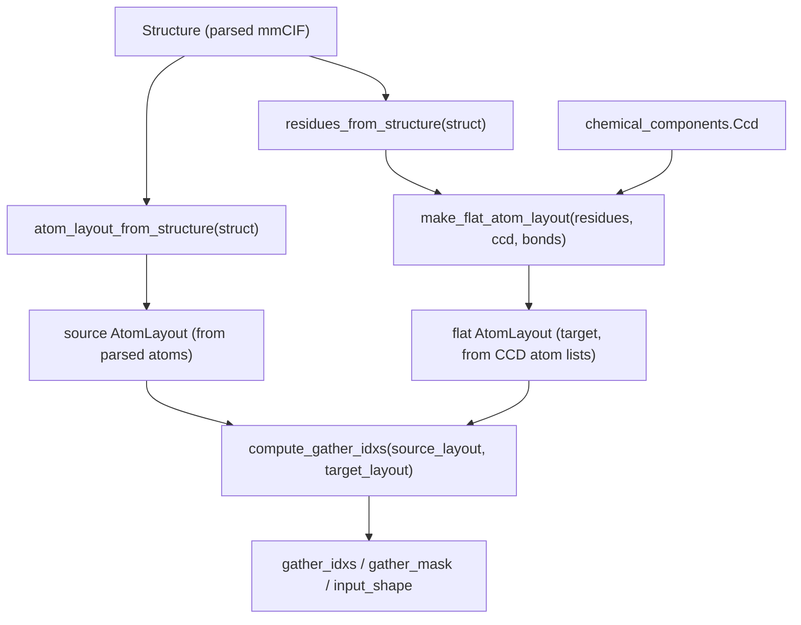

# alphafold3.model.atom_layout.atom_layout — AtomLayout construction and gather-index computation

## Overview

This module is the bridge between AlphaFold3's biology data structures
([`Structure`](../catalog/src/alphafold3/structure/structure.md#Structure), CCD chemical-component
records) and the fixed-shape numeric layouts the model consumes.
[`atom_layout_from_structure`](../catalog/src/alphafold3/model/atom_layout/atom_layout.md#atom_layout_from_structure)/
[`residues_from_structure`](../catalog/src/alphafold3/model/atom_layout/atom_layout.md#residues_from_structure)/
[`make_flat_atom_layout`](../catalog/src/alphafold3/model/atom_layout/atom_layout.md#make_flat_atom_layout)
extract an [`AtomLayout`](../catalog/src/alphafold3/model/atom_layout/atom_layout.md#AtomLayout) (a
struct-of-arrays of atom identity metadata) from a parsed structure, and
[`compute_gather_idxs`](../catalog/src/alphafold3/model/atom_layout/atom_layout.md#compute_gather_idxs)
produces the `GatherInfo`-style index/mask tables that translate one atom layout into another by
matching `(chain_id, res_id, atom_name)` triples — this is the precomputation step whose output the
model's [alphafold3-model-network-atom_cross_attention](alphafold3-model-network-atom_cross_attention.md)
module consumes at every forward pass to convert between per-token-atom, per-query, and per-key
tensor shapes.

## Diagram

## Design rationale (why it's built this way)

**Layouts are matched by identity key, not by array position.**
[`compute_gather_idxs`](../catalog/src/alphafold3/model/atom_layout/atom_layout.md#compute_gather_idxs)
builds a `dict` from `(chain_id, res_id, atom_name)` tuples to source indices, then looks up each
target atom by the same key — since the CCD-derived target atom order
([`make_flat_atom_layout`](../catalog/src/alphafold3/model/atom_layout/atom_layout.md#make_flat_atom_layout))
and the parsed-structure atom order
([`atom_layout_from_structure`](../catalog/src/alphafold3/model/atom_layout/atom_layout.md#atom_layout_from_structure))
need not agree (missing atoms, different orderings, hydrogens dropped), matching by biological
identity rather than position is the only correct way to build the correspondence.

**Atom lists are constructed from the CCD reference dictionary, not the raw parsed structure, so
that the model always sees a canonical, complete atom set per residue type.**
[`make_flat_atom_layout`](../catalog/src/alphafold3/model/atom_layout/atom_layout.md#make_flat_atom_layout)
looks up each residue's expected atoms from `ccd` (falling back to RDKit/SMILES for
non-standard/ligand residues), then drops hydrogens/leaving atoms per bonding context via
[`get_bonded_atoms`](../catalog/src/alphafold3/model/atom_layout/atom_layout.md#get_bonded_atoms) —
the resulting `AtomLayout` reflects the reference chemistry, not whatever subset of atoms happened
to be resolved in a given experimental structure, so downstream `AtomLayout`-shaped tensors are
comparable across different input structures of the same molecule.

**Unmatched target atoms are filled with a dummy index and masked off, not raised as errors.**
[`compute_gather_idxs`](../catalog/src/alphafold3/model/atom_layout/atom_layout.md#compute_gather_idxs)'s
`else` branch appends `fill_value` (default 0) to `gather_idxs` and `False` to `gather_mask` for any
target atom not found in the source — this keeps the gather operation itself branch-free and
shape-static; correctness for missing atoms is enforced entirely through the mask multiply at the
consuming end (`atom_layout.convert`), not through control flow.

## Entry points

- [`atom_layout_from_structure`](../catalog/src/alphafold3/model/atom_layout/atom_layout.md#atom_layout_from_structure) —
  reached to extract an [`AtomLayout`](../catalog/src/alphafold3/model/atom_layout/atom_layout.md#AtomLayout)
  directly from a parsed [`Structure`](../catalog/src/alphafold3/structure/structure.md#Structure).
- [`residues_from_structure`](../catalog/src/alphafold3/model/atom_layout/atom_layout.md#residues_from_structure) —
  reached to build a `Residues`
  object (one entry per residue, not per atom) as the input to
  [`make_flat_atom_layout`](../catalog/src/alphafold3/model/atom_layout/atom_layout.md#make_flat_atom_layout).
- [`make_flat_atom_layout`](../catalog/src/alphafold3/model/atom_layout/atom_layout.md#make_flat_atom_layout) —
  reached to build the canonical, CCD-derived target atom layout for a set of residues.
- [`compute_gather_idxs`](../catalog/src/alphafold3/model/atom_layout/atom_layout.md#compute_gather_idxs) —
  reached wherever two `AtomLayout`s (e.g. parsed-structure atoms vs. canonical CCD atoms) must be
  correlated into a gather/scatter index table.

## Mechanism (step-by-step)

1. **[`residues_from_structure`](../catalog/src/alphafold3/model/atom_layout/atom_layout.md#residues_from_structure)
   extracts per-residue metadata** (name, chain, terminus flags, SMILES for non-standard residues)
   from the parsed [`Structure`](../catalog/src/alphafold3/structure/structure.md#Structure).
2. **[`make_flat_atom_layout`](../catalog/src/alphafold3/model/atom_layout/atom_layout.md#make_flat_atom_layout)
   iterates residues**, looks up each residue's atom set from the CCD (or RDKit/SMILES fallback),
   drops hydrogens/leaving atoms based on bonding context (via
   [`get_bonded_atoms`](../catalog/src/alphafold3/model/atom_layout/atom_layout.md#get_bonded_atoms)
   and an internal `get_link_drop_atoms` helper),
   and appends the result into flat target-atom lists, producing a canonical target
   [`AtomLayout`](../catalog/src/alphafold3/model/atom_layout/atom_layout.md#AtomLayout).
3. **[`atom_layout_from_structure`](../catalog/src/alphafold3/model/atom_layout/atom_layout.md#atom_layout_from_structure)
   separately extracts a source layout** directly from the structure's parsed atom arrays.
4. **[`compute_gather_idxs`](../catalog/src/alphafold3/model/atom_layout/atom_layout.md#compute_gather_idxs)
   builds a `(chain_id, res_id, atom_name)`-keyed index** from the source layout, looks up every
   target-layout atom against it, and emits `gather_idxs`/`gather_mask`/`input_shape` — the table
   consumed by `atom_layout.convert` elsewhere in the model.

## Key data structures

- **[`AtomLayout`](../catalog/src/alphafold3/model/atom_layout/atom_layout.md#AtomLayout)** — a
  frozen dataclass of parallel `np.ndarray`s
  ([`atom_name`](../catalog/src/alphafold3/model/atom_layout/atom_layout.md#AtomLayout.atom_name),
  [`chain_id`](../catalog/src/alphafold3/model/atom_layout/atom_layout.md#AtomLayout.chain_id), plus
  optional `atom_element`/`res_name`/`chain_type`), all sharing one
  [`shape`](../catalog/src/alphafold3/model/atom_layout/atom_layout.md#AtomLayout.shape); supports
  [`__getitem__`](../catalog/src/alphafold3/model/atom_layout/atom_layout.md#AtomLayout.__getitem__)
  and
  [`copy_and_pad_to`](../catalog/src/alphafold3/model/atom_layout/atom_layout.md#AtomLayout.copy_and_pad_to)
  for reshaping/padding to a fixed target shape.
- **`Residues`** (this module's own dataclass, distinct from the identically-named
  [`structure_tables.Residues`](../catalog/src/alphafold3/structure/structure_tables.md#Residues)
  table type it is built from) — the per-residue analog of `AtomLayout`, carrying
  [`res_name`](../catalog/src/alphafold3/model/atom_layout/atom_layout.md#Residues.res_name) plus
  terminus/deprotonation metadata; sourced from the structure table's
  [`chain_key`](../catalog/src/alphafold3/structure/structure_tables.md#Residues.chain_key)/
  [`id`](../catalog/src/alphafold3/structure/structure_tables.md#Residues.id)/
  [`name`](../catalog/src/alphafold3/structure/structure_tables.md#Residues.name) columns via
  [`residues_from_structure`](../catalog/src/alphafold3/model/atom_layout/atom_layout.md#residues_from_structure).

## Dynamics (design intent)

Because [`AtomLayout.copy_and_pad_to`](../catalog/src/alphafold3/model/atom_layout/atom_layout.md#AtomLayout.copy_and_pad_to)
pads with empty-string sentinels (which map to `False` under `.astype(bool)`), a layout can always
be grown to a larger fixed shape without changing which real atoms it represents — this is the
mechanism that lets the model target one static maximum-atom-count shape across a batch of
differently-sized inputs.

## Edge cases

- [`compute_gather_idxs`](../catalog/src/alphafold3/model/atom_layout/atom_layout.md#compute_gather_idxs)'s
  identity key uses `zip(..., strict=True)` across `chain_id`/`res_id`/`atom_name` — a shape
  mismatch between those three arrays on either layout raises immediately rather than silently
  truncating.
- [`make_flat_atom_layout`](../catalog/src/alphafold3/model/atom_layout/atom_layout.md#make_flat_atom_layout)
  raises `ValueError` if a residue name is in neither the CCD nor has a SMILES string — there is no
  silent fallback for a genuinely unknown residue type.

## Open questions

- Whether [`compute_gather_idxs`](../catalog/src/alphafold3/model/atom_layout/atom_layout.md#compute_gather_idxs)'s
  Python-level dict-based matching (rather than a vectorized/JAX-traced approach) is a measurable
  preprocessing-time cost at the sizes AlphaFold3 targets is not addressed by this packet's cited
  subgraph — this function runs on host-side `np.ndarray`s ahead of any `jax.jit`, so it is outside
  the compiled program, but its wall-clock cost at large complex/multimer inputs is unmeasured here.

## See also
- [alphafold3-model-network-atom_cross_attention](alphafold3-model-network-atom_cross_attention.md) —
  the primary consumer of the gather-index tables this module produces, via `atom_layout.convert`.
- [alphafold3-model-feat_batch](alphafold3-model-feat_batch.md) — `Batch.atom_cross_att`, where the
  precomputed `GatherInfo` tables are stored for use during the forward pass.
