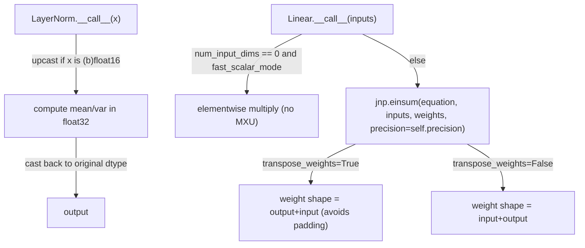

# alphafold3.model.components.haiku_modules — LayerNorm/Linear with TPU layout and precision control

## Overview

This module replaces Haiku's stock `LayerNorm`/`Linear` with versions carrying explicit TPU-layout
and mixed-precision controls, used throughout the whole AlphaFold3 network.
[`LayerNorm`](../catalog/src/alphafold3/model/components/haiku_modules.md#LayerNorm) adds an
`upcast` option that computes the normalization in float32 even when the input is bf16/fp16, then
casts back — protecting numerically-sensitive statistics (mean/variance) from low-precision
rounding without forcing the whole model into float32.
[`Linear`](../catalog/src/alphafold3/model/components/haiku_modules.md#Linear) adds
[`transpose_weights`](../catalog/src/alphafold3/model/components/haiku_modules.md#Linear.transpose_weights)
(weight layout to avoid TPU padding),
[`fast_scalar_mode`](../catalog/src/alphafold3/model/components/haiku_modules.md#Linear.fast_scalar_mode)
(a matmul-free path for degenerate scalar-projection layers), and an explicit
[`precision`](../catalog/src/alphafold3/model/components/haiku_modules.md#Linear.precision) knob
for the underlying `jnp.einsum`.

## Diagram

## Design rationale (why it's built this way)

**`LayerNorm`'s parameter shapes are always vectors, unlike stock Haiku, specifically to decouple
weight layout from normalization axis.** The class docstring states this directly: "This makes it
easier to change the layout whilst keep the model weight-compatible" — by always storing `scale`/
`offset` as flat vectors and reshaping to the broadcast shape at call time
(`param_broadcast_shape`), the parameter's on-disk/checkpoint shape never depends on which axis is
normalized, so changing `axis`/`param_axis` doesn't break weight compatibility with previously
trained checkpoints.

**`fast_scalar_mode` exists specifically to avoid the MXU for degenerate (num_input_dims=0)
projections.** The comment in [`Linear.__call__`](../catalog/src/alphafold3/model/components/haiku_modules.md#Linear.__call__)
states: "this means the linear Layer does not use the matmul units on the tpu, which is more
efficient and gives compiler more flexibility over layout" — a linear layer with zero input
dimensions is really just a per-output-channel scalar multiply, and routing it through
`jnp.einsum`/the MXU would waste a real matrix-multiply unit on what is actually an elementwise
op; the fast path does a direct broadcast-multiply instead.

**`transpose_weights` exists purely to avoid TPU padding, not for any numerical reason.** The
constructor docstring states `transpose_weights=True` (`[output, input]` weight layout) "is helpful
to avoid padding on the tensors holding the weights" — TPU memory layout pads the last two
dimensions to hardware tile boundaries (sublane/lane), so which logical axis (input-channels vs.
output-channels) ends up in the last position affects how much padding waste a given weight tensor
incurs; `transpose_weights` is a pure layout lever with no effect on the computed result.

**Precision is a per-`Linear`-instance, explicit parameter to `jnp.einsum`, not a global default.**
[`Linear.precision`](../catalog/src/alphafold3/model/components/haiku_modules.md#Linear.precision)
defaults to [`DEFAULT_PRECISION`](../catalog/src/alphafold3/model/components/haiku_modules.md#DEFAULT_PRECISION)
if unset, but every call site can override it — since different projections in the network have
different sensitivity to reduced-precision matmul (e.g. bf16-with-fp32-accumulation vs. full
float32), this is exposed as a per-layer knob rather than a single model-wide setting.

## Entry points

- [`LayerNorm`](../catalog/src/alphafold3/model/components/haiku_modules.md#LayerNorm) — used by
  essentially every normalization point in the network (Evoformer, Pairformer, diffusion
  transformer blocks).
- [`Linear`](../catalog/src/alphafold3/model/components/haiku_modules.md#Linear) —
  [`__call__`](../catalog/src/alphafold3/model/components/haiku_modules.md#Linear.__call__) is the
  single projection primitive nearly every network module builds its learned projections from.
- [`_get_initializer_scale`](../catalog/src/alphafold3/model/components/haiku_modules.md#_get_initializer_scale) —
  reached by both [`Linear.__call__`](../catalog/src/alphafold3/model/components/haiku_modules.md#Linear.__call__)
  and the standalone `haiku_linear_get_params` helper to translate a named initializer
  (`'linear'`/`'relu'`/`'zeros'`) into a concrete weight-initialization scheme scaled by the input
  shape.

## Mechanism (step-by-step)

1. **[`LayerNorm.__call__`](../catalog/src/alphafold3/model/components/haiku_modules.md#LayerNorm)**
   detects 16-bit input, upcasts to float32 if `upcast=True`, computes scale/offset parameters as
   flat vectors and reshapes them to the broadcast shape, delegates to `hk.LayerNorm.__call__` for
   the actual normalization math, then casts the result back to the original dtype.
2. **[`Linear.__call__`](../catalog/src/alphafold3/model/components/haiku_modules.md#Linear.__call__)
   branches on `num_input_dims == 0`.** If true and
   [`fast_scalar_mode`](../catalog/src/alphafold3/model/components/haiku_modules.md#Linear.fast_scalar_mode),
   it expands the input's trailing dims and multiplies elementwise by a weight vector — no einsum,
   no MXU.
3. **Otherwise, it builds an einsum equation string** from `in_letters`/`out_letters`, with weight
   shape and equation form depending on
   [`transpose_weights`](../catalog/src/alphafold3/model/components/haiku_modules.md#Linear.transpose_weights)
   (`[output, input]` vs. `[input, output]`), then calls `jnp.einsum(..., precision=`
   [`self.precision`](../catalog/src/alphafold3/model/components/haiku_modules.md#Linear.precision)`)`.
4. **An optional bias is added** if
   [`use_bias`](../catalog/src/alphafold3/model/components/haiku_modules.md#Linear.use_bias),
   initialized to
   [`bias_init`](../catalog/src/alphafold3/model/components/haiku_modules.md#Linear.bias_init).

## Key data structures

- **[`Linear`](../catalog/src/alphafold3/model/components/haiku_modules.md#Linear)** —
  [`output_shape`](../catalog/src/alphafold3/model/components/haiku_modules.md#Linear.output_shape)/
  [`num_input_dims`](../catalog/src/alphafold3/model/components/haiku_modules.md#Linear.num_input_dims)/
  [`num_output_dims`](../catalog/src/alphafold3/model/components/haiku_modules.md#Linear.num_output_dims)/
  [`initializer`](../catalog/src/alphafold3/model/components/haiku_modules.md#Linear.initializer)/
  [`use_bias`](../catalog/src/alphafold3/model/components/haiku_modules.md#Linear.use_bias)/
  [`bias_init`](../catalog/src/alphafold3/model/components/haiku_modules.md#Linear.bias_init)/
  [`precision`](../catalog/src/alphafold3/model/components/haiku_modules.md#Linear.precision)/
  [`fast_scalar_mode`](../catalog/src/alphafold3/model/components/haiku_modules.md#Linear.fast_scalar_mode)/
  [`transpose_weights`](../catalog/src/alphafold3/model/components/haiku_modules.md#Linear.transpose_weights).
- **[`DEFAULT_PRECISION`](../catalog/src/alphafold3/model/components/haiku_modules.md#DEFAULT_PRECISION)/
  [`TRUNCATED_NORMAL_STDDEV_FACTOR`](../catalog/src/alphafold3/model/components/haiku_modules.md#TRUNCATED_NORMAL_STDDEV_FACTOR)** —
  module-level constants controlling default einsum precision and the truncated-normal
  initialization scale used by the fast scalar path.

## Dynamics (design intent)

Because [`Linear`](../catalog/src/alphafold3/model/components/haiku_modules.md#Linear) supports
arbitrary input/output rank via the `in_letters`/`out_letters` einsum-equation construction, the
same class serves both ordinary `[..., C] -> [..., D]` projections and multi-head projections that
produce e.g. `[..., num_head, head_dim]` outputs in one call — the einsum equation adapts to
however many output dimensions [`output_shape`](../catalog/src/alphafold3/model/components/haiku_modules.md#Linear.output_shape)
specifies, without needing a separate "multi-head linear" class.

## Edge cases

- [`Linear.__call__`](../catalog/src/alphafold3/model/components/haiku_modules.md#Linear.__call__)'s
  fast-scalar path and general path use *different* weight initializers even for the same named
  `initializer` string (the fast path always uses `TruncatedNormal`/`Constant(0.0)`, not
  [`_get_initializer_scale`](../catalog/src/alphafold3/model/components/haiku_modules.md#_get_initializer_scale)'s
  shape-scaled variants) — switching `fast_scalar_mode` on/off for a `num_input_dims=0` layer is not
  purely a performance toggle, it also changes the initialization distribution.
- `in_letters`/`out_letters` are drawn from fixed 5-character pools (`'abcde'`/`'hijkl'`) — a
  [`Linear`](../catalog/src/alphafold3/model/components/haiku_modules.md#Linear) with more than 5
  input or output dimensions would exhaust the alphabet and raise an indexing error.

## Open questions

- Whether `fast_scalar_mode`'s "gives compiler more flexibility over layout" claim has been
  measured directly (e.g. via an HLO/layout diff) anywhere in this repo's test or benchmark suite is
  not addressed by this packet's cited subgraph.

## See also
- [alphafold3-model-network-modules](alphafold3-model-network-modules.md) — `TransitionBlock`/
  `GridSelfAttention`/etc., the primary consumers of `LayerNorm`/`Linear`.
- [alphafold3-model-model_config](alphafold3-model-model_config.md) — `GlobalConfig.bfloat16`/
  `final_init`, the model-wide precision/initialization policy these lower-level modules compose
  with.
