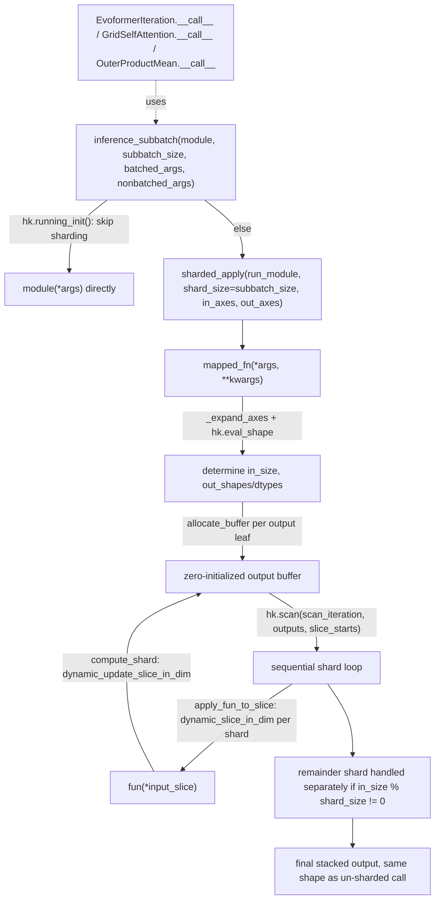

# alphafold3.model.components.mapping — sharded_apply, the memory/throughput tradeoff for huge tensors

## Overview

AlphaFold3's pair representation scales as `O(N^2)` in sequence length, and its Evoformer/Pairformer
attention modules would blow the accelerator's memory budget if vmapped over the full batch at
once. [`sharded_apply`](../catalog/src/alphafold3/model/components/mapping.md#sharded_apply) is the
mechanism that makes this tractable: it wraps a function so it runs over fixed-size **shards** of
an input axis, sequentially via `hk.scan`, writing each shard's result into a preallocated output
buffer via `dynamic_update_slice` — trading vmap's full-batch throughput for a smaller, tunable
memory footprint. [`sharded_map`](../catalog/src/alphafold3/model/components/mapping.md#sharded_map)
composes this with `hk.vmap` for the common "map, but in shards" case, and
[`inference_subbatch`](../catalog/src/alphafold3/model/components/mapping.md#inference_subbatch) is
the ergonomic entry point most model code calls directly, splitting batched vs. non-batched
arguments for the wrapped module.

## Diagram

## Design rationale (why it's built this way)

**Initialization skips sharding entirely, to guarantee shard-size-independent parameter shapes.**
Both [`sharded_map`](../catalog/src/alphafold3/model/components/mapping.md#sharded_map) and
[`inference_subbatch`](../catalog/src/alphafold3/model/components/mapping.md#inference_subbatch)
check `hk.running_init()` first and, if true, call the unwrapped `fun`/`module` directly (via plain
`hk.vmap` for `sharded_map`) — Haiku parameter shapes must not depend on runtime sharding choices,
so during parameter initialization the function always runs in its "natural" (unsharded) form; only
at actual inference time does the shard-size tradeoff kick in.

**The remainder shard is computed once, up front, specifically to determine output shape/dtype
before the main loop runs.** [`sharded_apply`](../catalog/src/alphafold3/model/components/mapping.md#sharded_apply)'s
[`mapped_fn`](../catalog/src/alphafold3/model/components/mapping.md#sharded_apply.mapped_fn) calls
`hk.eval_shape` on a shard of size `last_shard_size` (the remainder) rather than `shard_size` —
because `in_size` isn't necessarily a multiple of `shard_size`, the *last* shard may be smaller, and
its shape is what determines the true output shape/dtype (via `hk.eval_shape`, which traces without
executing) before any real computation runs.

**The main loop is `hk.scan`, not a Python `for` loop, specifically so shard count doesn't bloat the
compiled program.** [`scan_iteration`](../catalog/src/alphafold3/model/components/mapping.md#sharded_apply.mapped_fn.scan_iteration)
is passed to `hk.scan` over `slice_starts` — since the number of shards is a runtime-independent
value derived from static shapes, `hk.scan` lets XLA compile one iteration body once and lower it to
a loop, rather than unrolling `in_size / shard_size` copies of the function body into the HLO
graph, which is what a Python loop over `jax.jit`-traced calls would produce.

**Output writes use `dynamic_update_slice`, and reads use `dynamic_slice`, both explicitly wrapped
to preserve `tree_map`'s positional-argument convention.**
[`compute_shard`](../catalog/src/alphafold3/model/components/mapping.md#sharded_apply.mapped_fn.compute_shard)'s
comment notes `dynamic_update_slice_in_dim` is defined locally "since tree_map only works with
positional arguments" — `jax.lax.dynamic_update_slice_in_dim`'s natural argument order doesn't match
what `jax.tree.map` needs when mapping over `(outputs, slice_out, out_axes_)` triples, so a
locally-scoped wrapper reorders the arguments.

## Entry points

- [`inference_subbatch`](../catalog/src/alphafold3/model/components/mapping.md#inference_subbatch) —
  the primary entry point most network modules call directly; separates `batched_args` (sharded)
  from `nonbatched_args` (broadcast to every shard).
- [`sharded_map`](../catalog/src/alphafold3/model/components/mapping.md#sharded_map) — reached
  wherever a caller needs `vmap`-like semantics (rather than
  [`inference_subbatch`](../catalog/src/alphafold3/model/components/mapping.md#inference_subbatch)'s
  batched/non-batched argument split) but still wants the memory/throughput shard-size tradeoff.
- [`sharded_apply`](../catalog/src/alphafold3/model/components/mapping.md#sharded_apply) — the
  underlying primitive both higher-level helpers build on; reached directly by callers that already
  have a `vmap`'d function and just need it chunked.
- Consumers: [`EvoformerIteration.__call__`](../catalog/src/alphafold3/model/network/modules.md#EvoformerIteration.__call__)/
  [`GridSelfAttention.__call__`](../catalog/src/alphafold3/model/network/modules.md#GridSelfAttention.__call__)/
  [`OuterProductMean.__call__`](../catalog/src/alphafold3/model/network/modules.md#OuterProductMean.__call__)/
  [`PairFormerIteration.__call__`](../catalog/src/alphafold3/model/network/modules.md#PairFormerIteration.__call__) —
  the pair-representation-scale modules that call into this sharding machinery to fit within memory.

## Mechanism (step-by-step)

1. **[`inference_subbatch`](../catalog/src/alphafold3/model/components/mapping.md#inference_subbatch)
   builds `run_module`**, closing over `nonbatched_args`, then wraps it via
   [`sharded_apply`](../catalog/src/alphafold3/model/components/mapping.md#sharded_apply).
2. **[`mapped_fn`](../catalog/src/alphafold3/model/components/mapping.md#sharded_apply.mapped_fn)
   expands `in_axes`** via
   [`_expand_axes`](../catalog/src/alphafold3/model/components/mapping.md#_expand_axes) (replacing
   `None` with the sentinel [`PROXY`](../catalog/src/alphafold3/model/components/mapping.md#PROXY)
   for broadcast arguments) and computes `in_size` — the size of the axis being sharded — from
   whichever argument actually has that axis.
3. **Remainder-shard shape/dtype is derived via `hk.eval_shape`** on
   [`apply_fun_to_slice`](../catalog/src/alphafold3/model/components/mapping.md#sharded_apply.mapped_fn.apply_fun_to_slice),
   which itself calls
   [`_maybe_slice`](../catalog/src/alphafold3/model/components/mapping.md#_maybe_slice) (a
   [`PROXY`](../catalog/src/alphafold3/model/components/mapping.md#PROXY)-aware
   `dynamic_slice_in_dim`) per argument.
4. **An output buffer is zero-allocated** via
   [`allocate_buffer`](../catalog/src/alphafold3/model/components/mapping.md#sharded_apply.mapped_fn.allocate_buffer),
   sized from the regular-shard shape times the shard count plus the remainder.
5. **`hk.scan` runs [`scan_iteration`](../catalog/src/alphafold3/model/components/mapping.md#sharded_apply.mapped_fn.scan_iteration)
   over every full-size shard**, each iteration calling
   [`compute_shard`](../catalog/src/alphafold3/model/components/mapping.md#sharded_apply.mapped_fn.compute_shard)
   (slice → apply → write back via
   [`dynamic_update_slice_in_dim`](../catalog/src/alphafold3/model/components/mapping.md#sharded_apply.mapped_fn.dynamic_update_slice_in_dim)).
6. **The remainder shard (if any) is handled once more, outside the scan**, reusing
   [`compute_shard`](../catalog/src/alphafold3/model/components/mapping.md#sharded_apply.mapped_fn.compute_shard)
   to write into the tail of the output buffer.

## Key data structures

- **[`PROXY`](../catalog/src/alphafold3/model/components/mapping.md#PROXY)** — a sentinel object
  (`object()`) distinguishing "no axis to shard, broadcast this argument" from a real integer axis
  index; needed because `None` itself is used by JAX's own axis-spec convention with a different
  meaning in some contexts.
- **`out_shapes`/`out_dtypes`** — derived once via `hk.eval_shape`, driving both the output buffer's
  allocation and the final stacked shape computation
  ([`make_output_shape`](../catalog/src/alphafold3/model/components/mapping.md#sharded_apply.mapped_fn.make_output_shape)).

## Dynamics (design intent)

Because the whole shard loop is expressed as `hk.scan` over statically-known `slice_starts`, the
compiled program's size is independent of `in_size`/`shard_size` — this is the key property that
lets `shard_size` be tuned purely as a memory/latency knob (smaller shards → less peak memory, more
sequential steps → higher wall-clock latency) without any recompilation cost scaling with the
number of shards.

## Edge cases

- [`sharded_apply`](../catalog/src/alphafold3/model/components/mapping.md#sharded_apply) raises
  `NotImplementedError` if `new_out_axes=True` — stacking shard outputs onto genuinely new axes
  (rather than updating slices of a preallocated axis) is not implemented.
- `shard_size=None` short-circuits [`sharded_apply`](../catalog/src/alphafold3/model/components/mapping.md#sharded_apply)
  to return `fun` completely unmodified — the sharding machinery is a strict opt-in, not something
  that silently activates.
- When `in_size % shard_size != 0`, the remainder shard is handled as a genuinely separate code path
  (computed once, outside the `hk.scan` loop) rather than padding the input to an even multiple of
  `shard_size`.

## Open questions

- Whether `shard_size` values are tuned automatically based on available device memory, or are
  hardcoded per model-config call site, is not addressed by this packet's cited subgraph — see
  [alphafold3-model-model_config](alphafold3-model-model_config.md) for where subbatch-related
  config might live.

## See also
- [alphafold3-model-network-modules](alphafold3-model-network-modules.md) — `EvoformerIteration`/
  `GridSelfAttention`/`OuterProductMean`/`PairFormerIteration`, the primary consumers of this
  sharding machinery.
- [alphafold3-model-model_config](alphafold3-model-model_config.md) — `GlobalConfig`, likely to hold
  the `bfloat16`/sharding-related configuration this module's callers read.
