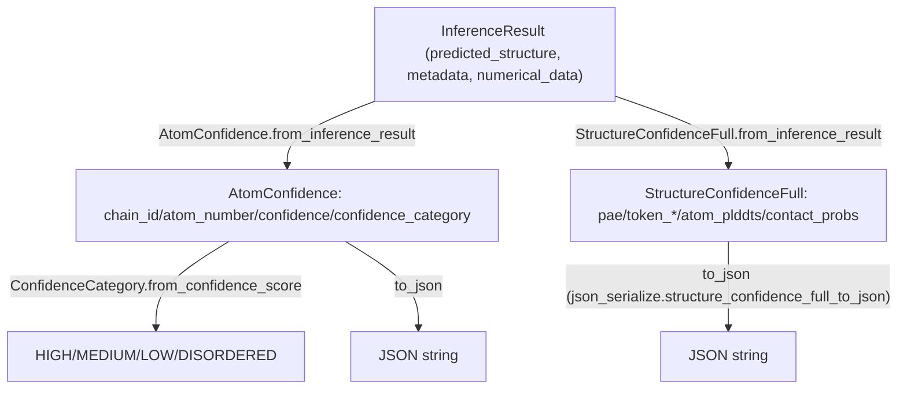

# alphafold3.model.confidence_types — post-inference confidence scoring and JSON serialization

## Overview

This module converts a completed
[`InferenceResult`](../catalog/src/alphafold3/model/model.md#InferenceResult) into the
human/tool-readable confidence artifacts AlphaFold3 ships: per-atom confidence categories (
[`AtomConfidence.from_inference_result`](../catalog/src/alphafold3/model/confidence_types.md#AtomConfidence.from_inference_result)),
summary scores (`StructureConfidenceSummary`, e.g. pTM/ipTM), and full per-token/per-atom confidence
data (
[`StructureConfidenceFull.from_inference_result`](../catalog/src/alphafold3/model/confidence_types.md#StructureConfidenceFull.from_inference_result)).
It runs entirely after the forward pass on host-side numpy arrays and is out of scope for
TPU-compute optimization — it is included here for completeness of the model's output pipeline.

## Diagram

## Design rationale (why it's built this way)

**Per-atom confidence is derived from the predicted structure's B-factor field, reusing the mmCIF
convention rather than a separate confidence tensor.**
[`AtomConfidence.from_inference_result`](../catalog/src/alphafold3/model/confidence_types.md#AtomConfidence.from_inference_result)
reads `struc.atom_b_factor` per atom — AlphaFold historically stores per-atom pLDDT in the mmCIF
B-factor column (a convention inherited from AlphaFold2), so confidence extraction is just reading
the same field structure/visualization tools already know how to display, rather than inventing a
new output channel.

**[`ConfidenceCategory.from_confidence_score`](../catalog/src/alphafold3/model/confidence_types.md#ConfidenceCategory.from_confidence_score)
uses fixed, non-overlapping score-range thresholds (90/70/50) matching the standard pLDDT confidence
bands**, and raises `ValueError` for any score outside `[0, 100]` — there is no clamping or silent
fallback for an out-of-range confidence value, since a value outside `[0, 100]` indicates a bug
upstream (pLDDT is defined on that range) rather than a legitimately unusual but valid score.

**JSON serialization special-cases `NaN`.** The module-level `_dump_json` helper replaces the
literal `'NaN'` substring in the dumped JSON with `'null'`, since Python's `json.dumps` emits a
bare `NaN` token that is not valid JSON — this is a workaround for confidence values that may
legitimately be undefined (e.g. no PAE for isolated single-chain predictions) without producing
malformed output files.

## Entry points

- [`AtomConfidence.from_inference_result`](../catalog/src/alphafold3/model/confidence_types.md#AtomConfidence.from_inference_result) —
  reached once per completed prediction to build the per-atom confidence summary from
  [`InferenceResult.predicted_structure`](../catalog/src/alphafold3/model/model.md#InferenceResult.predicted_structure).
- [`StructureConfidenceFull.from_inference_result`](../catalog/src/alphafold3/model/confidence_types.md#StructureConfidenceFull.from_inference_result) —
  reached to build the full per-token/per-atom confidence payload (PAE, contact probabilities) from
  [`InferenceResult.numerical_data`](../catalog/src/alphafold3/model/model.md#InferenceResult.numerical_data)
  and [`InferenceResult.metadata`](../catalog/src/alphafold3/model/model.md#InferenceResult.metadata).

## Mechanism (step-by-step)

1. **[`AtomConfidence.from_inference_result`](../catalog/src/alphafold3/model/confidence_types.md#AtomConfidence.from_inference_result)
   iterates `struc.iter_atoms()`**, reading each atom's B-factor as its confidence and looking up its
   [`ConfidenceCategory`](../catalog/src/alphafold3/model/confidence_types.md#ConfidenceCategory) via
   [`from_confidence_score`](../catalog/src/alphafold3/model/confidence_types.md#ConfidenceCategory.from_confidence_score).
2. **[`StructureConfidenceFull.from_inference_result`](../catalog/src/alphafold3/model/confidence_types.md#StructureConfidenceFull.from_inference_result)
   pulls `full_pae`/`contact_probs`** from
   [`InferenceResult.numerical_data`](../catalog/src/alphafold3/model/model.md#InferenceResult.numerical_data)
   (validating they are `np.ndarray`), and `token_chain_ids`/`token_res_ids` from
   [`InferenceResult.metadata`](../catalog/src/alphafold3/model/model.md#InferenceResult.metadata).
3. **`to_json` on either dataclass rounds and serializes** the numeric fields (with the `NaN` → `null`
   substitution described above), e.g.
   [`StructureConfidenceFull.to_json`](../catalog/src/alphafold3/model/confidence_types.md#StructureConfidenceFull.to_json),
   producing the on-disk confidence JSON files.

## Key data structures

- **[`ConfidenceCategory`](../catalog/src/alphafold3/model/confidence_types.md#ConfidenceCategory)** —
  an `enum.Enum` with
  [`HIGH`](../catalog/src/alphafold3/model/confidence_types.md#ConfidenceCategory.HIGH)/
  [`MEDIUM`](../catalog/src/alphafold3/model/confidence_types.md#ConfidenceCategory.MEDIUM)/
  [`LOW`](../catalog/src/alphafold3/model/confidence_types.md#ConfidenceCategory.LOW)/
  [`DISORDERED`](../catalog/src/alphafold3/model/confidence_types.md#ConfidenceCategory.DISORDERED)
  members mapped to single-character codes for compact JSON.
- **`StructureConfidenceFull`** —
  [`pae`](../catalog/src/alphafold3/model/confidence_types.md#StructureConfidenceFull.pae)/
  [`token_chain_ids`](../catalog/src/alphafold3/model/confidence_types.md#StructureConfidenceFull.token_chain_ids)/
  [`token_res_ids`](../catalog/src/alphafold3/model/confidence_types.md#StructureConfidenceFull.token_res_ids)/
  [`atom_plddts`](../catalog/src/alphafold3/model/confidence_types.md#StructureConfidenceFull.atom_plddts)/
  [`atom_chain_ids`](../catalog/src/alphafold3/model/confidence_types.md#StructureConfidenceFull.atom_chain_ids)/
  [`contact_probs`](../catalog/src/alphafold3/model/confidence_types.md#StructureConfidenceFull.contact_probs)
  (`[num_tokens, num_tokens]`); serialized via
  [`to_json`](../catalog/src/alphafold3/model/confidence_types.md#StructureConfidenceFull.to_json).

## Dynamics (design intent)

Because every constructor here (`from_inference_result`) is a pure host-side numpy transformation of
an already-completed [`InferenceResult`](../catalog/src/alphafold3/model/model.md#InferenceResult),
this module runs strictly after the compiled forward pass finishes — none of its cost is part of the
`jax.jit`-compiled step, so it has no direct bearing on TPU step time (it only affects host-side
post-processing wall-clock time, which is outside this wiki's optimization scope).

## Edge cases

- [`ConfidenceCategory.from_confidence_score`](../catalog/src/alphafold3/model/confidence_types.md#ConfidenceCategory.from_confidence_score)
  raises for any score outside `[0, 100]`, including `NaN` (since `NaN` comparisons are always
  `False`, a `NaN` confidence would fall through all four range checks to the final `raise`).
- [`StructureConfidenceFull.from_inference_result`](../catalog/src/alphafold3/model/confidence_types.md#StructureConfidenceFull.from_inference_result)
  explicitly type-checks `pae`/`contact_probs` as `np.ndarray` and raises `TypeError` otherwise —
  a caller passing JAX-device arrays (not yet copied to host `np.ndarray`) would hit this check.

## Open questions

- Whether `StructureConfidenceSummary` (the pTM/ipTM summary dataclass) construction is timed or
  otherwise a documented performance concern anywhere is not addressed by this packet's cited
  subgraph — the class exists as pure metadata extraction and appears sized far below anything
  perf-relevant to this wiki's scope.

## See also
- [alphafold3-model](alphafold3-model.md) — `InferenceResult`, `Model.get_inference_result`, the
  source of the data this module serializes.
