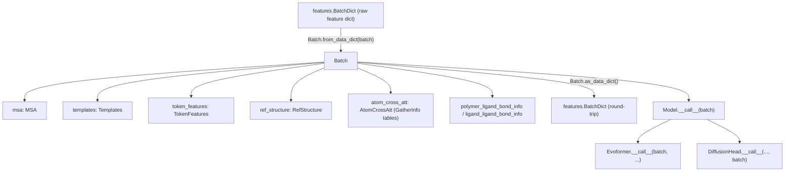

# alphafold3.model.feat_batch — Batch, the single featurized-input pytree

## Overview

[`Batch`](../catalog/src/alphafold3/model/feat_batch.md#Batch) is the single frozen dataclass that
bundles every featurized input the model forward pass consumes — MSA, templates, token features,
reference structure, bond info, and the atom-cross-attention gather tables — and is registered as a
JAX pytree via `jax.tree_util.register_dataclass`, so it flows through `jax.jit`/`jax.vmap` exactly
like any other array container. It is constructed once per input via
[`Batch.from_data_dict`](../catalog/src/alphafold3/model/feat_batch.md#Batch.from_data_dict) from the
raw feature dictionary produced by the data pipeline, and every subsequent network module (
[`Evoformer.__call__`](../catalog/src/alphafold3/model/network/evoformer.md#Evoformer.__call__),
[`DiffusionHead.__call__`](../catalog/src/alphafold3/model/network/diffusion_head.md#DiffusionHead.__call__))
receives it as a single argument rather than a long list of individual feature tensors.

## Diagram

## Design rationale (why it's built this way)

**`Batch` is a flat composition of per-feature-group dataclasses, each independently
(de)serializable, rather than one monolithic dict.** Every field (
[`msa`](../catalog/src/alphafold3/model/feat_batch.md#Batch.msa),
[`token_features`](../catalog/src/alphafold3/model/feat_batch.md#Batch.token_features),
[`ref_structure`](../catalog/src/alphafold3/model/feat_batch.md#Batch.ref_structure),
[`atom_cross_att`](../catalog/src/alphafold3/model/feat_batch.md#Batch.atom_cross_att),
[`convert_model_output`](../catalog/src/alphafold3/model/feat_batch.md#Batch.convert_model_output))
is its own dataclass type with its own `from_data_dict`/`as_data_dict` pair — `Batch.from_data_dict`
and `Batch.as_data_dict` simply delegate to each field's own conversion method and merge/split the
resulting dicts, so adding, removing, or changing one feature group's internal representation never
requires touching the other groups' code.

**Registered as a JAX pytree with no meta (static) fields — every field is data.**
`jax.tree_util.register_dataclass(Batch, data_fields=[...all fields...], meta_fields=[])` treats
every one of `Batch`'s eleven fields as a traced leaf-bearing subtree, not a static Python value —
this means shape/dtype changes to any nested feature (e.g. a different `num_res`) are visible to
`jax.jit`'s shape-based retracing exactly as if the arrays were passed directly as positional
arguments, keeping the "just pass `batch` everywhere" ergonomics fully compatible with JIT/vmap
tracing semantics.

## Entry points

- [`Batch.from_data_dict`](../catalog/src/alphafold3/model/feat_batch.md#Batch.from_data_dict) — the
  sole constructor, reached once per input to convert the raw
  `features.BatchDict` into the typed `Batch` pytree consumed by the rest of the model.
- [`Batch.as_data_dict`](../catalog/src/alphafold3/model/feat_batch.md#Batch.as_data_dict) — reached
  to serialize a `Batch` back to a flat dict, e.g. for caching or cross-process transfer.

## Mechanism (step-by-step)

1. **[`Batch.from_data_dict`](../catalog/src/alphafold3/model/feat_batch.md#Batch.from_data_dict)
   calls each feature group's own `from_data_dict`** (
   [`AtomCrossAtt.from_data_dict`](../catalog/src/alphafold3/model/features.md#AtomCrossAtt.from_data_dict),
   [`LigandLigandBondInfo.from_data_dict`](../catalog/src/alphafold3/model/features.md#LigandLigandBondInfo.from_data_dict),
   [`PolymerLigandBondInfo.from_data_dict`](../catalog/src/alphafold3/model/features.md#PolymerLigandBondInfo.from_data_dict),
   [`PseudoBetaInfo.from_data_dict`](../catalog/src/alphafold3/model/features.md#PseudoBetaInfo.from_data_dict))
   against the same shared `BatchDict`, each pulling out only the keys it owns.
2. **The eleven resulting typed objects are assembled into one
   [`Batch.from_data_dict`](../catalog/src/alphafold3/model/feat_batch.md#Batch.from_data_dict)
   instance** via the dataclass constructor.
3. **[`Batch.as_data_dict`](../catalog/src/alphafold3/model/feat_batch.md#Batch.as_data_dict) reverses
   this** by calling every field's own `as_data_dict` (
   [`RefStructure.as_data_dict`](../catalog/src/alphafold3/model/features.md#RefStructure.as_data_dict),
   [`PolymerLigandBondInfo.as_data_dict`](../catalog/src/alphafold3/model/features.md#PolymerLigandBondInfo.as_data_dict),
   [`ConvertModelOutput.as_data_dict`](../catalog/src/alphafold3/model/features.md#ConvertModelOutput.as_data_dict),
   [`TokenFeatures.as_data_dict`](../catalog/src/alphafold3/model/features.md#TokenFeatures.as_data_dict))
   and merging the dicts with `**` unpacking.

## Key data structures

- **[`Batch`](../catalog/src/alphafold3/model/feat_batch.md#Batch)** itself — the pytree-registered
  container; every downstream network entry point (
  [`Model.__call__`](../catalog/src/alphafold3/model/model.md#Model.__call__),
  [`Evoformer._relative_encoding`](../catalog/src/alphafold3/model/network/evoformer.md#Evoformer._relative_encoding)/
  [`_embed_bonds`](../catalog/src/alphafold3/model/network/evoformer.md#Evoformer._embed_bonds)/
  [`_embed_template_pair`](../catalog/src/alphafold3/model/network/evoformer.md#Evoformer._embed_template_pair))
  takes it as a single argument.
- **[`GatherInfo`](../catalog/src/alphafold3/model/atom_layout/atom_layout.md#GatherInfo)** — nested
  inside [`Batch.atom_cross_att`](../catalog/src/alphafold3/model/feat_batch.md#Batch.atom_cross_att),
  carrying [`gather_idxs`](../catalog/src/alphafold3/model/atom_layout/atom_layout.md#GatherInfo.gather_idxs)/
  [`gather_mask`](../catalog/src/alphafold3/model/atom_layout/atom_layout.md#GatherInfo.gather_mask)/
  [`input_shape`](../catalog/src/alphafold3/model/atom_layout/atom_layout.md#GatherInfo.input_shape),
  the precomputed conversion tables consumed by
  [`atom_cross_att_encoder`](../catalog/src/alphafold3/model/network/atom_cross_attention.md#atom_cross_att_encoder)/
  [`atom_cross_att_decoder`](../catalog/src/alphafold3/model/network/atom_cross_attention.md#atom_cross_att_decoder).

## Dynamics (design intent)

Because `Batch` is a flat pytree with no static (meta) fields, calling
[`Model.__call__`](../catalog/src/alphafold3/model/model.md#Model.__call__) with two `Batch`
instances of different `num_res`/MSA depth triggers a fresh `jax.jit` trace for each distinct shape
combination — the shape-fixing work done upstream (padding, atom-layout gather tables) exists
specifically to minimize how many distinct shapes actually reach this boundary in practice.

## Edge cases

- [`Batch.from_data_dict`](../catalog/src/alphafold3/model/feat_batch.md#Batch.from_data_dict) does
  not validate that all eleven feature groups were derived from a mutually consistent `num_res`/atom
  count — a caller assembling a `BatchDict` from mismatched sources would only discover the
  inconsistency downstream, at whichever network module's shape-dependent op first fails.

## Open questions

- Whether any field ought to be a `meta_field` (e.g. a genuinely static config value smuggled into
  the batch) rather than a data field is not addressed by this packet's cited subgraph — as written,
  every field is fully dynamic/traced.

## See also
- [alphafold3-model-features](alphafold3-model-features.md) — the per-feature-group dataclasses
  (`MSA`, `TokenFeatures`, `RefStructure`, `AtomCrossAtt`, etc.) this module composes.
- [alphafold3-model-atom_layout](alphafold3-model-atom_layout.md) — `GatherInfo`, nested inside
  `Batch.atom_cross_att`.
- [alphafold3-model-network-atom_cross_attention](alphafold3-model-network-atom_cross_attention.md) —
  the primary consumer of `Batch.atom_cross_att`.
