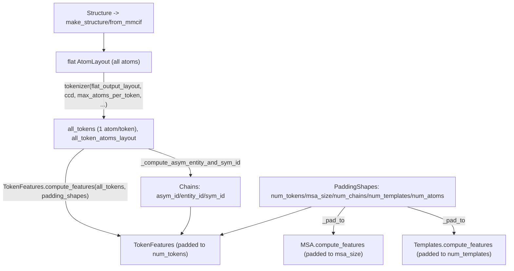

# alphafold3.model.features — tokenization and fixed-shape padding to the model's static tensors

## Overview

This module is where AlphaFold3's raw parsed-structure atom layout becomes the fixed-shape numeric
tensors the network actually compiles against. `tokenizer`
converts a flat per-atom layout into "tokens" (one token per polymer residue, one token per ligand
atom — the fundamental unit the Evoformer/Pairformer trunks operate on), and every per-feature
dataclass's `compute_features` classmethod (e.g.
[`TokenFeatures.compute_features`](../catalog/src/alphafold3/model/features.md#TokenFeatures.compute_features),
[`MSA.compute_features`](../catalog/src/alphafold3/model/features.md#MSA.compute_features),
[`Templates.compute_features`](../catalog/src/alphafold3/model/features.md#Templates.compute_features))
pads its output to a
[`PaddingShapes`](../catalog/src/alphafold3/model/features.md#PaddingShapes)-specified fixed size via
the shared [`_pad_to`](../catalog/src/alphafold3/model/features.md#_pad_to) helper — this is the
single choke point that turns AlphaFold3's inherently variable-length biological inputs (variable
residue count, variable MSA depth, variable template count) into the static-shape tensors XLA
compiles once per padding bucket.

## Diagram

## Design rationale (why it's built this way)

**Tokenization treats polymer residues and ligand atoms asymmetrically — one token per residue
for polymers, one token per atom for ligands.** `tokenizer`'s
docstring states this directly: "one token per polymer residue and one token per ligand atom" — a
protein/RNA/DNA residue is chemically regular enough that one token can represent its whole atom
set, but a ligand's chemistry is too heterogeneous (arbitrary small molecules) for a fixed
per-residue atom template, so it is tokenized at atom granularity instead — this asymmetry is what
makes AlphaFold3's "token" count comparable in scale to a residue count for ordinary proteins while
still handling arbitrary ligands.

**Every `compute_features` classmethod pads to a shape from one shared `PaddingShapes` value, not an
independently-chosen shape per feature group.** [`TokenFeatures.compute_features`](../catalog/src/alphafold3/model/features.md#TokenFeatures.compute_features)
pads every per-token array to `padding_shapes.num_tokens` via
[`_pad_to`](../catalog/src/alphafold3/model/features.md#_pad_to) — since
[`Batch.as_data_dict`](../catalog/src/alphafold3/model/feat_batch.md#Batch.as_data_dict) bundles many feature groups that must
all agree on `num_tokens`/`msa_size`/`num_templates` for the network's shape-checked operations to
type-check, funneling every group's padding decision through one shared
[`PaddingShapes`](../catalog/src/alphafold3/model/features.md#PaddingShapes) value keeps them
consistent by construction rather than by separately-maintained convention.

**`_pad_to` treats "pad to a smaller shape" as an error, not a silent truncation.**
[`_pad_to`](../catalog/src/alphafold3/model/features.md#_pad_to) raises `ValueError` if any requested
padded-axis width is smaller than the array's current size — since padding bucket sizes are chosen
upstream specifically to be large enough for a given input, a violation here indicates the bucket
selection itself was wrong, and silently truncating biological data (dropping atoms/tokens) would be
a correctness bug, not a recoverable condition.

## Entry points

- `tokenizer` — reached once per input, converting the flat atom layout into token-level
  `AtomLayout`s that feed
  [`_compute_asym_entity_and_sym_id`](../catalog/src/alphafold3/model/features.md#_compute_asym_entity_and_sym_id)
  and
  [`TokenFeatures.compute_features`](../catalog/src/alphafold3/model/features.md#TokenFeatures.compute_features).
- `TokenFeatures.compute_features` / `MSA.compute_features` / `Templates.compute_features` — reached
  once per feature group per input, each independently padding to the shared
  [`PaddingShapes`](../catalog/src/alphafold3/model/features.md#PaddingShapes).
- [`_compute_asym_entity_and_sym_id`](../catalog/src/alphafold3/model/features.md#_compute_asym_entity_and_sym_id) —
  reached by `TokenFeatures.compute_features` to derive chain-symmetry identifiers (`asym_id`/
  `entity_id`/`sym_id`) needed for handling symmetric multimers (e.g. an A3B2 stoichiometry).

## Mechanism (step-by-step)

1. **`tokenizer` groups the flat atom layout
   by `(chain_type, chain_id, res_id)`** via `itertools.groupby`, selecting one representative atom
   per polymer residue and treating each ligand atom as its own token, producing the `all_tokens`
   layout that
   [`_compute_asym_entity_and_sym_id`](../catalog/src/alphafold3/model/features.md#_compute_asym_entity_and_sym_id)
   consumes next.
2. **[`_compute_asym_entity_and_sym_id`](../catalog/src/alphafold3/model/features.md#_compute_asym_entity_and_sym_id)
   walks the resulting per-token chain IDs**, assigning a fresh `asym_id` per chain and grouping
   chains with identical residue-name sequences into the same `entity_id`, incrementing `sym_id` for
   each repeated copy — this is how the model represents "these two chains are the same molecule
   repeated" for symmetric multimers.
3. **[`TokenFeatures.compute_features`](../catalog/src/alphafold3/model/features.md#TokenFeatures.compute_features)
   derives `aatype`/`is_protein`/`is_rna`/`is_dna`/`is_ligand`/`is_water`** from each token's
   `chain_type`/`res_name`, looks up `asym_id`/`entity_id`/`sym_id` from the `Chains` result, then
   pads every one of these thirteen arrays to `padding_shapes.num_tokens` via
   [`_pad_to`](../catalog/src/alphafold3/model/features.md#_pad_to).
4. **[`_pad_to`](../catalog/src/alphafold3/model/features.md#_pad_to) pads the trailing (or specified)
   axes with `np.pad`**, raising if the target shape is smaller than the input, and passing through
   any axis marked `None` unchanged.

## Key data structures

- **[`PaddingShapes`](../catalog/src/alphafold3/model/features.md#PaddingShapes)** —
  [`num_tokens`](../catalog/src/alphafold3/model/features.md#PaddingShapes.num_tokens) plus
  `msa_size`/`num_chains`/`num_templates`/`num_atoms`; the single shared source of every feature
  group's target shape.
- **`Chains`** — `chain_id`/`asym_id`/`entity_id`/`sym_id` parallel arrays, one entry per unique
  chain, produced by
  [`_compute_asym_entity_and_sym_id`](../catalog/src/alphafold3/model/features.md#_compute_asym_entity_and_sym_id)
  and consumed to fill in
  [`TokenFeatures.compute_features`](../catalog/src/alphafold3/model/features.md#TokenFeatures.compute_features)'s
  per-token chain-symmetry fields.
- **`TokenFeatures`** — the padded,
  pytree-registered per-token feature bundle, built by
  [`compute_features`](../catalog/src/alphafold3/model/features.md#TokenFeatures.compute_features);
  [`as_data_dict`](../catalog/src/alphafold3/model/features.md#TokenFeatures.as_data_dict) round-trips
  it back to a flat dict for [`Batch.as_data_dict`](../catalog/src/alphafold3/model/feat_batch.md#Batch.as_data_dict).

## Dynamics (design intent)

Because every `compute_features` classmethod pads independently but from the same
[`PaddingShapes`](../catalog/src/alphafold3/model/features.md#PaddingShapes) instance, changing the
padding-bucket policy (e.g. switching to coarser/finer token-count buckets to trade compile count
against wasted compute on padding) is a change to whatever code constructs `PaddingShapes` for a
given input — no change is needed to any individual feature group's `compute_features` logic.

## Edge cases

- `tokenizer`'s `itertools.groupby` grouping
  key is `(chain_type, chain_id, res_id)` — atoms of the same residue that are not contiguous in the
  input layout (e.g. an out-of-order or interleaved atom listing) would be split into multiple
  groups/tokens rather than merged, since `groupby` only groups *consecutive* matching elements.
- [`TokenFeatures.compute_features`](../catalog/src/alphafold3/model/features.md#TokenFeatures.compute_features)
  raises `ValueError` for any `chain_type` that is neither in `mmcif_names.POLYMER_CHAIN_TYPES` nor
  `NON_POLYMER_CHAIN_TYPES` — there is no fallback "unknown chain type" token category.

## Open questions

- What determines the padding-bucket granularity (how `PaddingShapes` values are chosen for a given
  input, and how many distinct buckets exist in practice) is not addressed by this packet's cited
  subgraph — that policy likely lives in a data-pipeline/inference-runner module outside this
  packet's scope.

## See also
- [alphafold3-model-atom_layout](alphafold3-model-atom_layout.md) — `AtomLayout`, the per-atom
  layout this module's `tokenizer` consumes and converts.
- [alphafold3-model-feat_batch](alphafold3-model-feat_batch.md) — `Batch`, which composes
  `TokenFeatures` and every other `compute_features` output produced here.
