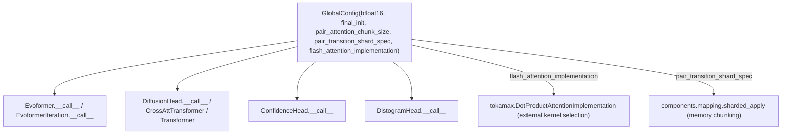

# alphafold3.model.model_config — GlobalConfig, the model-wide precision/sharding/kernel knobs

<!-- connect:up:begin -->
> **Cross-repo concept:** part of [sharding](../../../concepts/sharding.md) across this wiki's repos.
<!-- connect:up:end -->
## Overview

[`GlobalConfig`](../catalog/src/alphafold3/model/model_config.md#GlobalConfig) is the single
configuration object threaded through every network module
([`Evoformer`](../catalog/src/alphafold3/model/network/evoformer.md#Evoformer.__call__),
[`EvoformerIteration`](../catalog/src/alphafold3/model/network/modules.md#EvoformerIteration.__init__),
[`DiffusionHead`](../catalog/src/alphafold3/model/network/diffusion_head.md#DiffusionHead.__init__),
etc.) that controls the four axes this schema cares most about: precision
([`bfloat16`](../catalog/src/alphafold3/model/model_config.md#GlobalConfig.bfloat16)), weight
initialization (`final_init`, affecting how residual-branch outputs are zeroed at init), memory
chunking (`pair_attention_chunk_size`,
[`pair_transition_shard_spec`](../catalog/src/alphafold3/model/model_config.md#GlobalConfig.pair_transition_shard_spec) —
consumed by [alphafold3-model-components-mapping](alphafold3-model-components-mapping.md)'s
sharded-apply machinery), and kernel selection (`flash_attention_implementation`, a
`tokamax.DotProductAttentionImplementation` selecting which attention kernel backend — including
the `'xla'` value, which the source comment notes means "no flash attention" — every attention call
in the model uses).

## Diagram

## Design rationale (why it's built this way)

**Precision is a per-model global, not per-layer, because bf16/fp32 boundaries need to be
consistent across the whole forward pass.** [`bfloat16`](../catalog/src/alphafold3/model/model_config.md#GlobalConfig.bfloat16)
takes one of `'all'`/`'none'`/`'intermediate'` — a three-way choice rather than a per-module flag —
because mixed-precision correctness in a deep residual network depends on where exactly the
casts happen relative to residual adds and normalization, which is easier to reason about as one
model-wide policy than as independently-configured per-layer choices.

**Shard specs are `Sequence[(size, size)]` tuples with `None` entries, encoding a fallback chain
by problem size, not a single fixed shard size.**
[`pair_transition_shard_spec`](../catalog/src/alphafold3/model/model_config.md#GlobalConfig.pair_transition_shard_spec)
defaults to `((2048, None), (None, 1024))` — read as "if the relevant dimension is ≤2048, use no
sharding along the other axis; otherwise fall back to sharding at 1024" (mirroring
`pair_attention_chunk_size`'s `((1536, 128), (None, 32))`) — since AlphaFold3 must run on sequences
ranging from tens to thousands of residues, a single hardcoded shard size would either waste memory
headroom on small inputs or overflow it on large ones; the tuple-of-thresholds encodes a
size-dependent chunking policy directly in the config.

**Attention kernel selection is an external library type
(`tokamax.DotProductAttentionImplementation`), not an internal enum.** By typing
`flash_attention_implementation` against `tokamax`'s own implementation-selector type, `GlobalConfig`
delegates the actual kernel-backend catalog (which attention implementations exist, e.g. `'triton'`
vs. `'xla'`) to the kernel library rather than duplicating that enumeration in the model repo — a
new backend `tokamax` adds becomes usable here with zero changes to `alphafold3`.

## Entry points

- [`GlobalConfig`](../catalog/src/alphafold3/model/model_config.md#GlobalConfig) construction —
  reached once per model instantiation (see
  [`Model.Config.global_config`](../catalog/src/alphafold3/model/model.md#Model.Config.global_config)),
  threaded into every network submodule from there.
- [`GlobalConfig.bfloat16`](../catalog/src/alphafold3/model/model_config.md#GlobalConfig.bfloat16) /
  [`final_init`](../catalog/src/alphafold3/model/model_config.md#GlobalConfig.final_init) — read by
  every `__init__`/`__call__` across
  [`EvoformerIteration`](../catalog/src/alphafold3/model/network/modules.md#EvoformerIteration.__init__)/
  [`TriangleMultiplication`](../catalog/src/alphafold3/model/network/modules.md#TriangleMultiplication.__init__)/
  [`TransitionBlock`](../catalog/src/alphafold3/model/network/modules.md#TransitionBlock.__init__)
  and similar modules to decide numeric precision and residual-branch initialization.
- [`GlobalConfig.pair_transition_shard_spec`](../catalog/src/alphafold3/model/model_config.md#GlobalConfig.pair_transition_shard_spec) —
  read wherever a pair-representation-scale transition/attention op needs to decide its shard size,
  handed off to [alphafold3-model-components-mapping](alphafold3-model-components-mapping.md)'s
  `sharded_apply`/`inference_subbatch`.

## Mechanism (step-by-step)

1. **A `GlobalConfig` is constructed once, typically as part of the top-level model config** (see
   [`Model.Config.global_config`](../catalog/src/alphafold3/model/model.md#Model.Config.global_config)).
2. **Every network module's `__init__` stores a reference to (or reads from) the shared
   `GlobalConfig`** — e.g.
   [`DiffusionHead.__init__`](../catalog/src/alphafold3/model/network/diffusion_head.md#DiffusionHead.__init__)/
   [`Evoformer.__init__`](../catalog/src/alphafold3/model/network/evoformer.md#Evoformer.__init__)/
   [`ConfidenceHead.__init__`](../catalog/src/alphafold3/model/network/confidence_head.md#ConfidenceHead.__init__)
   all take it as a constructor argument.
3. **At `__call__` time, each module reads whichever `GlobalConfig` fields it needs** — precision
   flags gate `jnp.astype`/casting decisions, shard specs gate calls into
   [alphafold3-model-components-mapping](alphafold3-model-components-mapping.md), and
   `flash_attention_implementation` selects which `tokamax` attention kernel backend an attention
   call (e.g. inside
   [`GridSelfAttention._attention`](../catalog/src/alphafold3/model/network/modules.md#GridSelfAttention._attention))
   dispatches to.

## Key data structures

- **[`GlobalConfig`](../catalog/src/alphafold3/model/model_config.md#GlobalConfig)** — extends
  `base_config.BaseConfig`;
  [`bfloat16`](../catalog/src/alphafold3/model/model_config.md#GlobalConfig.bfloat16) (`'all'`/
  `'none'`/`'intermediate'`),
  [`final_init`](../catalog/src/alphafold3/model/model_config.md#GlobalConfig.final_init) (`'zeros'`/
  `'linear'`), `pair_attention_chunk_size`,
  [`pair_transition_shard_spec`](../catalog/src/alphafold3/model/model_config.md#GlobalConfig.pair_transition_shard_spec)
  (both `Sequence[_Shape2DType]`), `flash_attention_implementation`
  (`tokamax.DotProductAttentionImplementation`).
- **[`_Shape2DType`](../catalog/src/alphafold3/model/model_config.md#_Shape2DType._Shape2DType)** —
  `tuple[int | None, int | None]`, the shape of one entry in a shard/chunk-size spec sequence.

## Dynamics (design intent)

Because `GlobalConfig` is a plain, immutable dataclass-like config object (via `base_config`), the
same instance can be shared by reference across every submodule in the model without risk of one
module's runtime behavior silently diverging from another's — precision and kernel-selection
policy is guaranteed uniform across the whole forward pass by construction, not by convention.

## Edge cases

- The source comment on `flash_attention_implementation` states explicitly: "`flash_attention_implementation
  = 'xla'` means no flash attention" — i.e. `'xla'` is not itself a flash-attention backend but the
  fallback to XLA's default (non-fused) attention lowering; a reader should not assume every value of
  this field selects an actual flash-attention kernel.
- The default `pair_attention_chunk_size`/`pair_transition_shard_spec` tuples encode *ordered*
  fallback thresholds — the first tuple entry whose first element covers the actual dimension size
  is presumably meant to apply, so the order of entries in the sequence is semantically significant,
  not incidental.

## Open questions

- Whether `bfloat16='intermediate'` has a precisely-specified meaning (which specific
  activations/weights get cast) documented anywhere in code comments, or is purely convention
  enforced by each module's own casting logic, is not addressed by this packet's cited subgraph.

## See also
- [alphafold3-model-components-mapping](alphafold3-model-components-mapping.md) — `sharded_apply`/
  `inference_subbatch`, the mechanism `pair_transition_shard_spec` configures.
- [alphafold3-model-network-modules](alphafold3-model-network-modules.md) — the Evoformer/Pairformer
  building blocks that read `bfloat16`/`final_init` from this config.
- [alphafold3-model](alphafold3-model.md) — `Model.Config`, which owns the `global_config` instance
  every submodule receives.
