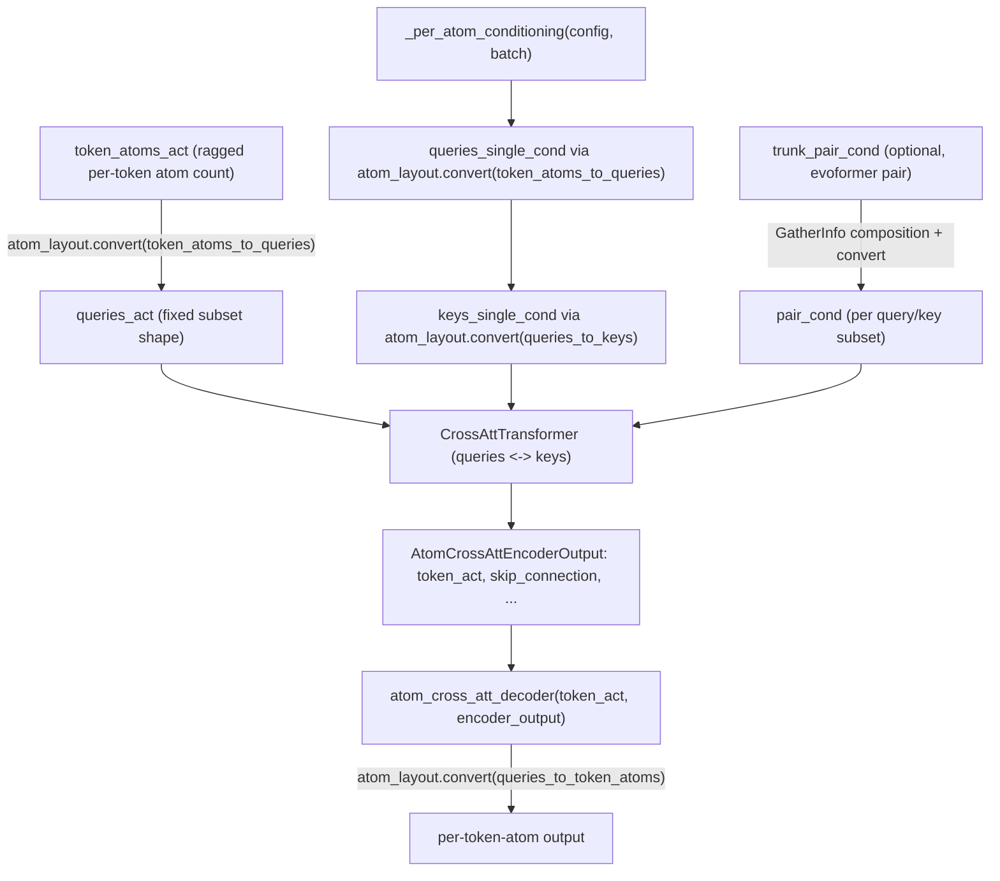

# alphafold3.model.network.atom_cross_attention — fixed-shape atom-subset cross attention

## Overview

AlphaFold3 operates on atoms (not just residues/tokens), but the number of atoms per token varies
(a ligand token may have dozens of atoms, an amino-acid token a handful) — an inherently ragged
shape that would be incompatible with static XLA compilation.
[`atom_cross_att_encoder`](../catalog/src/alphafold3/model/network/atom_cross_attention.md#atom_cross_att_encoder)/
[`atom_cross_att_decoder`](../catalog/src/alphafold3/model/network/atom_cross_attention.md#atom_cross_att_decoder)
solve this by regularizing atoms into fixed-size "subsets" of queries/keys via precomputed
[`GatherInfo`](../catalog/src/alphafold3/model/atom_layout/atom_layout.md#GatherInfo) gather-index
tables (see [alphafold3-model-atom_layout](alphafold3-model-atom_layout.md)) and
[`atom_layout.convert`](../catalog/src/alphafold3/model/atom_layout/atom_layout.md#convert), then
run a [`CrossAttTransformer`](../catalog/src/alphafold3/model/network/diffusion_transformer.md#CrossAttTransformer)
over those fixed-shape subsets. This is the bridge between per-atom-resolution data (ref structure,
predicted positions) and the per-token resolution the Evoformer/diffusion trunks operate at.

## Diagram

## Design rationale (why it's built this way)

**Ragged per-token atom counts are made static by regularizing into fixed-size subsets via
precomputed gather tables, not by padding every token to the global max atom count.** Rather than
padding every token's atom list to the maximum atoms-per-token seen anywhere in the input (wasteful
when most tokens are small amino acids and a few are large ligands),
[`_per_atom_conditioning`](../catalog/src/alphafold3/model/network/atom_cross_attention.md#_per_atom_conditioning)/
[`atom_cross_att_encoder`](../catalog/src/alphafold3/model/network/atom_cross_attention.md#atom_cross_att_encoder)
route every atom through [`atom_layout.convert`](../catalog/src/alphafold3/model/atom_layout/atom_layout.md#convert)
using a [`GatherInfo`](../catalog/src/alphafold3/model/atom_layout/atom_layout.md#GatherInfo) table
computed once per input (
[`Batch.atom_cross_att`](../catalog/src/alphafold3/model/feat_batch.md#Batch.atom_cross_att)) —
this reshapes the ragged atom set into a fixed `(num_subsets, num_queries)` grid whose shape is the
same for every input of a given token count, keeping the compiled program shape-static while still
processing exactly the atoms present.

**Pair conditioning for the trunk is broadcast to atom-pairs via a *composed*
[`GatherInfo`](../catalog/src/alphafold3/model/atom_layout/atom_layout.md#GatherInfo), not a second
independent gather.** [`atom_cross_att_encoder`](../catalog/src/alphafold3/model/network/atom_cross_attention.md#atom_cross_att_encoder)
builds `trunk_pair_to_atom_pair` by combining `tokens_to_queries`/`tokens_to_keys`'s gather indices
arithmetically (`num_tokens * tokens_to_queries.gather_idxs + tokens_to_keys.gather_idxs`) into one
flattened index into `trunk_pair_cond`'s `(num_tokens, num_tokens)` shape — the source comment notes
this "should boost ligands, but also help for cross attention within proteins, because we always
have atoms from multiple residues in a subset," i.e. even intra-protein atom subsets benefit from
trunk-level pair information about which residues they span.

**Some projections use `precision='highest'`, not the model's default precision.**
[`atom_cross_att_encoder`](../catalog/src/alphafold3/model/network/atom_cross_attention.md#atom_cross_att_encoder)'s
trunk-conditioning and atom-position-to-feature projections pass `precision='highest'` to
[`Linear`](../catalog/src/alphafold3/model/components/haiku_modules.md#Linear) explicitly — these
are the projections that touch raw physical atom coordinates or bridge from the (possibly
lower-precision) trunk representation, so they're deliberately exempted from whatever reduced
[`GlobalConfig`](../catalog/src/alphafold3/model/model_config.md#GlobalConfig) precision the rest of
the model uses.

## Entry points

- [`atom_cross_att_encoder`](../catalog/src/alphafold3/model/network/atom_cross_attention.md#atom_cross_att_encoder) —
  the per-atom-to-per-token encoder; reached wherever atom-level information (reference structure,
  predicted positions) must be folded into token-level activations.
- [`atom_cross_att_decoder`](../catalog/src/alphafold3/model/network/atom_cross_attention.md#atom_cross_att_decoder) —
  the reverse direction; reached to expand token-level activations back into per-atom output (e.g.
  the diffusion model's denoised atom positions), consuming an
  [`AtomCrossAttEncoderOutput`](../catalog/src/alphafold3/model/network/atom_cross_attention.md#AtomCrossAttEncoderOutput)'s
  [`skip_connection`](../catalog/src/alphafold3/model/network/atom_cross_attention.md#AtomCrossAttEncoderOutput.skip_connection).
- [`_per_atom_conditioning`](../catalog/src/alphafold3/model/network/atom_cross_attention.md#_per_atom_conditioning) —
  reached first, to build the per-atom feature conditioning (from reference-structure metadata like
  [`RefStructure.element`](../catalog/src/alphafold3/model/features.md#RefStructure.element)/
  [`charge`](../catalog/src/alphafold3/model/features.md#RefStructure.charge)) before any gather.

## Mechanism (step-by-step)

1. **[`_per_atom_conditioning`](../catalog/src/alphafold3/model/network/atom_cross_attention.md#_per_atom_conditioning)
   embeds atom metadata** (element, charge, reference position, etc. from
   [`Batch.ref_structure`](../catalog/src/alphafold3/model/feat_batch.md#Batch.ref_structure)) into
   per-token-atom conditioning features.
2. **[`atom_layout.convert`](../catalog/src/alphafold3/model/atom_layout/atom_layout.md#convert)
   reshapes** this (and, if present, `token_atoms_act`) from per-token-atom layout into the
   fixed-size `(num_subsets, num_queries)` "queries" layout via
   [`Batch.atom_cross_att.token_atoms_to_queries`](../catalog/src/alphafold3/model/features.md#AtomCrossAtt.token_atoms_to_queries).
3. **Keys are gathered from queries** via
   [`queries_to_keys`](../catalog/src/alphafold3/model/features.md#AtomCrossAtt.queries_to_keys),
   and pair conditioning between every query/key pair in a subset is built from per-atom single
   conditioning (row/col projections summed) plus, optionally, the trunk pair conditioning gathered
   through the composed `GatherInfo`.
4. **A [`CrossAttTransformer`](../catalog/src/alphafold3/model/network/diffusion_transformer.md#CrossAttTransformer)
   attends queries over keys** within each subset, producing per-query activations.
5. **[`atom_cross_att_encoder`](../catalog/src/alphafold3/model/network/atom_cross_attention.md#atom_cross_att_encoder)
   returns an [`AtomCrossAttEncoderOutput`](../catalog/src/alphafold3/model/network/atom_cross_attention.md#AtomCrossAttEncoderOutput)**
   bundling [`token_act`](../catalog/src/alphafold3/model/network/atom_cross_attention.md#AtomCrossAttEncoderOutput.token_act)
   (pooled to token resolution) and the raw per-query/per-key conditioning as a
   [`skip_connection`](../catalog/src/alphafold3/model/network/atom_cross_attention.md#AtomCrossAttEncoderOutput.skip_connection)
   for the decoder to reuse.
6. **[`atom_cross_att_decoder`](../catalog/src/alphafold3/model/network/atom_cross_attention.md#atom_cross_att_decoder)
   reverses the process**, converting query-layout activations back to per-token-atom layout via
   [`queries_to_token_atoms`](../catalog/src/alphafold3/model/features.md#AtomCrossAtt.queries_to_token_atoms).

## Key data structures

- **[`AtomCrossAttEncoderOutput`](../catalog/src/alphafold3/model/network/atom_cross_attention.md#AtomCrossAttEncoderOutput)** —
  a `jax.tree_util.register_dataclass`-registered pytree bundling
  [`token_act`](../catalog/src/alphafold3/model/network/atom_cross_attention.md#AtomCrossAttEncoderOutput.token_act)/
  [`skip_connection`](../catalog/src/alphafold3/model/network/atom_cross_attention.md#AtomCrossAttEncoderOutput.skip_connection)/
  [`queries_mask`](../catalog/src/alphafold3/model/network/atom_cross_attention.md#AtomCrossAttEncoderOutput.queries_mask)/
  [`queries_single_cond`](../catalog/src/alphafold3/model/network/atom_cross_attention.md#AtomCrossAttEncoderOutput.queries_single_cond)/
  [`keys_mask`](../catalog/src/alphafold3/model/network/atom_cross_attention.md#AtomCrossAttEncoderOutput.keys_mask)/
  [`keys_single_cond`](../catalog/src/alphafold3/model/network/atom_cross_attention.md#AtomCrossAttEncoderOutput.keys_single_cond)/
  [`pair_cond`](../catalog/src/alphafold3/model/network/atom_cross_attention.md#AtomCrossAttEncoderOutput.pair_cond).
- **[`Batch.atom_cross_att`](../catalog/src/alphafold3/model/feat_batch.md#Batch.atom_cross_att)** —
  the precomputed [`GatherInfo`](../catalog/src/alphafold3/model/atom_layout/atom_layout.md#GatherInfo)
  bundle (`token_atoms_to_queries`, `queries_to_keys`, `queries_to_token_atoms`, `tokens_to_queries`,
  `tokens_to_keys`) every conversion in this module reads.

## Dynamics (design intent)

Because the `(num_subsets, num_queries)`/`(num_subsets, num_keys)` shapes are fixed once
[`AtomCrossAttEncoderConfig`](../catalog/src/alphafold3/model/network/atom_cross_attention.md#AtomCrossAttEncoderConfig)
is chosen, the same compiled program handles any input whose actual atom count varies within the
subset capacity — the `GatherInfo` masks (
[`gather_mask`](../catalog/src/alphafold3/model/atom_layout/atom_layout.md#GatherInfo.gather_mask))
mark which slots are real vs. padding, and the model relies on masking (not shape) to ignore
padding atoms.

## Edge cases

- When `token_atoms_act` is `None` (the docstring's example: "begin of evoformer"),
  [`atom_cross_att_encoder`](../catalog/src/alphafold3/model/network/atom_cross_attention.md#atom_cross_att_encoder)
  uses `queries_single_cond` alone as `queries_act` — the encoder is designed to run even before any
  atom-position information exists.
- The trunk-pair-to-atom-pair `GatherInfo` composition assumes `tokens_to_queries`/`tokens_to_keys`
  share the same `num_tokens`-sized flattening scheme — a mismatch between the two gather tables'
  conventions would silently produce wrong indices rather than raising.

## Open questions

- Whether subset size (`num_queries`/`num_keys` per subset) is tuned per model-size config or fixed
  globally is not addressed by this packet's cited subgraph — see
  [alphafold3-model-atom_layout](alphafold3-model-atom_layout.md) for how the layout itself is
  constructed.

## See also
- [alphafold3-model-atom_layout](alphafold3-model-atom_layout.md) — `AtomLayout`/`GatherInfo`, the
  gather-index machinery this module depends on entirely.
- [alphafold3-model-network-diffusion_transformer](alphafold3-model-network-diffusion_transformer.md) —
  `CrossAttTransformer`, the attention mechanism run over the fixed-shape query/key subsets.
- [alphafold3-model-feat_batch](alphafold3-model-feat_batch.md) — `Batch.atom_cross_att`, the
  precomputed layout this module consumes.
