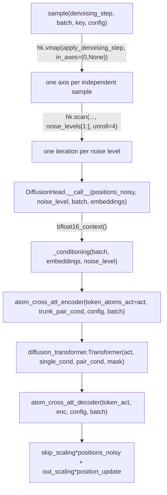

# alphafold3.model.network.diffusion_head — EDM-style denoiser, vmap+scan sampling loop

## Overview

[`DiffusionHead`](../catalog/src/alphafold3/model/network/diffusion_head.md#DiffusionHead.__call__)
is AlphaFold3's structure-generation module: an EDM/Karras-schedule denoising diffusion model that
takes noisy atom positions plus trunk (Evoformer) conditioning and predicts denoised positions,
built from the same
[`atom_cross_attention`](../catalog/src/alphafold3/model/network/atom_cross_attention.md#atom_cross_att_encoder)
encoder/decoder and
`diffusion_transformer.Transformer`
trunk documented elsewhere. The module-level
[`sample`](../catalog/src/alphafold3/model/network/diffusion_head.md#sample) function drives the
actual reverse-diffusion sampling loop, batching multiple independent samples via `hk.vmap` and
iterating the noise schedule via `hk.scan`, so one `DiffusionHead.__call__` trace produces every
denoising step and every parallel sample from a single compiled program.

## Diagram

## Design rationale (why it's built this way)

**Sampling batches over independent samples with `hk.vmap`, and iterates the noise schedule with
`hk.scan(..., unroll=4)`, composing both rather than choosing one.**
[`sample`](../catalog/src/alphafold3/model/network/diffusion_head.md#sample) wraps
`apply_denoising_step` in `hk.vmap(apply_denoising_step, in_axes=(0, None), split_rng=(not
hk.running_init()))` before scanning it — vmap gives every one of `num_samples` independent
denoising trajectories its own random key and position state while sharing one compiled step
function, and `hk.scan`'s `unroll=4` partially unrolls the sequential noise-schedule loop (a compile
time/step time tradeoff: more unrolling means a larger compiled program but fewer sequential
dispatch/loop-overhead points).

**Random rigid augmentation is applied fresh at every denoising step, not once up front.**
[`sample`](../catalog/src/alphafold3/model/network/diffusion_head.md#sample)'s
`apply_denoising_step` calls `random_augmentation(rng_key=key_aug, positions=positions, mask=mask)`
inside the loop body — since diffusion models are trained with augmentation applied per-noise-level
(not just at t=0), sampling must reproduce that per-step randomization to match the training
distribution the denoiser was fit to.

**`_conditioning` and the token-token transformer explicitly upcast to float32 mid-computation even
though the whole call runs inside a `bfloat16_context`.**
[`DiffusionHead.__call__`](../catalog/src/alphafold3/model/network/diffusion_head.md#DiffusionHead.__call__)
casts `act`/`trunk_single_cond`/`trunk_pair_cond`/`sequence_mask` to `jnp.float32` immediately before
the `diffusion_transformer.Transformer`
call, and every `Linear` projection in `_conditioning` passes `precision='highest'` — the diffusion
head's positions/conditioning are numerically sensitive enough (per-step accumulation across the
sampling loop) that they are deliberately exempted from the model-wide bf16 scope at these specific
points, matching the "some projections opt out of reduced precision" pattern seen elsewhere in the
network (see [alphafold3-model-network-diffusion_transformer](alphafold3-model-network-diffusion_transformer.md)).

## Entry points

- [`DiffusionHead.__call__`](../catalog/src/alphafold3/model/network/diffusion_head.md#DiffusionHead.__call__) —
  one forward denoising step: noisy positions + noise level + trunk conditioning in, denoised
  position update out.
- [`sample`](../catalog/src/alphafold3/model/network/diffusion_head.md#sample) — the full
  reverse-diffusion sampling loop, reached once per structure prediction from
  [`Model._sample_diffusion`](../catalog/src/alphafold3/model/model.md#Model._sample_diffusion).
- [`DiffusionHead._conditioning`](../catalog/src/alphafold3/model/network/diffusion_head.md#DiffusionHead._conditioning) —
  reached once per `__call__` to build the pair/single conditioning tensors from
  [`Batch.token_features`](../catalog/src/alphafold3/model/feat_batch.md#Batch.token_features) and
  the noise level.

## Mechanism (step-by-step)

1. **[`sample`](../catalog/src/alphafold3/model/network/diffusion_head.md#sample) initializes
   positions** as pure noise scaled by the first noise level, one copy per `num_samples` (vmapped
   axis).
2. **Each `apply_denoising_step` iteration** (scanned over `noise_levels[1:]`) applies random rigid
   augmentation, adds calibrated step noise, calls the `denoising_step` closure (ultimately
   [`DiffusionHead.__call__`](../catalog/src/alphafold3/model/network/diffusion_head.md#DiffusionHead.__call__)),
   and computes an Euler-step position update from the predicted denoised positions.
3. **Inside [`DiffusionHead.__call__`](../catalog/src/alphafold3/model/network/diffusion_head.md#DiffusionHead.__call__),
   [`_conditioning`](../catalog/src/alphafold3/model/network/diffusion_head.md#DiffusionHead._conditioning)
   builds `single_cond`/`pair_cond`** from the trunk embeddings, relative-position encoding (
   [`featurization.create_relative_encoding`](../catalog/src/alphafold3/model/network/featurization.md#create_relative_encoding)),
   and a noise-level embedding.
4. **[`atom_cross_attention.atom_cross_att_encoder`](../catalog/src/alphafold3/model/network/atom_cross_attention.md#atom_cross_att_encoder)
   converts the (rescaled, masked) noisy atom positions to token resolution**, the
   `Transformer`
   trunk processes token activations, and
   [`atom_cross_attention.atom_cross_att_decoder`](../catalog/src/alphafold3/model/network/atom_cross_attention.md#atom_cross_att_decoder)
   converts back to per-atom position updates.
5. **The final output combines the noisy input and the position update via EDM-style skip/output
   scaling** (`skip_scaling * positions_noisy + out_scaling * position_update`), masked by
   [`Batch.predicted_structure_info.atom_mask`](../catalog/src/alphafold3/model/feat_batch.md#Batch.predicted_structure_info).

## Key data structures

- **`DiffusionHead.Config`** — inherits both
  [`AtomCrossAttEncoderConfig`](../catalog/src/alphafold3/model/network/atom_cross_attention.md#AtomCrossAttEncoderConfig)
  and `AtomCrossAttDecoderConfig`, plus its own
  [`conditioning`](../catalog/src/alphafold3/model/network/diffusion_head.md#DiffusionHead.Config.conditioning)
  and
  [`transformer`](../catalog/src/alphafold3/model/network/diffusion_head.md#DiffusionHead.Config.transformer)
  (a `Transformer.Config`) sub-configs.
- **`SIGMA_DATA`** — the EDM noise-schedule scale constant used throughout
  [`noise_schedule`](../catalog/src/alphafold3/model/network/diffusion_head.md#SIGMA_DATA) and the
  skip/output scaling formulas in
  [`DiffusionHead.__call__`](../catalog/src/alphafold3/model/network/diffusion_head.md#DiffusionHead.__call__).

## Dynamics (design intent)

Because `apply_denoising_step` is both vmapped (over samples) and scanned (over noise levels), the
number of samples and the number of diffusion steps are both pure config values with no effect on
which functions get traced — only on the vmap batch dimension size and the scan trip count — keeping
the compiled program's structure identical regardless of `num_samples`/`steps`.

## Edge cases

- [`sample`](../catalog/src/alphafold3/model/network/diffusion_head.md#sample)'s
  `hk.vmap(..., split_rng=(not hk.running_init()))` means RNG splitting behavior differs between
  Haiku's parameter-initialization pass and a real forward pass — during `hk.running_init()`, the
  same RNG key is intentionally *not* split across the vmapped axis, since only parameter shapes
  (not actual random values) matter at init time.
- `unroll=4` in the `hk.scan` call means the number of configured diffusion steps must be considered
  against this unroll factor when reasoning about compiled-program size — this packet's cited
  subgraph does not state whether `steps` is required to be a multiple of 4.

## Open questions

- Whether the `eval_batch_size`/`eval_batch_dim_shard_size` config fields (present on
  `DiffusionHead.Config`) are consumed via `mapping.inference_subbatch`-style chunking anywhere in
  this specific packet's cited subgraph, or only by a caller outside it, is not resolved here.

## See also
- [alphafold3-model-network-atom_cross_attention](alphafold3-model-network-atom_cross_attention.md) —
  the encoder/decoder this module wraps to move between atom and token resolution.
- [alphafold3-model-network-diffusion_transformer](alphafold3-model-network-diffusion_transformer.md) —
  the `Transformer` trunk and `transition_block`/AdaLN-Zero primitives this module's `_conditioning`
  and main trunk both use.
- [alphafold3-model-feat_batch](alphafold3-model-feat_batch.md) — `Batch`, the featurized input this
  module reads token features and predicted-structure masks from.
