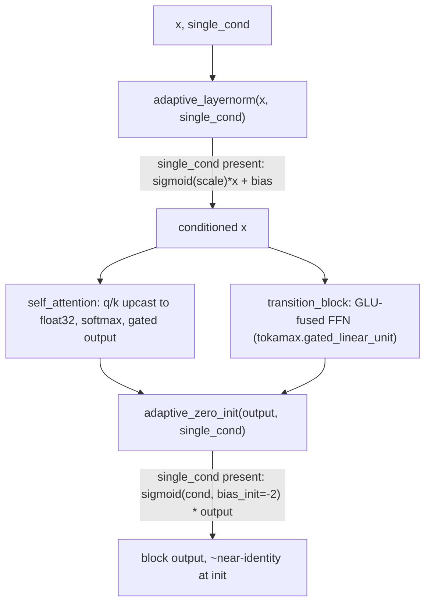

# alphafold3.model.network.diffusion_transformer — AdaLN-Zero transformer for the diffusion module

## Overview

This module implements the transformer trunk used by AlphaFold3's diffusion-based structure
module, following the "Scalable Diffusion Models with Transformers" (DiT) recipe:
[`adaptive_layernorm`](../catalog/src/alphafold3/model/network/diffusion_transformer.md#adaptive_layernorm)
conditions layer-norm scale/bias on a `single_cond` embedding rather than using learned constants,
and [`adaptive_zero_init`](../catalog/src/alphafold3/model/network/diffusion_transformer.md#adaptive_zero_init)
gates each block's output by a conditioning-derived sigmoid initialized near zero (AdaLN-Zero),
letting each block start as a near-identity function and grow its contribution during training.
[`self_attention`](../catalog/src/alphafold3/model/network/diffusion_transformer.md#self_attention)/
[`cross_attention`](../catalog/src/alphafold3/model/network/diffusion_transformer.md#cross_attention)
and [`transition_block`](../catalog/src/alphafold3/model/network/diffusion_transformer.md#transition_block)
are the two building blocks
[`Transformer`](../catalog/src/alphafold3/model/network/diffusion_transformer.md#Transformer.block)/
[`CrossAttTransformer`](../catalog/src/alphafold3/model/network/diffusion_transformer.md#CrossAttTransformer.__call__)
stack.

## Diagram

## Design rationale (why it's built this way)

**Adaptive layer-norm and zero-init both bottleneck through the same `single_cond` embedding,
making every block's behavior initially a no-op.**
[`adaptive_layernorm`](../catalog/src/alphafold3/model/network/diffusion_transformer.md#adaptive_layernorm)
derives its scale/bias from `single_cond` via zero-initialized Linear layers, and
[`adaptive_zero_init`](../catalog/src/alphafold3/model/network/diffusion_transformer.md#adaptive_zero_init)'s
conditioning path uses `bias_init=-2.0` so `sigmoid(-2) ≈ 0.1` at initialization — both are the
AdaLN-Zero technique's mechanism for making every added transformer block start as an
approximately-linear function of its input, which empirically stabilizes training of very deep
diffusion transformers.

**Attention logits are explicitly upcast to float32 before the softmax, with a comment citing
gradient stability, not accuracy.**
[`self_attention`](../catalog/src/alphafold3/model/network/diffusion_transformer.md#self_attention)'s
comment states: "In some situations the gradient norms can blow up without running this einsum in
float32" — `q`/`k`/`bias` are cast to float32 immediately before the QK einsum, even if the rest of
the model runs in bf16, specifically because unstable gradients (not just numerical imprecision)
have been observed empirically without this upcast.

**The feed-forward transition uses a fused GLU kernel (`tokamax.gated_linear_unit`) exactly like
[alphafold3-model-network-modules](alphafold3-model-network-modules.md)'s Evoformer
`TransitionBlock`, sharing the same fusion-vs-fallback pattern.**
[`transition_block`](../catalog/src/alphafold3/model/network/diffusion_transformer.md#transition_block)'s
`use_glu_kernel` branch computes the projection weights via
[`haiku_linear_get_params`](../catalog/src/alphafold3/model/components/haiku_modules.md#haiku_linear_get_params)
and calls `tokamax.gated_linear_unit` directly, rather than materializing the intermediate
projection and gate as separate `Linear` calls — this is the same "reuse the same fused kernel
across every transition-like block in the model" idiom as the Evoformer's transition/triangle-
multiplication blocks.

## Entry points

- [`Transformer.block`](../catalog/src/alphafold3/model/network/diffusion_transformer.md#Transformer.block) —
  one self-attention transformer block; stacked by
  [`Transformer`](../catalog/src/alphafold3/model/network/diffusion_transformer.md#Transformer.block)
  to form the diffusion module's main trunk.
- [`CrossAttTransformer.__call__`](../catalog/src/alphafold3/model/network/diffusion_transformer.md#CrossAttTransformer.__call__) —
  the cross-attention variant (atom-to-token or similar), used by the atom-cross-attention encoder/
  decoder (see [alphafold3-model-network-atom_cross_attention](alphafold3-model-network-atom_cross_attention.md)).
- [`self_attention`](../catalog/src/alphafold3/model/network/diffusion_transformer.md#self_attention) /
  [`cross_attention`](../catalog/src/alphafold3/model/network/diffusion_transformer.md#cross_attention) /
  [`transition_block`](../catalog/src/alphafold3/model/network/diffusion_transformer.md#transition_block) —
  the three functional building blocks every transformer block composes.

## Mechanism (step-by-step)

1. **[`adaptive_layernorm`](../catalog/src/alphafold3/model/network/diffusion_transformer.md#adaptive_layernorm)
   normalizes `x`**, and if `single_cond` is provided, derives a per-channel scale/bias from it
   (via zero-initialized [`Linear`](../catalog/src/alphafold3/model/components/haiku_modules.md#Linear)
   layers) instead of using [`LayerNorm`](../catalog/src/alphafold3/model/components/haiku_modules.md#LayerNorm)'s
   own learned scale/offset.
2. **[`self_attention`](../catalog/src/alphafold3/model/network/diffusion_transformer.md#self_attention)
   projects q/k/v**, upcasts q/k/bias to float32 for the QK einsum, optionally adds `pair_logits`,
   softmaxes, downcasts weights back to `x`'s dtype, computes the weighted average, and gates it by
   a learned sigmoid before
   [`adaptive_zero_init`](../catalog/src/alphafold3/model/network/diffusion_transformer.md#adaptive_zero_init).
3. **[`transition_block`](../catalog/src/alphafold3/model/network/diffusion_transformer.md#transition_block)
   layer-norms (adaptively), computes a GLU-gated intermediate** (fused via `tokamax.gated_linear_unit`
   if `use_glu_kernel`), then applies
   [`adaptive_zero_init`](../catalog/src/alphafold3/model/network/diffusion_transformer.md#adaptive_zero_init)
   to the result.
4. **[`Transformer`](../catalog/src/alphafold3/model/network/diffusion_transformer.md#Transformer.block)/
   [`CrossAttTransformer`](../catalog/src/alphafold3/model/network/diffusion_transformer.md#CrossAttTransformer.__call__)
   stack `num_blocks` repetitions** of attention + transition, each independently conditioned on the
   same (or block-specific) `single_cond`.

## Key data structures

- **[`SelfAttentionConfig`](../catalog/src/alphafold3/model/network/diffusion_transformer.md#SelfAttentionConfig)** —
  [`num_head`](../catalog/src/alphafold3/model/network/diffusion_transformer.md#SelfAttentionConfig.num_head)/
  [`key_dim`](../catalog/src/alphafold3/model/network/diffusion_transformer.md#SelfAttentionConfig.key_dim)/
  [`value_dim`](../catalog/src/alphafold3/model/network/diffusion_transformer.md#SelfAttentionConfig.value_dim)
  (the latter two defaulting to the input channel count if unset).
- **[`CrossAttentionConfig`](../catalog/src/alphafold3/model/network/diffusion_transformer.md#CrossAttentionConfig)** —
  the analogous config for cross-attention, same field shape.
- **[`CrossAttTransformer.Config`](../catalog/src/alphafold3/model/network/diffusion_transformer.md#CrossAttTransformer.Config.num_blocks)** —
  [`num_blocks`](../catalog/src/alphafold3/model/network/diffusion_transformer.md#CrossAttTransformer.Config.num_blocks)/
  [`num_intermediate_factor`](../catalog/src/alphafold3/model/network/diffusion_transformer.md#CrossAttTransformer.Config.num_intermediate_factor)/
  [`attention`](../catalog/src/alphafold3/model/network/diffusion_transformer.md#CrossAttTransformer.Config.attention)
  (a nested `CrossAttentionConfig`).

## Dynamics (design intent)

Because [`adaptive_zero_init`](../catalog/src/alphafold3/model/network/diffusion_transformer.md#adaptive_zero_init)'s
conditioning gate starts at `sigmoid(-2) ≈ 0.1` (not exactly zero), each block contributes a small
but nonzero signal from the very first training step — a compromise between the "true" AdaLN-Zero
(gate exactly zero at init) and avoiding completely dead gradients through an exactly-zero-gated
path.

## Edge cases

- [`self_attention`](../catalog/src/alphafold3/model/network/diffusion_transformer.md#self_attention)
  asserts `key_dim % num_head == 0` and `value_dim % num_head == 0` — a config with an
  incompatible head count raises immediately rather than silently truncating/padding.
- The `single_cond is None` branches in
  [`adaptive_layernorm`](../catalog/src/alphafold3/model/network/diffusion_transformer.md#adaptive_layernorm)/
  [`adaptive_zero_init`](../catalog/src/alphafold3/model/network/diffusion_transformer.md#adaptive_zero_init)
  are genuinely different code paths (plain LayerNorm / plain zero-init Linear), not just a
  degenerate case of the conditioned path with an all-ones/all-zeros `single_cond` — a caller cannot
  substitute a dummy `single_cond` to get equivalent behavior.

## Open questions

- Whether `pair_logits` (added into attention logits before the softmax) is expected to already be
  scaled comparably to the QK-dot-product logits, or requires its own normalization upstream, is not
  addressed by this packet's cited subgraph.

## See also
- [alphafold3-model-components-haiku_modules](alphafold3-model-components-haiku_modules.md) —
  `LayerNorm`/`Linear`, the primitives every block in this module is built from.
- [alphafold3-model-network-atom_cross_attention](alphafold3-model-network-atom_cross_attention.md) —
  a direct consumer of `CrossAttTransformer` for atom-to-token cross attention.
- [alphafold3-model-network-diffusion_head](alphafold3-model-network-diffusion_head.md) — the
  top-level diffusion head that conditions and drives this transformer trunk.
