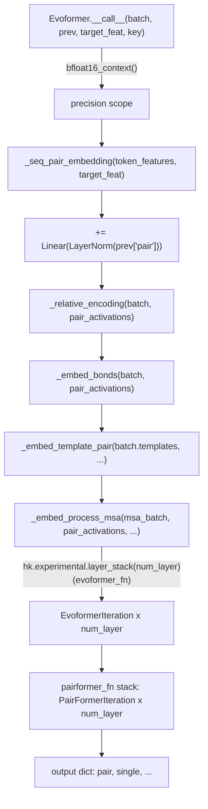

# alphafold3.model.network.evoformer — Evoformer trunk (MSA + pair processing, layer_stack, bf16 scope)

## Overview

[`Evoformer.__call__`](../catalog/src/alphafold3/model/network/evoformer.md#Evoformer.__call__) is
the top-level trunk that turns raw token/MSA/template features into a pair representation: it
embeds the sequence pair, adds bond/relative-position/template information, processes the MSA
through a stack of [`EvoformerIteration`](../catalog/src/alphafold3/model/network/modules.md#PairFormerIteration)
blocks (built via `hk.experimental.layer_stack`, not a Python loop), then refines the pair-only
representation through a stack of
[`PairFormerIteration`](../catalog/src/alphafold3/model/network/modules.md#PairFormerIteration)
blocks. The entire trunk runs inside a
[`bfloat16_context`](../catalog/src/alphafold3/model/components/utils.md#bfloat16_context) scope
gated by [`GlobalConfig.bfloat16`](../catalog/src/alphafold3/model/model_config.md#GlobalConfig.bfloat16) —
[`Evoformer.__call__`](../catalog/src/alphafold3/model/network/evoformer.md#Evoformer.__call__)
asserts this field is only `'all'` or `'none'` (not `'intermediate'`) for this particular trunk.

## Diagram

## Design rationale (why it's built this way)

**MSA and Pairformer stacks both use `hk.experimental.layer_stack`, not an unrolled Python loop or
`hk.scan`.** [`_embed_process_msa`](../catalog/src/alphafold3/model/network/evoformer.md#Evoformer._embed_process_msa)'s
`evoformer_fn`/[`Evoformer.evoformer_fn`](../catalog/src/alphafold3/model/network/evoformer.md#Evoformer.evoformer_fn)
is wrapped by `hk.experimental.layer_stack(self.config.msa_stack.num_layer)` — `layer_stack` shares
one set of parameters' *shape* across all layers while still giving each layer its own weight
values (stacked along a leading axis), which keeps the compiled HLO program size independent of
depth while still allowing per-layer-distinct parameters, unlike a plain Python `for` loop that
would unroll `num_layer` copies of the block into the trace.

**MSA processing shuffles and truncates rows before featurization, not after.**
[`_embed_process_msa`](../catalog/src/alphafold3/model/network/evoformer.md#Evoformer._embed_process_msa)
calls [`featurization.shuffle_msa`](../catalog/src/alphafold3/model/network/featurization.md#shuffle_msa)
then
[`truncate_msa_batch`](../catalog/src/alphafold3/model/network/featurization.md#truncate_msa_batch)`(...,
self.config.num_msa)` before
[`create_msa_feat`](../catalog/src/alphafold3/model/network/featurization.md#create_msa_feat) — since
the actual number of aligned sequences varies per input and can be very large, shuffling first (with
an RNG `key`) then truncating to a fixed `num_msa` gives a random, size-independent subsample rather
than always using the same (e.g. highest-identity) rows, while keeping every downstream tensor's
shape static for compilation.

**The MSA-stack precision assertion is a hard `assert`, not a silent fallback.**
[`Evoformer.__call__`](../catalog/src/alphafold3/model/network/evoformer.md#Evoformer.__call__)
asserts `self.global_config.`[`bfloat16`](../catalog/src/alphafold3/model/model_config.md#GlobalConfig.bfloat16)`
in {'all', 'none'}` — the Evoformer trunk does not support the third precision mode
(`'intermediate'`), so a caller enabling it would hit this assertion rather than the trunk silently
running in an unsupported/untested precision configuration.

## Entry points

- [`Evoformer.__call__`](../catalog/src/alphafold3/model/network/evoformer.md#Evoformer.__call__) —
  the sole top-level entry point, taking the featurized
  [`Batch`](../catalog/src/alphafold3/model/feat_batch.md#Batch), previous-iteration pair/single
  activations (`prev`), `target_feat`, and an RNG `key`.
- [`Evoformer._embed_process_msa`](../catalog/src/alphafold3/model/network/evoformer.md#Evoformer._embed_process_msa) —
  reached once per call to run the MSA stack and fold its result back into the pair representation.

## Mechanism (step-by-step)

1. **[`_seq_pair_embedding`](../catalog/src/alphafold3/model/network/evoformer.md#Evoformer._seq_pair_embedding)**
   builds the initial pair activations from
   [`TokenFeatures`](../catalog/src/alphafold3/model/features.md#TokenFeatures) (
   [`aatype`](../catalog/src/alphafold3/model/features.md#TokenFeatures.aatype),
   [`residue_index`](../catalog/src/alphafold3/model/features.md#TokenFeatures.residue_index), etc.)
   and `target_feat`.
2. **The previous iteration's pair activations are added back in**, via a
   [`LayerNorm`](../catalog/src/alphafold3/model/components/haiku_modules.md#LayerNorm) and
   [`Linear`](../catalog/src/alphafold3/model/components/haiku_modules.md#Linear) projection,
   letting the whole model be applied recycling-style across multiple calls.
3. **[`_relative_encoding`](../catalog/src/alphafold3/model/network/evoformer.md#Evoformer._relative_encoding)/
   [`_embed_bonds`](../catalog/src/alphafold3/model/network/evoformer.md#Evoformer._embed_bonds)/
   [`_embed_template_pair`](../catalog/src/alphafold3/model/network/evoformer.md#Evoformer._embed_template_pair)
   successively add** relative-position encodings, ligand/polymer bond information (from
   [`Batch.ligand_ligand_bond_info`](../catalog/src/alphafold3/model/feat_batch.md#Batch.ligand_ligand_bond_info)/
   [`polymer_ligand_bond_info`](../catalog/src/alphafold3/model/feat_batch.md#Batch.polymer_ligand_bond_info)),
   and template-derived pair features into the running pair activations.
4. **[`_embed_process_msa`](../catalog/src/alphafold3/model/network/evoformer.md#Evoformer._embed_process_msa)
   shuffles/truncates/featurizes the MSA**, runs it through the
   `hk.experimental.layer_stack`-wrapped
   [`EvoformerIteration`](../catalog/src/alphafold3/model/network/modules.md#PairFormerIteration)
   stack (see [alphafold3-model-network-modules](alphafold3-model-network-modules.md)), and returns
   the updated pair activations.
5. **A second `layer_stack`-wrapped stack of
   [`PairFormerIteration`](../catalog/src/alphafold3/model/network/modules.md#PairFormerIteration)**
   (`pairformer_fn`) further refines the pair (and single) representation with no further MSA
   involvement.

## Key data structures

- **`Evoformer.Config`** —
  [`pair_channel`](../catalog/src/alphafold3/model/network/evoformer.md#Evoformer.Config.pair_channel)/
  [`seq_channel`](../catalog/src/alphafold3/model/network/evoformer.md#Evoformer.Config.seq_channel)/
  [`msa_stack`](../catalog/src/alphafold3/model/network/evoformer.md#Evoformer.Config.msa_stack)
  (an `EvoformerIteration.Config` with a `num_layer`), plus nested
  [`pairformer`](../catalog/src/alphafold3/model/network/evoformer.md#Evoformer.Config.pairformer)/
  [`template`](../catalog/src/alphafold3/model/network/evoformer.md#Evoformer.Config.template)
  sub-configs.
- **[`Batch`](../catalog/src/alphafold3/model/feat_batch.md#Batch)** — the featurized input
  bundling [`token_features`](../catalog/src/alphafold3/model/feat_batch.md#Batch.token_features)/
  [`msa`](../catalog/src/alphafold3/model/feat_batch.md#Batch.msa)/
  [`templates`](../catalog/src/alphafold3/model/feat_batch.md#Batch.templates)/bond info — see
  [alphafold3-model-feat_batch](alphafold3-model-feat_batch.md).

## Dynamics (design intent)

Because both the MSA and Pairformer stacks use `hk.experimental.layer_stack`, the number of
trunk layers is purely a config value (`num_layer`) with no effect on compiled program size —
scaling the model to more Evoformer/Pairformer blocks is a parameter-count and compute-time change,
not a compile-time-size change.

## Edge cases

- [`Evoformer.__call__`](../catalog/src/alphafold3/model/network/evoformer.md#Evoformer.__call__)'s
  `assert self.global_config.bfloat16 in {'all', 'none'}` means any experiment attempting
  `bfloat16='intermediate'` with the Evoformer trunk fails immediately at call time, not silently
  degrading precision handling.
- [`_embed_process_msa`](../catalog/src/alphafold3/model/network/evoformer.md#Evoformer._embed_process_msa)
  truncates to `self.config.num_msa` rows *after* shuffling — the actual MSA rows a model sees for a
  given input can differ between calls with different RNG `key`s, which matters for reproducing
  exact predictions.

## Open questions

- Whether [`_embed_template_pair`](../catalog/src/alphafold3/model/network/evoformer.md#Evoformer._embed_template_pair)
  also uses `layer_stack` internally for its own per-template processing, or a different mechanism,
  is not resolved by this packet's cited subgraph.

## See also
- [alphafold3-model-network-modules](alphafold3-model-network-modules.md) —
  `EvoformerIteration`/`PairFormerIteration`, the per-layer blocks this trunk stacks.
- [alphafold3-model-feat_batch](alphafold3-model-feat_batch.md) — `Batch`, this module's featurized
  input type.
- [alphafold3-model-model_config](alphafold3-model-model_config.md) — `GlobalConfig.bfloat16`, the
  precision policy this trunk's `bfloat16_context` scope enforces.
