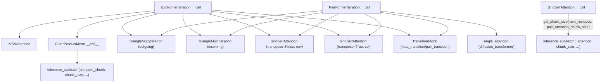

# alphafold3.model.network.modules — Evoformer/Pairformer building blocks (attention, triangle mult, transitions)

## Overview

This module is the Haiku building-block library the Evoformer and Pairformer trunks are assembled
from: [`MSAAttention`](../catalog/src/alphafold3/model/network/modules.md#MSAAttention),
[`GridSelfAttention`](../catalog/src/alphafold3/model/network/modules.md#GridSelfAttention)
(row/column triangle attention over the pair representation),
[`TriangleMultiplication`](../catalog/src/alphafold3/model/network/modules.md#TriangleMultiplication),
[`OuterProductMean`](../catalog/src/alphafold3/model/network/modules.md#OuterProductMean), and
[`TransitionBlock`](../catalog/src/alphafold3/model/network/modules.md#TransitionBlock), composed
into one [`EvoformerIteration.__call__`](../catalog/src/alphafold3/model/network/modules.md#EvoformerIteration.__call__)
(MSA + pair) or [`PairFormerIteration.__call__`](../catalog/src/alphafold3/model/network/modules.md#PairFormerIteration.__call__)
(pair + single, no MSA). Every module reads
[`GlobalConfig`](../catalog/src/alphafold3/model/model_config.md#GlobalConfig) for
precision/init/kernel-selection policy, and the two attention-heavy modules
([`GridSelfAttention`](../catalog/src/alphafold3/model/network/modules.md#GridSelfAttention),
[`OuterProductMean`](../catalog/src/alphafold3/model/network/modules.md#OuterProductMean)) route
through [alphafold3-model-components-mapping](alphafold3-model-components-mapping.md)'s
`inference_subbatch` to stay within memory for large `O(N^2)` pair tensors.

## Diagram

## Design rationale (why it's built this way)

**`GridSelfAttention` is one class parameterized by a `transpose` flag, not two separate row/column
attention classes.** [`GridSelfAttention`](../catalog/src/alphafold3/model/network/modules.md#GridSelfAttention)'s
[`transpose`](../catalog/src/alphafold3/model/network/modules.md#GridSelfAttention.transpose)
constructor argument swaps the leading two axes before and after
[`_attention`](../catalog/src/alphafold3/model/network/modules.md#GridSelfAttention._attention) —
since row-wise and column-wise triangle attention are mathematically the same operation applied to
a transposed pair tensor, sharing one implementation (and one set of learned weights' shapes) avoids
duplicating the attention logic for what's really an axis-order choice.

**Attention chunk size is computed from the actual sequence length at call time, not fixed at
construction.** [`GridSelfAttention.__call__`](../catalog/src/alphafold3/model/network/modules.md#GridSelfAttention.__call__)
calls [`get_shard_size`](../catalog/src/alphafold3/model/network/modules.md#get_shard_size)`(num_residues,
`[`pair_attention_chunk_size`](../catalog/src/alphafold3/model/model_config.md#GlobalConfig.pair_attention_chunk_size)`)`
every call — since `num_residues` varies per input structure, and the config field encodes a
size-dependent threshold table (see
[alphafold3-model-model_config](alphafold3-model-model_config.md)), the actual chunk size used can
differ between a 200-residue and a 3000-residue prediction from the same compiled model config.

**Every module carries both a per-module `Config` and the shared
[`GlobalConfig`](../catalog/src/alphafold3/model/model_config.md#GlobalConfig), rather than folding
global settings into each `Config`.** [`GridSelfAttention.Config`](../catalog/src/alphafold3/model/network/modules.md#GridSelfAttention.Config)/
[`TransitionBlock.Config`](../catalog/src/alphafold3/model/network/modules.md#TransitionBlock.Config)/
[`TriangleMultiplication.Config`](../catalog/src/alphafold3/model/network/modules.md#TriangleMultiplication.Config)
each hold only module-local hyperparameters (`num_head`, `use_glu_kernel`, etc.); precision/init/
kernel-backend policy is read from the separately-passed
[`GlobalConfig`](../catalog/src/alphafold3/model/model_config.md#GlobalConfig) — keeping these
concerns separate is what lets `GlobalConfig`'s policy apply uniformly without every `Config` class
duplicating the same fields.

## Entry points

- [`EvoformerIteration.__call__`](../catalog/src/alphafold3/model/network/modules.md#EvoformerIteration.__call__) —
  one MSA+pair Evoformer block; composes
  [`OuterProductMean`](../catalog/src/alphafold3/model/network/modules.md#OuterProductMean), MSA
  attention/transition, triangle multiplication/attention, and pair transition, gated by
  [`EvoformerIteration.config`](../catalog/src/alphafold3/model/network/modules.md#EvoformerIteration.config)'s
  [`msa_attention`](../catalog/src/alphafold3/model/network/modules.md#EvoformerIteration.Config.msa_attention)/
  [`outer_product_mean`](../catalog/src/alphafold3/model/network/modules.md#EvoformerIteration.Config.outer_product_mean)/
  [`triangle_multiplication_outgoing`](../catalog/src/alphafold3/model/network/modules.md#EvoformerIteration.Config.triangle_multiplication_outgoing)/
  [`pair_transition`](../catalog/src/alphafold3/model/network/modules.md#EvoformerIteration.Config.pair_transition)
  sub-configs.
- [`PairFormerIteration.__call__`](../catalog/src/alphafold3/model/network/modules.md#PairFormerIteration.__call__) —
  the pair+single (no-MSA) trunk block, gated similarly by
  [`PairFormerIteration.config`](../catalog/src/alphafold3/model/network/modules.md#PairFormerIteration.config)'s
  [`single_attention`](../catalog/src/alphafold3/model/network/modules.md#PairFormerIteration.Config.single_attention)/
  [`single_transition`](../catalog/src/alphafold3/model/network/modules.md#PairFormerIteration.Config.single_transition)
  sub-configs.
- [`GridSelfAttention.__call__`](../catalog/src/alphafold3/model/network/modules.md#GridSelfAttention.__call__) /
  [`OuterProductMean.__call__`](../catalog/src/alphafold3/model/network/modules.md#OuterProductMean.__call__) —
  the two memory-chunked entry points, both delegating to
  [`inference_subbatch`](../catalog/src/alphafold3/model/components/mapping.md#inference_subbatch).

## Mechanism (step-by-step)

1. **`GridSelfAttention._attention`** projects `q`/`k`/`v` (with a minimum 16-wide head dimension
   for Triton compatibility, per its own comment), then calls `tokamax.dot_product_attention` with
   `implementation=`[`global_config.flash_attention_implementation`](../catalog/src/alphafold3/model/model_config.md#GlobalConfig)
   — this is where the actual attention kernel backend is selected per
   [alphafold3-model-model_config](alphafold3-model-model_config.md).
2. **[`GridSelfAttention.__call__`](../catalog/src/alphafold3/model/network/modules.md#GridSelfAttention.__call__)
   optionally transposes**, computes the pair-bias projection, derives `chunk_size` via
   [`get_shard_size`](../catalog/src/alphafold3/model/network/modules.md#get_shard_size), and calls
   [`inference_subbatch`](../catalog/src/alphafold3/model/components/mapping.md#inference_subbatch)
   over [`_attention`](../catalog/src/alphafold3/model/network/modules.md#GridSelfAttention._attention)
   with the mask as a batched argument and the pair bias as non-batched.
3. **`TriangleMultiplication.__call__`** layer-norms, optionally routes through
   `tokamax.gated_linear_unit` (`use_glu_kernel`) for the projection+gate fusion, applies the
   incoming/outgoing einsum equation, center-normalizes, and gates the output — an inherently
   memory-bound-not-attention-bound operation, so it does not use
   [`inference_subbatch`](../catalog/src/alphafold3/model/components/mapping.md#inference_subbatch)
   chunking.
4. **[`OuterProductMean.__call__`](../catalog/src/alphafold3/model/network/modules.md#OuterProductMean.__call__)
   projects `left`/`right` per-residue features**, then chunks the *outer-product* computation
   itself (`compute_chunk`, an einsum over `left_act`/`right_act`/`output_w`) via
   [`inference_subbatch`](../catalog/src/alphafold3/model/components/mapping.md#inference_subbatch),
   since materializing the full outer product for all residue pairs at once is the memory-critical
   step.
5. **[`EvoformerIteration.__call__`](../catalog/src/alphafold3/model/network/modules.md#EvoformerIteration.__call__)/
   [`PairFormerIteration.__call__`](../catalog/src/alphafold3/model/network/modules.md#PairFormerIteration.__call__)
   sequence these sub-modules**, each gated by its own
   config sub-field, forming one trunk iteration; the full model stacks many of these iterations
   (see [alphafold3-model](alphafold3-model.md)/[alphafold3-model-network-evoformer](alphafold3-model-network-evoformer.md)).

## Key data structures

- **Per-module `Config` classes** — e.g.
  [`GridSelfAttention.Config`](../catalog/src/alphafold3/model/network/modules.md#GridSelfAttention.Config)
  (`num_head`), `OuterProductMean.Config` (
  [`num_outer_channel`](../catalog/src/alphafold3/model/network/modules.md#OuterProductMean.Config.num_outer_channel),
  `chunk_size`) — module-local hyperparameters, separate from
  [`GlobalConfig`](../catalog/src/alphafold3/model/model_config.md#GlobalConfig).
- **`EvoformerIteration.Config`/`PairFormerIteration.Config`** — nest every sub-module's `Config` (
  [`msa_attention`](../catalog/src/alphafold3/model/network/modules.md#EvoformerIteration.Config.msa_attention),
  [`pair_attention`](../catalog/src/alphafold3/model/network/modules.md#EvoformerIteration.Config.pair_attention),
  etc.), letting the whole trunk block's architecture be toggled/tuned from one config tree.

## Dynamics (design intent)

Because [`GridSelfAttention`](../catalog/src/alphafold3/model/network/modules.md#GridSelfAttention)/
[`OuterProductMean`](../catalog/src/alphafold3/model/network/modules.md#OuterProductMean) both
call [`inference_subbatch`](../catalog/src/alphafold3/model/components/mapping.md#inference_subbatch)
(which itself checks `hk.running_init()`), the chunking behavior is transparent to Haiku's
parameter-shape tracking — parameters are always initialized as if unchunked, so changing
`chunk_size`/`pair_attention_chunk_size` between runs never requires re-initializing weights.

## Edge cases

- [`GridSelfAttention._attention`](../catalog/src/alphafold3/model/network/modules.md#GridSelfAttention._attention)'s
  own comment notes "Triton requires a minimum dimension of 16 for doing matmul" — the QKV head
  dimension is clamped to at least 16 regardless of `num_channels // num_head`, a hardware-kernel
  constraint leaking into the model architecture's shape choices.
- [`TriangleMultiplication`](../catalog/src/alphafold3/model/network/modules.md#TriangleMultiplication)'s
  `equation` config field only accepts two literal einsum strings
  (`'ikc,jkc->ijc'`/`'kjc,kic->ijc'`) — these correspond to the "outgoing" vs. "incoming" triangle
  multiplication variants; no other einsum pattern is supported.

## Open questions

- Whether `use_glu_kernel=False` (the plain-JAX fallback path in
  [`TransitionBlock`](../catalog/src/alphafold3/model/network/modules.md#TransitionBlock)/
  [`TriangleMultiplication`](../catalog/src/alphafold3/model/network/modules.md#TriangleMultiplication))
  is only a debugging/portability fallback or is expected to remain performance-competitive on some
  hardware targets is not addressed by this packet's cited subgraph.

## See also
- [alphafold3-model-components-mapping](alphafold3-model-components-mapping.md) — `inference_subbatch`,
  the memory-chunking mechanism `GridSelfAttention`/`OuterProductMean` depend on.
- [alphafold3-model-model_config](alphafold3-model-model_config.md) — `GlobalConfig`, read by every
  module in this file for precision/init/kernel-selection policy.
- [alphafold3-model-network-diffusion_transformer](alphafold3-model-network-diffusion_transformer.md) —
  `SelfAttentionConfig`/`self_attention`, the analogous attention building blocks for the diffusion
  module's transformer trunk.
