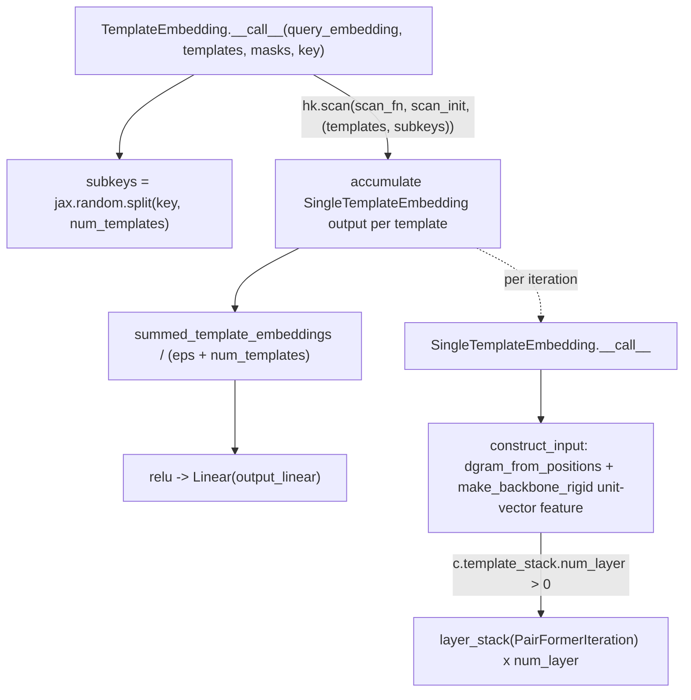

# alphafold3.model.network.template_modules — hk.scan template accumulation

## Overview

[`TemplateEmbedding.__call__`](../catalog/src/alphafold3/model/network/template_modules.md#TemplateEmbedding.__call__)
embeds a variable number of structural templates into a single fixed-size pair representation,
using `hk.scan` to accumulate a running sum across templates rather than stacking per-template
outputs — the compiled program's size is independent of `num_templates`, matching the same
depth-independence goal `hk.experimental.layer_stack` achieves for network depth elsewhere in the
model (see [alphafold3-model-network-evoformer](alphafold3-model-network-evoformer.md)).
[`SingleTemplateEmbedding.construct_input`](../catalog/src/alphafold3/model/network/template_modules.md#SingleTemplateEmbedding.construct_input)
builds each template's per-residue-pair feature vector from a distogram (
[`dgram_from_positions`](../catalog/src/alphafold3/model/network/template_modules.md#dgram_from_positions))
and a backbone-frame-relative unit-vector feature (via
[`make_backbone_rigid`](../catalog/src/alphafold3/model/network/template_modules.md#make_backbone_rigid)
and [`Rigid3Array`](../catalog/src/alphafold3/jax/geometry/rigid_matrix_vector.md#Rigid3Array)).

## Diagram

## Design rationale (why it's built this way)

**Templates are reduced via `hk.scan`'s running-sum accumulator, not `hk.vmap` followed by a
reduction.** [`TemplateEmbedding.__call__`](../catalog/src/alphafold3/model/network/template_modules.md#TemplateEmbedding.__call__)'s
`scan_fn` returns `carry + embedding` as the new carry — since the final output is only ever the
average over templates (never per-template embeddings individually), scanning with an additive
carry avoids ever materializing a `[num_templates, num_res, num_res, num_channels]` intermediate
tensor that `vmap`-then-`mean` would require, trading a sequential loop for reduced peak memory.

**Each template gets its own random key via `jax.random.split(key, num_templates)` up front, not a
shared key.** [`TemplateEmbedding.__call__`](../catalog/src/alphafold3/model/network/template_modules.md#TemplateEmbedding.__call__)
splits the key before the scan and passes the resulting array of subkeys as part of the scanned
input tuple `(templates, subkeys)` — this keeps whatever stochastic behavior exists inside
[`SingleTemplateEmbedding.__call__`](../catalog/src/alphafold3/model/network/template_modules.md#SingleTemplateEmbedding.__call__)
independent across templates, matching the general "explicit key threading" discipline JAX code
requires for reproducibility.

**Distogram computation is a pure pairwise threshold comparison, not a smooth/differentiable
distance embedding.** [`dgram_from_positions`](../catalog/src/alphafold3/model/network/template_modules.md#dgram_from_positions)
computes `(dist2 > lower_breaks) * (dist2 < upper_breaks)` as a hard 0/1 bin membership — a
one-hot-like binning of squared distances into `num_bins` (default 39) buckets — rather than, say, a
Gaussian-RBF-style soft encoding, keeping this feature simple and directly comparable to AlphaFold2's
original distogram formulation.

## Entry points

- [`TemplateEmbedding.__call__`](../catalog/src/alphafold3/model/network/template_modules.md#TemplateEmbedding.__call__) —
  reached once per input with templates, producing the `[num_res, num_res, num_channels]` combined
  template embedding fed into the pair representation.
- [`SingleTemplateEmbedding.__call__`](../catalog/src/alphafold3/model/network/template_modules.md#SingleTemplateEmbedding.__call__) —
  reached once per template (inside the scan) via
  [`SingleTemplateEmbedding.template_iteration_fn`](../catalog/src/alphafold3/model/network/template_modules.md#SingleTemplateEmbedding.template_iteration_fn).
- [`SingleTemplateEmbedding.construct_input`](../catalog/src/alphafold3/model/network/template_modules.md#SingleTemplateEmbedding.construct_input) —
  reached once per template to build its raw pair-feature input before the
  [`PairFormerIteration`](../catalog/src/alphafold3/model/network/modules.md#PairFormerIteration)
  stack.

## Mechanism (step-by-step)

1. **[`TemplateEmbedding.__call__`](../catalog/src/alphafold3/model/network/template_modules.md#TemplateEmbedding.__call__)
   asserts every input tensor's shape** against `num_residues`/`num_templates`/`num_atoms=24`, then
   builds one [`SingleTemplateEmbedding`](../catalog/src/alphafold3/model/network/template_modules.md#SingleTemplateEmbedding)
   module and scans it over `(templates, subkeys)` with an additive carry initialized to zeros.
2. **[`SingleTemplateEmbedding.construct_input`](../catalog/src/alphafold3/model/network/template_modules.md#SingleTemplateEmbedding.construct_input)
   computes a pseudo-beta distogram** via
   [`dgram_from_positions`](../catalog/src/alphafold3/model/network/template_modules.md#dgram_from_positions),
   a one-hot `aatype` pair feature, and a backbone-frame-relative unit-vector feature via
   [`make_backbone_rigid`](../catalog/src/alphafold3/model/network/template_modules.md#make_backbone_rigid)
   (which builds a [`Rigid3Array`](../catalog/src/alphafold3/jax/geometry/rigid_matrix_vector.md#Rigid3Array)
   per residue from three backbone atoms via
   [`Rot3Array.from_two_vectors`](../catalog/src/alphafold3/jax/geometry/rotation_matrix.md#Rot3Array.from_two_vectors)),
   then linearly projects and sums every feature into one `[num_res, num_res, num_channels]` `act`
   tensor.
3. **If `c.template_stack.num_layer` is nonzero, `act` is refined by an
   `hk.experimental.layer_stack`-wrapped stack of
   [`PairFormerIteration`](../catalog/src/alphafold3/model/network/modules.md#PairFormerIteration)**
   blocks (the per-template embedding trunk).
4. **Back in [`TemplateEmbedding.__call__`](../catalog/src/alphafold3/model/network/template_modules.md#TemplateEmbedding.__call__),
   the scan's final accumulated sum is divided by `num_templates`** (with a small epsilon guard),
   relu'd, and linearly projected to the output channel count.

## Key data structures

- **`TemplateEmbedding.Config`** —
  [`num_channels`](../catalog/src/alphafold3/model/network/template_modules.md#TemplateEmbedding.Config.num_channels),
  [`template_stack`](../catalog/src/alphafold3/model/network/template_modules.md#TemplateEmbedding.Config.template_stack)
  (a `PairFormerIteration.Config` with
  [`num_layer`](../catalog/src/alphafold3/model/network/modules.md#PairFormerIteration.Config.num_layer)),
  [`dgram_features`](../catalog/src/alphafold3/model/network/template_modules.md#TemplateEmbedding.Config.dgram_features)
  (a [`DistogramFeaturesConfig`](../catalog/src/alphafold3/model/network/template_modules.md#DistogramFeaturesConfig)
  with
  [`min_bin`](../catalog/src/alphafold3/model/network/template_modules.md#DistogramFeaturesConfig.min_bin)/
  [`max_bin`](../catalog/src/alphafold3/model/network/template_modules.md#DistogramFeaturesConfig.max_bin)/
  [`num_bins`](../catalog/src/alphafold3/model/network/template_modules.md#DistogramFeaturesConfig.num_bins)).
- **[`Templates`](../catalog/src/alphafold3/model/features.md#Templates)** — the
  per-template feature bundle (
  [`aatype`](../catalog/src/alphafold3/model/features.md#Templates.aatype)/
  [`atom_positions`](../catalog/src/alphafold3/model/features.md#Templates.atom_positions)/
  [`atom_mask`](../catalog/src/alphafold3/model/features.md#Templates.atom_mask))
  this module iterates over.

## Dynamics (design intent)

Because the scan's carry is a fixed-shape `[num_res, num_res, num_channels]` accumulator rather than
a per-template stacked tensor, `num_templates` only affects the scan's trip count, not any tensor's
shape — the compiled program handles any template count with the same shape signature, so
`num_templates` need not be baked into a static compilation bucket the way, say, `num_tokens` is.

## Edge cases

- [`TemplateEmbedding.__call__`](../catalog/src/alphafold3/model/network/template_modules.md#TemplateEmbedding.__call__)'s
  average-by-`num_templates` uses a `1e-7` epsilon in the denominator — with `num_templates=0` this
  produces a near-zero (not NaN) embedding, effectively a no-template fallback, though the function's
  shape assertions (`templates.aatype.shape == (num_templates, num_residues)`) still require a
  well-formed (possibly zero-length) `templates` object to be passed in.
- [`dgram_from_positions`](../catalog/src/alphafold3/model/network/template_modules.md#dgram_from_positions)'s
  final bin catches "everything larger than `max_bin`" per the config's own comment — the binning is
  not symmetric in how it treats the two tail bins (no explicit "smaller than `min_bin`" catch-all
  bin is called out in this packet's cited subgraph).

## Open questions

- Whether the sequential `hk.scan` over templates (rather than a `vmap`-based parallel embedding)
  has been measured as a step-time bottleneck at realistic `num_templates` counts is not addressed by
  this packet's cited subgraph.

## See also
- [alphafold3-model-network-evoformer](alphafold3-model-network-evoformer.md) — the sibling
  `hk.experimental.layer_stack`-based depth-independence pattern used inside each template's
  `PairFormerIteration` refinement.
- [alphafold3-jax-geometry-rigid_matrix_vector](alphafold3-jax-geometry-rigid_matrix_vector.md) —
  `Rigid3Array`, used by `make_backbone_rigid` to build per-residue backbone frames.
- [alphafold3-jax-geometry-rotation_matrix](alphafold3-jax-geometry-rotation_matrix.md) —
  `Rot3Array.from_two_vectors`, the rotation-construction primitive `make_backbone_rigid` uses.
