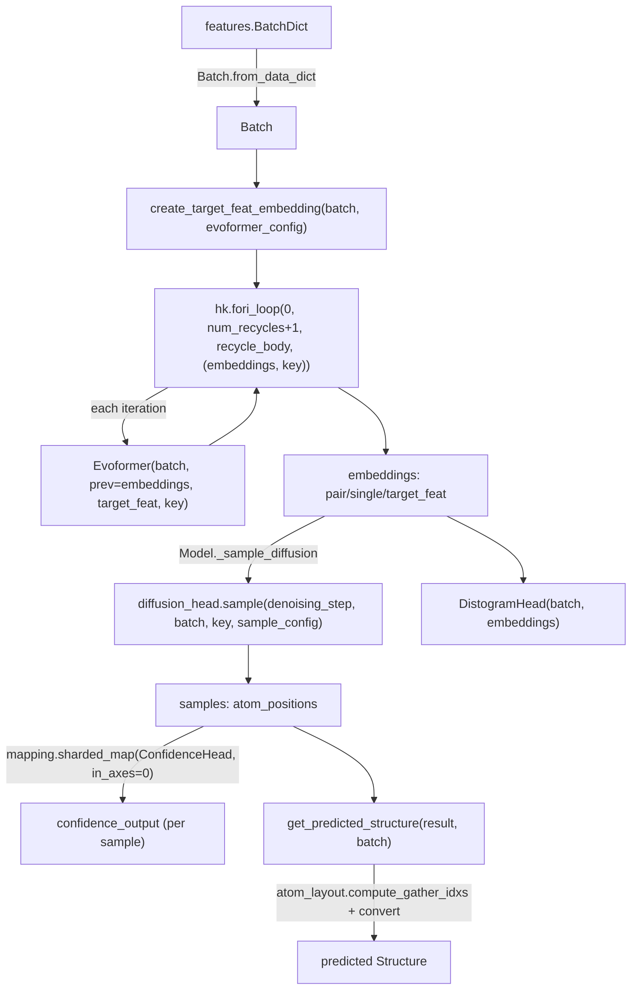

# alphafold3.model.model — top-level Model, recycling via hk.fori_loop

## Overview

[`Model.__call__`](../catalog/src/alphafold3/model/model.md#Model.__call__) is the single top-level
forward pass: it converts a raw feature dict into a
[`Batch`](../catalog/src/alphafold3/model/feat_batch.md#Batch), runs the Evoformer trunk repeatedly
in a recycling loop (via `hk.fori_loop`, not `layer_stack` — recycling reuses the *same* trunk
parameters every iteration, unlike stacked distinct layers), samples structures via the diffusion
head, and computes confidence/distogram heads over the result.
[`get_predicted_structure`](../catalog/src/alphafold3/model/model.md#get_predicted_structure)
converts the model's internal (padded, gathered) atom-position output back into a real
[`Structure`](../catalog/src/alphafold3/structure/structure.md#Structure) via
[`atom_layout.convert`](../catalog/src/alphafold3/model/atom_layout/atom_layout.md#convert), closing
the loop from raw structure in to predicted structure out.

## Diagram

## Design rationale (why it's built this way)

**Recycling uses `hk.fori_loop`, not `hk.experimental.layer_stack` or `hk.scan` — because every
iteration reuses identical parameters, not distinct per-iteration weights.**
[`Model.__call__`](../catalog/src/alphafold3/model/model.md#Model.__call__) builds one
`embedding_module = evoformer_network.Evoformer(...)` outside the loop, then calls `hk.fori_loop(0,
num_iter, recycle_body, (embeddings, key))` where `recycle_body` calls that same module instance
each time — `layer_stack` is for a compiled-size-independent stack of *distinct* per-layer
parameters, which is the wrong tool when the same weights should be applied repeatedly; `fori_loop`
compiles the recycle body once and calls it `num_iter` times, which is the correct pattern here.

**During Haiku's parameter-initialization pass, the recycle loop is skipped entirely and the body
runs exactly once.** [`Model.__call__`](../catalog/src/alphafold3/model/model.md#Model.__call__)
branches on `hk.running_init()`: if true, it calls `recycle_body(None, (embeddings, key))` directly
instead of `hk.fori_loop` — since parameter *shapes* (which is all init cares about) don't change
across recycle iterations, running the loop `num_recycles+1` times during init would be pure wasted
tracing work.

**Confidence-head computation over multiple diffusion samples is batched via
`mapping.sharded_map`, not a Python loop or `vmap`.**
[`Model.__call__`](../catalog/src/alphafold3/model/model.md#Model.__call__) wraps the
`ConfidenceHead`
call in `mapping.sharded_map(..., in_axes=0)(samples['atom_positions'])` — reusing the same
chunked-batched-apply idiom documented in
[alphafold3-model-components-mapping](alphafold3-model-components-mapping.md), trading (if
`shard_size` is set) some throughput for lower peak memory when scoring several diffusion samples'
worth of confidence in one call.

## Entry points

- [`Model.__call__`](../catalog/src/alphafold3/model/model.md#Model.__call__) — the single top-level
  forward pass, taking a raw `features.BatchDict` and returning the full `ModelResult` (diffusion
  samples, distogram, confidence outputs).
- [`Model.get_inference_result`](../catalog/src/alphafold3/model/model.md#Model.get_inference_result) —
  reached once per prediction to post-process a raw `ModelResult` into an
  `InferenceResult`, carrying
  [`metadata`](../catalog/src/alphafold3/model/model.md#InferenceResult.metadata).
- [`get_predicted_structure`](../catalog/src/alphafold3/model/model.md#get_predicted_structure) —
  reached to convert the model's internal per-token-atom output coordinates back into a real
  [`Structure`](../catalog/src/alphafold3/structure/structure.md#Structure).
- [`create_target_feat_embedding`](../catalog/src/alphafold3/model/model.md#create_target_feat_embedding) —
  reached once per call, before the recycle loop, to build the initial target-sequence feature
  embedding.

## Mechanism (step-by-step)

1. **[`Model.__call__`](../catalog/src/alphafold3/model/model.md#Model.__call__) converts the raw
   dict to a [`Batch`](../catalog/src/alphafold3/model/feat_batch.md#Batch)** via
   [`Batch.from_data_dict`](../catalog/src/alphafold3/model/feat_batch.md#Batch.from_data_dict), and
   builds the initial `target_feat` embedding via
   [`create_target_feat_embedding`](../catalog/src/alphafold3/model/model.md#create_target_feat_embedding).
2. **The recycle loop inside
   [`Model.__call__`](../catalog/src/alphafold3/model/model.md#Model.__call__) (`hk.fori_loop` or a
   single `recycle_body` call under `hk.running_init()`) runs the Evoformer trunk `num_recycles + 1`
   times**, each iteration re-embedding from the previous iteration's `pair`/`single` output
   (`prev`).
3. **[`Model._sample_diffusion`](../catalog/src/alphafold3/model/model.md#Model.__call__)-adjacent
   diffusion sampling** produces `samples['atom_positions']` from the final recycled embeddings (see
   [alphafold3-model-network-diffusion_head](alphafold3-model-network-diffusion_head.md)'s `sample`).
4. **Confidence and distogram heads, called from within
   [`Model.__call__`](../catalog/src/alphafold3/model/model.md#Model.__call__), consume the same
   final embeddings and samples**, with confidence scoring batched per-sample via
   `mapping.sharded_map`.
5. **[`get_predicted_structure`](../catalog/src/alphafold3/model/model.md#get_predicted_structure)
   gathers the padded per-token-atom output coordinates into the flat output atom layout** via
   [`atom_layout.compute_gather_idxs`](../catalog/src/alphafold3/model/atom_layout/atom_layout.md#compute_gather_idxs)/
   [`atom_layout.convert`](../catalog/src/alphafold3/model/atom_layout/atom_layout.md#convert), then
   writes the result into
   [`Structure.copy_and_update_atoms`](../catalog/src/alphafold3/structure/structure.md#Structure.copy_and_update_atoms).

## Key data structures

- **`Model.Config`** — `evoformer` (an
  `Evoformer.Config`), `global_config` (a
  [`GlobalConfig`](../catalog/src/alphafold3/model/model_config.md#GlobalConfig)),
  `heads` (diffusion/confidence/distogram sub-configs), `num_recycles` (default 10).
- **`InferenceResult`** —
  `predicted_structure`/
  `numerical_data`/[`metadata`](../catalog/src/alphafold3/model/model.md#InferenceResult.metadata)/
  `debug_outputs`/`model_id`, the final post-processed output every downstream consumer (confidence
  serialization, structure writing) reads from.

## Dynamics (design intent)

Because the recycle loop's `recycle_body` closure captures one shared `embedding_module` instance,
changing `num_recycles` only changes the `hk.fori_loop` trip count, not the compiled program's
structure — this is the same "config value, not a shape/structure change" property recycling shares
with the scan-based template accumulation in
[alphafold3-model-network-template_modules](alphafold3-model-network-template_modules.md), even
though the two use different Haiku control-flow primitives for different reasons (identical vs.
distinct per-iteration parameters).

## Edge cases

- [`get_predicted_structure`](../catalog/src/alphafold3/model/model.md#get_predicted_structure)
  explicitly handles atoms the model did not predict (`gather_mask == 0` after the gather):
  their coordinates are set to `(0, 0, 0)` and a warning is logged listing their
  `(chain_id, res_id, res_name, atom_name)` identity — this is a silent-but-logged fallback, not an
  error.
- [`Model.__call__`](../catalog/src/alphafold3/model/model.md#Model.__call__)'s
  `hk.running_init()` branch changes not just loop structure but the *number of forward passes*
  through the Evoformer (one, vs. `num_recycles + 1`) — any per-call side effect that depends on
  iteration count would behave differently between initialization and real inference.

## Open questions

- Whether `num_recycles` is ever varied at inference time per-input (early-stopping recycling based
  on a convergence criterion) or is always a fixed config value is not addressed by this packet's
  cited subgraph — as written, `hk.fori_loop`'s trip count is a static `num_iter`.

## See also
- [alphafold3-model-feat_batch](alphafold3-model-feat_batch.md) — `Batch`, the featurized input this
  module's `__call__` constructs and consumes.
- [alphafold3-model-network-evoformer](alphafold3-model-network-evoformer.md) — the Evoformer trunk
  invoked once per recycle iteration.
- [alphafold3-model-network-diffusion_head](alphafold3-model-network-diffusion_head.md) — the
  `sample` function driving structure generation from the final recycled embeddings.
- [alphafold3-model-atom_layout](alphafold3-model-atom_layout.md) — `compute_gather_idxs`/`convert`,
  used by `get_predicted_structure` to map model output back to a real structure.
- [alphafold3-model-components-mapping](alphafold3-model-components-mapping.md) — `sharded_map`, used
  to batch confidence-head scoring across diffusion samples.
