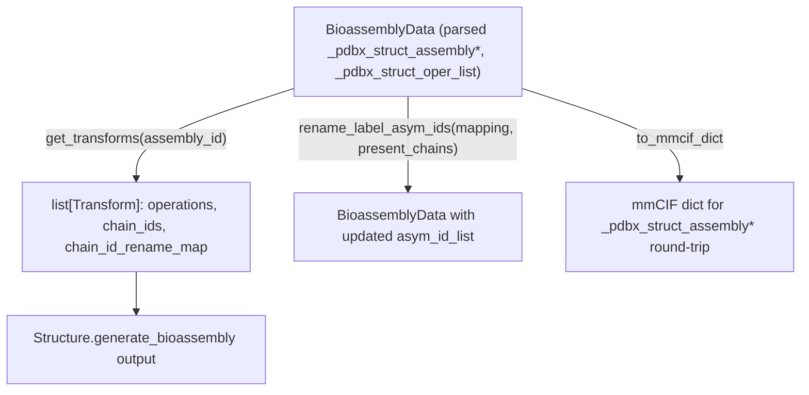

# alphafold3.structure.bioassemblies — biological assembly generation via rigid transforms

## Overview

This module represents mmCIF `_pdbx_struct_assembly*`/`_pdbx_struct_oper_list` categories as
[`BioassemblyData`](../catalog/src/alphafold3/structure/bioassemblies.md#BioassemblyData), which
turns them into ordered
[`Transform`](../catalog/src/alphafold3/structure/bioassemblies.md#Transform) objects (
[`get_transforms`](../catalog/src/alphafold3/structure/bioassemblies.md#BioassemblyData.get_transforms))
needed to generate a full biological assembly from an asymmetric unit — e.g. expanding a
crystallographic asymmetric unit into a biologically relevant multimer by applying rotation/
translation [`Operation`](../catalog/src/alphafold3/structure/bioassemblies.md#Operation)s to
specified chains, renaming chain IDs as needed so the expanded assembly's chains stay uniquely
identified.
[`BioassemblyData.rename_label_asym_ids`](../catalog/src/alphafold3/structure/bioassemblies.md#BioassemblyData.rename_label_asym_ids)
supports renumbering the underlying chain IDs consistently when a
[`Structure`](../catalog/src/alphafold3/structure/structure.md#Structure.bioassembly_data)'s own
chain IDs are renamed.
[`Structure.generate_bioassembly`](../catalog/src/alphafold3/structure/structure.md#Structure.generate_bioassembly)
is the consuming entry point. Pure host-side biology data transformation, out of TPU compute scope.

## Diagram

## Design rationale (why it's built this way)

**Chain renaming only kicks in the *second* time a given chain ID is expanded, keeping the first
occurrence's original ID unchanged.**
[`BioassemblyData.get_transforms`](../catalog/src/alphafold3/structure/bioassemblies.md#BioassemblyData.get_transforms)'s
comment states this directly: it isn't strictly necessary (no guarantee is made about chain naming
post-expansion) but "can make it a bit easier to inspect and compare structures pre and post
bioassembly extraction" — a pragmatic debuggability choice, not a correctness requirement.

**`Transform`'s `operations` field composes several rigid transformations, applied in reverse list
order to match standard matrix-composition convention.**
[`Transform.operations`](../catalog/src/alphafold3/structure/bioassemblies.md#Transform.operations)
is a sequence of [`Operation`](../catalog/src/alphafold3/structure/bioassemblies.md#Operation)s
composed right-to-left when applied — since applying transform `A` then `B` to a point is `B(A(x))`,
and the operations list is naturally ordered as parsed from the mmCIF's `oper_expression` (outermost
operation listed first), applying in reverse order at use time keeps composition semantics correct
without requiring the parser itself to pre-reverse the list.

**`rename_label_asym_ids` treats a post-rename collision as an error, not a silent merge.**
[`BioassemblyData.rename_label_asym_ids`](../catalog/src/alphafold3/structure/bioassemblies.md#BioassemblyData.rename_label_asym_ids)
raises `ValueError` if the count of unique renamed IDs doesn't match the count of unique original IDs
restricted to `present_chains` — since two distinct chains colliding onto the same new label would
silently corrupt which atoms belong to which chain in the renamed assembly, this is treated as a hard
failure rather than an ambiguous merge.

## Entry points

- [`BioassemblyData.get_transforms`](../catalog/src/alphafold3/structure/bioassemblies.md#BioassemblyData.get_transforms) —
  reached once per assembly ID to compute the ordered list of
  [`Transform`](../catalog/src/alphafold3/structure/bioassemblies.md#Transform)s needed to generate
  that assembly.
- [`BioassemblyData.rename_label_asym_ids`](../catalog/src/alphafold3/structure/bioassemblies.md#BioassemblyData.rename_label_asym_ids) —
  reached to produce a renamed copy of the bioassembly metadata when the underlying structure's
  chain IDs are renamed.
- [`BioassemblyData.to_mmcif_dict`](../catalog/src/alphafold3/structure/bioassemblies.md#BioassemblyData.to_mmcif_dict) —
  reached to serialize the bioassembly metadata back to mmCIF-dict form.
- [`Structure.generate_bioassembly`](../catalog/src/alphafold3/structure/structure.md#Structure.generate_bioassembly) —
  reached to actually apply the transforms and produce the expanded
  [`Structure`](../catalog/src/alphafold3/structure/structure.md#Structure.rename_chain_ids).

## Mechanism (step-by-step)

1. **[`BioassemblyData.get_transforms`](../catalog/src/alphafold3/structure/bioassemblies.md#BioassemblyData.get_transforms)
   parses each generation row's `oper_expression`** into sequences of operation IDs, and for each
   resulting `(oper_id_seq, chain_ids)` pair, builds a
   [`Transform`](../catalog/src/alphafold3/structure/bioassemblies.md#Transform) with a
   [`chain_id_rename_map`](../catalog/src/alphafold3/structure/bioassemblies.md#Transform.chain_id_rename_map)
   assigning fresh chain IDs to any chain seen more than once.
2. **Each [`Transform`](../catalog/src/alphafold3/structure/bioassemblies.md#Transform)'s
   [`operations`](../catalog/src/alphafold3/structure/bioassemblies.md#Transform.operations) are
   applied in reverse list order**, composing each constituent
   [`Operation`](../catalog/src/alphafold3/structure/bioassemblies.md#Operation)'s rotation and
   translation to produce the expanded coordinates for that transform's
   [`chain_ids`](../catalog/src/alphafold3/structure/bioassemblies.md#Transform.chain_ids).
3. **[`BioassemblyData.rename_label_asym_ids`](../catalog/src/alphafold3/structure/bioassemblies.md#BioassemblyData.rename_label_asym_ids)
   rewrites every generation row's `asym_id_list`** through the supplied mapping, restricted to
   `present_chains`, validating the result stays unique before returning a new
   [`BioassemblyData`](../catalog/src/alphafold3/structure/bioassemblies.md#BioassemblyData).

## Key data structures

- **[`Operation`](../catalog/src/alphafold3/structure/bioassemblies.md#Operation)** —
  [`trans`](../catalog/src/alphafold3/structure/bioassemblies.md#Operation.trans) `(3,)` and
  [`rot`](../catalog/src/alphafold3/structure/bioassemblies.md#Operation.rot) `(3, 3)` arrays; one
  rigid transformation parsed from a `_pdbx_struct_oper_list` row.
- **[`Transform`](../catalog/src/alphafold3/structure/bioassemblies.md#Transform)** —
  [`operations`](../catalog/src/alphafold3/structure/bioassemblies.md#Transform.operations) (applied
  right-to-left),
  [`chain_ids`](../catalog/src/alphafold3/structure/bioassemblies.md#Transform.chain_ids) (which
  chains this transform targets),
  [`chain_id_rename_map`](../catalog/src/alphafold3/structure/bioassemblies.md#Transform.chain_id_rename_map)
  (disambiguation for repeated chain copies).
- **[`BioassemblyData`](../catalog/src/alphafold3/structure/bioassemblies.md#BioassemblyData)** —
  wraps the three parsed mmCIF category dicts plus derived
  [`_operations`](../catalog/src/alphafold3/structure/bioassemblies.md#BioassemblyData._operations)
  (parsed [`Operation`](../catalog/src/alphafold3/structure/bioassemblies.md#Operation)s keyed by
  oper ID) and ordered
  [`_assembly_ids`](../catalog/src/alphafold3/structure/bioassemblies.md#BioassemblyData._assembly_ids)/
  [`_oper_ids`](../catalog/src/alphafold3/structure/bioassemblies.md#BioassemblyData._oper_ids).

## Dynamics (design intent)

Because chain renaming is deferred until a chain ID is seen a second time within
[`get_transforms`](../catalog/src/alphafold3/structure/bioassemblies.md#BioassemblyData.get_transforms),
the number of distinct new chain IDs allocated is exactly `(total chain-copies across all
transforms) - (unique chain IDs in the asymmetric unit)` — proportional to how much the biological
assembly actually multiplies the asymmetric unit's content.

## Edge cases

- [`BioassemblyData`](../catalog/src/alphafold3/structure/bioassemblies.md#BioassemblyData)'s
  constructor validates every `assembly_id`/`oper_id` is present in its respective source table at
  construction time, raising `ValueError` listing the missing ID and the available keys — an
  inconsistent assembly/operation reference is caught immediately rather than at first use in
  [`get_transforms`](../catalog/src/alphafold3/structure/bioassemblies.md#BioassemblyData.get_transforms).
- [`BioassemblyData.rename_label_asym_ids`](../catalog/src/alphafold3/structure/bioassemblies.md#BioassemblyData.rename_label_asym_ids)
  drops any label_asym_id from `_pdbx_struct_assembly_gen` rows that isn't in `present_chains` —
  chains absent from the atom site list are silently excluded from the renamed output, not preserved
  as dangling references.

## Open questions

- Whether nested/composed assemblies (an assembly whose generation references another assembly's
  output, rather than only the base asymmetric unit) are supported is not addressed by this packet's
  cited subgraph.

## See also
- [alphafold3-structure-mmcif](alphafold3-structure-mmcif.md) — `parse_oper_expr`/`int_id_to_str_id`/
  `str_id_to_int_id`, the parsing helpers this module's construction path depends on.
- [alphafold3-structure](alphafold3-structure.md) — `Structure.generate_bioassembly`, the consumer
  of the transforms this module computes.
