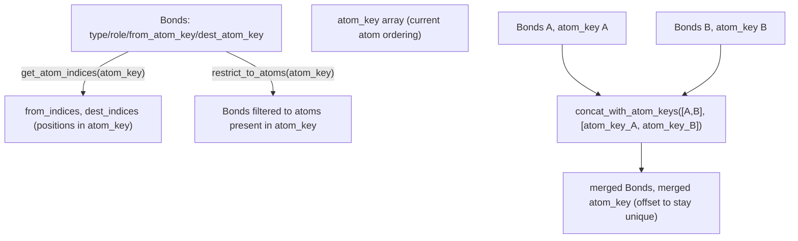

# alphafold3.structure.bonds — Bonds table (struct_conn) and cross-structure concatenation

## Overview

[`Bonds`](../catalog/src/alphafold3/structure/bonds.md#Bonds) is the table type representing mmCIF
`_struct_conn` bond records (covalent, disulfide, hydrogen, metal-coordination bonds) as parallel
arrays keyed by
[`from_atom_key`](../catalog/src/alphafold3/structure/bonds.md#Bonds.from_atom_key)/
[`dest_atom_key`](../catalog/src/alphafold3/structure/bonds.md#Bonds.dest_atom_key) rather than atom
index, so bonds remain valid across structure filtering/reordering operations.
[`concat_with_atom_keys`](../catalog/src/alphafold3/structure/bonds.md#concat_with_atom_keys) merges
multiple structures' bond tables and atom-key spaces together (e.g. when assembling a multi-chain
structure), re-offsetting keys so they stay globally unique. This is pure host-side biology-data
plumbing, out of scope for TPU compute.

## Diagram

## Design rationale (why it's built this way)

**Bonds reference atoms by a stable integer `atom_key`, not by positional index into the atom
arrays.** [`Bonds.get_atom_indices`](../catalog/src/alphafold3/structure/bonds.md#Bonds.get_atom_indices)
looks up `from_atom_key`/`dest_atom_key` against a caller-supplied `atom_key` array via
`np.searchsorted` rather than assuming the bond table and the atom arrays share an implicit
positional correspondence — since a `Structure`
can be filtered, reordered, or concatenated, positional atom indices would go stale immediately;
`atom_key`-based lookup survives all of these.

**`concat_with_atom_keys` re-offsets every input's atom keys by a running `max_key`, guaranteeing
global uniqueness rather than requiring the caller to pre-arrange non-overlapping key spaces.**
[`concat_with_atom_keys`](../catalog/src/alphafold3/structure/bonds.md#concat_with_atom_keys)
computes `offset = max_key + 1` per input and adds it to that input's `atom_key`/`from_atom_key`/
`dest_atom_key` arrays before concatenating — this lets each input structure's bond table be built
independently (e.g. per-chain) with its own locally-valid key numbering, and only reconciled at
merge time.

## Entry points

- [`Bonds.get_atom_indices`](../catalog/src/alphafold3/structure/bonds.md#Bonds.get_atom_indices) —
  reached to translate a bond table's atom keys into positions within a given `atom_key` array,
  e.g. before writing an mmCIF `_struct_conn` block.
- [`Bonds.restrict_to_atoms`](../catalog/src/alphafold3/structure/bonds.md#Bonds.restrict_to_atoms) —
  reached whenever a structure is filtered to a subset of atoms, to drop bonds referencing atoms no
  longer present.
- [`concat_with_atom_keys`](../catalog/src/alphafold3/structure/bonds.md#concat_with_atom_keys) —
  reached when merging multiple structures' bond tables (e.g.
  [`from_sequences_and_bonds`](../catalog/src/alphafold3/structure/parsing.md#from_sequences_and_bonds)).

## Mechanism (step-by-step)

1. **[`Bonds.get_atom_indices`](../catalog/src/alphafold3/structure/bonds.md#Bonds.get_atom_indices)
   validates every `from_atom_key`/`dest_atom_key` is present** in the supplied `atom_key` array
   (raising `ValueError` listing any missing keys), then uses `np.argsort`/`np.searchsorted` to
   locate each bond endpoint's position.
2. **[`Bonds.restrict_to_atoms`](../catalog/src/alphafold3/structure/bonds.md#Bonds.restrict_to_atoms)
   builds a boolean mask** requiring both endpoints to be in the surviving `atom_key` set, then
   filters the table to that mask.
3. **[`concat_with_atom_keys`](../catalog/src/alphafold3/structure/bonds.md#concat_with_atom_keys)
   iterates each `(bonds, atom_key)` pair**, offsetting keys by the running maximum seen so far, and
   concatenates the resulting arrays (or returns `None`/empty if there are no bonds at all).

## Key data structures

- **[`Bonds`](../catalog/src/alphafold3/structure/bonds.md#Bonds)** — a frozen `table.Table`
  subclass carrying `type`,
  [`role`](../catalog/src/alphafold3/structure/bonds.md#Bonds.role),
  [`from_atom_key`](../catalog/src/alphafold3/structure/bonds.md#Bonds.from_atom_key),
  [`dest_atom_key`](../catalog/src/alphafold3/structure/bonds.md#Bonds.dest_atom_key), backing
  [`Structure.add_bonds`](../catalog/src/alphafold3/structure/structure.md#Structure.add_bonds)/
  [`Structure.iter_bonds`](../catalog/src/alphafold3/structure/structure.md#Structure.iter_bonds).

## Dynamics (design intent)

Because bond endpoints are looked up by key rather than assumed-position, any operation that
reorders or subsets a structure's atoms (filtering, chain renaming, concatenation) can leave the
`Bonds` table untouched — only the atom-key-to-position mapping used at consumption time
(`get_atom_indices`) needs to reflect the current ordering.

## Edge cases

- [`concat_with_atom_keys`](../catalog/src/alphafold3/structure/bonds.md#concat_with_atom_keys)
  asserts `bonds is None or bonds.size == 0` whenever the corresponding `atom_key` array is empty —
  a non-empty bonds table paired with an empty atom-key array is treated as an internal
  inconsistency, not a valid (if unusual) input.
- [`Bonds.get_atom_indices`](../catalog/src/alphafold3/structure/bonds.md#Bonds.get_atom_indices)
  raises rather than silently dropping bonds referencing atoms missing from `atom_key` — callers
  needing to drop such bonds must call
  [`restrict_to_atoms`](../catalog/src/alphafold3/structure/bonds.md#Bonds.restrict_to_atoms) first.

## Open questions

- Whether bond-table concatenation order matters for any downstream consumer (e.g. deterministic
  `_struct_conn.id` numbering across re-runs) is not addressed by this packet's cited subgraph.

## See also
- [alphafold3-model-atom_layout](alphafold3-model-atom_layout.md) — a consumer of bonded-atom
  information (`get_bonded_atoms`) built on top of a similar identity-keyed matching discipline.
