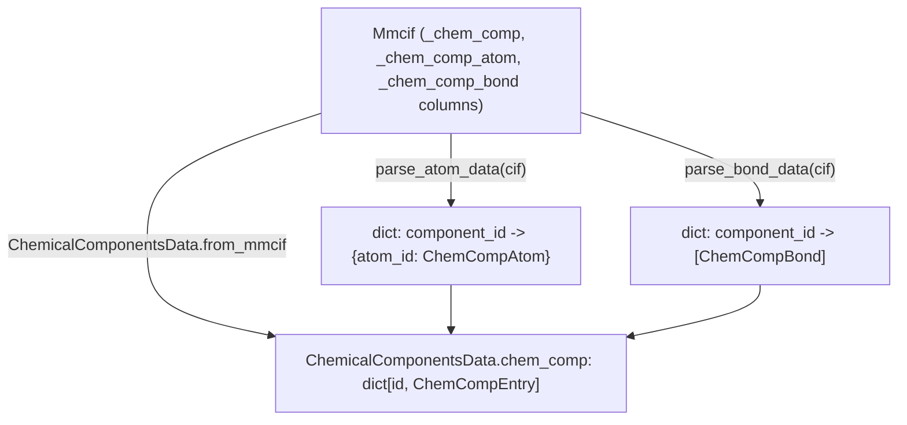

# alphafold3.structure.chemical_components — CCD entry parsing (_chem_comp_* mmCIF categories)

## Overview

This module parses and represents the Chemical Component Dictionary (CCD) reference data embedded
in an mmCIF file: [`ChemCompEntry`](../catalog/src/alphafold3/structure/chemical_components.md#ChemCompEntry)
(one per residue/ligand type, `_chem_comp` category) nests
[`ChemCompAtom`](../catalog/src/alphafold3/structure/chemical_components.md#ChemCompAtom) (`_chem_comp_atom`)
and [`ChemCompBond`](../catalog/src/alphafold3/structure/chemical_components.md#ChemCompBond)
(`_chem_comp_bond`) records, and
[`ChemicalComponentsData.from_mmcif`](../catalog/src/alphafold3/structure/chemical_components.md#ChemicalComponentsData.from_mmcif)
assembles the whole reference dictionary from a parsed
[`Mmcif`](../catalog/src/alphafold3/structure/mmcif.md#Mmcif) object. This is the CCD data consumed
by [`atom_layout.make_flat_atom_layout`](alphafold3-model-atom_layout.md) elsewhere to determine each
residue's canonical atom set — pure host-side reference-data parsing, out of TPU-compute scope.

## Diagram

## Design rationale (why it's built this way)

**`ChemicalComponentsData.from_mmcif` synthesizes special-cased entries for `MSE`→`MET` and
`N`→`DN` rather than requiring the input mmCIF to already contain them.** When `fix_mse`/
`fix_unknown_dna` are set and the corresponding standard-residue entry is missing,
[`from_mmcif`](../catalog/src/alphafold3/structure/chemical_components.md#ChemicalComponentsData.from_mmcif)
inserts a hand-written [`ChemCompEntry`](../catalog/src/alphafold3/structure/chemical_components.md#ChemCompEntry)
for the standard counterpart — selenomethionine (MSE) and unknown-DNA placeholders are common in
experimental structures but the model is trained on standard residues, so this substitution
normalizes such inputs at parse time rather than requiring every downstream consumer to special-case
them.

**`ChemCompEntry.extends` defines a "compatible/more-specific" relation rather than equality**, by
treating any "missing" value ([`_value_is_missing`](../catalog/src/alphafold3/structure/chemical_components.md#_value_is_missing))
on the *other* entry as automatically satisfied — this supports incrementally merging a
minimal/partial `ChemCompEntry` (e.g. from userCCD input) against the full reference entry without
requiring every field to match exactly.

## Entry points

- [`ChemicalComponentsData.from_mmcif`](../catalog/src/alphafold3/structure/chemical_components.md#ChemicalComponentsData.from_mmcif) —
  the sole constructor, reached once per parsed structure to build the full CCD-derived reference
  dictionary.
- [`parse_atom_data`](../catalog/src/alphafold3/structure/chemical_components.md#parse_atom_data) /
  [`parse_bond_data`](../catalog/src/alphafold3/structure/chemical_components.md#parse_bond_data) —
  reached by `from_mmcif` to build the per-component atom/bond mappings from the raw mmCIF columns.
- [`get_data_for_ccd_components`](../catalog/src/alphafold3/structure/chemical_components.md#get_data_for_ccd_components) —
  reached to look up specific component entries by name from an assembled
  [`ChemicalComponentsData`](../catalog/src/alphafold3/structure/chemical_components.md#ChemicalComponentsData).

## Mechanism (step-by-step)

1. **[`ChemicalComponentsData.from_mmcif`](../catalog/src/alphafold3/structure/chemical_components.md#ChemicalComponentsData.from_mmcif)
   validates required columns**, then reads the flat `_chem_comp.*` columns and calls
   [`parse_atom_data`](../catalog/src/alphafold3/structure/chemical_components.md#parse_atom_data)/
   [`parse_bond_data`](../catalog/src/alphafold3/structure/chemical_components.md#parse_bond_data)
   to build per-component atom/bond mappings.
2. **Each component's flat fields plus its atom/bond mappings are assembled into one
   [`ChemCompEntry`](../catalog/src/alphafold3/structure/chemical_components.md#ChemCompEntry)** per
   `component_name`.
3. **If requested,
   [`ChemicalComponentsData.from_mmcif`](../catalog/src/alphafold3/structure/chemical_components.md#ChemicalComponentsData.from_mmcif)
   synthesizes `MSE`/`N` fallback entries** for `MET`/`DN` when not already present.

## Key data structures

- **[`ChemCompAtom`](../catalog/src/alphafold3/structure/chemical_components.md#ChemCompAtom)** —
  [`type_symbol`](../catalog/src/alphafold3/structure/chemical_components.md#ChemCompAtom.type_symbol)/
  [`ordinal`](../catalog/src/alphafold3/structure/chemical_components.md#ChemCompAtom.ordinal)/
  [`charge`](../catalog/src/alphafold3/structure/chemical_components.md#ChemCompAtom.charge)/
  [`leaving_atom_flag`](../catalog/src/alphafold3/structure/chemical_components.md#ChemCompAtom.leaving_atom_flag)/
  [`model_ideal_x`/`y`/`z`](../catalog/src/alphafold3/structure/chemical_components.md#ChemCompAtom.model_ideal_x).
- **[`ChemCompBond`](../catalog/src/alphafold3/structure/chemical_components.md#ChemCompBond)** —
  [`atom_id_1`/`atom_id_2`](../catalog/src/alphafold3/structure/chemical_components.md#ChemCompBond.atom_id_1)/
  [`value_order`](../catalog/src/alphafold3/structure/chemical_components.md#ChemCompBond.value_order)/
  [`aromatic_flag`](../catalog/src/alphafold3/structure/chemical_components.md#ChemCompBond.aromatic_flag)/
  [`stereo_config`](../catalog/src/alphafold3/structure/chemical_components.md#ChemCompBond.stereo_config).
- **[`ChemCompEntry`](../catalog/src/alphafold3/structure/chemical_components.md#ChemCompEntry)** —
  [`name`](../catalog/src/alphafold3/structure/chemical_components.md#ChemCompEntry.name)/
  [`formula`](../catalog/src/alphafold3/structure/chemical_components.md#ChemCompEntry.formula)/
  [`formula_weight`](../catalog/src/alphafold3/structure/chemical_components.md#ChemCompEntry.formula_weight)/
  [`mon_nstd_flag`](../catalog/src/alphafold3/structure/chemical_components.md#ChemCompEntry.mon_nstd_flag)/
  [`pdbx_smiles`](../catalog/src/alphafold3/structure/chemical_components.md#ChemCompEntry.pdbx_smiles)/
  [`pdbx_synonyms`](../catalog/src/alphafold3/structure/chemical_components.md#ChemCompEntry.pdbx_synonyms)/
  [`chem_comp_atoms`](../catalog/src/alphafold3/structure/chemical_components.md#ChemCompEntry.chem_comp_atoms)/
  [`chem_comp_bonds`](../catalog/src/alphafold3/structure/chemical_components.md#ChemCompEntry.chem_comp_bonds).
- **[`ChemicalComponentsData`](../catalog/src/alphafold3/structure/chemical_components.md#ChemicalComponentsData)** —
  the top-level
  [`chem_comp`](../catalog/src/alphafold3/structure/chemical_components.md#ChemicalComponentsData.chem_comp)
  mapping, with
  [`to_mmcif_dict`](../catalog/src/alphafold3/structure/chemical_components.md#ChemicalComponentsData.to_mmcif_dict)/
  [`format_coords`](../catalog/src/alphafold3/structure/chemical_components.md#ChemicalComponentsData.format_coords)
  for round-tripping back to mmCIF text.

## Dynamics (design intent)

Because [`ChemicalComponentsData`](../catalog/src/alphafold3/structure/chemical_components.md#ChemicalComponentsData)
is a frozen dataclass wrapping an immutable mapping, once built for a given input mmCIF it can be
shared/reused across every downstream consumer (atom-layout construction, structure round-tripping)
without risk of one consumer's mutation affecting another.

## Edge cases

- [`MissingChemicalComponentsDataError`](../catalog/src/alphafold3/structure/chemical_components.md#MissingChemicalComponentsDataError)
  is raised if either `_chem_comp.id` or `_chem_comp.type` is absent from the input mmCIF — these two
  columns are treated as unconditionally required, unlike every other `_chem_comp.*` column which
  falls back to `'?'` if missing.
- `ChemCompEntry.__post_init__` raises `ValueError` for any field that is an empty string (but
  `None` is allowed) — the distinction between "genuinely absent" (`None`) and "empty string" is
  enforced strictly.

## Open questions

- Whether `ChemCompEntry.extends`'s asymmetric compatibility check is exercised anywhere in this
  packet's cited subgraph beyond its own definition (e.g. by userCCD merging logic) is not resolved
  here.

## See also
- [alphafold3-model-atom_layout](alphafold3-model-atom_layout.md) — `make_flat_atom_layout`, the
  primary consumer of the CCD data this module parses.
