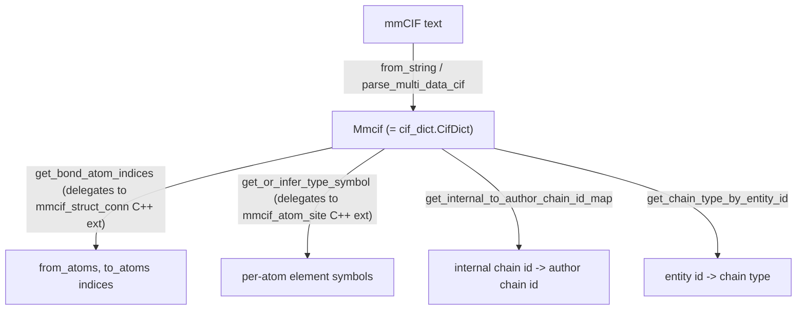

# alphafold3.structure.mmcif — low-level mmCIF parsing, thin wrapper over a C++ CifDict

## Overview

This module is a thin Python layer over a C++ mmCIF parser: `Mmcif` is a direct alias for
`cif_dict.CifDict` (`Mmcif = cif_dict.CifDict`), and most functions here
([`get_bond_atom_indices`](../catalog/src/alphafold3/structure/mmcif.md#get_bond_atom_indices),
[`get_or_infer_type_symbol`](../catalog/src/alphafold3/structure/mmcif.md#get_or_infer_type_symbol),
[`get_internal_to_author_chain_id_map`](../catalog/src/alphafold3/structure/mmcif.md#get_internal_to_author_chain_id_map))
delegate straight into `alphafold3.cpp` extension modules
(`mmcif_struct_conn`/`mmcif_atom_site`), wrapping their exceptions into friendlier Python error types
(e.g. [`BondParsingError`](../catalog/src/alphafold3/structure/mmcif.md#BondParsingError)). This is
pure host-side parsing infrastructure, out of scope for TPU compute.

## Diagram

## Design rationale (why it's built this way)

**`Mmcif` is a bare type alias for the C++ `CifDict`, not a Python subclass or wrapper class.**
`Mmcif = cif_dict.CifDict` means every function in this module operates directly on the C++-backed
object with no intervening Python-level indirection — the module docstring notes `CifDict` "behaves
like an immutable Python dictionary" and has "many useful methods... not shown in this file,"
meaning this module intentionally only adds the *specific* higher-level operations (bond-index
extraction, chain-ID mapping) that are awkward to express as raw dict lookups, leaving everything
else to the C++ type's own dict-like interface.

**C++ exceptions are caught and re-raised as module-specific Python exception types at the call
boundary.** [`get_bond_atom_indices`](../catalog/src/alphafold3/structure/mmcif.md#get_bond_atom_indices)
catches `ValueError` from `mmcif_struct_conn.get_bond_atom_indices` and re-raises as
[`BondParsingError`](../catalog/src/alphafold3/structure/mmcif.md#BondParsingError) — this gives
Python callers a semantically specific exception type to catch (bond-parsing failures specifically)
rather than a generic `ValueError` that could originate from many places.

## Entry points

- [`from_string`](../catalog/src/alphafold3/structure/mmcif.md#from_string) /
  [`parse_multi_data_cif`](../catalog/src/alphafold3/structure/mmcif.md#parse_multi_data_cif) —
  reached to parse raw mmCIF text into `Mmcif` object(s); the latter for multi-`data_` block files.
- [`get_bond_atom_indices`](../catalog/src/alphafold3/structure/mmcif.md#get_bond_atom_indices) —
  reached to resolve `_struct_conn` bond records into 0-based `_atom_site` row indices.
- [`get_internal_to_author_chain_id_map`](../catalog/src/alphafold3/structure/mmcif.md#get_internal_to_author_chain_id_map) —
  reached to build the (non-bijective) mapping from internal to author-facing chain IDs.
- [`get_or_infer_type_symbol`](../catalog/src/alphafold3/structure/mmcif.md#get_or_infer_type_symbol) —
  reached to obtain per-atom element symbols, falling back to CCD-based inference when
  `_atom_site.type_symbol` is absent.

## Mechanism (step-by-step)

1. **[`from_string`](../catalog/src/alphafold3/structure/mmcif.md#from_string)/
   [`parse_multi_data_cif`](../catalog/src/alphafold3/structure/mmcif.md#parse_multi_data_cif)
   delegate directly to `cif_dict.from_string`/`cif_dict.parse_multi_data_cif`**, the C++ parser
   entry points.
2. **[`get_bond_atom_indices`](../catalog/src/alphafold3/structure/mmcif.md#get_bond_atom_indices)
   calls `mmcif_struct_conn.get_bond_atom_indices(mmcif, model_id)`**, catching its `ValueError` and
   re-raising as
   [`BondParsingError`](../catalog/src/alphafold3/structure/mmcif.md#BondParsingError).
3. **[`get_or_infer_type_symbol`](../catalog/src/alphafold3/structure/mmcif.md#get_or_infer_type_symbol)
   builds a `(res_name, atom_name) -> element` closure over the CCD** and passes it into
   `mmcif_atom_site.get_or_infer_type_symbol`, so the C++ extension can call back into Python CCD
   lookups only for atoms missing an explicit `type_symbol`.
4. **[`get_chain_type_by_entity_id`](../catalog/src/alphafold3/structure/mmcif.md#get_chain_type_by_entity_id)
   reads `_entity_poly`/`_entity` columns directly as plain dict lookups** (no C++ delegation needed
   for this simpler case), preferring the polymer-specific type when available.

## Key data structures

- **`Mmcif`** — alias for the C++ `cif_dict.CifDict`; every function in this module takes or returns
  one.
- **[`BondParsingError`](../catalog/src/alphafold3/structure/mmcif.md#BondParsingError)** — the
  Python-facing exception type for bond-table parsing failures.

## Dynamics (design intent)

Because `Mmcif` is the C++ type itself rather than a Python wrapper, passing an `Mmcif` object
between this module's functions and the C++ extension modules
(`mmcif_struct_conn`/`mmcif_atom_site`) involves no marshaling/copy — every function call operates on
the same underlying C++ object.

## Edge cases

- [`get_bond_atom_indices`](../catalog/src/alphafold3/structure/mmcif.md#get_bond_atom_indices)'s
  returned indices are explicitly documented as "simple 0-based indexes into the columns of the
  `_atom_site` table," *not* corresponding to `_atom_site.id` or any other ID column — callers must
  not conflate these positional indices with any mmCIF identifier column.
- [`get_internal_to_author_chain_id_map`](../catalog/src/alphafold3/structure/mmcif.md#get_internal_to_author_chain_id_map)'s
  docstring states the mapping is "not a bijection" — a protein chain and a bound ligand can share
  one author chain ID while having distinct internal chain IDs, so the reverse mapping is not
  well-defined without additional disambiguation.

## Open questions

- What specific errors `mmcif_struct_conn`/`mmcif_atom_site` (the C++ extensions) can raise beyond
  `ValueError`, and whether all of them are caught at this Python boundary, is not addressed by this
  packet's cited subgraph (their implementation is outside the scope of the SCIP-python index used
  here).

## See also
- [alphafold3-structure-chemical_components](alphafold3-structure-chemical_components.md) —
  `ChemicalComponentsData.from_mmcif`, a consumer of the `Mmcif` object this module wraps parsing
  for.
