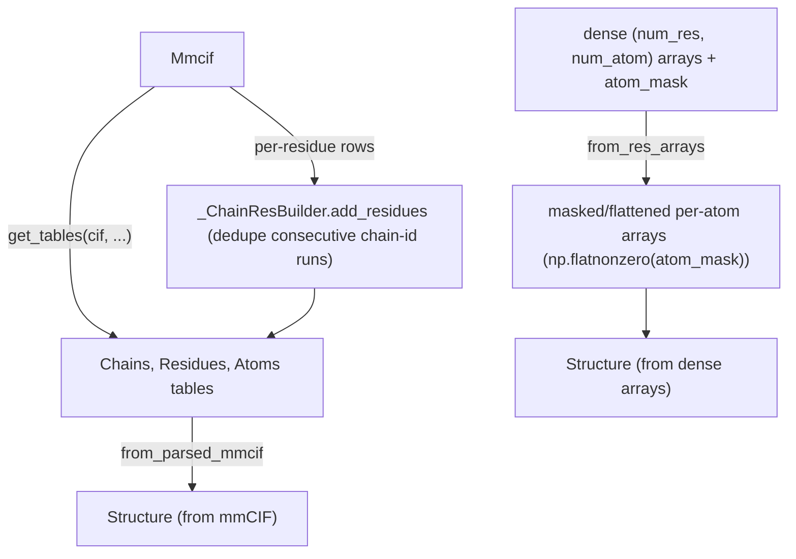

# alphafold3.structure.parsing — mmCIF-to-Structure and array-to-Structure construction

## Overview

This module is where a [`Structure`](../catalog/src/alphafold3/structure/structure.md#Structure) is
actually built, from either a parsed mmCIF (
[`get_tables`](../catalog/src/alphafold3/structure/parsing.md#get_tables) →
[`from_parsed_mmcif`](../catalog/src/alphafold3/structure/parsing.md#from_parsed_mmcif)) or from
dense ML-style numpy arrays with an explicit residue dimension (
[`from_res_arrays`](../catalog/src/alphafold3/structure/parsing.md#from_res_arrays)) — the latter is
effectively the inverse of the atom-layout padding machinery documented in
[alphafold3-model-atom_layout](alphafold3-model-atom_layout.md), converting a dense
`(num_res, num_atom)`-shaped representation with a mask back into the ragged
[`structure_tables`](alphafold3-structure-structure_tables.md) form.
`_ChainResBuilder` incrementally
assembles chain/residue tables while parsing. Pure host-side biology data ingestion, out of TPU
compute scope.

## Diagram

## Design rationale (why it's built this way)

**`from_res_arrays` treats the atom dimension as a dense grid to be sparsified via `atom_mask`, not
a ragged input.** [`from_res_arrays`](../catalog/src/alphafold3/structure/parsing.md#from_res_arrays)
takes every atom-shaped field as a dense `(num_res, num_atom)` array (or with additional leading
dims for coordinates) and immediately calls `np.flatnonzero(atom_mask)` to select only the atoms
actually present, discarding the rest — this mirrors exactly the dense-with-mask convention used
throughout the model's tensor featurization, making it straightforward to convert model output
tensors (which are naturally dense/padded) back into a real
[`Structure`](../catalog/src/alphafold3/structure/structure.md#Structure).

**`_ChainResBuilder.add_residues` deduplicates consecutive same-chain-ID runs by comparing each row
against the *previous* row, not by grouping the whole input up front.**
[`_ChainResBuilder.add_residues`](../catalog/src/alphafold3/structure/parsing.md#_ChainResBuilder.add_residues)
prepends the last-seen chain ID (`self.chain_id[-1] if self.chain_id else None`) to the new batch of
`chain_ids` before computing a change mask — this lets residues be added incrementally in multiple
calls (e.g. per parsing chunk) while still correctly detecting a chain boundary that straddles two
calls.

**`get_tables`'s `model_id` behavior branches on emptiness, not `None`, to decide single-model vs.
all-models output shape.** [`get_tables`](../catalog/src/alphafold3/structure/parsing.md#get_tables)'s
docstring specifies: if `model_id` is set, only that model's coordinates/B-factors/occupancies are
returned (no extra leading dimension); if empty, all models are returned with a leading
`num_models` dimension — one function serves both the common single-model case and the NMR-ensemble
multi-model case via this single string-emptiness branch.

## Entry points

- [`from_res_arrays`](../catalog/src/alphafold3/structure/parsing.md#from_res_arrays) — reached to
  build a [`Structure`](../catalog/src/alphafold3/structure/structure.md#Structure) directly from
  dense per-residue/per-atom numpy arrays plus an `atom_mask`.
- [`get_tables`](../catalog/src/alphafold3/structure/parsing.md#get_tables) — reached to extract
  [`Chains`](../catalog/src/alphafold3/structure/structure_tables.md#Chains)/
  [`Residues`](../catalog/src/alphafold3/structure/structure_tables.md#Residues)/
  [`Atoms`](../catalog/src/alphafold3/structure/structure_tables.md#Atoms) tables from a parsed
  [`Mmcif`](../catalog/src/alphafold3/structure/mmcif.md#Mmcif) object.
- [`_ChainResBuilder.add_residues`](../catalog/src/alphafold3/structure/parsing.md#_ChainResBuilder.add_residues) —
  reached incrementally while parsing to accumulate chain/residue table rows.
- [`from_sequences_and_bonds`](../catalog/src/alphafold3/structure/parsing.md#from_sequences_and_bonds) —
  reached to build a [`Structure`](../catalog/src/alphafold3/structure/structure.md#Structure)
  directly from sequence strings plus bond information (e.g. for synthetic/test structures), using
  [`Bonds.make_empty`](../catalog/src/alphafold3/structure/bonds.md#Bonds.make_empty) as a
  fallback when no bonds are given.

## Mechanism (step-by-step)

1. **[`from_res_arrays`](../catalog/src/alphafold3/structure/parsing.md#from_res_arrays) partitions
   its `**kwargs` into chain/residue/atom-shaped fields** (validated against
   `structure.{CHAIN,RESIDUE,ATOM}_FIELDS`) and constructor-forwarded fields, masks every atom field
   by `atom_mask`, and derives chain boundaries from contiguous runs of `chain_id`.
2. **Chain, residue, and atom
   [`structure_tables`](alphafold3-structure-structure_tables.md)-typed tables are built** with
   correctly cross-referencing `chain_key`/`res_key` foreign keys, then passed to the
   [`Structure`](../catalog/src/alphafold3/structure/structure.md#Structure) constructor with an
   empty [`Bonds.make_empty`](../catalog/src/alphafold3/structure/bonds.md#Bonds.make_empty) table
   (bonds are not set by this path).
3. **[`get_tables`](../catalog/src/alphafold3/structure/parsing.md#get_tables) fills in any missing
   required mmCIF tables/columns**, filters `_atom_site` rows by the requested model, and extracts
   parallel per-atom string/float arrays via helper closures keyed by column name.

## Key data structures

- **`_ChainResBuilder`** —
  accumulates parallel Python lists for
  [`chain_key`/`chain_id`/`chain_type`](../catalog/src/alphafold3/structure/parsing.md#_ChainResBuilder.chain_id)
  and residue fields, converted to arrays via
  [`make_chains_table`](../catalog/src/alphafold3/structure/parsing.md#_ChainResBuilder.make_chains_table)/
  [`make_residues_table`](../catalog/src/alphafold3/structure/parsing.md#_ChainResBuilder.make_residues_table).
- **[`SequenceFormat`](../catalog/src/alphafold3/structure/parsing.md#SequenceFormat)** — an enum
  selecting how a raw sequence string should be expanded into residue names (used by
  [`expand_sequence`](../catalog/src/alphafold3/structure/parsing.md#expand_sequence)).

## Dynamics (design intent)

Because [`from_res_arrays`](../catalog/src/alphafold3/structure/parsing.md#from_res_arrays) accepts
exactly the dense, masked array shape the model's featurization/output tensors naturally have, it
serves as a direct bridge from model output back to a `Structure` without an intermediate
`AtomLayout`-based gather step — a different (simpler, non-`GatherInfo`-based) path than
[`get_predicted_structure`](alphafold3-model.md) uses, appropriate when the caller already has a
clean dense `(num_res, num_atom, ...)` layout rather than a general ragged one.

## Edge cases

- [`from_res_arrays`](../catalog/src/alphafold3/structure/parsing.md#from_res_arrays) raises
  `ValueError` if `chain_id` is non-contiguous (`len(set(chain_id)) != len(chain_start)`) — chain IDs
  must appear in contiguous runs; an input with the same chain ID appearing in two separate,
  non-adjacent row ranges is rejected rather than silently merged or split.
- [`from_res_arrays`](../catalog/src/alphafold3/structure/parsing.md#from_res_arrays) raises
  `ValueError` for any kwarg listed in `structure.TABLE_FIELDS`, since those must be derived (not
  supplied directly) by this constructor.

## Open questions

- Whether [`get_tables`](../catalog/src/alphafold3/structure/parsing.md#get_tables)'s multi-model
  (`model_id=''`) path has any measured parsing-time cost difference versus single-model parsing at
  realistic NMR-ensemble sizes is not addressed by this packet's cited subgraph.

## See also
- [alphafold3-structure-structure_tables](alphafold3-structure-structure_tables.md) —
  `Chains`/`Residues`/`Atoms`, the table types this module constructs.
- [alphafold3-model-atom_layout](alphafold3-model-atom_layout.md) — the padding/gather-index
  machinery that plays a symmetric, ML-tensor-facing role to `from_res_arrays`'s dense-array
  ingestion.
