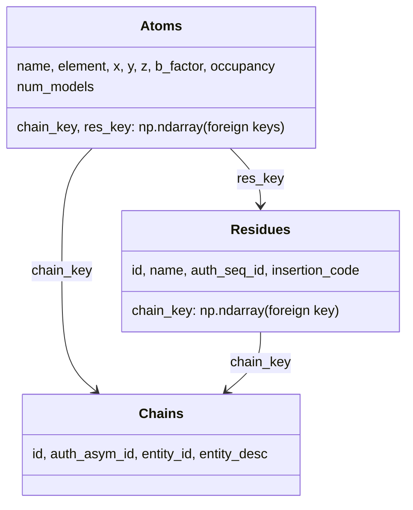

# alphafold3.structure.structure_tables — Atoms/Residues/Chains relational tables

## Overview

This module defines the three relational table types that back every
`Structure`:
[`Atoms`](../catalog/src/alphafold3/structure/structure_tables.md#Atoms),
[`Residues`](../catalog/src/alphafold3/structure/structure_tables.md#Residues), and
[`Chains`](../catalog/src/alphafold3/structure/structure_tables.md#Chains), each a
`table.Table` subclass with an integer primary `key` column and foreign-key columns linking atoms to
residues to chains (
[`Atoms.chain_key`](../catalog/src/alphafold3/structure/structure_tables.md#Atoms.chain_key)/
[`res_key`](../catalog/src/alphafold3/structure/structure_tables.md#Atoms.res_key),
[`Residues.chain_key`](../catalog/src/alphafold3/structure/structure_tables.md#Residues.chain_key)).
[`tables_from_atom_arrays`](../catalog/src/alphafold3/structure/structure_tables.md#tables_from_atom_arrays)
is the primary constructor, converting flat per-atom parallel arrays into this three-table
relational form. Pure host-side biology data modeling, out of TPU compute scope.

## Diagram

## Design rationale (why it's built this way)

**Atoms/Residues/Chains are linked by explicit integer foreign keys, not by nested/hierarchical
Python objects.** Every [`Atoms`](../catalog/src/alphafold3/structure/structure_tables.md#Atoms) row
carries [`chain_key`](../catalog/src/alphafold3/structure/structure_tables.md#Atoms.chain_key)/
[`res_key`](../catalog/src/alphafold3/structure/structure_tables.md#Atoms.res_key) referencing rows
in the other two tables — this is a genuine relational-database-style design (foreign keys, not
nesting), which is what lets
[`Structure._validate_table_foreign_keys`](../catalog/src/alphafold3/structure/structure.md#Structure._validate_table_foreign_keys)
check referential integrity uniformly and lets bulk vectorized numpy operations (filtering,
reordering) apply to each table independently without needing to walk a nested object graph.

**[`Atoms`](../catalog/src/alphafold3/structure/structure_tables.md#Atoms) supports an optional
leading "models" dimension on its coordinate/B-factor/occupancy columns, exposed via a computed
property rather than a separate multi-model table type.** That property inspects the table's shape
minus its trailing axis (empty tuple → 1 model, one leading dim → that many models, anything else →
raise) — this lets the same [`Atoms`](../catalog/src/alphafold3/structure/structure_tables.md#Atoms)
table type represent both single-model (X-ray/most predicted) and multi-model (NMR ensemble)
structures, with `multimodel_cols` marking exactly which columns carry the extra leading axis.

**`Atoms.__post_init__` validates coordinate/B-factor/occupancy finiteness at construction time, not
lazily at first use.** Every [`Atoms`](../catalog/src/alphafold3/structure/structure_tables.md#Atoms)
instance checks `np.isfinite` on `x`/`y`/`z`/`b_factor`/`occupancy` and raises immediately if any
contain NaN/inf — since downstream geometry and confidence computations assume finite coordinates,
catching non-finite values at the table-construction boundary (the earliest possible point) avoids
propagating corrupt data deep into the pipeline before failing.

## Entry points

- [`tables_from_atom_arrays`](../catalog/src/alphafold3/structure/structure_tables.md#tables_from_atom_arrays) —
  the primary constructor, reached once per structure to build all three tables from flat per-atom
  parallel arrays (residue/chain/atom identity and coordinates).
- [`Atoms.from_defaults`](../catalog/src/alphafold3/structure/structure_tables.md#Atoms.from_defaults) /
  [`Residues.from_defaults`](../catalog/src/alphafold3/structure/structure_tables.md#Residues.from_defaults) —
  reached to build a table directly with sensible defaults (`'?'`, `0.0`, `1.0` for unset columns)
  for any field not explicitly supplied.

## Mechanism (step-by-step)

1. **[`tables_from_atom_arrays`](../catalog/src/alphafold3/structure/structure_tables.md#tables_from_atom_arrays)
   takes flat per-atom arrays** (`res_id`, `chain_id`, `res_name`, `atom_name`, coordinates, etc.),
   with only `res_id` strictly required and every other column optional (filled with defaults).
2. **Per-residue and per-chain unique keys are derived and cross-referenced**, producing
   [`Chains`](../catalog/src/alphafold3/structure/structure_tables.md#Chains),
   [`Residues`](../catalog/src/alphafold3/structure/structure_tables.md#Residues), and
   [`Atoms`](../catalog/src/alphafold3/structure/structure_tables.md#Atoms) tables whose foreign keys
   correctly cross-reference each other.
3. **[`Atoms.__post_init__`](../catalog/src/alphafold3/structure/structure_tables.md#Atoms) validates
   finiteness of every numeric column** as the tables are constructed.

## Key data structures

- **[`Atoms`](../catalog/src/alphafold3/structure/structure_tables.md#Atoms)** —
  [`chain_key`](../catalog/src/alphafold3/structure/structure_tables.md#Atoms.chain_key)/
  [`res_key`](../catalog/src/alphafold3/structure/structure_tables.md#Atoms.res_key)/
  [`name`](../catalog/src/alphafold3/structure/structure_tables.md#Atoms.name)/
  [`element`](../catalog/src/alphafold3/structure/structure_tables.md#Atoms.element)/
  [`x`/`y`/`z`](../catalog/src/alphafold3/structure/structure_tables.md#Atoms.x)/
  [`b_factor`](../catalog/src/alphafold3/structure/structure_tables.md#Atoms.b_factor)/
  [`occupancy`](../catalog/src/alphafold3/structure/structure_tables.md#Atoms.occupancy).
- **[`Residues`](../catalog/src/alphafold3/structure/structure_tables.md#Residues)** —
  [`chain_key`](../catalog/src/alphafold3/structure/structure_tables.md#Residues.chain_key)/
  [`id`](../catalog/src/alphafold3/structure/structure_tables.md#Residues.id)/
  [`name`](../catalog/src/alphafold3/structure/structure_tables.md#Residues.name)/
  [`auth_seq_id`](../catalog/src/alphafold3/structure/structure_tables.md#Residues.auth_seq_id)/
  [`insertion_code`](../catalog/src/alphafold3/structure/structure_tables.md#Residues.insertion_code).
- **[`Chains`](../catalog/src/alphafold3/structure/structure_tables.md#Chains)** —
  [`id`](../catalog/src/alphafold3/structure/structure_tables.md#Chains.id)/
  [`auth_asym_id`](../catalog/src/alphafold3/structure/structure_tables.md#Chains.auth_asym_id)/
  [`entity_id`](../catalog/src/alphafold3/structure/structure_tables.md#Chains.entity_id)/
  [`entity_desc`](../catalog/src/alphafold3/structure/structure_tables.md#Chains.entity_desc).

## Dynamics (design intent)

Because every cross-table reference is an explicit integer key rather than a Python object
reference, any of the three tables can be filtered, reordered, or replaced independently as long as
referential integrity is re-validated afterward (
[`Structure._validate_table_foreign_keys`](../catalog/src/alphafold3/structure/structure.md#Structure._validate_table_foreign_keys)) —
this is what makes bulk structure operations (`Structure.filter`, chain reordering) tractable as
vectorized numpy operations on each table rather than requiring a graph traversal.

## Edge cases

- [`tables_from_atom_arrays`](../catalog/src/alphafold3/structure/structure_tables.md#tables_from_atom_arrays)'s
  docstring states it "is not possible to construct structures with chains that do not contain any
  resolved residues" via this function — a chain with zero resolved atoms requires using the
  `Structure` constructor directly.
- The model-count property on
  [`Atoms`](../catalog/src/alphafold3/structure/structure_tables.md#Atoms) raises `ValueError` for
  any table whose coordinate columns have more than one leading dimension beyond the atom axis —
  multi-model support is limited to exactly one extra leading axis.

## Open questions

- Whether `tables_from_atom_arrays`'s "not possible to construct chains without resolved residues"
  limitation is exercised/worked around anywhere in this packet's cited subgraph (e.g. via direct
  `Structure` construction for such cases) is not addressed here.

## See also
- [alphafold3-model-atom_layout](alphafold3-model-atom_layout.md) — `Residues` (the model-side
  dataclass, distinct from this module's table type), built from these tables via
  `residues_from_structure`.
