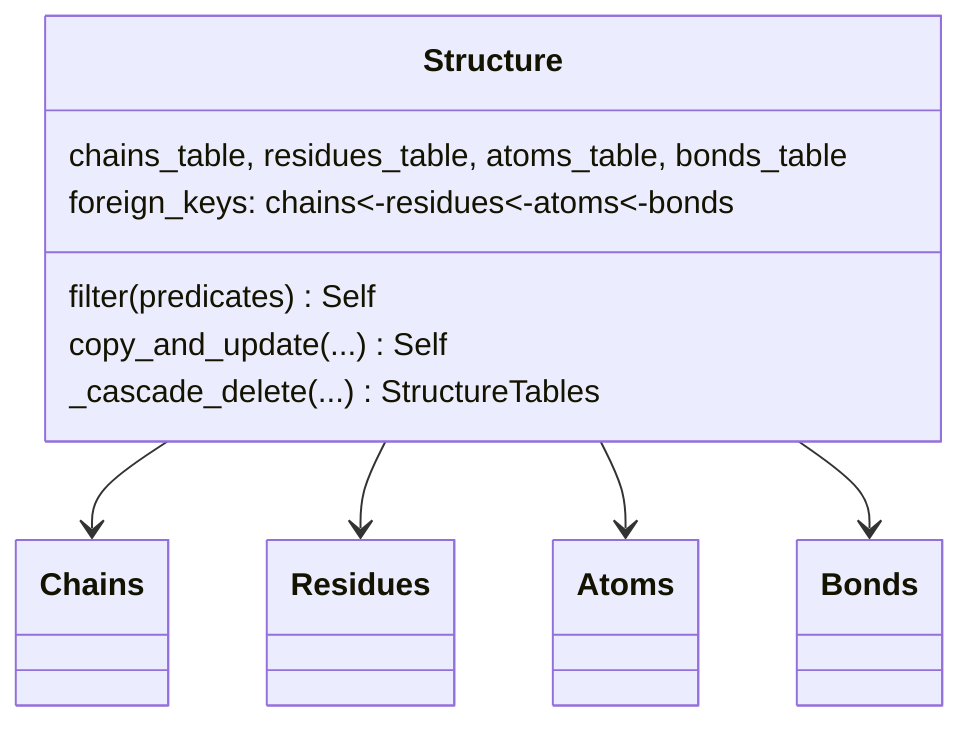

# alphafold3.structure.structure — Structure, the immutable Chains/Residues/Atoms/Bonds database

## Overview

[`Structure`](../catalog/src/alphafold3/structure/structure.md#Structure) is AlphaFold3's central
molecular-structure representation: a `table.Database` composing the four relational tables
documented in [alphafold3-structure-structure_tables](alphafold3-structure-structure_tables.md)
(Chains, Residues, Atoms) plus [`Bonds`](../catalog/src/alphafold3/structure/structure_tables.md#Bonds), with a
declared `foreign_keys` mapping and strict validation, including
[`_validate_consistent_table_ordering`](../catalog/src/alphafold3/structure/structure.md#Structure._validate_consistent_table_ordering).
Every mutation ([`filter`](../catalog/src/alphafold3/structure/structure.md#Structure.filter),
[`copy_and_update`](../catalog/src/alphafold3/structure/structure.md#Structure.copy_and_update),
[`merge_chains`](../catalog/src/alphafold3/structure/structure.md#Structure.merge_chains)) returns a
new `Structure`; nothing mutates in place. This is the biology-side data model that
[`atom_layout`](alphafold3-model-atom_layout.md)/[`parsing`](alphafold3-structure-parsing.md)/
[`bioassemblies`](alphafold3-structure-bioassemblies.md) all build on top of. Pure host-side data
modeling, out of TPU compute scope.

## Diagram

## Design rationale (why it's built this way)

**Foreign-key relationships are declared once, as class-level data (`foreign_keys` ClassVar), and
validated generically — not hand-checked per accessor.**
[`Structure`](../catalog/src/alphafold3/structure/structure.md#Structure)'s class-level mapping
declares `{'residues': (('chain_key', 'chains'),), 'atoms': (('chain_key', 'chains'), ('res_key',
'residues')), 'bonds': (('from_atom_key', 'atoms'), ('dest_atom_key', 'atoms'))}`, and construction-
time validation walks this declaration to check every column against the referenced table's key
set — this keeps the foreign-key schema in one declarative place rather than scattered validation
logic per table pair.

**Consistent table ordering is validated *separately* from foreign-key validity — a table can
reference only valid keys yet still fail validation if row order is inconsistent.**
[`_validate_consistent_table_ordering`](../catalog/src/alphafold3/structure/structure.md#Structure._validate_consistent_table_ordering)
checks that the atoms table's chain/residue-key transitions, read at `chain_boundaries`/
`res_boundaries`, exactly match the chains/residues tables' own row order — this second, distinct
invariant (beyond mere referential integrity) is what lets other code assume atoms are grouped by
residue and by chain in the same order the chain/residue tables list them, without needing to
re-sort.

**Deletions cascade downward through a fixed hierarchy (chains > residues > atoms > bonds), and never
upward.** [`_cascade_delete`](../catalog/src/alphafold3/structure/structure.md#Structure._cascade_delete)'s
docstring states explicitly: removing a residue removes its atoms and any bonds on those atoms, but
removing all of a chain's residues does *not* remove the now-empty chain row — the hierarchy is
one-directional by design, so that filtering residues/atoms never silently discards chain identity
(a chain can validly have zero present residues, e.g. representing something wholly unresolved).

## Entry points

- [`Structure.filter`](../catalog/src/alphafold3/structure/structure.md#Structure.filter) — the
  primary subsetting operation, reached with `<table>_<column>` keyword predicates (constant value,
  iterable of values, or boolean function) to produce a new, cascade-deleted `Structure`.
- [`Structure.copy_and_update`](../catalog/src/alphafold3/structure/structure.md#Structure.copy_and_update) /
  [`copy_and_update_atoms`](../catalog/src/alphafold3/structure/structure.md#Structure.copy_and_update_atoms) /
  [`copy_and_update_residues`](../catalog/src/alphafold3/structure/structure.md#Structure.copy_and_update_residues) /
  [`copy_and_update_globals`](../catalog/src/alphafold3/structure/structure.md#Structure.copy_and_update_globals) —
  reached to produce a modified copy of specific table(s) or global metadata.
- [`Structure.select`](../catalog/src/alphafold3/structure/structure.md#Structure.select) — reached
  to select a subset by explicit index/mask rather than predicate.
- [`Structure.iter_atoms`](../catalog/src/alphafold3/structure/structure.md#Structure.iter_atoms) /
  [`iter_residues`](../catalog/src/alphafold3/structure/structure.md#Structure.iter_residues) —
  reached for row-by-row iteration.

## Mechanism (step-by-step)

1. **[`Structure`](../catalog/src/alphafold3/structure/structure.md#Structure) construction stores the
   four tables and (unless `skip_validation`) validates foreign-key referential integrity and calls
   [`_validate_consistent_table_ordering`](../catalog/src/alphafold3/structure/structure.md#Structure._validate_consistent_table_ordering)**.
2. **[`Structure.filter`](../catalog/src/alphafold3/structure/structure.md#Structure.filter) resolves
   its `<table>_<column>` keyword predicates into a boolean mask** per table, applies the mask, and
   calls
   [`_cascade_delete`](../catalog/src/alphafold3/structure/structure.md#Structure._cascade_delete)
   to propagate the deletion down the chains→residues→atoms→bonds hierarchy.
3. **[`_cascade_delete`](../catalog/src/alphafold3/structure/structure.md#Structure._cascade_delete)
   only recomputes a downstream table if its upstream table actually changed** (tracked via
   `chains_unchanged`/`residues_unchanged`/`atoms_unchanged` flags), short-circuiting no-op cascades.
4. **[`Structure.copy_and_update`](../catalog/src/alphafold3/structure/structure.md#Structure.copy_and_update)
   and friends construct a new `Structure`** with the updated table(s) or metadata, re-validating
   unless explicitly skipped.

## Key data structures

- **[`Structure`](../catalog/src/alphafold3/structure/structure.md#Structure)** itself — composing
  [`chains_table`/`residues_table`/`atoms_table`](../catalog/src/alphafold3/structure/structure.md#Structure.atoms_table)/
  [`bonds`](../catalog/src/alphafold3/structure/structure.md#Structure.add_bonds), plus scalar
  metadata ([`name`](../catalog/src/alphafold3/structure/structure.md#Structure.name),
  [`bioassembly_data`](../catalog/src/alphafold3/structure/structure.md#Structure.chemical_components_data)-adjacent
  fields).
- **`StructureTables`** — the plain tuple-like container `_cascade_delete` returns, bundling the
  (possibly unchanged) four tables after a cascade.
- **`CascadeDelete`** — an enum controlling how far up the hierarchy
  [`filter`](../catalog/src/alphafold3/structure/structure.md#Structure.filter) is allowed to prune
  (e.g. `CHAINS` — the default — vs. more conservative options).

## Dynamics (design intent)

Because every table-modifying operation returns a new `Structure` rather than mutating in place, a
`Structure` reference can be shared freely between callers (e.g. as an immutable cache key, or across
concurrent processing) without risk of one consumer's filter/update affecting another's view.

## Edge cases

- [`_validate_consistent_table_ordering`](../catalog/src/alphafold3/structure/structure.md#Structure._validate_consistent_table_ordering)
  raises `ValueError` (with both orderings printed) if atom-table chain/residue-key transitions don't
  match the chains/residues tables' own order — a `Structure` built with tables in inconsistent order
  fails at construction, not at first use of an order-dependent accessor.
- [`_cascade_delete`](../catalog/src/alphafold3/structure/structure.md#Structure._cascade_delete)
  explicitly does *not* delete now-empty chains — a filter that removes every residue of a chain
  still leaves that chain's row present in the chains table, which callers relying on "no empty
  chains" must handle themselves.

## Open questions

- Whether `skip_validation=True` construction paths (bypassing both foreign-key and ordering checks)
  are used anywhere performance-sensitive in the ingestion pipeline, or only for internal
  already-validated intermediate states, is not addressed by this packet's cited subgraph.

## See also
- [alphafold3-structure-structure_tables](alphafold3-structure-structure_tables.md) — `Chains`/
  `Residues`/`Atoms`, the table types this class composes.
- [alphafold3-structure-bonds](alphafold3-structure-bonds.md) — `Bonds`, the fourth table, and
  `restrict_to_atoms`, used by `_cascade_delete`.
- [alphafold3-structure-parsing](alphafold3-structure-parsing.md) — `from_res_arrays`/`get_tables`,
  the primary constructors that build a `Structure`'s tables from raw input.
- [alphafold3-structure-bioassemblies](alphafold3-structure-bioassemblies.md) —
  `Structure.generate_bioassembly`, a consumer of this class's table-update machinery.
