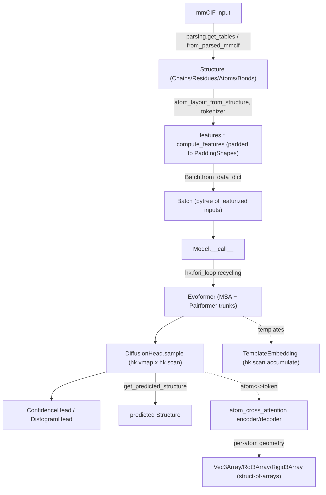
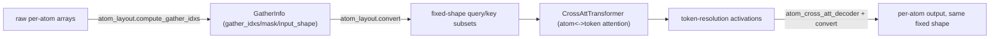

# alphafold3 — what it is and how it fits together

## In one paragraph

AlphaFold3 predicts the 3D structure of proteins, nucleic acids, ligands, and their complexes from
sequence (and optional MSA/template) input, using a JAX/Haiku model that alternates a
representation-learning trunk (Evoformer/Pairformer, with optional template embedding) with a
denoising-diffusion structure module. The central design idea running through the whole codebase is
**keeping every compiled tensor shape static** despite the model's inputs being inherently
variable-length (residue count, atom count per residue, MSA depth, template count) — this is solved
by a layered set of "regularize-to-fixed-shape" mechanisms: tokenization (one token per residue, one
per ligand atom), atom-layout gather tables for atom-to-token conversion, and padding to shared
bucket shapes. A parallel, independent design thread is a relational `Structure` data model (Chains/
Residues/Atoms/Bonds tables linked by integer foreign keys) that represents the biology side —
parsed mmCIF input and predicted structure output — entirely separately from the model's tensor
world, with explicit conversion functions bridging the two.

## Core architecture

## Main concepts

**Fixed-shape featurization via tokenization and padding.** Variable-length biological inputs
(residue count, MSA depth, template count) are normalized to static shapes at the featurization
boundary: [`tokenizer`](concepts/alphafold3-model-features.md) assigns one token per polymer residue
and one per ligand atom, and every `compute_features` classmethod pads to a shared
[`PaddingShapes`](concepts/alphafold3-model-features.md) bucket. This is the foundational trick that
makes the rest of the model shape-static.

**Atom-to-token cross attention via precomputed gather tables.** Because atom counts per token vary
(a ligand token may have dozens of atoms, an amino acid a handful),
[atom_cross_attention](concepts/alphafold3-model-network-atom_cross_attention.md) converts between
atom and token resolution using fixed-size query/key subsets built from
[`GatherInfo`](concepts/alphafold3-model-atom_layout.md) index/mask tables — computed once per input
by [atom_layout](concepts/alphafold3-model-atom_layout.md), consumed on every forward pass.

**Depth/count-independent compiled program size via three distinct Haiku control-flow idioms, chosen
per situation.** `hk.experimental.layer_stack` gives distinct-per-layer stacked parameters
independent of depth ([evoformer](concepts/alphafold3-model-network-evoformer.md),
[template_modules](concepts/alphafold3-model-network-template_modules.md)); `hk.scan` with an
additive carry sums a variable count of templates without stacking them
([template_modules](concepts/alphafold3-model-network-template_modules.md)); `hk.fori_loop` reruns
*identical* parameters for a fixed recycle count ([model](concepts/alphafold3-model.md)). Each
mechanism is chosen for whether per-iteration parameters are distinct, summed, or identical.

**AdaLN-Zero diffusion transformer for structure generation.** The
[diffusion_head](concepts/alphafold3-model-network-diffusion_head.md)/
[diffusion_transformer](concepts/alphafold3-model-network-diffusion_transformer.md) modules implement
an EDM/Karras-schedule denoiser whose transformer blocks use adaptive layer-norm and zero-gated
residual updates (near-identity at init), sampled via `hk.vmap` (independent samples) composed with
`hk.scan` (sequential noise-schedule steps, `unroll=4`).

**Struct-of-arrays geometry for TPU-friendly 3D math.** [Vec3Array/Rot3Array/Rigid3Array
](concepts/alphafold3-jax-geometry-vector.md) represent points/rotations/rigid transforms as parallel
scalar arrays rather than literal 3-vectors/3×3 matrices — explicitly to avoid small TPU matmuls and
unwanted mixed bf16/fp32 precision on physical coordinates (documented directly in source).

**Deliberate, per-projection precision control layered under a global bf16 policy.**
[GlobalConfig.bfloat16](concepts/alphafold3-model-model_config.md) sets a model-wide precision mode,
but individual [`Linear`](concepts/alphafold3-model-components-haiku_modules.md) layers and specific
computations (diffusion attention logits, trunk conditioning projections) explicitly opt into
`precision='highest'` or float32 upcasts where empirically necessary for gradient/numerical
stability — precision is a per-call-site override, not a single global switch.

**Memory/throughput chunking via `mapping.sharded_map`/`inference_subbatch`.**
[components-mapping](concepts/alphafold3-model-components-mapping.md) provides `hk.scan`-based
chunked-apply primitives used wherever a computation (outer-product einsums, confidence scoring
across diffusion samples) would otherwise materialize a memory-prohibitive intermediate tensor.

**A separate, foreign-key-validated relational `Structure` model for the biology side.**
[structure](concepts/alphafold3-structure.md) composes
[Chains/Residues/Atoms](concepts/alphafold3-structure-structure_tables.md) and
[Bonds](concepts/alphafold3-structure-bonds.md) tables via declared foreign keys, with immutable
copy-on-write semantics; [parsing](concepts/alphafold3-structure-parsing.md),
[mmcif](concepts/alphafold3-structure-mmcif.md),
[chemical_components](concepts/alphafold3-structure-chemical_components.md), and
[bioassemblies](concepts/alphafold3-structure-bioassemblies.md) build and manipulate it independently
of the model's JAX tensor world.

## How a request flows

An mmCIF (or equivalent) input is parsed into a [`Structure`](concepts/alphafold3-structure.md)
([parsing](concepts/alphafold3-structure-parsing.md)), tokenized and padded into
[`Batch`](concepts/alphafold3-model-feat_batch.md)
([features](concepts/alphafold3-model-features.md)/[atom_layout](concepts/alphafold3-model-atom_layout.md)),
recycled through the [Evoformer](concepts/alphafold3-model-network-evoformer.md) trunk
([model](concepts/alphafold3-model.md)), sampled into atom positions by the
[diffusion head](concepts/alphafold3-model-network-diffusion_head.md), scored by confidence/distogram
heads, and finally converted back into a predicted
[`Structure`](concepts/alphafold3-structure.md) via `get_predicted_structure`
([model](concepts/alphafold3-model.md)), which reverses the same gather-table machinery used to
enter the model.

## Map of the wiki

- **"Why is a tensor this shape / how is padding decided?"** →
  [alphafold3-model-features](concepts/alphafold3-model-features.md),
  [alphafold3-model-atom_layout](concepts/alphafold3-model-atom_layout.md).
- **"How does the model move between atom and token resolution?"** →
  [alphafold3-model-network-atom_cross_attention](concepts/alphafold3-model-network-atom_cross_attention.md).
- **"How does recycling / template count / sample count avoid recompilation?"** →
  [alphafold3-model](concepts/alphafold3-model.md),
  [alphafold3-model-network-template_modules](concepts/alphafold3-model-network-template_modules.md),
  [alphafold3-model-network-diffusion_head](concepts/alphafold3-model-network-diffusion_head.md).
- **"Where is precision (bf16/fp32) controlled?"** →
  [alphafold3-model-model_config](concepts/alphafold3-model-model_config.md),
  [alphafold3-model-components-haiku_modules](concepts/alphafold3-model-components-haiku_modules.md).
- **"How is the biology (structure/mmCIF) side represented?"** →
  [alphafold3-structure](concepts/alphafold3-structure.md) and its `alphafold3-structure-*` subpages.
- For exhaustive per-symbol lookup (signatures, call sites), see `catalog/`; for the full concept
  list with one-line summaries, see `../index.md`.
