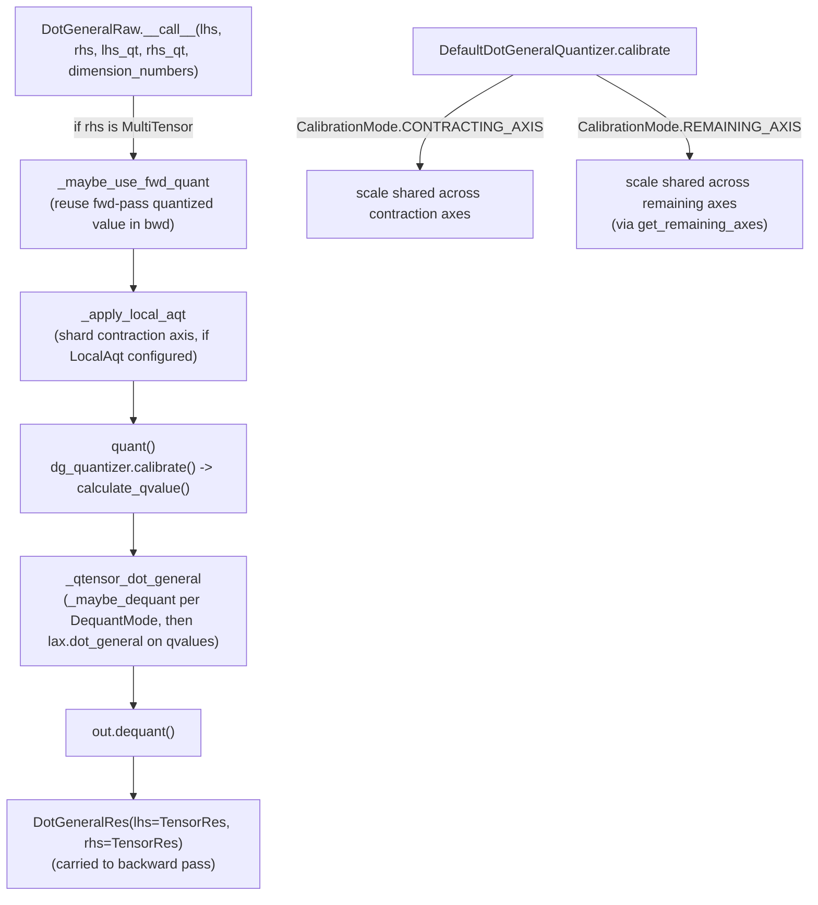

# aqt.jax.v2.aqt_dot_general — the quantized dot_general dispatch core

## Overview

This module is AQT's central replacement for `jax.lax.dot_general`: instead of computing a plain
matmul, it quantizes both operands to a lower-precision `QTensor` (typically int8/int4 or fp8),
performs the contraction in that narrow dtype, then dequantizes the result — all while producing a
custom VJP so gradients still flow correctly through the quantization. The two load-bearing objects
are [`DotGeneralRaw`](../catalog/aqt/jax/aqt_dot_general.md#DotGeneralRaw) (one unidirectional
quantized dot_general, no gradient) and its three-way composition into a full forward+backward
op (`DotGeneral`, built from a `fwd`, `dlhs`, and `drhs` `DotGeneralRaw`). Everything else in the
file — [`CalibrationMode`](../catalog/aqt/jax/aqt_dot_general.md#CalibrationMode),
[`DequantMode`](../catalog/aqt/jax/aqt_dot_general.md#DequantMode),
[`quant`](../catalog/aqt/jax/aqt_dot_general.md#quant),
[`_qtensor_dot_general`](../catalog/aqt/jax/aqt_dot_general.md#_qtensor_dot_general) — exists to
answer two orthogonal questions independently per tensor: *which axes get a shared scale* and
*when is the scale re-applied (dequantized)*.

## Diagram

## Design rationale (why it's built this way)

**Quantization axis choice and dequantization timing are two independent enum knobs, not one
combined mode, because different deployment shapes need different combinations.**
[`CalibrationMode`](../catalog/aqt/jax/aqt_dot_general.md#CalibrationMode)'s own doc calls it
"Calibration axis modes" — `CONTRACTING_AXIS` shares one scale per contracted slice,
`REMAINING_AXIS` shares one scale per output slice (computed via
[`get_remaining_axes`](../catalog/aqt/jax/v2/utils.md#get_remaining_axes)). Separately,
[`DequantMode`](../catalog/aqt/jax/aqt_dot_general.md#DequantMode) picks *where* the scale
multiplication happens: `OUTPUT` (scale the dot_general result, compatible only with
`CONTRACTING_AXIS`), `THIS_INPUT` (fake-quant: multiply this operand's `qvalue` by its own scale
*before* the matmul, compatible with either calibration mode), or `OTHER_INPUT` (transpose this
operand's scale into the *other* operand's shape and multiply it in before the matmul — only
compatible with `REMAINING_AXIS`). Crossing these two axes gives the compatibility matrix that
[`_qtensor_dot_general`](../catalog/aqt/jax/aqt_dot_general.md#_qtensor_dot_general) asserts on.

**`quant()`'s `_postprocess_qtensor` poisons the gradient by default when a caller supplies its own
pre-quantized `QTensor`, because a caller-supplied `QTensor` is assumed to be a frozen serving-time
weight, not something a training loop should backprop into.**
[`_postprocess_qtensor`](../catalog/aqt/jax/aqt_dot_general.md#quant._postprocess_qtensor)'s doc says
it computes "qtensor from input or input_qtensor" — when `input_qtensor` (the caller-supplied one)
is set and
[`allow_dummy_gradient_into_qtensor`](../catalog/aqt/jax/aqt_dot_general.md#DotGeneralRaw.allow_dummy_gradient_into_qtensor)
is `False`, the gradient function is replaced with a poison string ("Gradients are not generally
expected in serving...") rather than a real callable — this converts a silent correctness bug (someone
accidentally training against a frozen serving weight) into a loud one the moment that poisoned
gradient is actually used.

**`_maybe_use_fwd_quant` lets the backward pass reuse the *exact* quantized values the forward pass
already computed, instead of re-quantizing, because re-quantizing independently in fwd and bwd can
silently pick different rounding and break the custom-VJP's implicit consistency assumption.**
[`_maybe_use_fwd_quant`](../catalog/aqt/jax/aqt_dot_general.md#_maybe_use_fwd_quant)'s doc — "Applies
already quantized value for backpropagation, if the flag is set" — only fires when `rhs` arrives as
a [`MultiTensor`](../catalog/aqt/jax/aqt_dot_general.md#MultiTensor) (the forward pass's `(x, qx)`
pair) and `use_fwd_quant` is set on the `Tensor` config; the returned `lhs`/`rhs` pair uses the
forward pass's already-computed quantized `rhs` rather than quantizing the raw value fresh.

**Local AQT trades gradient-through-quantization fidelity for a smaller contraction dimension by
splitting one big contraction into a batch of smaller ones.**
[`_apply_local_aqt`](../catalog/aqt/jax/aqt_dot_general.md#_apply_local_aqt) is only invoked when
[`local_aqt`](../catalog/aqt/jax/aqt_dot_general.md#DotGeneralRaw.local_aqt) (a
[`LocalAqt`](../catalog/aqt/jax/aqt_dot_general.md#LocalAqt) config) is set, reshaping the
contraction axis into `(shard_count, shard_size)` via
[`factor_reshape`](../catalog/aqt/jax/aqt_dot_general.md#_apply_local_aqt.factor_reshape) or
[`factor_reshape_largest`](../catalog/aqt/jax/aqt_dot_general.md#_apply_local_aqt.factor_reshape_largest)
and folding that shard axis into the batch dimensions of `dimension_numbers` — each shard gets its
own independent quantization scale (finer-grained than one scale for the whole contraction), at the
cost of `local_aqt` not being supported in the forward pass
(`assert_config_validity` — see caller `DotGeneral.assert_config_validity`).

> [!inferred] `DefaultDotGeneralQuantizer`'s
> [`skip_mid_scales`](../catalog/aqt/jax/aqt_dot_general.md#DefaultDotGeneralQuantizer.skip_mid_scales)
> field is hardcoded `Literal[True]`, and
> [`lhs_mid_alpha`](../catalog/aqt/jax/aqt_dot_general.md#DefaultDotGeneralQuantizer.lhs_mid_alpha)/
> [`rhs_mid_alpha`](../catalog/aqt/jax/aqt_dot_general.md#DefaultDotGeneralQuantizer.rhs_mid_alpha)
> both default to `None` — the "mid" quantizers
> ([`lhs_mid`](../catalog/aqt/jax/aqt_dot_general.md#DefaultDotGeneralQuantizer.lhs_mid)/
> [`rhs_mid`](../catalog/aqt/jax/aqt_dot_general.md#DefaultDotGeneralQuantizer.rhs_mid)) exist in the
> dataclass but the alpha-blending path they'd support looks disabled/unused in the current default
> configuration, suggesting it's a half-migrated or experimental feature.

## Entry points

- [`DotGeneralRaw.__call__`](../catalog/aqt/jax/aqt_dot_general.md#DotGeneralRaw.__call__) — the
  actual quantized dot_general for one direction (fwd, dlhs, or drhs); called once per direction per
  matmul by the injected custom-VJP wrapper.
- [`DotGeneral.assert_config_validity`](../catalog/aqt/jax/aqt_dot_general.md#DotGeneral.assert_config_validity) —
  validates the composed `fwd`/[`dlhs`](../catalog/aqt/jax/aqt_dot_general.md#DotGeneral.dlhs)/
  [`drhs`](../catalog/aqt/jax/aqt_dot_general.md#DotGeneral.drhs) configuration before any dot_general
  runs (e.g. that `local_aqt` isn't set on `fwd`).
- [`dg_core`](../catalog/aqt/jax/aqt_dot_general.md#DotGeneral.dg_core) — the expanded-API entry point
  a caller uses to get both the output and the `QTensor`s of a `dot_general` call (as opposed to the
  plain-array-in/plain-array-out injectable path).
- [`dot_general`](../catalog/aqt/jax/v2/pallas/dot_general.md#dot_general) (pallas variant) — the
  in-kernel replacement used when AQT's quantized matmul must run *inside* a Pallas kernel body,
  always returning a dequantized array rather than a `QTensor`.

## Mechanism (step-by-step)

1. **Optionally reuse the forward pass's quantized value.**
   [`DotGeneralRaw.__call__`](../catalog/aqt/jax/aqt_dot_general.md#DotGeneralRaw.__call__) checks if
   `rhs` arrived as a [`MultiTensor`](../catalog/aqt/jax/aqt_dot_general.md#MultiTensor) (the backward
   pass's view of the forward pass's `(value, quantized_value)` pair) and, if so, calls
   [`_maybe_use_fwd_quant`](../catalog/aqt/jax/aqt_dot_general.md#_maybe_use_fwd_quant) to substitute
   in the already-quantized value rather than re-quantizing.
2. **Optionally shard the contraction axis for local AQT.** If
   [`local_aqt`](../catalog/aqt/jax/aqt_dot_general.md#DotGeneralRaw.local_aqt) is configured,
   [`_apply_local_aqt`](../catalog/aqt/jax/aqt_dot_general.md#_apply_local_aqt) reshapes `lhs`/`rhs`
   and the `dimension_numbers` so the contraction becomes a batched contraction over smaller shards.
3. **Quantize both operands via the pluggable `dg_quantizer`.**
   [`quant`](../catalog/aqt/jax/aqt_dot_general.md#quant) calls
   [`DefaultDotGeneralQuantizer.calibrate`](../catalog/aqt/jax/aqt_dot_general.md#DefaultDotGeneralQuantizer.calibrate)
   (computing calibration axes via
   [`_get_calibration_axes`](../catalog/aqt/jax/aqt_dot_general.md#DefaultDotGeneralQuantizer._get_calibration_axes),
   which dispatches on [`CalibrationMode`](../catalog/aqt/jax/aqt_dot_general.md#CalibrationMode))
   then `calculate_qvalue`, and lets a caller-supplied incomplete `QTensor`
   (`lhs_qt`/`rhs_qt`) short-circuit re-calibration.
4. **Run the contraction in the narrow dtype and dequantize.**
   [`_qtensor_dot_general`](../catalog/aqt/jax/aqt_dot_general.md#_qtensor_dot_general) picks, per
   operand, whether to dequantize *before* the matmul (`_maybe_dequant`, when
   [`DequantMode.THIS_INPUT`](../catalog/aqt/jax/aqt_dot_general.md#DequantMode.THIS_INPUT)) or leave
   the raw `qvalue` (otherwise), applies any
   [`OTHER_INPUT`](../catalog/aqt/jax/aqt_dot_general.md#DequantMode.OTHER_INPUT)-mode scale transposed
   via [`transpose.lhs_scale_transpose_for_rhs_input`](../catalog/aqt/jax/v2/transpose.md#lhs_scale_transpose_for_rhs_input)/
   [`rhs_scale_transpose_for_lhs_input`](../catalog/aqt/jax/v2/transpose.md#rhs_scale_transpose_for_lhs_input)
   onto the other operand, asserts the `int32`-accumulator dtype constraint
   ([`dtypes_allowed_for_int32_accum`](../catalog/aqt/jax/aqt_dot_general.md#dtypes_allowed_for_int32_accum)),
   then runs `lax.dot_general` on the (possibly still-quantized) values and computes the output's
   scale via [`_get_scale_t`](../catalog/aqt/jax/aqt_dot_general.md#_get_scale_t) transposed with
   [`lhs_scale_transpose_to_output`](../catalog/aqt/jax/v2/transpose.md#lhs_scale_transpose_to_output)/
   [`rhs_scale_transpose_to_output`](../catalog/aqt/jax/v2/transpose.md#rhs_scale_transpose_to_output).
5. **Dequantize the final `QTensor` and package forward-pass state for the backward pass.**
   `out.dequant()` produces the plain array result; a
   [`DotGeneralRes`](../catalog/aqt/jax/aqt_dot_general.md#DotGeneralRes) bundles both operands'
   [`TensorRes`](../catalog/aqt/jax/aqt_dot_general.md#TensorRes) (each a
   [`MultiTensor`](../catalog/aqt/jax/aqt_dot_general.md#MultiTensor) plus a
   [`GradientFn`](../catalog/aqt/jax/v2/aqt_tensor.md#GradientFn)) for the custom-VJP backward pass to
   consume — except when `local_aqt` is set, in which case `res` is dropped entirely (local AQT isn't
   supported in the forward-pass gradient path).

## Key data structures

- **[`DotGeneralRaw`](../catalog/aqt/jax/aqt_dot_general.md#DotGeneralRaw)** — one direction's
  quantization config: `lhs`/`rhs` ([`Tensor`](../catalog/aqt/jax/aqt_dot_general.md#Tensor)),
  [`dg_quantizer`](../catalog/aqt/jax/aqt_dot_general.md#DotGeneralRaw.dg_quantizer), an accumulator
  dtype, an optional [`local_aqt`](../catalog/aqt/jax/aqt_dot_general.md#DotGeneralRaw.local_aqt), and
  [`jax_scope_name`](../catalog/aqt/jax/aqt_dot_general.md#DotGeneralRaw.jax_scope_name) (for
  profiling — the `__call__` body runs inside `jax.named_scope(self.jax_scope_name)`).
- **[`Tensor`](../catalog/aqt/jax/aqt_dot_general.md#Tensor)** — per-operand quantization
  configuration: `use_fwd_quant`, `dequant_mode`
  ([`DequantMode`](../catalog/aqt/jax/aqt_dot_general.md#DequantMode)), `calibration_mode`
  ([`CalibrationMode`](../catalog/aqt/jax/aqt_dot_general.md#CalibrationMode)).
- **[`MultiTensor`](../catalog/aqt/jax/aqt_dot_general.md#MultiTensor)** — the `(x, qx)` pair (raw
  value + [`QTensor`](../catalog/aqt/jax/v2/aqt_tensor.md#QTensor)) threaded from forward pass to
  backward pass so the backward pass can reuse the forward pass's quantization decision.
- **[`DotGeneralQuantizer`](../catalog/aqt/jax/aqt_dot_general.md#DotGeneralQuantizer)** (abstract) /
  [`DefaultDotGeneralQuantizer`](../catalog/aqt/jax/aqt_dot_general.md#DefaultDotGeneralQuantizer)
  (concrete) — the pluggable calibration+quantization strategy `quant()` delegates to; GPTQ supplies
  its own alternative implementation (see
  [aqt-jax-v2-extensions-gptq-gptq_dot_general_quantizer](aqt-jax-v2-extensions-gptq-gptq_dot_general_quantizer.md)
  if present).
- **[`LocalAqt`](../catalog/aqt/jax/aqt_dot_general.md#LocalAqt)** — `contraction_axis_shard_count`
  XOR `contraction_axis_shard_size` (exactly one is set, selecting between
  [`factor_reshape`](../catalog/aqt/jax/aqt_dot_general.md#_apply_local_aqt.factor_reshape) and
  [`factor_reshape_largest`](../catalog/aqt/jax/aqt_dot_general.md#_apply_local_aqt.factor_reshape_largest)),
  plus `tile_largest_shape` selecting which reshape strategy applies.

## Dynamics (design intent)

`assert_config_validity` explicitly guards against `local_aqt` being set on the forward-pass
`DotGeneralRaw` — the assertion message `'local_aqt is not yet supported in fwd.'` (seen inline in
`__call__`'s own use of `self.local_aqt`) documents that local AQT sharding is a backward-pass-only
optimization in this codebase, not a general dot_general feature.

## Edge cases

- [`_qtensor_dot_general`](../catalog/aqt/jax/aqt_dot_general.md#_qtensor_dot_general) asserts the
  accumulator dtype is only ever `jnp.int32` when *both* operands' quantized dtype is in
  [`dtypes_allowed_for_int32_accum`](../catalog/aqt/jax/aqt_dot_general.md#dtypes_allowed_for_int32_accum)
  (`int4`/`int8`) — mixing an int32 accumulator with any other dtype combination fails loudly rather
  than silently producing wrong-precision results.
- `DotGeneralRaw.__call__`'s bias assertion — bias is only supported when `dequant_mode ==
  DequantMode.THIS_INPUT` — means a `QTensor` with a non-empty `bias` field used under `OUTPUT` or
  `OTHER_INPUT` dequant mode raises immediately rather than silently dropping the bias.

## Open questions

- Whether GPTQ's own `GptqDotGeneralQuantizer._get_calibration_axes`
  (a near-duplicate of `DefaultDotGeneralQuantizer._get_calibration_axes`) is meant to be temporary
  scaffolding or a permanent fork isn't settled by this packet's subgraph alone — the source has a
  `TODO(lew)` acknowledging the duplication.

## See also
- [aqt-jax-v2-aqt_tensor](aqt-jax-v2-aqt_tensor.md) — `QTensor`, the quantized-tensor representation
  every dot_general call produces and consumes.
- [aqt-jax-v2-aqt_quantizer](aqt-jax-v2-aqt_quantizer.md) — `Quantizer`, the per-tensor quantization
  config `DefaultDotGeneralQuantizer` wraps one of per operand.
- [aqt-jax-v2-utils](aqt-jax-v2-utils.md) — `flax_slots_kw_only_dataclass`/`static_field`, the
  dataclass machinery every config class here is built with; `get_remaining_axes`, used by
  `REMAINING_AXIS` calibration.
