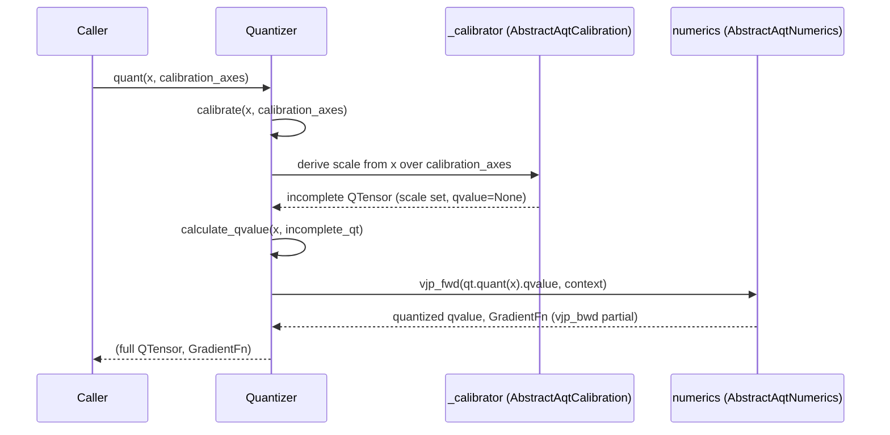

# aqt.jax.v2.aqt_quantizer — the per-tensor calibrate-then-quantize contract

## Overview

[`Quantizer`](../catalog/aqt/jax/v2/aqt_quantizer.md#Quantizer) is AQT's per-tensor quantization
configuration and driver — one instance is attached to *one side* of *one* dot_general/conv operand
(the dot_general layer above composes two of them, lhs and rhs). It factors quantization into two
independently-pluggable strategies: an [`AbstractAqtNumerics`](../catalog/aqt/jax/v2/aqt_quantizer.md#AbstractAqtNumerics)
(how many bits, what rounding — int, fp8, or
[`NoNumerics`](../catalog/aqt/jax/v2/numerics/no_numerics.md#NoNumerics) for "don't actually
quantize") and an [`AbstractAqtCalibration`](../catalog/aqt/jax/v2/aqt_quantizer.md#AbstractAqtCalibration)
(how to derive a scale from the data, e.g.
[`AbsMaxCalibration`](../catalog/aqt/jax/v2/calibration.md#AbsMaxCalibration)'s simple `max(abs(x))`).
[`quantizer_make`](../catalog/aqt/jax/v2/aqt_quantizer.md#quantizer_make) is the standard constructor
that wires a bit-width choice into both strategies at once.

## Diagram

## Design rationale (why it's built this way)

**`quant()` is a two-step pipeline — `calibrate()` then `calculate_qvalue()` — kept as two separately
callable methods, not fused, because some callers need to short-circuit or reuse just one half.**
[`Quantizer.quant`](../catalog/aqt/jax/v2/aqt_quantizer.md#Quantizer.quant)'s own doc — "The core
quantizing function" — is literally `qt = self.calibrate(...); qt, quant_grad =
self.calculate_qvalue(x, qt); return qt, quant_grad`. This split is exactly what lets a caller
provide its own pre-calibrated incomplete `QTensor` (see
[aqt-jax-aqt_dot_general](aqt-jax-aqt_dot_general.md)'s `quant()` function, which accepts an
already-incomplete `lhs_qt`/`rhs_qt` and skips straight to `calculate_qvalue`).

**`NoNumerics` is numerics-typed exactly like every real quantization strategy, so "don't quantize"
requires no special-casing at call sites — only inside the two methods that do real work.** Both
[`Quantizer.calibrate`](../catalog/aqt/jax/v2/aqt_quantizer.md#Quantizer.calibrate) and
[`Quantizer.calculate_qvalue`](../catalog/aqt/jax/v2/aqt_quantizer.md#Quantizer.calculate_qvalue)
open with `if isinstance(self.numerics,
`[`NoNumerics`](../catalog/aqt/jax/v2/numerics/no_numerics.md#NoNumerics)`): return ...` short-circuits
— `calibrate` returns a `QTensor` with `qvalue=x` directly (the "quantized" value is just the
original array) and `calculate_qvalue` returns `(qt, None)` (no gradient function needed since there's
no quantization to differentiate through) — every other call site treats `NoNumerics` exactly like any
other numerics choice.

**Calibration is deferred to a lazily-initialized `_calibrator` object, constructed once from a
`calibration` *class* reference, not eagerly at `Quantizer` construction time.**
[`Quantizer.init_calibration`](../catalog/aqt/jax/v2/aqt_quantizer.md#Quantizer) — visible in source
as `init_calibration`, though not itself a separately cited symbol in this packet — asserts
`self._calibrator is None` (a one-shot guard against double-initialization) then instantiates
[`calibration`](../catalog/aqt/jax/v2/aqt_quantizer.md#Quantizer.calibration) (the class, e.g.
[`AbsMaxCalibration`](../catalog/aqt/jax/v2/calibration.md#AbsMaxCalibration)) into
[`_calibrator`](../catalog/aqt/jax/v2/aqt_quantizer.md#Quantizer._calibrator) (the instance). The
comment on this pattern in [`quantizer_make`](../catalog/aqt/jax/v2/aqt_quantizer.md#quantizer_make)
— "We currently need to call because bwd pass is too late for initialization" — explains why: this
initialization must happen *before* JAX's custom-VJP machinery splits the computation into forward
and backward passes, since the backward pass alone would be too late to construct the calibrator.

**Tiling changes *which axes* get calibrated, computed as a coordinate transform before calibration
proper runs, not as a parallel code path inside calibration.** When a
[`TilingState`](../catalog/aqt/jax/v2/tiled_dot_general.md#TilingState) is supplied,
[`Quantizer.calibrate`](../catalog/aqt/jax/v2/aqt_quantizer.md#Quantizer.calibrate) first calls
[`tiling_state.apply`](../catalog/aqt/jax/v2/tiled_dot_general.md#TilingState.apply)`(x)` to reshape
`x` into tiles, then
[`tiling_state.to_tiled_axes_transposed`](../catalog/aqt/jax/v2/tiled_dot_general.md#TilingState.to_tiled_axes_transposed)
to remap the caller's untiled `calibration_axes` into the tiled coordinate system — everything
downstream (the calibration + numerics dispatch) then runs against the already-tiled tensor and axes,
unaware that tiling ever happened.

> [!inferred] The pallas-specific
> [`quant`](../catalog/aqt/jax/v2/pallas/quantizer.md#quant) function's own comment — "jax.lax.stop_gradient
> is not supported in pallas, thus disable scale_stop_grad" and "VPU ops only support float32...
> pallas requires explicit casting" — documents that the Pallas execution environment imposes real
> constraints back onto how a `Quantizer` must be configured (`scale_stop_grad=False,
> scale_dtype=jnp.float32`) that don't apply to the plain-JAX dot_general path.

## Entry points

- [`quantizer_make`](../catalog/aqt/jax/v2/aqt_quantizer.md#quantizer_make) — the standard
  `Quantizer` constructor; called once per operand per `dot_general` config (see
  [`dot_general_raw_make`](../catalog/aqt/jax/aqt_dot_general.md#dot_general_raw_make)), resolving a
  bit-width into a concrete `numerics` + `calibration` pair via
  [`get_numerics`](../catalog/aqt/jax/v2/numerics/utils.md#get_numerics) and
  [`AbsMaxCalibration`](../catalog/aqt/jax/v2/calibration.md#AbsMaxCalibration).
- [`Quantizer.quant`](../catalog/aqt/jax/v2/aqt_quantizer.md#Quantizer.quant) — the top-level
  calibrate-then-quantize entry point most callers use directly.
- [`Quantizer.calibrate`](../catalog/aqt/jax/v2/aqt_quantizer.md#Quantizer.calibrate) /
  [`Quantizer.calculate_qvalue`](../catalog/aqt/jax/v2/aqt_quantizer.md#Quantizer.calculate_qvalue) —
  the two half-steps, called separately when a caller supplies its own incomplete `QTensor` (skipping
  straight to `calculate_qvalue`).
- [`quant`](../catalog/aqt/jax/v2/pallas/quantizer.md#quant) (pallas variant) — a standalone
  channel-wise quantization helper for use inside Pallas kernel bodies, building its own `Quantizer`
  via `quantizer_make` internally rather than taking one as a parameter.

## Mechanism (step-by-step)

1. **[`quantizer_make`](../catalog/aqt/jax/v2/aqt_quantizer.md#quantizer_make) resolves a bit-width
   into numerics + calibration and constructs the `Quantizer`.** It calls
   [`get_numerics`](../catalog/aqt/jax/v2/numerics/utils.md#get_numerics)`(n_bits,
   preserve_max_val)` to pick the numerics strategy, defaults `calibration` to
   [`AbsMaxCalibration`](../catalog/aqt/jax/v2/calibration.md#AbsMaxCalibration) whenever `n_bits` is
   not `None`, builds a fresh [`Context`](../catalog/aqt/jax/v2/utils.md#Context) with `key=None,
   train_step=None`, and — unless `initialize_calibration=False` — immediately initializes the
   calibrator.
2. **[`Quantizer.calibrate`](../catalog/aqt/jax/v2/aqt_quantizer.md#Quantizer.calibrate) derives scale
   parameters from the data, producing an incomplete [`QTensor`](../catalog/aqt/jax/v2/aqt_tensor.md#QTensor).**
   For [`NoNumerics`](../catalog/aqt/jax/v2/numerics/no_numerics.md#NoNumerics) it short-circuits to a
   pass-through `QTensor`; otherwise it consults
   [`calib_shared_axes`](../catalog/aqt/jax/v2/aqt_quantizer.md#Quantizer.calib_shared_axes) (either
   the caller-supplied `calibration_axes` or the `"per_tensor"` override) to decide which axes share
   one scale.
3. **[`Quantizer.calculate_qvalue`](../catalog/aqt/jax/v2/aqt_quantizer.md#Quantizer.calculate_qvalue)
   fills in the quantized value and the gradient function.** It calls `qt.quant(x)` (the `QTensor`'s
   own quantize method — applying the calibrated scale), then
   `self.numerics.vjp_fwd(qt.qvalue, self.context)` to get the final quantized value plus residuals,
   and wraps `self.numerics.vjp_bwd` with those residuals via `jax.tree_util.Partial` to produce the
   returned [`GradientFn`](../catalog/aqt/jax/v2/aqt_tensor.md#GradientFn) — this is why `GradientFn`
   is a *closure* over calibration-time residuals, not a bare function reference.
4. **[`Quantizer.quant`](../catalog/aqt/jax/v2/aqt_quantizer.md#Quantizer.quant) is exactly the
   composition of the two above, nothing more.** It exists purely so most callers don't need to know
   the two-step structure exists.

## Key data structures

- **[`Quantizer`](../catalog/aqt/jax/v2/aqt_quantizer.md#Quantizer)** — `numerics`
  ([`AbstractAqtNumerics`](../catalog/aqt/jax/v2/aqt_quantizer.md#AbstractAqtNumerics)),
  `calibration` (an `AbstractAqtCalibration` *class*, not instance),
  `_calibrator` (the lazily-constructed instance),
  [`calib_shared_axes`](../catalog/aqt/jax/v2/aqt_quantizer.md#Quantizer.calib_shared_axes),
  `scale_stop_grad`, `scale_dtype`, and a
  [`context`](../catalog/aqt/jax/v2/aqt_quantizer.md#Quantizer.context)
  ([`Context`](../catalog/aqt/jax/v2/utils.md#Context)).
- **[`AbstractAqtNumerics`](../catalog/aqt/jax/v2/aqt_quantizer.md#AbstractAqtNumerics)** — alias for
  [`AqtNumerics`](../catalog/aqt/jax/v2/numerics/numerics.md#AqtNumerics), the abstract base every
  bit-width/dtype-specific numerics strategy implements (see
  [aqt-jax-v2-numerics-fp_numerics](aqt-jax-v2-numerics-fp_numerics.md) for one concrete strategy).
- **[`AbstractAqtCalibration`](../catalog/aqt/jax/v2/aqt_quantizer.md#AbstractAqtCalibration)** —
  alias for [`Calibration`](../catalog/aqt/jax/v2/calibration.md#Calibration), the abstract base for
  scale derivation strategies; [`AbsMaxCalibration`](../catalog/aqt/jax/v2/calibration.md#AbsMaxCalibration)
  is the default concrete implementation.
- **[`TilingState`](../catalog/aqt/jax/v2/tiled_dot_general.md#TilingState)** — bookkeeping for
  splitting an axis into tiles that each get an independent calibration scale; an alias re-exported
  from `tiled_dot_general` (also visible as
  [`TilingState`](../catalog/aqt/jax/v2/aqt_quantizer.md#TilingState) inside this module).

## Dynamics (design intent)

`init_calibration`'s assertion (`self._calibrator is None, "second call to
self.init_calibration()"`) documents that calibrator construction is a one-time event per `Quantizer`
instance — a caller that accidentally re-initializes a `Quantizer` (e.g. across repeated calls in a
training loop without constructing a fresh instance) hits this assertion rather than silently getting
a fresh, uncorrelated calibrator.

## Edge cases

- [`Quantizer.calibrate`](../catalog/aqt/jax/v2/aqt_quantizer.md#Quantizer.calibrate)'s
  `calib_shared_axes == "per_tensor"` branch computes `shared_axes = list(range(x.ndim))` — sharing
  one single scale across the *entire* tensor — as a special string sentinel distinct from an
  explicit axis list, so `"per_tensor"` and `list(range(x.ndim))` are equivalent but not
  interchangeable in the field's type (`Sequence[AxisIdx] | Literal["per_tensor"] | None`).

## Open questions

- Whether `_validate_inputs`/`_dot_general_aqt_jvp`-style custom-gradient scaffolding visible in the
  `dot_general_raw_make` source excerpt (from the older, non-v2
  [`aqt/jax/aqt_dot_general.py`](../catalog/aqt/jax/aqt_dot_general.md) module) shares any code path
  with `Quantizer`'s own gradient handling, or is an independent legacy mechanism, isn't resolved by
  this packet's subgraph.

## See also
- [aqt-jax-v2-aqt_tensor](aqt-jax-v2-aqt_tensor.md) — `QTensor`/`GradientFn`, the two return values of
  every `Quantizer.quant()`/`calculate_qvalue()` call.
- [aqt-jax-aqt_dot_general](aqt-jax-aqt_dot_general.md) — `dot_general_raw_make`, the primary
  constructor of a matched pair of `Quantizer`s (one per operand) via `quantizer_make`.
- [aqt-jax-v2-utils](aqt-jax-v2-utils.md) — `Context`/`static_field`/`flax_slots_kw_only_dataclass`,
  the shared config-object machinery `Quantizer` is built from.
