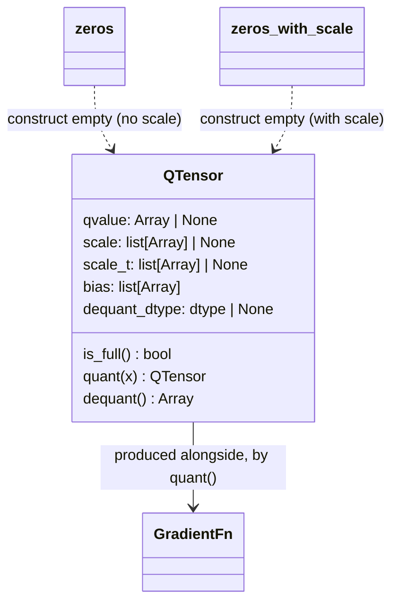

# aqt.jax.v2.aqt_tensor — QTensor, the quantized-array representation

## Overview

[`QTensor`](../catalog/aqt/jax/v2/aqt_tensor.md#QTensor) is AQT's one universal quantized-value
container — a registered JAX pytree carrying a narrow-dtype `qvalue`, one or more per-axis `scale`
arrays, an optional pre-transposed `scale_t`, an optional additive `bias`, and the original
(pre-quantization) `dequant_dtype`. Every AQT-quantized computation — dot_general, conv, the Pallas
kernels — passes `QTensor`s between stages instead of plain arrays, and every gradient function AQT
attaches to a quantized op is represented as a [`GradientFn`](../catalog/aqt/jax/v2/aqt_tensor.md#GradientFn)
(`None | Callable[..., Any]`, `None` exactly when there is no numerics to differentiate through).

## Diagram

## Design rationale (why it's built this way)

**`QTensor` can exist in two distinct states — "incomplete" (calibration parameters only, no
`qvalue`) and "full" (quantized value present) — modeled as the same class with `qvalue` nullable,
not two separate types.** [`QTensor`](../catalog/aqt/jax/v2/aqt_tensor.md#QTensor)'s own doc marks
`qvalue` as "Quantized (compressed) representation of tensor. Use `dequant()` method to 'decompress'
to the original tensor" and its own `is_full()` check is exactly `self.qvalue is not None` — this
two-phase lifecycle (calibrate → produce an incomplete `QTensor` with only scale info → quantize →
fill in `qvalue`) is threaded through
[`Quantizer.calibrate`](../catalog/aqt/jax/v2/aqt_quantizer.md#Quantizer.calibrate) (produces
incomplete) then
[`Quantizer.calculate_qvalue`](../catalog/aqt/jax/v2/aqt_quantizer.md#Quantizer.calculate_qvalue)
(fills in `qvalue`), and
[`Quantizer.quant`](../catalog/aqt/jax/v2/aqt_quantizer.md#Quantizer.quant) is the convenience
function that runs both steps back to back.

**Both `scale` and `scale_t` (transposed scale) are stored on the same `QTensor`, rather than
recomputing the transpose on demand, because the transpose is needed twice — once in the dot_general
backward pass and once in post-dot_general output scaling — and is worth caching.** The field
comment on `scale_t` (visible in source, though `scale_t` itself is not a directly citable symbol in
this packet) explains this is also why AQT persists `scale_t` in checkpoints: recomputing the
transpose at every inference call would be wasted work when the scale itself doesn't change between
calls.

**Bias is defined additively at the *pre-scale* value, so quant/dequant are exact inverses of each
other regardless of how many bias terms accumulate.** The class docstring's own formula —
`quant(x) = (x + b) / s`, `dequant(q) = (q * s) - b` — composes multiple scales and biases
multiplicatively/additively (`s[0] * s[1] * ...`, `b[0] + b[1] + ...`); an empty `bias` list (`len(bias)
== 0`) is the documented sentinel for "no bias correction applies," distinct from a bias of zero.

> [!inferred] [`zeros`](../catalog/aqt/jax/v2/aqt_tensor.md#zeros) and
> [`zeros_with_scale`](../catalog/aqt/jax/v2/aqt_tensor.md#zeros_with_scale) both default
> `dequant_dtype=jnp.bfloat16` — this suggests bf16 is treated as AQT's canonical "no quantization
> configured yet" placeholder dtype for freshly-allocated `QTensor`s (e.g. as an initial optimizer
> state shape), rather than a value ever intended to reach a real forward pass.

## Entry points

- [`QTensor`](../catalog/aqt/jax/v2/aqt_tensor.md#QTensor) — constructed directly by
  [`Quantizer.calibrate`](../catalog/aqt/jax/v2/aqt_quantizer.md#Quantizer.calibrate) (incomplete,
  scale-only) and by every dot_general/conv path that needs to pass a quantized value across a
  function boundary (e.g.
  [`DotGeneralRaw.__call__`](../catalog/aqt/jax/aqt_dot_general.md#DotGeneralRaw.__call__)'s
  `lhs_qt`/`rhs_qt` parameters).
- [`zeros`](../catalog/aqt/jax/v2/aqt_tensor.md#zeros) /
  [`zeros_with_scale`](../catalog/aqt/jax/v2/aqt_tensor.md#zeros_with_scale) — construct a
  placeholder `QTensor` (e.g. for `jax.eval_shape`-style abstract initialization or as a "no scale
  yet" default) without an actual calibration step.
- [`GradientFn`](../catalog/aqt/jax/v2/aqt_tensor.md#GradientFn) — the type every quantizing function
  ([`Quantizer.quant`](../catalog/aqt/jax/v2/aqt_quantizer.md#Quantizer.quant),
  [`Quantizer.calculate_qvalue`](../catalog/aqt/jax/v2/aqt_quantizer.md#Quantizer.calculate_qvalue),
  [`DefaultDotGeneralQuantizer.calculate_qvalue`](../catalog/aqt/jax/aqt_dot_general.md#DefaultDotGeneralQuantizer.calculate_qvalue))
  returns alongside its `QTensor`, consumed later by
  [`grad_dot_general`](../catalog/aqt/jax/aqt_dot_general.md#dg_core_vjp_bwd.grad_dot_general) in the
  custom-VJP backward pass.

## Mechanism (step-by-step)

1. **Calibration produces an incomplete `QTensor` — scale computed, `qvalue` still `None`.**
   [`Quantizer.calibrate`](../catalog/aqt/jax/v2/aqt_quantizer.md#Quantizer.calibrate) constructs a
   [`QTensor`](../catalog/aqt/jax/v2/aqt_tensor.md#QTensor) whose `qvalue` field is left at its
   pre-quantization value (or `None`), so `is_full()` is `False` at this stage — for the
   `no_numerics.NoNumerics` case it short-circuits and returns a `QTensor` with `qvalue=x` directly
   (skipping quantization).
2. **Quantization fills in `qvalue` from the calibration parameters.**
   [`Quantizer.calculate_qvalue`](../catalog/aqt/jax/v2/aqt_quantizer.md#Quantizer.calculate_qvalue)
   uses the quantization parameters already present in the incomplete `QTensor` to quantize `x`,
   producing the completed `QTensor` plus a
   [`GradientFn`](../catalog/aqt/jax/v2/aqt_tensor.md#GradientFn) for the backward pass.
3. **Both operands' `QTensor`s feed [`_qtensor_dot_general`](../catalog/aqt/jax/aqt_dot_general.md#_qtensor_dot_general),
   which itself returns a `QTensor`.** The dot_general result is *itself* wrapped as a `QTensor`
   (with its own combined scale, computed via
   [`_get_scale_t`](../catalog/aqt/jax/aqt_dot_general.md#_get_scale_t)) rather than a plain array,
   so the caller (
   [`DotGeneralRaw.__call__`](../catalog/aqt/jax/aqt_dot_general.md#DotGeneralRaw.__call__)) must
   still dequantize it explicitly.
4. **`_maybe_dequant` decides, per operand, whether a `QTensor` is dequantized before or after the
   matmul.** [`_maybe_dequant`](../catalog/aqt/jax/aqt_dot_general.md#_qtensor_dot_general._maybe_dequant)
   reads `qvalue`/`sparsity_mask` directly off the `QTensor` for the not-fake-quant path, or fully
   dequantizes it up front for the fake-quant (`DequantMode.THIS_INPUT`) path.
5. **`_postprocess_qtensor` decides whether the caller's pre-supplied `QTensor` or the freshly
   calculated one wins.** [`_postprocess_qtensor`](../catalog/aqt/jax/aqt_dot_general.md#quant._postprocess_qtensor)
   returns the caller-supplied `input_qtensor` unchanged (poisoning its gradient function unless
   explicitly allowed) when one was provided, otherwise the newly `calculate_qvalue`-computed one —
   see [aqt-jax-aqt_dot_general](aqt-jax-aqt_dot_general.md) for the full dispatch this feeds into.

## Key data structures

- **[`QTensor`](../catalog/aqt/jax/v2/aqt_tensor.md#QTensor)** — `qvalue` (nullable — presence is
  the incomplete/full discriminator), `scale`/`scale_t` (per-axis calibration scale and its cached
  transpose), `bias` (additive correction terms, empty list = no bias), `dequant_dtype` (the
  pre-quantization dtype), and a `tiling_state` (for tiled/blocked quantization).
- **[`GradientFn`](../catalog/aqt/jax/v2/aqt_tensor.md#GradientFn)** — `None | Callable[..., Any]`;
  `None` specifically means "no numerics" (the `no_numerics.NoNumerics` short-circuit path), not
  merely "not yet computed."
- **`MultiTensor`** ([aqt-jax-aqt_dot_general](aqt-jax-aqt_dot_general.md)) — the `(raw_array,
  QTensor)` pair used to carry a `QTensor` from forward to backward pass without re-deriving it.

## Dynamics (design intent)
Because `QTensor` is a `flax_slots_kw_only_dataclass` (a registered pytree — see
[aqt-jax-v2-utils](aqt-jax-v2-utils.md)), passing an incomplete `QTensor` (calibration-only, no
`qvalue`) through a `jax.jit` boundary is well-defined: `qvalue=None` is itself a valid pytree leaf
value, and downstream code must check `is_full()` before assuming `qvalue` is usable — this is why
[`_maybe_dequant`](../catalog/aqt/jax/aqt_dot_general.md#_qtensor_dot_general._maybe_dequant) and the
calibration-vs-quantization split exist as two separate steps rather than one.

## Edge cases
- `QTensor` re-exports itself under the exact same name in three Pallas modules
  ([`aqt/jax/v2/pallas/dot_general.py`](../catalog/aqt/jax/v2/pallas/dot_general.md#QTensor),
  [`pallas_call.py`](../catalog/aqt/jax/v2/pallas/pallas_call.md#QTensor),
  [`pallas/quantizer.py`](../catalog/aqt/jax/v2/pallas/quantizer.md#QTensor)) via a plain `QTensor =
  aqt_tensor.QTensor` alias — a reader following an `isinstance(x, QTensor)` check in Pallas code
  needs to know these are the same class, not a Pallas-specific subclass.

## Open questions
- Whether `sparsity_mask` (visible on the class but not a separately cited symbol in this packet) is
  wired into any calling convention beyond `_maybe_dequant`'s read isn't settled by this packet's
  subgraph alone.

## See also
- [aqt-jax-aqt_dot_general](aqt-jax-aqt_dot_general.md) — the primary consumer of `QTensor`,
  `GradientFn`, and the calibrate→quantize→dot_general→dequant pipeline.
- [aqt-jax-v2-aqt_quantizer](aqt-jax-v2-aqt_quantizer.md) — `Quantizer.calibrate`/`calculate_qvalue`,
  the two-phase producer of every `QTensor`.
- [aqt-jax-v2-utils](aqt-jax-v2-utils.md) — `flax_slots_kw_only_dataclass`, the pytree-registration
  mechanism `QTensor` is built with.
