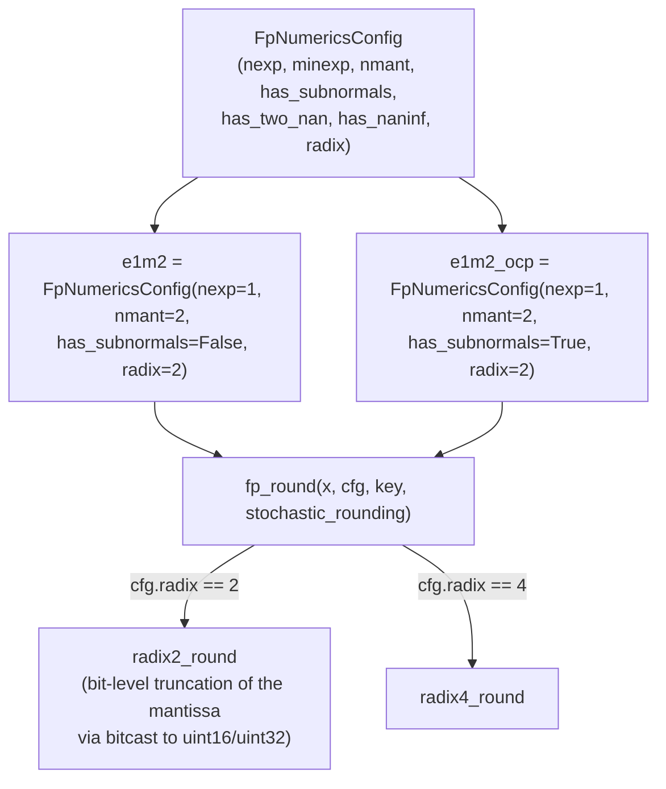

# aqt.jax.v2.numerics.fp_numerics — custom-format floating-point quantization

## Overview

This module implements quantization to *custom* narrow floating-point formats (e.g. `e1m2`, an FP
format with 1 exponent bit and 2 mantissa bits) rather than a fixed hardware type — the format itself
(exponent bits, mantissa bits, subnormal support, radix) is data, held in
[`FpNumericsConfig`](../catalog/aqt/jax/v2/numerics/fp_numerics.md#FpNumericsConfig), and
[`fp_round`](../catalog/aqt/jax/v2/numerics/fp_numerics.md#fp_round) is the single dispatcher that
rounds an array to whatever format a given config describes. Named module-level constants like
[`e1m2`](../catalog/aqt/jax/v2/numerics/fp_numerics.md#e1m2) and
[`e1m2_ocp`](../catalog/aqt/jax/v2/numerics/fp_numerics.md#e1m2_ocp) are pre-built configs for common
formats — the `_ocp` suffix marking the Open Compute Project's standardized variant of a format that
otherwise shares the same bit layout.

## Diagram

## Design rationale (why it's built this way)

**A floating-point format is fully described by seven scalar fields on
[`FpNumericsConfig`](../catalog/aqt/jax/v2/numerics/fp_numerics.md#FpNumericsConfig) — `nexp` (exponent
bits), `minexp`, `nmant` (mantissa bits), `has_subnormals`, `has_two_nan`, `has_naninf`, `radix` —
rather than one enum per named format, because this lets `fp_round` implement rounding once,
generically, against any config instead of once per named format.** The presence of two configs with
identical `nexp=1, nmant=2, radix=2` — [`e1m2`](../catalog/aqt/jax/v2/numerics/fp_numerics.md#e1m2)
(`has_subnormals=False`) vs. [`e1m2_ocp`](../catalog/aqt/jax/v2/numerics/fp_numerics.md#e1m2_ocp)
(`has_subnormals=True`) — demonstrates the point directly: the same nominal "1 exponent bit, 2
mantissa bit" format has two behaviorally distinct variants differing only in whether the smallest
representable magnitude range is a subnormal ramp or a hard cutoff, and both are expressible as plain
data rather than needing a new class.

**`fp_round` dispatches on `radix` (2 vs. 4) as its only branch, because everything else about
rounding — exponent/mantissa bit counts, subnormal handling — is uniform across both radices within
each radix-specific implementation.** [`fp_round`](../catalog/aqt/jax/v2/numerics/fp_numerics.md#fp_round)'s
own doc, "Round function dispatcher," and its body's assertion (`cfg.radix == 2 or cfg.radix == 4,
'Only radix 2 and 4 are supported.'`) make explicit that these are the only two supported radices —
anything else fails loudly at the dispatch point rather than silently falling through to a default.

> [!inferred] `radix2_round`'s implementation (visible in source, though not itself a separately
> cited symbol in this packet) rounds by bitcasting the input to an unsigned integer type
> (`bits_dtype`) and truncating mantissa bits directly at the bit-pattern level (`man_trunc_bits =
> container_man - nmant`), rather than via floating-point arithmetic — this is presumably chosen for
> exactness (bit-level truncation has no floating-point rounding-of-rounding error) and to make
> stochastic rounding's noise injection (adding random bits below the truncation boundary before
> truncating) straightforward to implement.

## Entry points

- [`fp_round`](../catalog/aqt/jax/v2/numerics/fp_numerics.md#fp_round) — the sole public rounding
  entry point; called with a target [`FpNumericsConfig`](../catalog/aqt/jax/v2/numerics/fp_numerics.md#FpNumericsConfig)
  and a stochastic-rounding flag whenever an array must be quantized to a custom FP format.
- [`FpNumericsConfig`](../catalog/aqt/jax/v2/numerics/fp_numerics.md#FpNumericsConfig) — constructed
  once per named format (see [`e1m2`](../catalog/aqt/jax/v2/numerics/fp_numerics.md#e1m2)/
  [`e1m2_ocp`](../catalog/aqt/jax/v2/numerics/fp_numerics.md#e1m2_ocp) as examples) and passed by
  reference wherever a numerics strategy needs to describe its target format.

## Mechanism (step-by-step)

1. **A format is selected as a pre-built [`FpNumericsConfig`](../catalog/aqt/jax/v2/numerics/fp_numerics.md#FpNumericsConfig)
   constant** (e.g. [`e1m2`](../catalog/aqt/jax/v2/numerics/fp_numerics.md#e1m2) or
   [`e1m2_ocp`](../catalog/aqt/jax/v2/numerics/fp_numerics.md#e1m2_ocp)) rather than constructed ad
   hoc per call, so a given format's exact bit layout is defined once and shared across every call
   site that quantizes to it.
2. **[`fp_round`](../catalog/aqt/jax/v2/numerics/fp_numerics.md#fp_round) asserts the config's radix
   is supported, then dispatches to a radix-specific rounding function.** `cfg.radix == 2` routes to
   `radix2_round`; `cfg.radix == 4` routes to `radix4_round`; any other radix value fails the
   assertion immediately rather than silently rounding incorrectly.
3. **The radix-specific function that
   [`fp_round`](../catalog/aqt/jax/v2/numerics/fp_numerics.md#fp_round) dispatches to performs the
   actual bit-level rounding**, optionally injecting
   stochastic noise before truncation when `stochastic_rounding=True` is passed through from
   `fp_round`'s own parameter.

## Key data structures

- **[`FpNumericsConfig`](../catalog/aqt/jax/v2/numerics/fp_numerics.md#FpNumericsConfig)** — the
  data-only description of one floating-point format: `nexp`, `minexp`, `nmant`, `has_subnormals`,
  `has_two_nan`, `has_naninf`, `radix`.

## Dynamics (design intent)
Not addressable from this packet's subgraph alone beyond the radix dispatch described above.

## Edge cases
- [`fp_round`](../catalog/aqt/jax/v2/numerics/fp_numerics.md#fp_round) only supports `cfg.radix in
  (2, 4)` — any other radix value raises an `AssertionError` rather than being silently accepted.

## Open questions
- Whether `minexp` values other than `0` are actually supported end-to-end — the `radix2_round`
  source (visible but not a separately cited symbol here) itself asserts `cfg.minexp == 0, 'minexp
  not implemented'` — isn't resolved by this packet's subgraph; every named config
  (`e1m2`/`e1m2_ocp`/etc.) uses `minexp=0`.

## See also
- [aqt-jax-v2-aqt_quantizer](aqt-jax-v2-aqt_quantizer.md) — `AbstractAqtNumerics`, the abstract
  interface this module's numerics strategy would implement alongside int-based numerics.
- [aqt-jax-v2-utils](aqt-jax-v2-utils.md) — `flax_slots_kw_only_dataclass`, the decorator
  `FpNumericsConfig` is built with.
