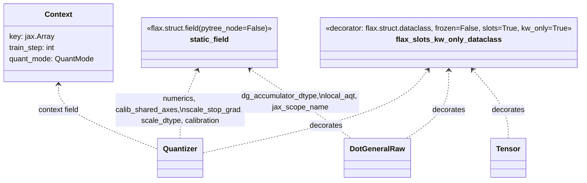

# aqt.jax.v2.utils — the dataclass/static-field foundation every AQT config builds on

## Overview

This is AQT v2's base layer — its own docstring states the constraint plainly: "Code in this file
can't depend on any other AQT file." It defines the one dataclass convention every config object in
the codebase (`Tensor`, `Quantizer`, `DotGeneralRaw`, `LocalAqt`, ...) is built from —
[`flax_slots_kw_only_dataclass`](../catalog/aqt/jax/v2/utils.md#flax_slots_kw_only_dataclass) plus
[`static_field`](../catalog/aqt/jax/v2/utils.md#static_field) — and two small but pervasive helper
types: [`AxisIdx`](../catalog/aqt/jax/v2/utils.md#AxisIdx) (a plain `int` alias used everywhere an
axis position is threaded through) and [`Context`](../catalog/aqt/jax/v2/utils.md#Context) (the
PRNG-key/train-step/quant-mode bundle passed into every quantizer).

## Diagram

## Design rationale (why it's built this way)

**Every AQT config field is marked `static_field` (a pytree *non-leaf*), not a regular dataclass
field, so JAX transformations treat quantization configuration as compile-time-constant metadata
rather than traced data.**
[`static_field`](../catalog/aqt/jax/v2/utils.md#static_field) wraps `flax.struct.field(pytree_node=False,
**kwargs)` — every config attribute built this way (numerics choice, calibration mode, dtype, scope
name, `local_aqt` sharding config) becomes part of a JAX pytree's *aux_data*, not its traced leaves.
This is what lets a `Quantizer`/`DotGeneralRaw` instance be passed straight through `jax.jit`
boundaries without forcing a recompile every time some unrelated leaf array changes shape, while
still letting `jax.tree_util` walk into the object structurally.

**`flax_slots_kw_only_dataclass` composes two decorator behaviors — `slots=True` and
`kw_only=True` — because AQT config classes have many optional fields and no natural positional
order.** [`flax_slots_kw_only_dataclass`](../catalog/aqt/jax/v2/utils.md#flax_slots_kw_only_dataclass)
is `functools.partial(flax_slots_dataclass, kw_only=True)`, itself
`functools.partial(flax.struct.dataclass, frozen=False, slots=True)` — `slots=True` avoids the
per-instance `__dict__` overhead across the very large number of small config objects AQT constructs
(one `Tensor`/`Quantizer` pair per operand per dot_general call site), and `kw_only=True` forces every
call site to name its fields explicitly rather than relying on positional order, which would be
fragile across the dozens of optional fields these classes accumulate.

> [!inferred] The module comment marking `flax_slots_kw_only_dataclass`/`flax_slots_dataclass` as a
> temporary migration seam ("This will exist only temporarily while completing the migration") — not
> itself a cited symbol here, but visible in the surrounding source — suggests the intent is to
> eventually collapse both decorators into one once every AQT config class has migrated to
> keyword-only construction.

## Entry points

- [`flax_slots_kw_only_dataclass`](../catalog/aqt/jax/v2/utils.md#flax_slots_kw_only_dataclass) —
  applied as a class decorator to every AQT config dataclass; this is the mechanism by which
  [`DotGeneralRaw`](../catalog/aqt/jax/aqt_dot_general.md#DotGeneralRaw),
  [`MultiTensor`](../catalog/aqt/jax/aqt_dot_general.md#MultiTensor), and
  [`DotGeneralRes`](../catalog/aqt/jax/aqt_dot_general.md#DotGeneralRes) all become registered JAX
  pytrees.
- [`static_field`](../catalog/aqt/jax/v2/utils.md#static_field) — called as the default factory for
  every non-array config field, e.g.
  [`DotGeneralRaw.local_aqt`](../catalog/aqt/jax/aqt_dot_general.md#DotGeneralRaw.local_aqt),
  [`DotGeneralRaw.jax_scope_name`](../catalog/aqt/jax/aqt_dot_general.md#DotGeneralRaw.jax_scope_name),
  and every `Quantizer` field
  ([`numerics`](../catalog/aqt/jax/v2/aqt_quantizer.md#Quantizer.numerics),
  [`calibration`](../catalog/aqt/jax/v2/aqt_quantizer.md#Quantizer.calibration),
  [`scale_stop_grad`](../catalog/aqt/jax/v2/aqt_quantizer.md#Quantizer.scale_stop_grad),
  [`scale_dtype`](../catalog/aqt/jax/v2/aqt_quantizer.md#Quantizer.scale_dtype),
  [`_calibrator`](../catalog/aqt/jax/v2/aqt_quantizer.md#Quantizer._calibrator)).
- [`AxisIdx`](../catalog/aqt/jax/v2/utils.md#AxisIdx) — the type every axis-position parameter is
  annotated with across the whole quantization stack, e.g.
  [`Quantizer.calibrate`](../catalog/aqt/jax/v2/aqt_quantizer.md#Quantizer.calibrate)'s
  `calibration_axes` and
  [`DefaultDotGeneralQuantizer._get_calibration_axes`](../catalog/aqt/jax/aqt_dot_general.md#DefaultDotGeneralQuantizer._get_calibration_axes)'s
  `ca`/`ba`.

## Mechanism (step-by-step)

1. **A config class is decorated once, at class-definition time, and every instance thereafter is a
   registered JAX pytree.**
   [`flax_slots_kw_only_dataclass`](../catalog/aqt/jax/v2/utils.md#flax_slots_kw_only_dataclass)
   applies `flax.struct.dataclass` (which does the pytree registration) with `frozen=False,
   slots=True, kw_only=True` baked in — e.g.
   [`DotGeneralQuantizer`](../catalog/aqt/jax/aqt_dot_general.md#DotGeneralQuantizer) and
   [`DefaultDotGeneralQuantizer`](../catalog/aqt/jax/aqt_dot_general.md#DefaultDotGeneralQuantizer)
   both carry this decorator.
2. **Every field default that shouldn't be traced is wrapped in [`static_field`](../catalog/aqt/jax/v2/utils.md#static_field)
   at declaration time.** [`Quantizer.calib_shared_axes`](../catalog/aqt/jax/v2/aqt_quantizer.md#Quantizer.calib_shared_axes)
   and [`Quantizer.scale_dtype`](../catalog/aqt/jax/v2/aqt_quantizer.md#Quantizer.scale_dtype) are
   both declared this way — their values participate in the pytree's aux_data (used for equality/hash
   during `jit` tracing) rather than being traced as arrays.
3. **[`quantizer_make`](../catalog/aqt/jax/v2/aqt_quantizer.md#quantizer_make) constructs a
   [`Context`](../catalog/aqt/jax/v2/utils.md#Context) with `key=None, train_step=None` at
   quantizer-creation time**, deferring the actual PRNG key/step binding to whenever the quantizer is
   later invoked inside a live training loop — the
   [`Quantizer.context`](../catalog/aqt/jax/v2/aqt_quantizer.md#Quantizer.context) field is populated
   with this placeholder and updated later (see
   [`DotGeneralQuantizer.set_context`](../catalog/aqt/jax/aqt_dot_general.md#DotGeneralQuantizer.set_context)).
4. **[`Quantizer.calibrate`](../catalog/aqt/jax/v2/aqt_quantizer.md#Quantizer.calibrate) and
   [`Quantizer.quant`](../catalog/aqt/jax/v2/aqt_quantizer.md#Quantizer.quant) both take
   `calibration_axes: Sequence[`[`AxisIdx`](../catalog/aqt/jax/v2/utils.md#AxisIdx)`]` as an explicit
   parameter rather than deriving it internally**, so the same `Quantizer` object can be reused across
   call sites that need different calibration axes (e.g. `CONTRACTING_AXIS` vs `REMAINING_AXIS`
   dispatch upstream in
   [`DefaultDotGeneralQuantizer._get_calibration_axes`](../catalog/aqt/jax/aqt_dot_general.md#DefaultDotGeneralQuantizer._get_calibration_axes)).

## Key data structures

- **[`Context`](../catalog/aqt/jax/v2/utils.md#Context)** — the ambient PRNG-key/train-step/
  quant-mode bundle every `Quantizer` carries; threaded in from the caller rather than looked up
  globally, so quantization is a pure function of its inputs.
- **[`AxisIdx`](../catalog/aqt/jax/v2/utils.md#AxisIdx)** — `int` alias; used pervasively (not a
  wrapper class) so axis-position lists are plain `Sequence[int]` throughout the calibration-axis
  machinery.

## Dynamics (design intent)

Because `static_field`-wrapped attributes are non-pytree-leaves, changing one (e.g. swapping
`dg_accumulator_dtype` between calls) is a *retracing* event under `jax.jit`, not a data update — this
is consistent with these fields being genuinely static configuration (bit-width, dequant mode,
scope name) rather than per-step-varying state.

## Edge cases
None visible in this packet's subgraph beyond the static/dynamic field split itself.

## Open questions
- Whether `flax_slots_dataclass`/`flax_slots_kw_only_dataclass` will actually be collapsed into one
  decorator (per the module's own migration-seam comment) isn't resolved by this packet's subgraph.

## See also
- [aqt-jax-aqt_dot_general](aqt-jax-aqt_dot_general.md) — `DotGeneralRaw`/`Tensor`/`LocalAqt`, the
  primary consumers of `flax_slots_kw_only_dataclass`/`static_field`.
- [aqt-jax-v2-aqt_quantizer](aqt-jax-v2-aqt_quantizer.md) — `Quantizer`, whose `context` field is a
  `Context` and whose every other field is a `static_field`.
