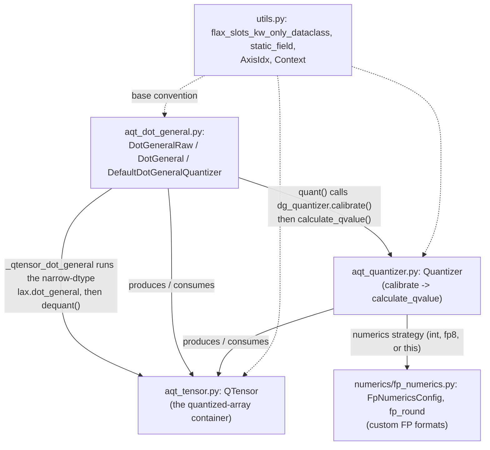

# aqt — what it is and how it fits together

## In one paragraph

AQT (Accurate Quantized Training) is a `jax.lax.dot_general`/conv replacement library: instead of
computing a plain matmul, it quantizes both operands to a narrow dtype (int4/int8 or a custom
floating-point format), runs the contraction in that narrow dtype, and dequantizes the result — with
a custom VJP so training gradients still flow correctly through the quantization. This grounded
catalog covers AQT's **v2** stack (`aqt/jax/v2/`), the actively-used generation; a separate, older
non-v2 API (`aqt/jax/aqt_dot_general.py` and siblings, imported by the v2 dot_general dispatch layer
for some shared internals) and a still-older `jax_legacy/` stack also exist in the repo but are out of
this catalog's scope. Every quantization decision factors into two independently-pluggable axes —
*calibration* (how to derive a scale from data) and *numerics* (what narrow format to round to) — and
every config object in the codebase is built from one shared dataclass convention so it composes
cleanly as a JAX pytree.

## Core architecture

## Main concepts

**Calibration axis and dequantization timing are two independent knobs, not one combined mode.**
`CalibrationMode` (`CONTRACTING_AXIS` vs `REMAINING_AXIS`) picks which axes share one scale;
`DequantMode` (`OUTPUT`/`THIS_INPUT`/`OTHER_INPUT`) picks *when* that scale gets multiplied back in.
Crossing these two axes is the compatibility matrix the dot_general dispatch core enforces. See
[aqt-jax-aqt_dot_general](concepts/aqt-jax-aqt_dot_general.md).

**`QTensor` has a two-phase lifecycle — incomplete (calibration only) then full (quantized value
present) — represented as one class with a nullable `qvalue`, not two types.** `Quantizer.calibrate`
produces the incomplete form; `Quantizer.calculate_qvalue` fills it in. See
[aqt-jax-v2-aqt_tensor](concepts/aqt-jax-v2-aqt_tensor.md).

**`Quantizer` factors quantization into a pluggable calibration strategy and a pluggable numerics
strategy, composed at construction time by `quantizer_make`.** `NoNumerics` is numerics-typed just
like every real strategy, so "don't actually quantize" needs no special-casing outside the two core
methods. See [aqt-jax-v2-aqt_quantizer](concepts/aqt-jax-v2-aqt_quantizer.md).

**Every AQT config object shares one dataclass convention: `flax_slots_kw_only_dataclass` +
`static_field`, marking configuration as a pytree's non-traced aux_data.** This is what lets
`Tensor`/`Quantizer`/`DotGeneralRaw` instances cross `jax.jit` boundaries without forcing a recompile
on every unrelated leaf-array change. See [aqt-jax-v2-utils](concepts/aqt-jax-v2-utils.md).

**Custom floating-point formats are data (a config struct), not a fixed set of hardware types.**
`FpNumericsConfig` describes an arbitrary FP layout (exponent/mantissa bits, subnormal support,
radix); `fp_round` is the one generic rounding dispatcher for any such config. See
[aqt-jax-v2-numerics-fp_numerics](concepts/aqt-jax-v2-numerics-fp_numerics.md).

**Backward-pass optimizations reuse forward-pass work rather than recomputing it.**
`_maybe_use_fwd_quant` lets the backward pass reuse the forward pass's already-quantized value
instead of re-quantizing (avoiding a rounding-consistency mismatch); local AQT (`LocalAqt`) shards the
contraction axis for finer-grained backward-pass quantization at the cost of not being supported in
the forward pass. See [aqt-jax-aqt_dot_general](concepts/aqt-jax-aqt_dot_general.md).

## How a request flows

A quantized dot_general call (`DotGeneralRaw.__call__`) first optionally reuses the backward pass's
forward-quantized value (`_maybe_use_fwd_quant`) and optionally shards the contraction axis for local
AQT (`_apply_local_aqt`); it then calls `quant()`, which delegates to `dg_quantizer.calibrate()`
(computing calibration axes per `CalibrationMode`, producing incomplete `QTensor`s) followed by
`calculate_qvalue()` (filling in the quantized `qvalue` plus a `GradientFn` closure); the two
quantized `QTensor`s feed `_qtensor_dot_general`, which dequantizes per-operand as needed
(`DequantMode`), runs `lax.dot_general` in the narrow dtype, and computes the output's own scale; the
final `QTensor` is dequantized (`out.dequant()`) to produce the plain-array result, while a
`DotGeneralRes` bundle carries the forward pass's `QTensor`s and gradient functions to the backward
pass.

## Map of the wiki

- "How does the quantized dot_general dispatch actually work — calibration modes, dequant modes,
  local AQT, forward-quant reuse?" → [aqt-jax-aqt_dot_general](concepts/aqt-jax-aqt_dot_general.md).
- "What is `QTensor` and how does its incomplete/full lifecycle work?" →
  [aqt-jax-v2-aqt_tensor](concepts/aqt-jax-v2-aqt_tensor.md).
- "How does per-tensor calibration and quantization compose?" →
  [aqt-jax-v2-aqt_quantizer](concepts/aqt-jax-v2-aqt_quantizer.md).
- "What's the shared dataclass/pytree convention every config object uses?" →
  [aqt-jax-v2-utils](concepts/aqt-jax-v2-utils.md).
- "How are custom floating-point quantization formats defined and rounded to?" →
  [aqt-jax-v2-numerics-fp_numerics](concepts/aqt-jax-v2-numerics-fp_numerics.md).
- For the exhaustive per-symbol index, see `catalog/`; for the ranked concept list, see `index.md`.
