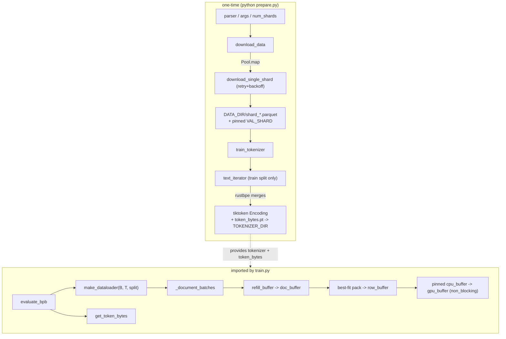

# prepare — data shards, BPE tokenizer, packed dataloader, and the fixed BPB metric

One-time data/tokenizer setup plus the runtime data-feeding and evaluation primitives that `train.py` imports.

## Overview
`prepare.py` has two lives. Run as a script, it does **one-time setup**: download parquet shards from a Hugging Face dataset and train a small (8192-token) byte-level BPE tokenizer, both cached under `~/.cache/autoresearch/`. Imported by the trainer, it is the **runtime data plane**: an infinite, BOS-aligned, best-fit-*packed* dataloader ([`make_dataloader`](../catalog/prepare.md#make_dataloader)) that stages batches through pinned host memory into preallocated GPU buffers at 100% token utilization, and the *frozen* evaluation metric ([`evaluate_bpb`](../catalog/prepare.md#evaluate_bpb)) that reports vocab-independent bits-per-byte. The single design rule underneath both halves is **comparability**: a pinned validation shard, a fixed context length, and a byte-normalized loss so results are directly comparable across model configs.

## Diagram

## Design rationale (why it's built this way)

**The validation shard is pinned, and it is the *last* shard.** [`VAL_SHARD`](../catalog/prepare.md#VAL_SHARD) `= MAX_SHARD` (shard 06542, [`MAX_SHARD`](../catalog/prepare.md#MAX_SHARD)), and [`download_data`](../catalog/prepare.md#download_data) always appends it to the download set even when you ask for only a few training shards. Everything downstream then *excludes* it from training: [`text_iterator`](../catalog/prepare.md#text_iterator) filters out [`VAL_FILENAME`](../catalog/prepare.md#VAL_FILENAME) when building the tokenizer corpus, and [`_document_batches`](../catalog/prepare.md#_document_batches) routes it to the `"val"` split only. This is the guardrail that keeps the eval set out of both training data *and* tokenizer statistics, so the reported number is honest across runs.

**BPB, not loss, is the metric — and it is explicitly frozen.** The source marks the eval section "DO NOT CHANGE — this is the fixed metric". [`evaluate_bpb`](../catalog/prepare.md#evaluate_bpb)'s docstring explains why: *"Bits per byte (BPB): vocab size-independent evaluation metric. Sums per-token cross-entropy (in nats), sums target byte lengths, then converts nats/byte to bits/byte."* Normalizing by *bytes* rather than tokens means two models with different tokenizers/vocabularies are still comparable — a per-token loss would reward a coarser tokenizer for free. Special tokens contribute 0 bytes and are masked out of both sums.

**The dataloader trades a little cropping for zero padding.** [`make_dataloader`](../catalog/prepare.md#make_dataloader)'s docstring states the intent: *"BOS-aligned dataloader with best-fit packing. Every row starts with BOS. Documents packed using best-fit to minimize cropping. When no document fits remaining space, crops shortest doc to fill exactly. 100% utilization (no padding)."* Best-fit (largest doc that still fits the remaining row space) is a greedy bin-packing choice that keeps whole documents intact when possible; only when nothing fits does it crop the shortest buffered doc to fill the row exactly. The payoff is that every one of the `B×T` positions carries a real training token — no compute is spent on padding.

> [!inferred]
> The from-scratch tokenizer path is `rustbpe` (fast Rust BPE training) → a `tiktoken.Encoding` rebuilt from the trained merges, pickled to disk; a parallel `token_bytes.pt` lookup table (UTF-8 byte length per token id, 0 for specials) is what makes BPB computable at eval time. These library details are visible in [`train_tokenizer`](../catalog/prepare.md#train_tokenizer)'s body but the `rustbpe`/`tiktoken` objects are not repo symbols in the subgraph, so they are noted rather than cited.

## Entry points
- [`args`](../catalog/prepare.md#args) / [`parser`](../catalog/prepare.md#parser) — the CLI (`--num-shards`, `--download-workers`); [`num_shards`](../catalog/prepare.md#num_shards) resolves `-1` to [`MAX_SHARD`](../catalog/prepare.md#MAX_SHARD) (download everything) at script start.
- [`download_data`](../catalog/prepare.md#download_data) — Step 1 of the script: fetch the requested training shards plus the pinned val shard into [`DATA_DIR`](../catalog/prepare.md#DATA_DIR).
- [`train_tokenizer`](../catalog/prepare.md#train_tokenizer) — Step 2: train the BPE tokenizer and write it (plus the token-bytes table) to [`TOKENIZER_DIR`](../catalog/prepare.md#TOKENIZER_DIR).
- [`make_dataloader`](../catalog/prepare.md#make_dataloader) — the runtime entry the trainer calls to get GPU-resident `(inputs, targets, epoch)` batches; reached on every training and eval step.
- [`evaluate_bpb`](../catalog/prepare.md#evaluate_bpb) — the runtime entry the trainer calls once at the end to produce the reported quality number.

## Mechanism (step-by-step)
1. **Resolve the shard set from the CLI.** [`parser`](../catalog/prepare.md#parser) → [`args`](../catalog/prepare.md#args) → [`num_shards`](../catalog/prepare.md#num_shards): `-1` means all [`MAX_SHARD`](../catalog/prepare.md#MAX_SHARD) shards, otherwise a small count for testing. The count is a *training*-shard count; the val shard is added separately.

2. **Download in parallel with retries.** [`download_data`](../catalog/prepare.md#download_data) builds the id list, always includes [`VAL_SHARD`](../catalog/prepare.md#VAL_SHARD), skips shards already on disk, then maps [`download_single_shard`](../catalog/prepare.md#download_single_shard) across a process `Pool`. Each shard is fetched from [`BASE_URL`](../catalog/prepare.md#BASE_URL) streaming to a `.tmp` file that is atomically renamed on success, with up to 5 attempts and exponential backoff — so an interrupted download never leaves a corrupt shard, and re-running resumes cleanly.

3. **Train the tokenizer on the training split only.** [`train_tokenizer`](../catalog/prepare.md#train_tokenizer) is idempotent (returns early if the pickle already exists) and requires ≥2 shards. It feeds [`text_iterator`](../catalog/prepare.md#text_iterator) — which enumerates parquet row-groups via [`list_parquet_files`](../catalog/prepare.md#list_parquet_files) while excluding [`VAL_FILENAME`](../catalog/prepare.md#VAL_FILENAME) and caps each doc at 10k chars — into the BPE trainer with target [`VOCAB_SIZE`](../catalog/prepare.md#VOCAB_SIZE) (8192, minus the reserved [`SPECIAL_TOKENS`](../catalog/prepare.md#SPECIAL_TOKENS)) and the GPT-4-style [`SPLIT_PATTERN`](../catalog/prepare.md#SPLIT_PATTERN) regex. It then writes the encoding and a per-token byte-length table into [`TOKENIZER_DIR`](../catalog/prepare.md#TOKENIZER_DIR).

4. **Stream documents infinitely.** At runtime [`make_dataloader`](../catalog/prepare.md#make_dataloader) pulls from [`_document_batches`](../catalog/prepare.md#_document_batches), an infinite generator over parquet row-groups that partitions files by split (train = all but the val shard in [`DATA_DIR`](../catalog/prepare.md#DATA_DIR); val = only the val shard) and bumps an epoch counter each full pass. Its inner [`refill_buffer`](../catalog/prepare.md#make_dataloader.refill_buffer) tokenizes the next document batch (prepending BOS) and tops up a working `doc_buffer` to `buffer_size`.

5. **Pack rows to 100% utilization.** For each of the `B` rows, [`make_dataloader`](../catalog/prepare.md#make_dataloader) fills `row_capacity = T + 1` positions by repeatedly choosing the *largest buffered doc that still fits*; when none fits, it crops the shortest doc to fill the remainder exactly. Every position ends up a real token, and each row is BOS-aligned.

6. **Stage batches host→device efficiently.** After packing `row_buffer`, [`make_dataloader`](../catalog/prepare.md#make_dataloader) slices inputs/targets as offset-by-one views, copies them into a **pinned** host buffer, then issues a single `non_blocking=True` copy into a **preallocated** CUDA buffer before yielding the GPU views plus the epoch. Pinned memory + async copy + reused buffers is the throughput-and-memory trick: no per-step GPU allocation and the H2D transfer can overlap with compute.

7. **Evaluate in frozen bits-per-byte.** [`evaluate_bpb`](../catalog/prepare.md#evaluate_bpb) loads the byte-length table via [`get_token_bytes`](../catalog/prepare.md#get_token_bytes), builds a `"val"` [`make_dataloader`](../catalog/prepare.md#make_dataloader), and runs [`EVAL_TOKENS`](../catalog/prepare.md#EVAL_TOKENS) `/ (batch × MAX_SEQ_LEN)` steps at the fixed [`MAX_SEQ_LEN`](../catalog/prepare.md#MAX_SEQ_LEN). It accumulates per-token cross-entropy (nats) and target byte counts, masks out zero-byte special tokens, and returns `total_nats / (ln2 · total_bytes)` — bits per byte.

## Key data structures
- **Cache layout** — [`CACHE_DIR`](../catalog/prepare.md#CACHE_DIR) → [`DATA_DIR`](../catalog/prepare.md#DATA_DIR) (parquet shards) and [`TOKENIZER_DIR`](../catalog/prepare.md#TOKENIZER_DIR) (tokenizer pickle + `token_bytes.pt`); the single on-disk contract between the one-time and runtime halves.
- **Dataloader buffers** — a Python `doc_buffer` of tokenized docs (refilled by [`refill_buffer`](../catalog/prepare.md#make_dataloader.refill_buffer)), a CPU `row_buffer`, a *pinned* `cpu_buffer`, and a preallocated CUDA `gpu_buffer` reused every step; inputs/targets are offset views into these.
- **Token-bytes table** — the `int32` tensor read by [`get_token_bytes`](../catalog/prepare.md#get_token_bytes) mapping token id → UTF-8 byte length (0 for [`SPECIAL_TOKENS`](../catalog/prepare.md#SPECIAL_TOKENS)); the denominator source for BPB.

## Dynamics (design intent)
[`_document_batches`](../catalog/prepare.md#_document_batches) never terminates — it loops over shards forever, incrementing `epoch` — so the trainer's time-budget loop, not the data, decides when to stop. Downloads are the only concurrent part: [`download_data`](../catalog/prepare.md#download_data) parallelizes [`download_single_shard`](../catalog/prepare.md#download_single_shard) across a `Pool`, sized to `min(workers, needed)`. The runtime path is single-threaded and deterministic given the shard set; its only overlap is the async H2D copy in [`make_dataloader`](../catalog/prepare.md#make_dataloader).

## Edge cases
- **Too few shards.** [`train_tokenizer`](../catalog/prepare.md#train_tokenizer) exits if fewer than 2 shards are present (needs ≥1 train + 1 val); [`_document_batches`](../catalog/prepare.md#_document_batches) asserts the split is non-empty.
- **Interrupted / partial downloads.** [`download_single_shard`](../catalog/prepare.md#download_single_shard) writes to `.tmp` and renames atomically, cleaning up on failure — re-running [`download_data`](../catalog/prepare.md#download_data) skips completed shards.
- **Idempotent tokenizer.** [`train_tokenizer`](../catalog/prepare.md#train_tokenizer) returns early if both the pickle and token-bytes file already exist, so re-preparing is cheap.
- **Cropping vs. packing.** When no buffered doc fits the remaining row space, [`make_dataloader`](../catalog/prepare.md#make_dataloader) crops the shortest doc — a deliberate small information loss chosen over padding waste.

## Open questions
- The exact `rustbpe` → `tiktoken` interop and the `Tokenizer.encode` batching (`num_threads`) are visible in source but their symbols are outside this packet's subgraph, so they are described only in the inferred block above.

## See also
- [train](train.md) — consumes [`make_dataloader`](../catalog/prepare.md#make_dataloader) for the training loop and [`evaluate_bpb`](../catalog/prepare.md#evaluate_bpb) for the final [`val_bpb`](../catalog/train.md#val_bpb) number, at the fixed [`MAX_SEQ_LEN`](../catalog/prepare.md#MAX_SEQ_LEN) context length.
