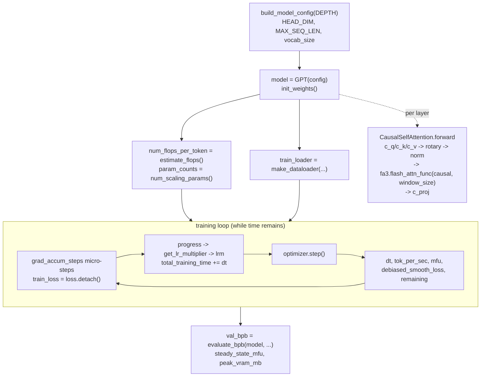

# train — time-budgeted single-GPU GPT pretraining (FA3 attention, MFU accounting)

Single-file, single-GPU GPT pretrainer that trains for a fixed wall-clock budget and reports one number (validation bits-per-byte) plus a hardware-efficiency (MFU) readout.

## Overview
`train.py` is a methodological reference, not a scaling framework: the whole model, optimizer, training loop, and reporting live in one file with hyperparameters as module-level constants, and the "experiment" is *"how good a model can you train in five minutes on one GPU"*. The design idea that shapes everything is the **time budget** rather than a step count — every schedule is driven by `progress = total_training_time / TIME_BUDGET`, and the loop stops when the clock runs out, deliberately excluding the first 10 (compilation-warmup) steps from both the budget and the efficiency numbers. The compute-heavy pieces relevant to a performance reader are the attention path — a Flash-Attention-3 kernel ([`fa3`](../catalog/train.md#fa3)) called per layer with a sliding-window mask — and the FLOP/MFU accounting ([`num_flops_per_token`](../catalog/train.md#num_flops_per_token), [`mfu`](../catalog/train.md#mfu), [`steady_state_mfu`](../catalog/train.md#steady_state_mfu)) that grades throughput against the H100's bf16 peak.

## Diagram

## Design rationale (why it's built this way)

**The budget is wall-clock, and warmup is excluded on purpose.** Schedules read [`progress`](../catalog/train.md#progress), which is `total_training_time / TIME_BUDGET` clamped to 1.0, and [`total_training_time`](../catalog/train.md#total_training_time) only starts accumulating [`dt`](../catalog/train.md#dt) after [`step`](../catalog/train.md#step) `> 10`. This is the key methodological move: `torch.compile` and CUDA kernel autotuning make the first handful of steps wildly slower than steady state, so counting them would both waste budget and pollute the efficiency metric. The same `step > 10` gate defines [`steady_state_mfu`](../catalog/train.md#steady_state_mfu) (`(step - 10)` steps of real work), so the reported MFU reflects the compiled hot loop, not compilation.

**MFU is measured, not assumed.** [`num_flops_per_token`](../catalog/train.md#num_flops_per_token) comes from [`estimate_flops`](../catalog/train.md#GPT.estimate_flops), which computes `6 * (dense params, excluding embeddings and per-layer scalars) + attention FLOPs`. The attention term is *window-aware*: it walks the per-layer window sizes and charges `12 * n_head * head_dim * effective_seq`, where `effective_seq` is capped by the sliding window — so shorter windows are correctly credited with fewer FLOPs. [`mfu`](../catalog/train.md#mfu) then divides realized FLOPs/s by a hard-coded H100 bf16 peak.

> [!inferred]
> The peak-FLOPs denominator is the module constant `H100_BF16_PEAK_FLOPS = 989.5e12` (train.py:463), which is *not* in this packet's subgraph, so the MFU number is only meaningful on an H100-class device; on other GPUs the percentage is scaled to the wrong roofline. The FA3 repo is also selected by device: `varunneal/flash-attention-3` on Hopper (`cap == (9,0)`), else `kernels-community/flash-attn3` (train.py:22-24).

**Precision is bf16 throughout the compute path, fp32 only where it matters.** [`init_weights`](../catalog/train.md#GPT.init_weights) explicitly casts the token embedding and value embeddings to `torch.bfloat16`, and the forward pass runs under a bf16 autocast context; only the final logits are pulled back to fp32 before a `softcap * tanh(logits/softcap)` clamp and cross-entropy. This is the standard mixed-precision split — matmuls in bf16 for MXU/tensor-core throughput, the loss in fp32 for numerical stability.

> [!inferred]
> The optimizer (a fused Muon-for-matrices / AdamW-for-everything-else optimizer, its two kernels wrapped in `@torch.compile(fullgraph=True)`) and the `torch.compile(model)` call are visible in the source (train.py:236-426, 508) but their symbols are not in this packet's subgraph, so they are not cited here. Notably the optimizer keeps its scalar hyperparameters as 0-D CPU tensors specifically to avoid `torch.compile` recompilation when LR/momentum change each step — a compilation-stability trick worth knowing but out of scope for this page's grounding.

## Entry points
- [`build_model_config`](../catalog/train.md#build_model_config) — turns the single knob `DEPTH` into a full `GPTConfig`; reached once at startup. It rounds `depth * ASPECT_RATIO` up to a multiple of [`HEAD_DIM`](../catalog/train.md#HEAD_DIM) so the model width is head-aligned, and pins the context length to [`MAX_SEQ_LEN`](../catalog/prepare.md#MAX_SEQ_LEN) and vocabulary to [`vocab_size`](../catalog/train.md#vocab_size).
- [`forward`](../catalog/train.md#CausalSelfAttention.forward) — the per-layer attention kernel path; control reaches it once per transformer block on every micro-step of every training and eval step. This is the compute-dominant inner loop for a performance reader.
- [`val_bpb`](../catalog/train.md#val_bpb) — the single reported quality number, produced once after the loop by [`evaluate_bpb`](../catalog/prepare.md#evaluate_bpb) on the pinned validation shard.

## Mechanism (step-by-step)
1. **Derive the model from one number.** [`build_model_config`](../catalog/train.md#build_model_config) computes width from `DEPTH`, keeping it a multiple of [`HEAD_DIM`](../catalog/train.md#HEAD_DIM) (128) so every head is full-width, and sets `n_head == n_kv_head` (no GQA at this scale). [`config`](../catalog/train.md#config) is that `GPTConfig`; [`model`](../catalog/train.md#model) is a `GPT(config)` built on the `meta` device then materialized and initialized via [`init_weights`](../catalog/train.md#GPT.init_weights), which also precomputes rotary tables sized to [`rotary_seq_len`](../catalog/train.md#GPT.rotary_seq_len) (`10×` the context) and casts embeddings to bf16.

2. **Account for size and cost before training.** [`param_counts`](../catalog/train.md#param_counts) from [`num_scaling_params`](../catalog/train.md#GPT.num_scaling_params) breaks parameters into wte / value-embeds / lm_head / matrices / scalars, and [`num_params`](../catalog/train.md#num_params) is the total. [`num_flops_per_token`](../catalog/train.md#num_flops_per_token) is [`estimate_flops`](../catalog/train.md#GPT.estimate_flops) — the FLOP-per-token figure that later feeds MFU. Both are pure bookkeeping (no training has happened yet) but they define the denominators of every efficiency metric.

3. **Fix the batching arithmetic.** [`tokens_per_fwdbwd`](../catalog/train.md#tokens_per_fwdbwd) is `DEVICE_BATCH_SIZE * MAX_SEQ_LEN`; [`grad_accum_steps`](../catalog/train.md#grad_accum_steps) is [`TOTAL_BATCH_SIZE`](../catalog/train.md#TOTAL_BATCH_SIZE) (2¹⁹ ≈ 524K tokens/optimizer-step) divided by it. So the loop does `grad_accum_steps` micro-forwards/backwards per optimizer step to reach a large effective batch on one GPU. [`train_loader`](../catalog/train.md#train_loader) is a [`make_dataloader`](../catalog/prepare.md#make_dataloader) generator that hands back GPU-resident `(x, y, epoch)` tuples.

4. **Run the attention kernel per layer.** Inside [`forward`](../catalog/train.md#CausalSelfAttention.forward), the input is projected to q/k/v by [`c_q`](../catalog/train.md#CausalSelfAttention.c_q)/[`c_k`](../catalog/train.md#CausalSelfAttention.c_k)/[`c_v`](../catalog/train.md#CausalSelfAttention.c_v) and reshaped to `(B, T, n_head/n_kv_head, head_dim)` using [`n_head`](../catalog/train.md#CausalSelfAttention.n_head), [`n_kv_head`](../catalog/train.md#CausalSelfAttention.n_kv_head), and [`head_dim`](../catalog/train.md#CausalSelfAttention.head_dim) (= [`n_embd`](../catalog/train.md#CausalSelfAttention.n_embd) `// n_head`). A ResFormer *value residual* optionally mixes a value embedding into `v` through a per-head sigmoid gate [`ve_gate`](../catalog/train.md#CausalSelfAttention.ve_gate). Rotary embeddings are applied, then q and k are RMS-normed by [`norm`](../catalog/train.md#norm) (QK-norm), and the actual attention is a single fused call `fa3.flash_attn_func(q, k, v, causal=True, window_size=window_size)` via [`fa3`](../catalog/train.md#fa3) — a Flash-Attention-3 kernel with a per-layer sliding window — before the output projection [`c_proj`](../catalog/train.md#CausalSelfAttention.c_proj). QK-norm + causal + windowed FA3 is the whole performance story of the layer.

5. **Step the loop against the clock.** Each iteration accumulates gradients over the micro-steps (tracking [`train_loss`](../catalog/train.md#train_loss) → [`train_loss_f`](../catalog/train.md#train_loss_f), which also drives a NaN/blow-up fast-fail), advances [`epoch`](../catalog/train.md#epoch) as the dataloader wraps, then computes schedules from [`progress`](../catalog/train.md#progress): [`lrm`](../catalog/train.md#lrm) via [`get_lr_multiplier`](../catalog/train.md#get_lr_multiplier) (warmup / flat / warmdown to `FINAL_LR_FRAC`). After the optimizer step, [`total_training_time`](../catalog/train.md#total_training_time) accrues [`dt`](../catalog/train.md#dt) only past the warmup gate, and the loop breaks once it reaches `TIME_BUDGET`.

6. **Report throughput and smoothed loss live.** Per step it prints [`tok_per_sec`](../catalog/train.md#tok_per_sec) (`TOTAL_BATCH_SIZE / dt`), [`mfu`](../catalog/train.md#mfu) (realized vs. peak FLOPs), [`remaining`](../catalog/train.md#remaining) budget, [`pct_done`](../catalog/train.md#pct_done), and a bias-corrected EMA of the loss — [`debiased_smooth_loss`](../catalog/train.md#debiased_smooth_loss), computed from an EMA with [`ema_beta`](../catalog/train.md#ema_beta) `= 0.9` divided by `(1 - ema_beta**(step+1))` so early steps aren't biased toward the zero-initialized average.

7. **Finish with one quality number and a hardware readout.** After the loop, [`total_tokens`](../catalog/train.md#total_tokens) `= step * TOTAL_BATCH_SIZE`, and the model is evaluated to [`val_bpb`](../catalog/train.md#val_bpb) via [`evaluate_bpb`](../catalog/prepare.md#evaluate_bpb). The summary reports [`steady_state_mfu`](../catalog/train.md#steady_state_mfu) (MFU over the post-warmup steps) and [`peak_vram_mb`](../catalog/train.md#peak_vram_mb) from `torch.cuda.max_memory_allocated()` — so a reader sees both *how good* (bpb) and *how efficiently* (MFU, VRAM) the budget was spent.

## Key data structures
- **`GPTConfig` via [`config`](../catalog/train.md#config)** — width/depth/heads/window pattern; the single source the model, FLOP estimate, and optimizer all read.
- **Model state in [`GPT`](../catalog/train.md#GPT.config)** — [`transformer`](../catalog/train.md#GPT.transformer) (a `ModuleDict` of `wte` + block list), [`value_embeds`](../catalog/train.md#GPT.value_embeds) (per-layer value-residual embeddings, only on alternating layers), and precomputed rotary buffers sized by [`rotary_seq_len`](../catalog/train.md#GPT.rotary_seq_len).
- **Metric scalars** — [`num_flops_per_token`](../catalog/train.md#num_flops_per_token), [`total_training_time`](../catalog/train.md#total_training_time), [`step`](../catalog/train.md#step): the three quantities every efficiency number is a ratio of.

## Dynamics (design intent)
The loop is intentionally synchronous and single-device: `torch.cuda.synchronize()` brackets each step so [`dt`](../catalog/train.md#dt) is a true wall-clock measurement rather than an async-queue artifact, which is what makes [`tok_per_sec`](../catalog/train.md#tok_per_sec) and [`mfu`](../catalog/train.md#mfu) trustworthy. Gradient accumulation ([`grad_accum_steps`](../catalog/train.md#grad_accum_steps)) is how a 524K-token effective batch ([`TOTAL_BATCH_SIZE`](../catalog/train.md#TOTAL_BATCH_SIZE)) is reached without model/data parallelism. The sliding-window pattern makes attention cost sub-quadratic on most layers, and [`estimate_flops`](../catalog/train.md#GPT.estimate_flops) mirrors that so MFU stays honest.

## Edge cases
- **Warmup accounting.** Anything at [`step`](../catalog/train.md#step) `≤ 10` is excluded from [`total_training_time`](../catalog/train.md#total_training_time) and from [`steady_state_mfu`](../catalog/train.md#steady_state_mfu); a run shorter than 11 steps would report zero training time.
- **NaN / divergence guard.** [`train_loss_f`](../catalog/train.md#train_loss_f) is checked each step and the process exits on NaN or loss `> 100`, so a blown-up run fails fast instead of burning the budget.
- **Device-dependent MFU.** As noted above, [`mfu`](../catalog/train.md#mfu) is normalized to a fixed H100 peak; the number is only interpretable on that hardware.

## Open questions
- The optimizer (`MuonAdamW` / `setup_optimizer`), the `torch.compile` wrapping, `H100_BF16_PEAK_FLOPS`, and the window-size schedule (`_compute_window_sizes` / `WINDOW_PATTERN`) are load-bearing for performance but are **not in this packet's subgraph**, so they are described only in `[!inferred]` blocks and not cited. A fuller optimizer/compilation page would need those symbols surfaced.

## See also
- [prepare](prepare.md) — the tokenizer, data shards, dataloader ([`make_dataloader`](../catalog/prepare.md#make_dataloader)), and the fixed BPB metric ([`evaluate_bpb`](../catalog/prepare.md#evaluate_bpb)) this loop consumes.
