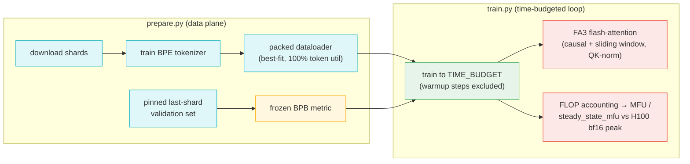

# autoresearch — what it is and how it fits together

## In one paragraph
`autoresearch` is Karpathy's minimal single-GPU GPT-pretraining reference: two small Python files
that train a language model for a **fixed wall-clock time budget** on one H100 and report a single
comparable number — validation **bits-per-byte (BPB)** — alongside a hardware-efficiency readout
(**MFU**). It exists to make optimization experiments *comparable*: the metric is frozen, the
validation set is pinned and excluded from training, and the first warmup/compile steps are excluded
from timing, so any change's effect on quality-per-second is measured cleanly. It is the
methodological model for this wiki's own loop — the same "one number, held-constant harness, measure
the delta" discipline, scaled down to a single accelerator. Everything lives in two concerns:
[`prepare`](concepts/prepare.md) builds the data + tokenizer and the runtime data plane, and
[`train`](concepts/train.md) is the time-budgeted loop that consumes them.

## Core architecture

Node → concept page: [data plane + metric](concepts/prepare.md) · [time-budgeted loop + MFU](concepts/train.md).

## Main concepts

### The time-budgeted training loop
[`train`](concepts/train.md) trains for a fixed **wall-clock budget**, not a step count, and reports
one number (val BPB) plus an MFU readout. The perf-load-bearing surfaces: the **FA3 flash-attention**
kernel (causal + per-layer sliding window, QK-norm), window-aware **FLOP accounting** feeding
measured `mfu` / `steady_state_mfu` against a hard-coded H100 bf16 peak, bf16 mixed precision, and
the deliberate exclusion of the first ~10 compile/warmup steps from both timing and MFU. See
[train](concepts/train.md).

### The data plane and the frozen metric
[`prepare`](concepts/prepare.md) has two lives: a one-time **shard download + BPE tokenizer**
training, and the runtime data plane `train.py` imports — a **best-fit packed dataloader** (100%
token utilization, no padding) with a pinned host buffer + `non_blocking` H2D copy into preallocated
CUDA buffers. Its guardrails are what make experiments comparable: the pinned last-shard validation
set is excluded from both training data and tokenizer statistics, and the byte-normalized **BPB**
metric is frozen. See [prepare](concepts/prepare.md).

## Map of the wiki
- **How is a run scored / what's the harness discipline?** → [train](concepts/train.md) (time budget, BPB, MFU) + [prepare](concepts/prepare.md) (pinned val set, frozen BPB).
- **Where is the attention kernel / MFU accounting?** → [train](concepts/train.md).
- **How is data fed (packing, tokenizer, H2D)?** → [prepare](concepts/prepare.md).
- **What is symbol X — signature, callers?** → the per-module structural index under [`catalog/`](catalog/).
