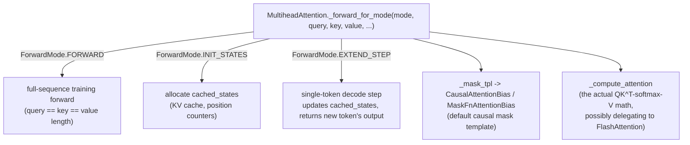

# axlearn.common.attention — MultiheadAttention and the ForwardMode training/decode dispatch

## Overview

[`MultiheadAttention`](../catalog/axlearn/common/attention.md#MultiheadAttention) ("A basic
multi-head attention layer") is AXLearn's central attention implementation, built on
[`BaseLayer`](../catalog/axlearn/common/base_layer.md#BaseLayer) ("Base class for all neural network
layers in AXLearn"). Its single forward method,
[`_forward_for_mode`](../catalog/axlearn/common/attention.md#MultiheadAttention._forward_for_mode)
("Computes attention for the given query, key, value, and attention logit biases"), dispatches on a
[`ForwardMode`](../catalog/axlearn/common/attention.md#ForwardMode) enum ("describes the type of
computation to be done in a forward pass through a layer") — the same layer code handles full-sequence
training, autoregressive-decode initialization, and single-step decode extension, rather than three
separate layer implementations.

## Diagram

## Design rationale (why it's built this way)

**One `_forward_for_mode` method, gated by a `ForwardMode` enum, replaces what would otherwise be
three separate methods (`forward`, `init_states`, `extend_step`) — because training and
autoregressive-decode code paths share almost all of their logic (projections, masking, attention
math) and only differ in cache handling.**
[`ForwardMode`](../catalog/axlearn/common/attention.md#ForwardMode)'s own doc — "describes the type of
computation to be done in a forward pass through a layer" — combined with
`_forward_for_mode` accepting both `cached_states` (for decode) and full `query`/`key`/`value` (for
training) in one signature, confirms this unification is deliberate: a bug fix or feature added to the
shared attention math automatically applies to both training and serving.

**`_mask_tpl` is a *template* (`ClassConfigBase[MaskFnAttentionBias]`), not a fixed mask instance —
every layer instance builds its own mask child via `default_config`/`_add_child`, so mask behavior is
configurable per-layer without subclassing `MultiheadAttention`.**
[`MultiheadAttention._mask_tpl`](../catalog/axlearn/common/attention.md#MultiheadAttention._mask_tpl)
defaults to [`CausalAttentionBias`](../catalog/axlearn/common/attention_bias.md#BaseAttentionBias)-derived
config but is overridable per instantiation.

**Every AXLearn layer is `Configurable` — instantiated from a `Config` object via `instantiate()`, not
constructed with plain `__init__` arguments — so the whole model graph is describable as pure,
serializable config data before any layer object exists.**
[`Configurable.config`](../catalog/axlearn/common/config.md#Configurable.config) (a property) and
[`Configurable.default_config`](../catalog/axlearn/common/config.md#Configurable.default_config)
(a classmethod) are the two halves of this: `default_config()` produces a `Config[C]` describing the
class's defaults, and [`instantiate`](../catalog/axlearn/common/config.md#Configurable.Config.instantiate)
("Instantiates a Configurable object") builds the real object from a (possibly mutated) config.
[`Module._add_child`](../catalog/axlearn/common/module.md#Module._add_child) ("Adds a child module")
is how a parent layer's config-time construction recursively instantiates its own children (like
`MultiheadAttention`'s mask child) — the whole model is a config tree that gets walked once at
construction time.

## Entry points

- [`MultiheadAttention._forward_for_mode`](../catalog/axlearn/common/attention.md#MultiheadAttention._forward_for_mode) —
  the one method every attention call (training or serving) routes through.
- [`Configurable.default_config`](../catalog/axlearn/common/config.md#Configurable.default_config) /
  [`instantiate`](../catalog/axlearn/common/config.md#Configurable.Config.instantiate) — the
  construction entry points every AXLearn layer (not just attention) uses.

## Mechanism (step-by-step)

1. **A `MultiheadAttention` config is built via `default_config()`**, optionally overriding
   `_mask_tpl` or other fields, then `instantiate()`d — recursively instantiating child configs
   (e.g. the mask template) via
   [`Module._add_child`](../catalog/axlearn/common/module.md#Module._add_child).
2. **[`_forward_for_mode`](../catalog/axlearn/common/attention.md#MultiheadAttention._forward_for_mode)
   is called with a `ForwardMode` and query/key/value (or `cached_states` for
   decode).** For `FORWARD`, it computes attention directly; for `INIT_STATES`/`EXTEND_STEP`, it
   additionally manages `cached_states`.
3. **The configured [`_mask_tpl`](../catalog/axlearn/common/attention.md#MultiheadAttention._mask_tpl)
   (default
   [`CausalAttentionBias`](../catalog/axlearn/common/attention_bias.md#BaseAttentionBias)-derived) is
   applied as `attention_logit_biases`**, combined with any explicit bias the caller passes.
4. **The actual attention math runs via
   [`_forward_for_mode`](../catalog/axlearn/common/attention.md#MultiheadAttention._forward_for_mode)'s
   call to `_compute_attention`**, which may itself dispatch to a
   Flash-Attention-backed implementation (see
   [axlearn-common-flash_attention-layer](axlearn-common-flash_attention-layer.md)).

## Key data structures

- **[`ForwardMode`](../catalog/axlearn/common/attention.md#ForwardMode)** — the training/decode-init/
  decode-step discriminator every layer forward call carries.
- **[`MultiheadAttention`](../catalog/axlearn/common/attention.md#MultiheadAttention)** — the layer
  itself; built on [`BaseLayer`](../catalog/axlearn/common/base_layer.md#BaseLayer) /
  [`Module`](../catalog/axlearn/common/module.md#Module).
- **[`BaseAttentionBias`](../catalog/axlearn/common/attention_bias.md#BaseAttentionBias)** — "Base
  class representing attention logit biases"; `_mask_tpl` builds one per layer instance.
- **`Tensor`/`Nested`/`NestedTensor`** (from `axlearn.common.utils`) — `Tensor = jax.Array`;
  `Nested`/`NestedTensor` are the recursive dict-of-arrays types threaded through every layer's
  forward signature.

## Dynamics (design intent)
Not addressable beyond the mode-dispatch design described above from this packet's subgraph.

## Edge cases
None directly visible in this packet's subgraph beyond the `ForwardMode`-gated cache handling.

## Open questions
- The exact set of `ForwardMode` values beyond training/decode-init/decode-step (if any) isn't fully
  enumerated by the symbols in this packet's subgraph.

## See also
- [axlearn-common-attention_bias](axlearn-common-attention_bias.md) — `BaseAttentionBias`/`CausalAttentionBias`,
  the mask representation `_mask_tpl` builds.
- [axlearn-common-flash_attention-layer](axlearn-common-flash_attention-layer.md) — `FlashAttention`,
  a `_compute_attention` implementation this layer can delegate to.
- [axlearn-common-kv_cache-base_kv_cache](axlearn-common-kv_cache-base_kv_cache.md) — `BaseKVCache`,
  the `cached_states` representation used during `ForwardMode.EXTEND_STEP`.
