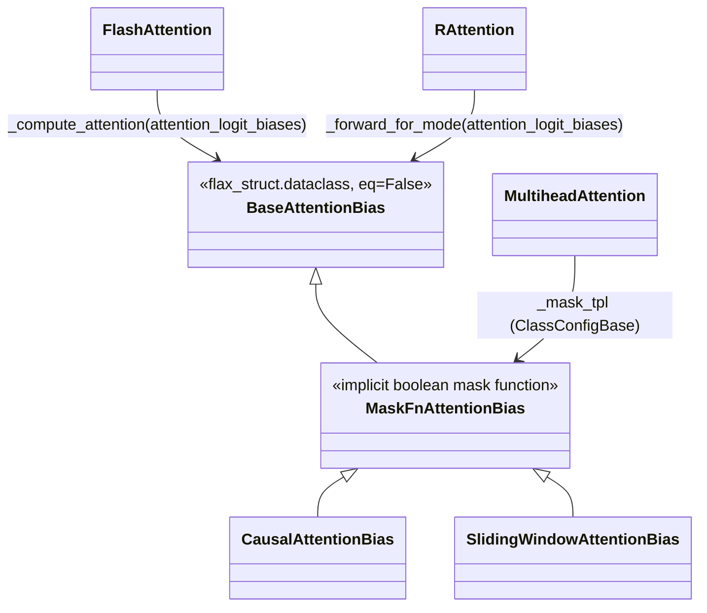

# axlearn.common.attention_bias — BaseAttentionBias, implicit boolean masks, and the causal bias

## Overview

[`BaseAttentionBias`](../catalog/axlearn/common/attention_bias.md#BaseAttentionBias) ("Base class
representing attention logit biases") is the root of AXLearn's attention-masking type hierarchy.
[`MaskFnAttentionBias`](../catalog/axlearn/common/attention_bias.md#MaskFnAttentionBias) ("An
attention bias represented as an implicit boolean mask") is the key intermediate abstraction — masks
are represented as *functions* to be evaluated lazily, not materialized boolean/float arrays — and
[`CausalAttentionBias`](../catalog/axlearn/common/attention_bias.md#CausalAttentionBias) ("A causal
attention mask") is the `@final` concrete subclass every `MultiheadAttention` defaults to (see
[axlearn-common-attention](axlearn-common-attention.md)'s `_mask_tpl`). The same bias types are shared
across attention implementations — Flash Attention's
[`FlashAttention._compute_attention`](../catalog/axlearn/common/flash_attention/layer.md#FlashAttention._compute_attention)
and the ring-attention-derived
[`RAttention._forward_for_mode`](../catalog/axlearn/common/rattention/rattention.md#RAttention._forward_for_mode)
both accept a `BaseAttentionBias`, not a bespoke mask type each.

## Diagram

## Design rationale (why it's built this way)

**`MaskFnAttentionBias` represents a mask as an implicit boolean function, not a materialized
`[query_len, key_len]` array, so backends (Flash Attention's blockwise kernel, in particular) can
evaluate the mask function per-block without ever allocating the full mask.** Its own doc — "An
attention bias represented as an implicit boolean mask" — combined with
[`CausalAttentionBias`](../catalog/axlearn/common/attention_bias.md#CausalAttentionBias) and
`SlidingWindowAttentionBias` both being concrete `MaskFnAttentionBias` subclasses confirms this
lazy-evaluation representation is the norm, not the exception, for structured masks.

**`NEG_INF` is a single shared sentinel float for "masked out," not `-jnp.inf`, presumably to avoid
NaN propagation from `-inf - (-inf)` or similar arithmetic that a literal infinity would risk under
certain reduction/softmax implementations.** Every masking site in the codebase references this one
constant rather than each computing its own large-negative-number convention.

**`BaseAttentionBias` is a `flax_struct.dataclass` with `eq=False`**, meaning bias instances are *not*
compared by value equality — appropriate for a type that may wrap arbitrary (possibly array-valued,
non-hashable-in-the-usual-sense) mask state, where structural equality wouldn't be well-defined or
useful.

**The exact same `BaseAttentionBias`/`_compute_attention` contract is shared between the base
`MultiheadAttention`, `FlashAttention`, and `RAttention` — three independently-implemented attention
backends all accept an identical bias argument type**, confirmed by
[`FlashAttention._compute_attention`](../catalog/axlearn/common/flash_attention/layer.md#FlashAttention._compute_attention)'s
and
[`RAttention._forward_for_mode`](../catalog/axlearn/common/rattention/rattention.md#RAttention._forward_for_mode)'s
identical `attention_logit_biases: Union[None, Tensor, BaseAttentionBias]` signature — this is what
lets a model swap attention backends purely via config, without touching masking code.

## Entry points

- [`CausalAttentionBias`](../catalog/axlearn/common/attention_bias.md#CausalAttentionBias) — the
  default mask every `MultiheadAttention` instantiates via its `_mask_tpl`.
- [`MultiheadAttention._forward_for_mode`](../catalog/axlearn/common/attention.md#MultiheadAttention._forward_for_mode) /
  [`FlashAttention._compute_attention`](../catalog/axlearn/common/flash_attention/layer.md#FlashAttention._compute_attention) /
  [`RAttention._forward_for_mode`](../catalog/axlearn/common/rattention/rattention.md#RAttention._forward_for_mode) —
  the three attention-implementation entry points that all accept a `BaseAttentionBias`.

## Mechanism (step-by-step)

1. **A `MaskFnAttentionBias` subclass (default
   [`CausalAttentionBias`](../catalog/axlearn/common/attention_bias.md#CausalAttentionBias)) is
   instantiated per attention layer** via `MultiheadAttention._mask_tpl`'s `default_config()`.
2. **The bias is passed as `attention_logit_biases` into whichever attention implementation is
   configured** — base
   [`MultiheadAttention._forward_for_mode`](../catalog/axlearn/common/attention.md#MultiheadAttention._forward_for_mode),
   [`FlashAttention._compute_attention`](../catalog/axlearn/common/flash_attention/layer.md#FlashAttention._compute_attention),
   or
   [`RAttention._forward_for_mode`](../catalog/axlearn/common/rattention/rattention.md#RAttention._forward_for_mode) —
   all accepting the
   identical `Union[None, Tensor, BaseAttentionBias]` type.
3. **The implicit mask function is evaluated lazily by whichever backend
   [`FlashAttention._compute_attention`](../catalog/axlearn/common/flash_attention/layer.md#FlashAttention._compute_attention)
   or the base attention path dispatches to**, per-block for
   kernel-based backends (Flash Attention), or materialized once for the base implementation — the
   choice is internal to each backend, invisible to the caller.
4. **Wherever the mask evaluates false (masked position), [`NEG_INF`](../catalog/axlearn/common/attention_bias.md#NEG_INF)
   is added to the attention logits** before the softmax, effectively zeroing that position's
   attention weight.

## Key data structures

- **[`BaseAttentionBias`](../catalog/axlearn/common/attention_bias.md#BaseAttentionBias)** — root
  type; `flax_struct.dataclass(eq=False)`.
- **[`MaskFnAttentionBias`](../catalog/axlearn/common/attention_bias.md#MaskFnAttentionBias)** — the
  implicit-boolean-mask-function representation; base for
  [`CausalAttentionBias`](../catalog/axlearn/common/attention_bias.md#CausalAttentionBias) and
  `SlidingWindowAttentionBias`.
- **[`NEG_INF`](../catalog/axlearn/common/attention_bias.md#NEG_INF)** — the shared masked-logit
  sentinel value.

## Dynamics (design intent)
Not addressable beyond the shared-bias-contract design described above from this packet's subgraph.

## Edge cases
None directly visible in this packet's subgraph.

## Open questions
- The exact numeric value `NEG_INF` is set to (and why that specific magnitude, vs. `-jnp.inf` or
  `jnp.finfo(dtype).min`) isn't resolved by the symbols in this packet's subgraph.

## See also
- [axlearn-common-attention](axlearn-common-attention.md) — `MultiheadAttention`, `_mask_tpl`'s owner.
- [axlearn-common-flash_attention-layer](axlearn-common-flash_attention-layer.md) — `FlashAttention`,
  one of the bias-consuming attention backends.
