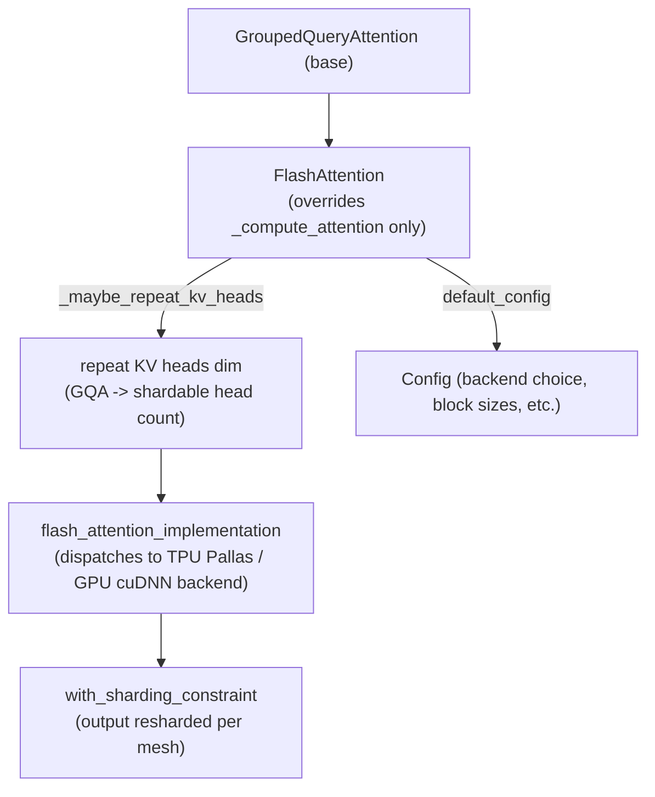

# axlearn.common.flash_attention.layer — FlashAttention, a GroupedQueryAttention with a kernel backend

## Overview

[`FlashAttention`](../catalog/axlearn/common/flash_attention/layer.md#FlashAttention) ("FlashAttention
layer") subclasses `GroupedQueryAttention` (itself presumably a `MultiheadAttention` specialization —
see [axlearn-common-attention](axlearn-common-attention.md)), overriding only
[`_compute_attention`](../catalog/axlearn/common/flash_attention/layer.md#FlashAttention._compute_attention)
("Computes attention context and probs") to route through `flash_attention_implementation` instead of
the plain dense-attention math. This is the concrete integration point between AXLearn's general
attention-layer abstraction and the family of Flash Attention kernel backends checked via
`BaseFlashAttention.is_supported` (see
[axlearn-common-flash_attention-common](axlearn-common-flash_attention-common.md)).

## Diagram

## Design rationale (why it's built this way)

**`FlashAttention` overrides exactly one method (`_compute_attention`) from its base class, inheriting
everything else — Q/K/V projection, masking, `ForwardMode` dispatch — unchanged.** This mirrors the
same "swap the compute, keep everything else" design already seen in
[axlearn-common-attention](axlearn-common-attention.md)'s `_forward_for_mode`/`_compute_attention`
split — `FlashAttention` is precisely what you get from plugging a kernel-backed `_compute_attention`
into that same shared scaffolding.

**KV heads are explicitly repeated to a shardable count before the kernel call
(`_maybe_repeat_kv_heads`), rather than relying on the kernel itself to broadcast fewer KV heads
across more Q heads.** Its own doc — "Repeats key or value heads dim to be shardable" — indicates
Grouped Query Attention's characteristic KV-head-sharing (fewer KV heads than Q heads) can conflict
with the mesh sharding scheme unless the KV head dimension is pre-expanded to match a shardable count;
this is a TPU/mesh-sharding-driven transformation, not a numerical-correctness one (GQA broadcasting is
mathematically well-defined either way).

**The output of the flash-attention kernel call is explicitly resharded (`with_sharding_constraint`)
rather than trusting XLA to infer the correct output sharding**, since custom kernels (Pallas calls in
particular) don't always propagate sharding information as reliably as native XLA ops do.

## Entry points

- [`FlashAttention._compute_attention`](../catalog/axlearn/common/flash_attention/layer.md#FlashAttention._compute_attention) —
  called from the inherited `_forward_for_mode` (see
  [axlearn-common-attention](axlearn-common-attention.md)) in place of the base dense-attention
  implementation.
- [`FlashAttention.default_config`](../catalog/axlearn/common/flash_attention/layer.md#FlashAttention.default_config) —
  the standard construction entry point (per AXLearn's `Configurable` pattern).

## Mechanism (step-by-step)

1. **A `FlashAttention` layer is constructed via
   [`default_config`](../catalog/axlearn/common/flash_attention/layer.md#FlashAttention.default_config)`()`**,
   configuring the backend choice
   and any kernel-specific parameters.
2. **On each forward call, the inherited `_forward_for_mode` calls
   [`_compute_attention`](../catalog/axlearn/common/flash_attention/layer.md#FlashAttention._compute_attention)**
   with the
   projected `q_proj`, a `kv_state`, and the layer's `attention_logit_biases`.
3. **[`_compute_attention`](../catalog/axlearn/common/flash_attention/layer.md#FlashAttention._compute_attention)
   calls
   [`_maybe_repeat_kv_heads`](../catalog/axlearn/common/flash_attention/layer.md#FlashAttention._maybe_repeat_kv_heads)**
   to expand `k_proj`/`v_proj`'s head dimension
   to a shardable count before the kernel call.
4. **`flash_attention_implementation` (called from
   [`_compute_attention`](../catalog/axlearn/common/flash_attention/layer.md#FlashAttention._compute_attention))
   dispatches to the concrete kernel backend** (TPU Pallas or GPU
   cuDNN, selected per `env`/config), computing attention context and probabilities.
5. **The kernel's output is explicitly resharded via `with_sharding_constraint`, inside the same
   [`_compute_attention`](../catalog/axlearn/common/flash_attention/layer.md#FlashAttention._compute_attention)
   call,** before being
   returned.

## Key data structures

- **[`FlashAttention`](../catalog/axlearn/common/flash_attention/layer.md#FlashAttention)** — a
  `GroupedQueryAttention` subclass; its `Config` carries the kernel backend choice and related
  parameters.

## Dynamics (design intent)
Not addressable beyond the single-method-override design described above from this packet's subgraph.

## Edge cases
None directly visible in this packet's subgraph.

## Open questions
- The exact set of backends `flash_attention_implementation` can dispatch to (TPU Pallas vs. GPU
  cuDNN vs. others), and the selection criteria, aren't fully resolved by the symbols in this packet's
  subgraph — see [axlearn-common-flash_attention-common](axlearn-common-flash_attention-common.md)'s
  `is_supported` contract for the capability-negotiation side of this.

## See also
- [axlearn-common-attention](axlearn-common-attention.md) — `MultiheadAttention`/`_forward_for_mode`,
  the scaffolding `FlashAttention` inherits.
- [axlearn-common-flash_attention-common](axlearn-common-flash_attention-common.md) —
  `BaseFlashAttention.is_supported`, the capability check gating which backend `FlashAttention`
  ultimately dispatches to.
- [axlearn-common-attention_bias](axlearn-common-attention_bias.md) — `BaseAttentionBias`, the mask
  type `_compute_attention` accepts.
