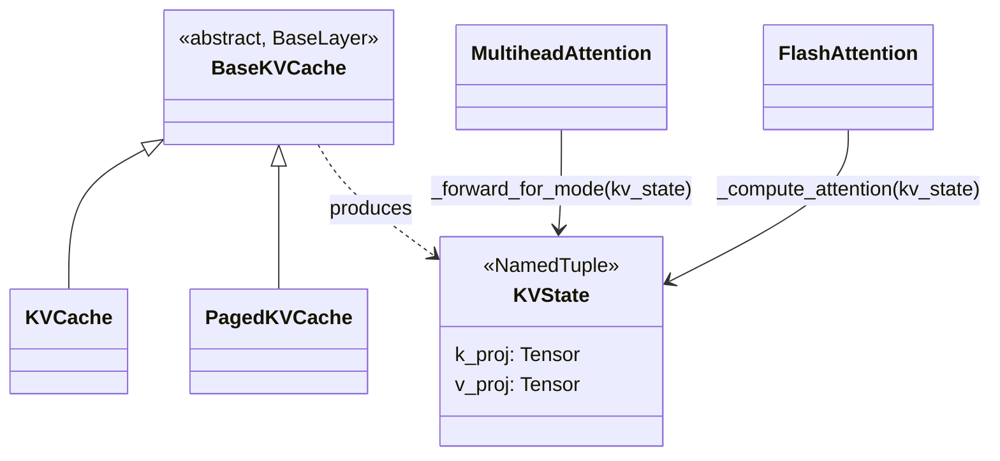

# axlearn.common.kv_cache.base_kv_cache — BaseKVCache and KVState

## Overview

[`BaseKVCache`](../catalog/axlearn/common/kv_cache/base_kv_cache.md#BaseKVCache) ("Abstract base
class for KV cache") is a `BaseLayer` subclass every concrete KV-cache implementation (`KVCache`,
`PagedKVCache`, per the base's own `calls/refs`) extends.
[`KVState`](../catalog/axlearn/common/kv_cache/base_kv_cache.md#KVState) ("Represents key/value
projections") is the plain `NamedTuple` result type every attention layer's
`_forward_for_mode`/`_compute_attention` passes around — both
[`MultiheadAttention._forward_for_mode`](../catalog/axlearn/common/attention.md#MultiheadAttention._forward_for_mode)
and
[`FlashAttention._compute_attention`](../catalog/axlearn/common/flash_attention/layer.md#FlashAttention._compute_attention)
accept a `kv_state: KVState` uniformly, regardless of which concrete cache implementation produced it.

## Diagram

## Design rationale (why it's built this way)

**`KVState` is a plain two-field `NamedTuple` (`k_proj`, `v_proj`), not a richer object carrying cache
bookkeeping (page indices, sequence lengths, etc.) — cache-management state lives on the concrete
`BaseKVCache` subclass, while `KVState` is purely the *result* an attention layer needs to consume.**
This separation is what lets both
[`MultiheadAttention._forward_for_mode`](../catalog/axlearn/common/attention.md#MultiheadAttention._forward_for_mode)
(the base dense-attention path) and
[`FlashAttention._compute_attention`](../catalog/axlearn/common/flash_attention/layer.md#FlashAttention._compute_attention)
(the kernel-backed path) accept the identical `KVState` type regardless of whether the cache behind
it is a plain buffer (`KVCache`) or a paged one (`PagedKVCache`) — the attention math never needs to
know which.

**`BaseKVCache` is a `BaseLayer`, not a plain dataclass, meaning cache state is itself part of the
model's configurable/instantiable layer tree** — consistent with AXLearn's general pattern (see
[axlearn-common-attention](axlearn-common-attention.md)) where every stateful component, including
what might otherwise be considered "just a buffer," is a `Configurable`/`Module`-based layer.

## Entry points

- [`BaseKVCache`](../catalog/axlearn/common/kv_cache/base_kv_cache.md#BaseKVCache) — the abstract base
  every concrete KV-cache implementation extends.
- [`KVState`](../catalog/axlearn/common/kv_cache/base_kv_cache.md#KVState) — the shared result type
  passed into `MultiheadAttention._forward_for_mode`/`FlashAttention._compute_attention`.

## Mechanism (step-by-step)

1. **A concrete [`BaseKVCache`](../catalog/axlearn/common/kv_cache/base_kv_cache.md#BaseKVCache)
   subclass (e.g. `KVCache`/`PagedKVCache`) manages the actual cache
   storage and update logic**, internal to that subclass.
2. **When attention needs to read key/value projections (during `ForwardMode.EXTEND_STEP` decode, or
   equivalently for cross-attention), the cache produces a
   [`KVState`](../catalog/axlearn/common/kv_cache/base_kv_cache.md#KVState)** — a plain
   `(k_proj, v_proj)` pair.
3. **The attention layer's
   [`_forward_for_mode`](../catalog/axlearn/common/attention.md#MultiheadAttention._forward_for_mode)/
   [`_compute_attention`](../catalog/axlearn/common/flash_attention/layer.md#FlashAttention._compute_attention)
   consumes `kv_state` uniformly**,
   regardless of which `BaseKVCache` implementation produced it.

## Key data structures

- **[`BaseKVCache`](../catalog/axlearn/common/kv_cache/base_kv_cache.md#BaseKVCache)** — abstract
  `BaseLayer` subclass.
- **[`KVState`](../catalog/axlearn/common/kv_cache/base_kv_cache.md#KVState)** —
  [`k_proj`](../catalog/axlearn/common/kv_cache/base_kv_cache.md#KVState.k_proj)/
  [`v_proj`](../catalog/axlearn/common/kv_cache/base_kv_cache.md#KVState.v_proj) (both `Tensor`).

## Dynamics (design intent)
Not addressable beyond the cache/state separation described above from this packet's subgraph.

## Edge cases
None directly visible in this packet's subgraph.

## Open questions
- The concrete `KVCache`/`PagedKVCache` implementations' own cache-update mechanics (page allocation,
  eviction, etc.) aren't resolved by the symbols in this packet's subgraph — only the shared
  `BaseKVCache`/`KVState` contract is grounded here.

## See also
- [axlearn-common-attention](axlearn-common-attention.md) — `MultiheadAttention._forward_for_mode`,
  a consumer of `KVState`.
- [axlearn-common-flash_attention-layer](axlearn-common-flash_attention-layer.md) —
  `FlashAttention._compute_attention`, the other `KVState` consumer.
