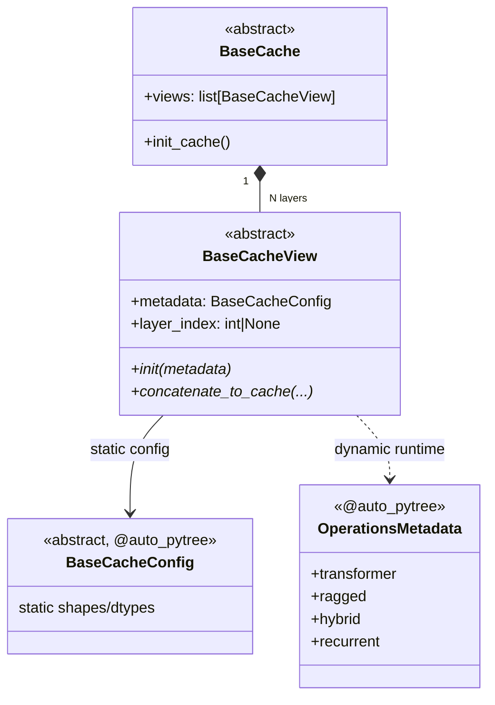

# easydel/caching/_abstracts — the cache/view/config/metadata contract every KV-cache implements

## Overview
This file defines the four abstract shapes that *every* concrete cache in EasyDeL (transformer KV, ragged-paged, hybrid, recurrent/SSM) must fit into, so the attention layer can treat all of them through one interface. The split is deliberate and worth internalizing: a **[`BaseCache`](../catalog/easydel/caching/_abstracts.md#BaseCache)** is the whole-model container (one per model), a **[`BaseCacheView`](../catalog/easydel/caching/_abstracts.md#BaseCacheView)** is one layer's slice of it, a **[`BaseCacheConfig`](../catalog/easydel/caching/_abstracts.md#BaseCacheConfig)** is *static* shape/dtype configuration, and **[`OperationsMetadata`](../catalog/easydel/caching/_abstracts.md#OperationsMetadata)** is the *dynamic* per-forward-pass runtime state (positions, indices). The container/view split lets each layer own an independently-sharded, independently-formatted cache; the config/metadata split cleanly separates what's fixed at build time from what changes every decode step — a distinction that matters because the former can be baked into the compiled graph while the latter must stay a traced input.

## Diagram

## Design rationale (why it's built this way)
- **Container vs. view = per-layer isolation.** [`BaseCacheView`](../catalog/easydel/caching/_abstracts.md#BaseCacheView)'s docstring lists the reasons: "Layer-specific optimization and sharding / Independent cache management per layer / Flexible cache formats for different layer types." A hybrid model can thus put a full KV cache on some layers and an SSM state on others, each with its own memory layout, while [`BaseCache`](../catalog/easydel/caching/_abstracts.md#BaseCache) just holds the list and orchestrates batch operations.
- **Functional updates, not in-place mutation.** The view docstring is explicit: "Methods return new instances, not modify in-place" — required for JAX's functional model. [`concatenate_to_cache`](../catalog/easydel/caching/_abstracts.md#BaseCacheView) returns updated tensors + a new view rather than mutating, so the update is a pure function XLA can trace and the compiler can donate buffers for.
- **Static config is `@auto_pytree`; the view is NOT.** [`BaseCacheConfig`](../catalog/easydel/caching/_abstracts.md#BaseCacheConfig) carries `@auto_pytree` for JAX compatibility, but [`BaseCacheView`](../catalog/easydel/caching/_abstracts.md#BaseCacheView) deliberately does *not* — its docstring notes "concrete implementations need to control their PyTree structure." This is the key subtlety: how a view flattens into leaves (which fields are traced tensors vs static) is implementation-specific, so the base refuses to impose a pytree registration.
- **Two-tier metadata: static config vs. runtime metadata.** `BaseRunTimeMetadata` (and its unified subclass [`OperationsMetadata`](../catalog/easydel/caching/_abstracts.md#OperationsMetadata)) captures "dynamic information that varies during model execution but isn't part of the permanent cache state" — positions, offsets, per-batch indices — kept separate from the fixed [`BaseCacheConfig`](../catalog/easydel/caching/_abstracts.md#BaseCacheConfig) so the static half can specialize the compiled graph.

## Entry points
- [`BaseCacheView.init`](../catalog/easydel/caching/_abstracts.md#BaseCacheView) — the abstract per-layer factory. Concrete views (transformer/ragged/hybrid/recurrent) implement it to allocate their tensors from a [`BaseCacheConfig`](../catalog/easydel/caching/_abstracts.md#BaseCacheConfig): compute shapes, choose sharding, allocate at the right dtype, apply quantization, set initial positions. Control reaches it once per layer at cache-construction time.
- [`BaseCacheView.concatenate_to_cache`](../catalog/easydel/caching/_abstracts.md#BaseCacheView) — the abstract per-step update. Every attention layer's `concatenate` ultimately calls a concrete implementation of this to fold newly-computed K/V (or SSM state) into the cache; its documented return patterns differ by type (`(key, value, mask, new_view)` for transformer, `(new_view,)` for Mamba/paged).
- [`OperationsMetadata`](../catalog/easydel/caching/_abstracts.md#OperationsMetadata) — the single runtime-metadata object attention layers pass around; it composes one of `transformer`/`ragged`/`hybrid`/`recurrent` type-specific metadata (only one populated at a time) so callers don't need to know which concrete cache is underneath.

## Mechanism (step-by-step)
1. **A model builds one [`BaseCache`](../catalog/easydel/caching/_abstracts.md#BaseCache) holding N [`BaseCacheView`](../catalog/easydel/caching/_abstracts.md#BaseCacheView)s** — one per layer. The container is the object users hold; per-layer state lives in the views, each carrying its `metadata` (a [`BaseCacheConfig`](../catalog/easydel/caching/_abstracts.md#BaseCacheConfig)) and its `layer_index`.
2. **Each view allocates via `init`.** [`BaseCacheView.init`](../catalog/easydel/caching/_abstracts.md#BaseCacheView) reads the static [`BaseCacheConfig`](../catalog/easydel/caching/_abstracts.md#BaseCacheConfig) to compute tensor shapes/dtypes and sharding for that specific layer — the config is shared across all views in the hierarchy, so cache geometry is decided in one place.
3. **Every decode step, the layer calls `concatenate_to_cache`** with the newly-computed states plus an [`OperationsMetadata`](../catalog/easydel/caching/_abstracts.md#OperationsMetadata) describing where in the cache to write. The method returns updated tensors and a *new* view (functional), which the layer threads back up through its `AttentionLayerOutput.cache_view`.
4. **Runtime vs static stay separate throughout.** The traced-per-step dynamic data (positions, starts) rides in [`OperationsMetadata`](../catalog/easydel/caching/_abstracts.md#OperationsMetadata) constructed fresh each call (via helpers like `OperationsMetadata.for_transformer(...)`), while the immutable geometry stays in [`BaseCacheConfig`](../catalog/easydel/caching/_abstracts.md#BaseCacheConfig) baked into the view — so recompilation isn't triggered by position changes.

## Key data structures
- [`BaseCache`](../catalog/easydel/caching/_abstracts.md#BaseCache) — multi-layer container; the top-level object.
- [`BaseCacheView`](../catalog/easydel/caching/_abstracts.md#BaseCacheView) — single-layer state + `init`/`concatenate_to_cache` contract; explicitly non-`@auto_pytree`.
- [`BaseCacheConfig`](../catalog/easydel/caching/_abstracts.md#BaseCacheConfig) — static, `@auto_pytree` geometry/dtype config shared across views.
- [`OperationsMetadata`](../catalog/easydel/caching/_abstracts.md#OperationsMetadata) — unified dynamic runtime metadata composing per-type metadata (`transformer`/`ragged`/`hybrid`/`recurrent`), only one populated.

## Dynamics (design intent)
> [!inferred] The composition design of [`OperationsMetadata`](../catalog/easydel/caching/_abstracts.md#OperationsMetadata) ("works with the dynamic operation discovery system", per its docstring) is what lets the attention performer dispatch on cache type at runtime without the layer code branching — the layer holds a single opaque metadata object and the operation executor inspects which sub-field is populated.

## Edge cases
- **`layer_index` may be `None`** for cache types "that don't have layer structure" — code walking views must tolerate a missing index.
- **Exactly one of the `OperationsMetadata` sub-fields is valid at a time**; populating two (or reading the wrong one) is a silent correctness bug the type system doesn't catch.
- A view that forgets to return a *new* instance (mutating in place) breaks JAX tracing — the abstract docstring calls this out precisely because it's the easy mistake.

## Open questions
> [!inferred] The concrete PyTree registration each view chooses (which fields are leaves) is left to subclasses and isn't visible from this abstract file; see the per-cache concept pages for how transformer vs ragged-paged views actually lay out their tensors.

## See also
- [easydel/caching/transformer/cache](easydel-caching-transformer-cache.md) — the dense contiguous KV implementation.
- [easydel/caching/ragged_page/cache](easydel-caching-ragged_page-cache.md) — the paged implementation.
- [easydel/caching/hybrid/cache](easydel-caching-hybrid-cache.md) — mixed attention/SSM per-layer caches.
- [easydel/layers/attention/_unified](easydel-layers-attention-_unified.md) — the consumer that calls `concatenate_to_cache`.

## Sources
- raw/code/EasyDeL/easydel/caching/_abstracts.py
