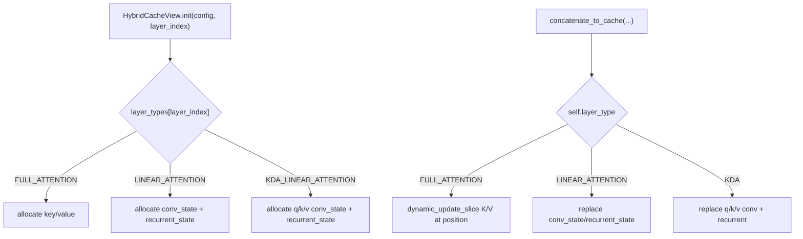

# easydel/caching/hybrid/cache — one cache, different state per layer (KV vs conv+recurrent)

## Overview
Hybrid architectures (e.g. Gemma-style interleaved attention, Mamba/attention stacks, Kimi Linear) mix *attention* layers and *linear-attention/SSM* layers in the same model — and those two layer kinds need fundamentally different cached state: attention needs a K/V buffer, while a linear-attention layer needs a convolution state plus a recurrent state. `HybridCacheView` is the key idea here: a *single* view type that carries fields for **both** kinds, allocates only the ones its layer needs (the rest stay `None`), and branches its update on a per-layer `layer_type` string (its per-layer allocator is [`HybridCacheView.init`](../catalog/easydel/caching/hybrid/cache.md#HybridCacheView.init)). [`HybridCache`](../catalog/easydel/caching/hybrid/cache.md#HybridCache) is the container of these mixed views. This "union view" avoids needing the model's cache list to hold heterogeneous view classes — every layer's slot is a `HybridCacheView`, just populated differently.

## Diagram

## Design rationale (why it's built this way)
- **One view class, `None`-typed optional fields.** `HybridCacheView` (allocated by [`HybridCacheView.init`](../catalog/easydel/caching/hybrid/cache.md#HybridCacheView.init)) declares `key`/`value` *and* `conv_state`/`recurrent_state` *and* `q_conv_state`/`k_conv_state`/`v_conv_state`, all `... | None`. Its docstring: "The view stores only the state type needed for its layer type, with the other fields set to None." Keeping them in one class means [`HybridCache.views`](../catalog/easydel/caching/hybrid/cache.md#HybridCache.views) is a homogeneous list — the model doesn't juggle a `TransformerCacheView` here and a `RecurrentCacheView` there.
- **`layer_type` is the dispatch key, resolved from config at init.** [`HybridCacheView.init`](../catalog/easydel/caching/hybrid/cache.md#HybridCacheView.init) reads `metadata.layer_types[layer_index]` to decide which tensors to allocate; [`concatenate_to_cache`](../catalog/easydel/caching/hybrid/cache.md#HybridCacheView.concatenate_to_cache) reads `self.layer_type` to decide which update branch to run. Because `layer_type` is `pytree_node=False`, the branch is resolved at trace time — each layer compiles to only its own update path, no runtime dispatch cost.
- **The attention branch reuses the contiguous-cache trick.** For `FULL_ATTENTION`, the update is a plain `lax.dynamic_update_slice(key, key_states, (0, position, 0, 0))` — the same in-place-functional write as the standalone [`TransformerCacheView`](../catalog/easydel/caching/transformer/cache.md#TransformerCacheView), just inlined so the hybrid view doesn't depend on the transformer module. (Note: this branch assumes a scalar cache position shared across the batch — see edge cases.)
- **A parallel variant exists for a different layout.** `ParallelHybridCacheView` (in the same file) is a sibling `@auto_pytree(frozen=False)` implementation for a parallel-layout hybrid; the base `HybridCacheView` (allocated via [`HybridCacheView.init`](../catalog/easydel/caching/hybrid/cache.md#HybridCacheView.init)) is the general-purpose one.

## Entry points
- [`HybridCacheView.init`](../catalog/easydel/caching/hybrid/cache.md#HybridCacheView.init) — per-layer allocation; picks KV vs conv+recurrent vs KDA-separate-conv tensors based on `layer_types[layer_index]`, defaulting to `FULL_ATTENTION`.
- [`HybridCacheView.concatenate_to_cache`](../catalog/easydel/caching/hybrid/cache.md#HybridCacheView.concatenate_to_cache) — the unified per-step update accepting *all* possible state kinds as optional args and using only the ones its `layer_type` needs; returns `(key_cache, value_cache, updated_view)` where the K/V are `None` for non-attention layers.
- [`HybridCache.init_cache`](../catalog/easydel/caching/hybrid/cache.md#HybridCache) — builds the container; its [`views`](../catalog/easydel/caching/hybrid/cache.md#HybridCache.views) list is one `HybridCacheView` per layer, each pre-typed by the model's `layer_types`.

## Mechanism (step-by-step)
1. **Init resolves the layer's kind.** [`HybridCacheView.init`](../catalog/easydel/caching/hybrid/cache.md#HybridCacheView.init) looks up `metadata.layer_types[layer_index]`; a `FULL_ATTENTION` layer allocates `key`/`value`, a `LINEAR_ATTENTION` layer allocates `conv_state`+`recurrent_state`, and a `KDA_LINEAR_ATTENTION` (Kimi) layer allocates separate `q_conv_state`/`k_conv_state`/`v_conv_state`+`recurrent_state`. Unused fields stay `None`.
2. **Update branches on `self.layer_type`.** [`concatenate_to_cache`](../catalog/easydel/caching/hybrid/cache.md#HybridCacheView.concatenate_to_cache) for `FULL_ATTENTION` writes `key_states`/`value_states` at `cache_position` via `dynamic_update_slice`, advances `positions += seq_len`, and returns the updated K/V plus a new view. For `LINEAR_ATTENTION` it swaps in the new `conv_state`/`recurrent_state` (returning `None` for K/V), and for KDA it swaps the per-Q/K/V conv states plus recurrent state.
3. **Early-out when inputs are missing.** If a `FULL_ATTENTION` layer's [`concatenate_to_cache`](../catalog/easydel/caching/hybrid/cache.md#HybridCacheView.concatenate_to_cache) is called with `key_states`/`value_states` both `None`, it returns its existing `(self.key, self.value, self)` unchanged — a no-op guard for steps where a given layer isn't updated.
4. **Functional replace throughout.** Every branch of [`concatenate_to_cache`](../catalog/easydel/caching/hybrid/cache.md#HybridCacheView.concatenate_to_cache) returns `self.replace(...)` with a fresh position/state, satisfying the `BaseCacheView` "new instances, not in-place" rule.

## Key data structures
- `HybridCacheView` — the union view: `key`/`value` (attention), `conv_state`/`recurrent_state` (linear), `q/k/v_conv_state` (KDA), plus `positions`, `layer_index`, and the static `layer_type` (allocated by [`HybridCacheView.init`](../catalog/easydel/caching/hybrid/cache.md#HybridCacheView.init)).
- [`HybridCache.views`](../catalog/easydel/caching/hybrid/cache.md#HybridCache.views) — the homogeneous per-layer view list.
- `HybridCacheConfig.layer_types` — the per-layer kind array that drives all the branching (static).

## Dynamics (design intent)
> [!inferred] Because `layer_type` is static (`pytree_node=False`), the whole model's per-layer update pattern is fixed at compile time: the interleave of attention and SSM layers becomes a fixed sequence of specialized `concatenate_to_cache` bodies, so a hybrid model compiles to one graph with no data-dependent cache dispatch.

## Edge cases
- **Scalar cache position assumption.** The `FULL_ATTENTION` branch uses `int(cache_position[0])` for the whole batch — its own comment says "assume cache_position is a scalar for all batches," so ragged per-sequence positions are not handled here the way [`TransformerCacheView`](../catalog/easydel/caching/transformer/cache.md#TransformerCacheView)'s per-batch `vmap` handles them.
- **Mask-KV-dim mismatch when embedding a `TransformerCacheView`.** The transformer cache explicitly expands its mask when used inside a hybrid cache (shorter mask than full KV) — the two modules are aware of each other for this interop.
- **Field ordering constraint.** The dataclass forces no-default fields (`positions`, `metadata`) before the defaulted KDA conv-state fields — a subtlety `@auto_pytree` inherits from dataclass semantics.

## Open questions
> [!inferred] `HybridMetadata`, `HybridCacheConfig.create`, and `ParallelHybridCacheView`'s distinct layout are in this file but not in this packet's citation subgraph; the exact SSM recurrent-state update math lives in the linear-attention layers, not here.

## See also
- [easydel/caching/_abstracts](easydel-caching-_abstracts.md) — the base contract.
- [easydel/caching/transformer/cache](easydel-caching-transformer-cache.md) — the attention branch's standalone twin.
- [easydel/layers/attention/_unified](easydel-layers-attention-_unified.md) — attention layers whose cache view may be hybrid.

## Sources
- raw/code/EasyDeL/easydel/caching/hybrid/cache.py
