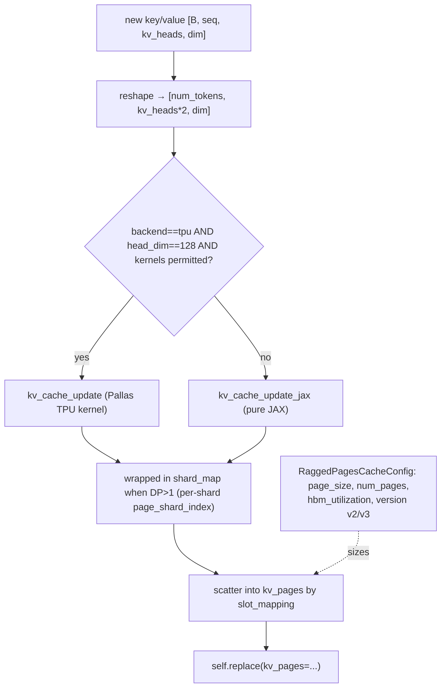

# easydel/caching/ragged_page/cache — paged KV cache with a TPU Pallas update kernel

<!-- connect:up:begin -->
> **Cross-repo concept:** part of [kv-cache](../../../concepts/kv-cache.md), [pallas-kernel](../../../concepts/pallas-kernel.md) across this wiki's repos.
<!-- connect:up:end -->
## Overview
This is the high-throughput serving cache: instead of one contiguous `[batch, seq, ...]` buffer per sequence, KV storage is divided into fixed-size **pages** (`page_size=128` tokens by default) drawn from a shared pool, so variable-length concurrent requests pack into memory without per-sequence over-allocation (the vLLM PagedAttention idea, ported to JAX/TPU). [`RaggedPagesCacheConfig`](../catalog/easydel/caching/ragged_page/cache.md#RaggedPagesCacheConfig) sizes the page pool from an HBM-utilization target; [`RaggedPagesCacheView`](../catalog/easydel/caching/ragged_page/cache.md#RaggedPagesCacheView) holds one layer's `kv_pages` tensor; and [`concatenate_to_cache`](../catalog/easydel/caching/ragged_page/cache.md#RaggedPagesCacheView) scatters new tokens into their pages via a **slot mapping**, using a TPU-optimized Pallas kernel (`kv_cache_update`) when eligible and a pure-JAX fallback otherwise. The whole thing exists to serve many sequences at once, which is why the update path is shard-map aware and DP-aware.

## Diagram

## Design rationale (why it's built this way)
- **Pages decouple physical storage from logical sequences.** The config docstring: "The paged cache divides KV storage into fixed-size pages that can be allocated and deallocated independently, enabling efficient memory management for variable-length sequences." `num_pages` is computed from an `hbm_utilization` target (default 0.9) rather than from a per-sequence max length — the cache fills HBM to a budget and hands out pages on demand.
- **Kernel eligibility is a runtime gate, not an assumption.** In [`concatenate_to_cache`](../catalog/easydel/caching/ragged_page/cache.md#RaggedPagesCacheView), `use_kernel = jax.default_backend() == "tpu" and PERMITTED_KV_KERNELS`, and it *drops* to JAX (`use_kernel=False`) when `head_size != 128` — the Pallas `kv_cache_update` kernel is specialized for 128-dim heads. This is a deliberate "fast path when the shape fits, correct path always" split rather than a hard kernel dependency.
- **Data-parallel page sharding needs per-shard slot localization.** When `data_parallel_size > 1`, the update is forced through `shard_map` so each shard can compute its own `page_shard_index` via `jax.lax.axis_index` (folding multiple DP axes into one flat index). Pages are sharded on the DP axis; without per-shard index derivation, every shard would write to the same global page index — the code comment states exactly this ("DP-sharded page buffers require per-shard slot localization").
- **Almost every config field is `pytree_node=False`.** `page_size`, `num_pages`, `version`, dims — all static so they specialize the compiled graph; only the actual page tensor is a traced leaf. Two format versions (`v2`, `v3`) coexist behind `metadata.is_v2` so the update path can evolve without breaking checkpoints.

## Entry points
- [`RaggedPagesCacheConfig`](../catalog/easydel/caching/ragged_page/cache.md#RaggedPagesCacheConfig) (`.create(...)`) — computes the page-pool geometry (`num_pages`, `max_num_pages_per_req`, slice counts) from model dims + `hbm_utilization` + mesh info; the static plan every view allocates against.
- [`RaggedPagesCacheView.init`](../catalog/easydel/caching/ragged_page/cache.md#RaggedPagesCacheView) — allocates one layer's `kv_pages` as a zeros tensor of `config.get_shape_and_axes()` shape, resolves its sharding through the partition manager, and runs it through the quantizer — all inside `@jax.named_scope("easydel-paged-attention-cache-init")`.
- [`RaggedPagesCache.init_cache`](../catalog/easydel/caching/ragged_page/cache.md#RaggedPagesCache) — builds the model-level container of per-layer views (the shared page pool spans layers).
- [`concatenate_to_cache`](../catalog/easydel/caching/ragged_page/cache.md#RaggedPagesCacheView) — the per-step scatter-write; returns an updated view.

## Mechanism (step-by-step)
1. **Flatten batch×seq into a token list.** [`concatenate_to_cache`](../catalog/easydel/caching/ragged_page/cache.md#RaggedPagesCacheView) unwraps the [`RaggedPagesMetadata`](../catalog/easydel/caching/ragged_page/cache.md#RaggedPagesMetadata), then (for v2) reshapes K and V to `[num_tokens, num_kv_heads, head_size]` and stacks them into a single `[num_tokens, num_kv_heads*2, head_size]` tensor — K and V share the page layout, halving the number of scatter ops.
2. **Pick kernel vs JAX, and shard_map vs not.** From the unwrapped [`RaggedPagesMetadata`](../catalog/easydel/caching/ragged_page/cache.md#RaggedPagesMetadata), it computes `use_kernel`/`use_shardmap` from backend, `head_size==128`, `PERMITTED_KV_KERNELS`, and `data_parallel_size`. The inner `_update_fn` calls either the Pallas `kv_cache_update` or `kv_cache_update_jax`, both taking `slots`, `pages`, `num_update_slices`, `page_size` — the slot mapping is what routes each token to its physical page/offset.
3. **Localize the page index per DP shard.** Inside [`RaggedPagesCacheView`](../catalog/easydel/caching/ragged_page/cache.md#RaggedPagesCacheView)'s `_update_fn`, when DP>1 the shard's `page_shard_index` is derived by folding `jax.lax.axis_index` over the DP axes; the function is wrapped with `jax.shard_map` whose `in_specs`/`out_specs` shard the page buffer on the DP axis and the head axis. This is what lets a DP-replicated serving deployment maintain a correctly-partitioned shared page pool.
4. **Scatter and return a new view.** `_update_fn(kvs, slot_mapping, self.kv_pages, num_kv_update_slices)` writes the tokens into `kv_pages`, and [`RaggedPagesCacheView`](../catalog/easydel/caching/ragged_page/cache.md#RaggedPagesCacheView) returns `self.replace(kv_pages=...)` — functional per the `BaseCacheView` contract. (For non-v2, the method is a no-op returning `self`, i.e. writes happen elsewhere in v3.)

## Key data structures
- [`RaggedPagesCacheView`](../catalog/easydel/caching/ragged_page/cache.md#RaggedPagesCacheView) — one layer's `kv_pages` of shape `(num_pages, page_size, kv_groups, packing, head_dim)`, possibly an `ImplicitArray` when quantized; carries its own `partition_manager`.
- [`RaggedPagesCacheConfig`](../catalog/easydel/caching/ragged_page/cache.md#RaggedPagesCacheConfig) — the static page plan: `page_size`, `num_pages` (computed), `hbm_utilization`, `kv_head_shards`, `version`, window-aware sizing fields.
- [`RaggedPagesMetadata`](../catalog/easydel/caching/ragged_page/cache.md#RaggedPagesMetadata) — the dynamic per-step routing info: `slot_mapping`, `num_kv_update_slices`, `page_size` — created via `create_empty` and populated per batch.

## Dynamics (design intent)
- The Pallas kernel path and the JAX path produce the same page layout; the kernel is purely a TPU throughput optimization for the 128-dim-head common case. A serving deployment on a non-TPU backend, or with an unusual head dim, degrades gracefully to `kv_cache_update_jax` with no correctness change.
- Sharding the page pool on the DP axis (rather than replicating) means each DP shard holds a slice of pages and serves its own requests — the `page_shard_index` arithmetic is the glue that keeps global slot indices consistent across shards.

## Edge cases
- **`head_size != 128`** forces `use_kernel=False` but keeps `use_shardmap` — the JAX update still runs under shard_map when DP>1.
- **`data_parallel_size > 1`** always forces shard_map even if the kernel would otherwise run un-sharded, to get per-shard page localization.
- **v3 format**: `concatenate_to_cache` returns `self` unchanged for non-v2, meaning the write path differs entirely between versions — a reader must check `metadata.is_v2` before assuming this method mutates the cache.

## Open questions
> [!inferred] The Pallas `kv_cache_update` kernel body, `RaggedPagesCacheConfig.create`'s exact `num_pages` derivation from `hbm_utilization`, and how v3 performs its writes are outside this packet's citation subgraph; this page documents the view-level dispatch and DP logic.

## See also
- [easydel/caching/_abstracts](easydel-caching-_abstracts.md) — the base contract.
- [easydel/caching/transformer/cache](easydel-caching-transformer-cache.md) — the contiguous (training/simple-decode) alternative.
- [easydel/layers/attention/_unified](easydel-layers-attention-_unified.md) — consumes `RaggedPagesCacheView` via its cache-view union.

## Sources
- raw/code/EasyDeL/easydel/caching/ragged_page/cache.py
