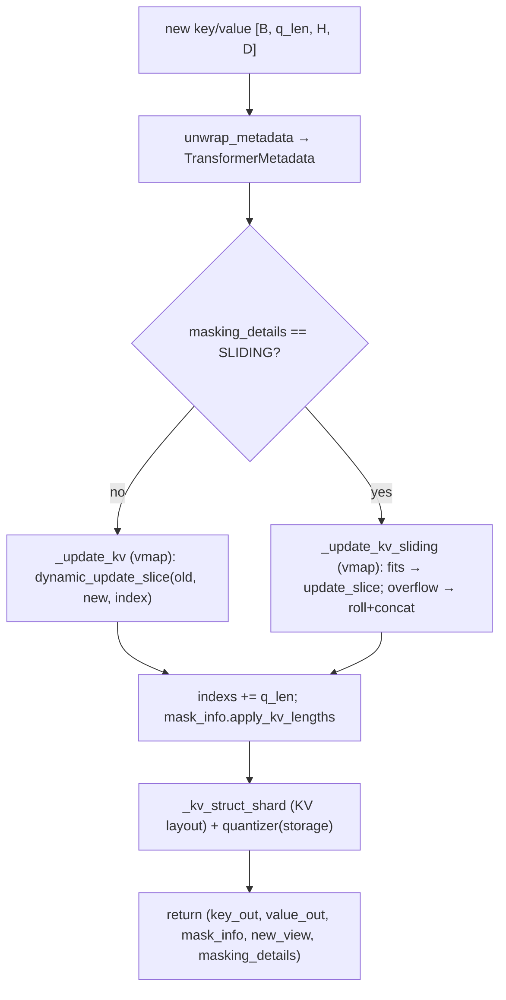

# easydel/caching/transformer/cache — the dense contiguous KV cache with a sliding-window fast path

<!-- connect:up:begin -->
> **Cross-repo concept:** part of [kv-cache](../../../concepts/kv-cache.md) across this wiki's repos.
<!-- connect:up:end -->
## Overview
This is the "standard" KV cache: a pre-allocated `[batch, seq, heads, dim]` tensor per layer whose new keys/values are written in-place-functionally at a per-sequence write index via `lax.dynamic_update_slice`. [`TransformerCache`](../catalog/easydel/caching/transformer/cache.md#TransformerCache) is the model-level container of per-layer [`TransformerCacheView`](../catalog/easydel/caching/transformer/cache.md#TransformerCacheView)s (implementing the `BaseCache`/`BaseCacheView` contract), and the single interesting method is [`concatenate_to_cache`](../catalog/easydel/caching/transformer/cache.md#TransformerCacheView.concatenate_to_cache), which handles the ordinary "append at index" path and a distinct sliding-window path that rolls the buffer when the window overflows. The design keeps the *storage* dtype fixed (possibly quantized) while returning K/V in the *runtime* dtype for the attention math — a separation that lets you cache in int8 but compute in bf16.

## Diagram

## Design rationale (why it's built this way)
- **Storage dtype ≠ runtime dtype.** [`concatenate_to_cache`](../catalog/easydel/caching/transformer/cache.md#TransformerCacheView.concatenate_to_cache) writes `quantizer(key_cache_storage)` into the new view but returns `key_cache_out = key_cache_storage.astype(runtime_dtype)` for the attention kernel. The comment states it plainly: "Keep the cache storage dtype stable ... while returning KV in runtime dtype for the attention computation." This is what makes KV quantization (via an `EasyQuantizer`, passed into both `init` and the update) transparent to the attention math.
- **Per-sequence write index via `vmap`.** The update closures `_update_kv` / `_update_kv_sliding` are `jax.vmap`'d over the batch axis, each using its own scalar `slot`/`current_index`. This means different sequences in a batch can be at different cache positions (ragged prefill lengths) without a Python loop — the index is a traced per-batch int array (`self.indexs`).
- **Sliding window is a separate closure, not a flag inside the append.** When `masking_details.mask_type == AttnMaskType.SLIDING`, the cache tensor is allocated to `min(window_size, seq)` (see `init`), and `_update_kv_sliding` chooses at trace time between three cases: new chunk larger than window (keep the tail), fits in the remaining window (`dynamic_update_slice`), or overflows (`lax.cond` → drop the oldest `new_len` rows and concatenate). Encoding the roll as a `lax.cond` keeps it inside one compiled function rather than needing host control.
- **`@auto_pytree(frozen=False)` on the view, functional `.replace`.** The view is a mutable-registered pytree but updates go through `self.replace(key=..., value=..., indexs=...)`, returning a new instance — honoring the `BaseCacheView` "return new instances" rule while keeping the pytree flatten cheap.

## Entry points
- [`TransformerCache.init_cache`](../catalog/easydel/caching/transformer/cache.md#TransformerCache.init_empty) / [`init_empty`](../catalog/easydel/caching/transformer/cache.md#TransformerCache.init_empty) — build the whole-model container; `init_empty` produces the placeholder (all-`None`) cache before the first write. The container's [`views`](../catalog/easydel/caching/transformer/cache.md#TransformerCache.views) list holds one [`TransformerCacheView`](../catalog/easydel/caching/transformer/cache.md#TransformerCacheView) per layer.
- [`TransformerCacheView.init`](../catalog/easydel/caching/transformer/cache.md#TransformerCacheView) — allocates one layer's K/V tensors from a `TransformerCacheConfig` (shapes `[batch, seq, key_heads, key_dim]`), shrinking the sequence axis to the sliding-window size when `masking_details` is SLIDING, wrapping the whole allocation in a `@jax.named_scope("easydel-transformer-cacheview-init")` so allocation shows up in traces.
- [`concatenate_to_cache`](../catalog/easydel/caching/transformer/cache.md#TransformerCacheView.concatenate_to_cache) — the per-step update the attention layer calls; returns the 5-tuple `(key_out, value_out, mask_info, new_view, masking_details)`.

## Mechanism (step-by-step)
1. **Unwrap metadata + expand the mask if needed.** [`concatenate_to_cache`](../catalog/easydel/caching/transformer/cache.md#TransformerCacheView.concatenate_to_cache) first calls `unwrap_metadata(cache_metadata, "transformer")` to pull a [`TransformerMetadata`](../catalog/easydel/caching/transformer/cache.md#TransformerMetadata) out of a possibly-composite [`OperationsMetadata`](../catalog/easydel/caching/_abstracts.md#OperationsMetadata). If the incoming mask's KV length is shorter than the cache (which happens when a [`TransformerCacheView`](../catalog/easydel/caching/transformer/cache.md#TransformerCacheView) is used inside a [`HybridCache`](../catalog/easydel/caching/hybrid/cache.md#HybridCache)), it expands the mask's KV dimension to the cache size.
2. **Choose the update closure by mask type.** Within [`concatenate_to_cache`](../catalog/easydel/caching/transformer/cache.md#TransformerCacheView.concatenate_to_cache), for SLIDING it runs `_update_kv_sliding`; otherwise `_update_kv`. Both are `vmap`'d over batch, each writing `new` at the sequence's own `slot`/`current_index` with `lax.dynamic_update_slice`. The sliding variant additionally handles window overflow by rolling.
3. **Advance indices and re-derive the mask.** [`concatenate_to_cache`](../catalog/easydel/caching/transformer/cache.md#TransformerCacheView.concatenate_to_cache) sets `indexs = indexs + num_updated_cache_vectors`, then `mask_info.apply_kv_lengths(...)` recomputes valid-position bookkeeping (passing `sliding_window` only on the SLIDING path so the mask knows the window bound).
4. **Shard, quantize storage, return dual-dtype tensors.** [`concatenate_to_cache`](../catalog/easydel/caching/transformer/cache.md#TransformerCacheView.concatenate_to_cache) lays out the updated K/V with `_kv_struct_shard` (KV_LENGTH/KV_HEAD axes), passes the *storage* copies through the `quantizer` into `self.replace(...)`, and casts the *returned* copies to `runtime_dtype`. The updated per-batch `indexs` is itself re-sharded on the batch axis. The method returns key/value in runtime dtype, the updated `mask_info`, the new view, and the `masking_details`.

## Key data structures
- [`TransformerCacheView`](../catalog/easydel/caching/transformer/cache.md#TransformerCacheView) — one layer: `key`, `value` (storage-dtype tensors), `indexs` (per-batch write position), `masking_details`, `layer_index`; `is_empty` ⇔ `key is None`.
- [`TransformerCache.views`](../catalog/easydel/caching/transformer/cache.md#TransformerCache.views) — the per-layer view list.
- [`TransformerMetadata`](../catalog/easydel/caching/transformer/cache.md#TransformerMetadata) — the dynamic runtime metadata (starts/positions) unwrapped from [`OperationsMetadata`](../catalog/easydel/caching/_abstracts.md#OperationsMetadata) each step.

## Dynamics (design intent)
- The per-batch `indexs` array is what makes this cache handle ragged batch positions: sequences prefilled to different lengths simply carry different scalar slots into the `vmap`'d `dynamic_update_slice`, so one compiled `concatenate_to_cache` serves any mix of positions.
- Because storage stays in its allocation dtype and only the *returned* tensors are upcast, a quantized cache never round-trips through a wide dtype in HBM — the upcast happens on the read path feeding attention.

## Edge cases
- **New chunk ≥ window** in the sliding path returns just the last `window_size` rows — a prefill longer than the window discards the earlier keys by construction.
- **Mask KV-len < cache KV-len** (hybrid embedding) triggers `_expand_mask_kv_dim`; without it the mask and cache would be misaligned.
- **First step**: `init_empty` gives an all-`None` cache (`is_empty` true); the first `concatenate_to_cache` materializes it via `_maybe_materialize(self.key)`.

## Open questions
> [!inferred] `TransformerCacheConfig.create` and the exact `MaskInfo.apply_kv_lengths` bookkeeping are adjacent but outside this packet's citation subgraph; this page documents the cache-update mechanics, not the mask algebra.

## See also
- [easydel/caching/_abstracts](easydel-caching-_abstracts.md) — the `BaseCache`/`BaseCacheView` contract this implements.
- [easydel/caching/ragged_page/cache](easydel-caching-ragged_page-cache.md) — the paged alternative for high-throughput serving.
- [easydel/caching/hybrid/cache](easydel-caching-hybrid-cache.md) — mixes this view with SSM views per layer.
- [easydel/layers/attention/_unified](easydel-layers-attention-_unified.md) — the caller.

## Sources
- raw/code/EasyDeL/easydel/caching/transformer/cache.py
