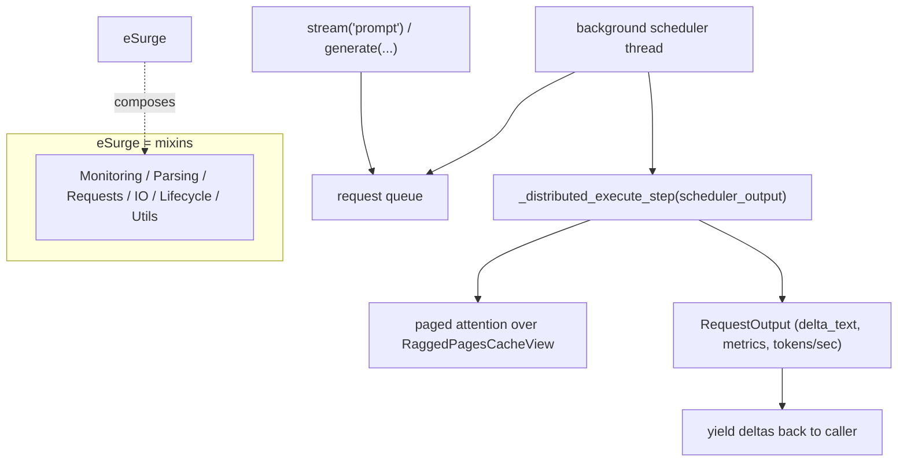

# easydel/inference/esurge/esurge_engine — the continuous-batching serving engine front door

<!-- connect:up:begin -->
> **Cross-repo concept:** part of [continuous-batching](../../../concepts/continuous-batching.md) across this wiki's repos.
<!-- connect:up:end -->
## Overview
[`eSurge`](../catalog/easydel/inference/esurge/esurge_engine.md#eSurge) is EasyDeL's high-throughput serving engine — the JAX/TPU analogue of vLLM's engine. Its whole reason to exist is *continuous batching*: a background scheduler thread pulls requests off a queue and keeps the accelerator busy by mixing prefill and decode work across many concurrent requests, backed by the paged KV cache ([`RaggedPagesCacheView`](../catalog/easydel/caching/ragged_page/cache.md)). The class itself is thin — it composes six mixins (monitoring, parsing, requests, IO, lifecycle, utils) that carry the actual behavior — and exposes a simple surface (`initiate()`, `stream()`, `generate()`) returning [`RequestOutput`](../catalog/easydel/inference/esurge/esurge_engine.md#RequestOutput) objects rich with throughput metrics (TTFT, tokens/sec). The design idea: keep the *engine* a small orchestrator over mixins and a background scheduler, so the serving concerns (streaming, monitoring, distributed execution) are separable.

## Diagram

## Design rationale (why it's built this way)
- **Engine = orchestrator over mixins.** [`eSurge`](../catalog/easydel/inference/esurge/esurge_engine.md#eSurge) inherits `EngineMonitoringMixin`, `EngineParsingMixin`, `EngineRequestsMixin`, `EngineIOMixin`, `EngineLifecycleMixin`, `EngineUtilsMixin` — the serving concerns are each a mixin, so the engine class stays a small composition rather than a monolith. Lifecycle (start/stop the scheduler), IO (tokenize/detokenize), requests (queue management), monitoring (Prometheus/console), parsing (tool/reasoning parsers) are independently maintainable.
- **Background scheduler for continuous batching.** The docstring: "runs a background scheduler thread that continuously processes requests from the queue, enabling high throughput and low latency." This is the core throughput mechanism — the accelerator never waits for a full static batch; it processes whatever's ready, mixing prefill and decode. `_distributed_execute_step` is the per-scheduler-tick execution.
- **Rich per-request metrics as first-class output.** [`RequestOutput`](../catalog/easydel/inference/esurge/esurge_engine.md#RequestOutput) carries `tokens_per_second`, `first_token_time` (TTFT), `time_spent_generating`, `processing_time`, plus `delta_text`/`accumulated_text` and `update_seq`/`delta_seq` for streaming — serving performance is measured, not inferred. The two sequence counters let a streaming client distinguish "any update" from "new text."
- **Distributed-config fingerprint for cache scoping.** [`_distributed_config_fingerprint`](../catalog/easydel/inference/esurge/esurge_engine.md#eSurge._distributed_config_fingerprint) (via `make_config_fingerprint`) keys the distributed setup so compiled/cached artifacts are scoped to a specific distributed configuration — changing the parallelism invalidates the cache rather than silently reusing an incompatible one.
- **Context management + truncation built in.** The engine auto-manages context length with `reserve_tokens` for generation and configurable truncation — so a prompt that would overflow the model length is handled by the engine, not the caller.

## Entry points
- [`eSurge`](../catalog/easydel/inference/esurge/esurge_engine.md#eSurge) (`__init__` + `initiate()`) — construct with model + `max_model_len` + `reserve_tokens`, then start the scheduler; the front door for serving.
- `stream(prompt)` / `generate(...)` — the generation surface (from the request/IO mixins) yielding [`RequestOutput`](../catalog/easydel/inference/esurge/esurge_engine.md#RequestOutput) with `delta_text` for streaming.
- [`RequestOutput`](../catalog/easydel/inference/esurge/esurge_engine.md#RequestOutput) — the per-request result carrying generated text + throughput metrics; consumed by the caller and the monitoring layer.
- [`__repr__`](../catalog/easydel/inference/esurge/esurge_engine.md#eSurge.__repr__) — surfaces model size/type/name and engine state for logging.

## Mechanism (step-by-step)
1. **Construct + initiate.** [`eSurge.__init__`](../catalog/easydel/inference/esurge/esurge_engine.md#eSurge) wires the model, paged cache, worker manager (with [`_worker_startup_timeout`](../catalog/easydel/inference/esurge/esurge_engine.md#eSurge._worker_startup_timeout)), and the distributed fingerprint; `initiate()` (lifecycle mixin) starts the background scheduler thread.
2. **Requests queue up.** A `stream`/`generate` call enqueues a request; the engine assigns a `request_id` and returns/yields [`RequestOutput`](../catalog/easydel/inference/esurge/esurge_engine.md#RequestOutput) handles.
3. **Scheduler ticks execute mixed batches.** The [`eSurge`](../catalog/easydel/inference/esurge/esurge_engine.md#eSurge) background thread forms a batch of ready prefill+decode work and calls `_distributed_execute_step(scheduler_output)`, which runs the model over the `RaggedPagesCacheView` paged cache — the continuous-batching step.
4. **Deltas + metrics stream out.** Each step updates the relevant [`RequestOutput`](../catalog/easydel/inference/esurge/esurge_engine.md#RequestOutput)s' `delta_text`/`accumulated_text` and throughput fields; streaming callers consume `delta_text` as it lands, with `delta_seq` marking genuine text changes.

## Key data structures
- [`eSurge`](../catalog/easydel/inference/esurge/esurge_engine.md#eSurge) — the engine, a composition of six behavior mixins over a background scheduler.
- [`RequestOutput`](../catalog/easydel/inference/esurge/esurge_engine.md#RequestOutput) — `{request_id, prompt, outputs: [CompletionOutput], finished, metrics, accumulated_text, delta_text, tokens_per_second, first_token_time, ...}`.
- `_distributed_config_fingerprint` / `_worker_startup_timeout` — the distributed-scoping key and worker readiness bound.

## Dynamics (design intent)
> [!inferred] The background-scheduler + paged-cache combination is exactly what turns idle accelerator cycles into throughput: because decode is memory-bound and single-request decode underutilizes the TPU, mixing many requests' decode tokens (plus opportunistic prefill) into each step is the serving-side throughput win — the whole engine exists to keep that batch full.

## Edge cases
- **Worker startup timeout** ([`_worker_startup_timeout`](../catalog/easydel/inference/esurge/esurge_engine.md#eSurge._worker_startup_timeout)) bounds how long the engine waits for distributed workers — exceeding it fails initiation rather than hanging.
- **Distributed-config change** invalidates the fingerprint-scoped cache — reusing a cache across incompatible parallelism is prevented by design.
- **Context overflow** is handled by truncation/`reserve_tokens`, so an over-long prompt is trimmed rather than erroring — callers must know generation space is reserved.

## Open questions
> [!inferred] The scheduler algorithm, the mixins' bodies, and `_distributed_execute_step`'s internals are large and mostly outside this packet's citation subgraph; this page documents the engine's role and the cited engine/output/fingerprint/timeout surface.

## See also
- [easydel/caching/ragged_page/cache](easydel-caching-ragged_page-cache.md) — the paged cache the engine serves from.
- [easydel/inference/esurge/runners/sequence_buffer](easydel-inference-esurge-runners-sequence_buffer.md) — the per-sequence token buffer the runner manages.
- [easydel/inference/openai_api_modules](easydel-inference-openai_api_modules.md) — the OpenAI-compatible request/response schema layered on top.

## Sources
- raw/code/EasyDeL/easydel/inference/esurge/esurge_engine.py
