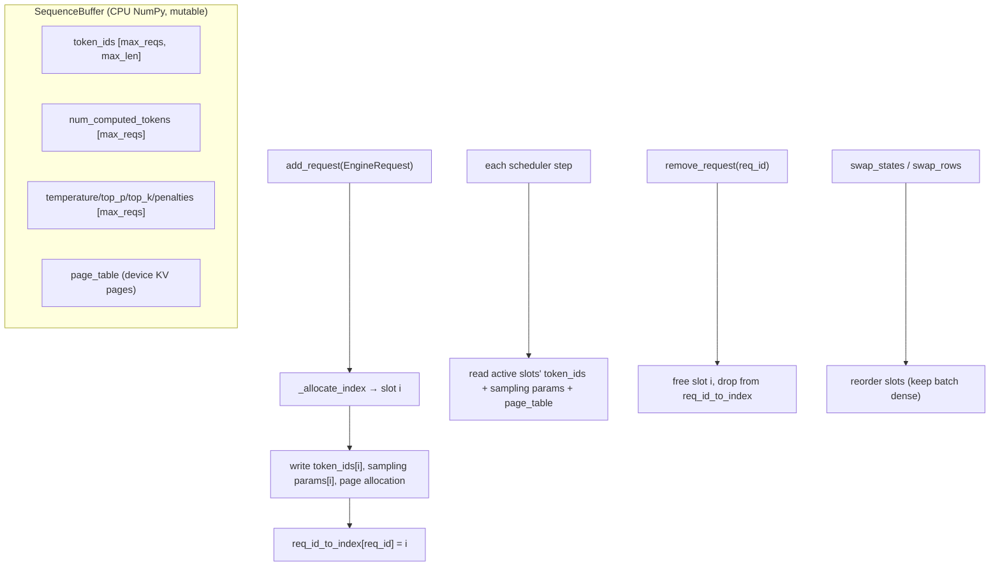

# easydel/inference/esurge/runners/sequence_buffer — the CPU-side batch-slot state for continuous batching

## Overview
`SequenceBuffer` is the bookkeeping backbone of eSurge's continuous batching: a fixed-capacity, *slot-indexed* table holding, for up to `max_num_reqs` concurrent requests, each one's [`token_ids`](../catalog/easydel/inference/esurge/runners/sequence_buffer.md#SequenceBuffer.token_ids), progress counters ([`num_computed_tokens`](../catalog/easydel/inference/esurge/runners/sequence_buffer.md#SequenceBuffer.num_computed_tokens), [`num_tokens`](../catalog/easydel/inference/esurge/runners/sequence_buffer.md#SequenceBuffer.num_tokens), [`num_prompt_tokens`](../catalog/easydel/inference/esurge/runners/sequence_buffer.md#SequenceBuffer.num_prompt_tokens)), per-request sampling parameters ([`temperature`](../catalog/easydel/inference/esurge/runners/sequence_buffer.md#SequenceBuffer.temperature), [`top_p`](../catalog/easydel/inference/esurge/runners/sequence_buffer.md#SequenceBuffer.top_p), [`top_k`](../catalog/easydel/inference/esurge/runners/sequence_buffer.md#SequenceBuffer.top_k), the penalty vectors), and the [`page_table`](../catalog/easydel/inference/esurge/runners/sequence_buffer.md#SequenceBuffer.page_table) mapping each request to its paged-KV allocation. The two design decisions that define it: **NumPy arrays on CPU** for all the metadata (so slot management is cheap host-side scalar work, not device round-trips), and **mutable in-place** methods (unlike the functional cache) because this is host orchestration, not a traced computation. A [`req_id_to_index`](../catalog/easydel/inference/esurge/runners/sequence_buffer.md#SequenceBuffer.req_id_to_index) map translates request IDs to physical slots.

## Diagram

## Design rationale (why it's built this way)
- **CPU NumPy metadata, device only for KV.** The docstring is explicit: "NumPy arrays stay on CPU for fast metadata operations / PageTable manages device-side KV cache allocations." Slot allocation, sampling-param lookup, and progress tracking are host-side scalar/array ops — keeping them off-device avoids a host↔device sync on every scheduler tick, which would dominate at high request rates. Only the KV pages (via [`page_table`](../catalog/easydel/inference/esurge/runners/sequence_buffer.md#SequenceBuffer.page_table)) live on the accelerator.
- **Mutable in-place, deliberately.** Unlike the functional caching views, `SequenceBuffer`'s methods "modify state in-place (return None)" — a "simplified mental model: direct state mutations." Because this is host orchestration outside `jit`, immutability would only add allocation churn; mutation is the right model.
- **Fixed-capacity slot table with an index map.** Every array is `[max_num_reqs, ...]`, and [`add_request`](../catalog/easydel/inference/esurge/runners/sequence_buffer.md#SequenceBuffer.add_request) allocates a physical slot via `_allocate_index`, recording it in [`req_id_to_index`](../catalog/easydel/inference/esurge/runners/sequence_buffer.md#SequenceBuffer.req_id_to_index). Pre-allocating the whole table means no per-request allocation and a stable batch layout the model step can index directly.
- **Slot swapping keeps the active batch dense.** [`swap_states`](../catalog/easydel/inference/esurge/runners/sequence_buffer.md#SequenceBuffer.swap_states) / [`swap_rows`](../catalog/easydel/inference/esurge/runners/sequence_buffer.md#swap_rows) reorder slots so active requests stay packed after removals — important because the model processes a contiguous prefix of slots, and gaps would waste compute. [`_layout_version`](../catalog/easydel/inference/esurge/runners/sequence_buffer.md#SequenceBuffer._layout_version) tracks when the layout changed so downstream metadata can be rebuilt.
- **Full sampling-parameter matrix per slot.** The buffer holds vectorized [`temperature`](../catalog/easydel/inference/esurge/runners/sequence_buffer.md#SequenceBuffer.temperature)/[`top_p`](../catalog/easydel/inference/esurge/runners/sequence_buffer.md#SequenceBuffer.top_p)/[`top_k`](../catalog/easydel/inference/esurge/runners/sequence_buffer.md#SequenceBuffer.top_k)/[`min_p`](../catalog/easydel/inference/esurge/runners/sequence_buffer.md#SequenceBuffer.min_p), the penalty arrays ([`frequency_penalties`](../catalog/easydel/inference/esurge/runners/sequence_buffer.md#SequenceBuffer.frequency_penalties), [`presence_penalties`](../catalog/easydel/inference/esurge/runners/sequence_buffer.md#SequenceBuffer.presence_penalties), [`repetition_penalties`](../catalog/easydel/inference/esurge/runners/sequence_buffer.md#SequenceBuffer.repetition_penalties)), and constraint masks ([`allowed_token_ids_mask`](../catalog/easydel/inference/esurge/runners/sequence_buffer.md#SequenceBuffer.allowed_token_ids_mask), [`bad_words_token_ids`](../catalog/easydel/inference/esurge/runners/sequence_buffer.md#SequenceBuffer.bad_words_token_ids), [`logit_bias`](../catalog/easydel/inference/esurge/runners/sequence_buffer.md#SequenceBuffer.logit_bias)) — so a batched sampler can apply per-request sampling in one vectorized pass.

## Entry points
- [`add_request`](../catalog/easydel/inference/esurge/runners/sequence_buffer.md#SequenceBuffer.add_request) — allocate a slot for a new `EngineRequest`, write its tokens/sampling params/page allocation, and register it in [`req_id_to_index`](../catalog/easydel/inference/esurge/runners/sequence_buffer.md#SequenceBuffer.req_id_to_index); handles prompt truncation past `max_model_len`.
- [`remove_request`](../catalog/easydel/inference/esurge/runners/sequence_buffer.md#SequenceBuffer.remove_request) — free a finished request's slot and drop it from the index map; returns the freed index.
- [`swap_states`](../catalog/easydel/inference/esurge/runners/sequence_buffer.md#SequenceBuffer.swap_states) / [`swap_rows`](../catalog/easydel/inference/esurge/runners/sequence_buffer.md#swap_rows) — reorder slots to keep the active batch dense.
- [`clear`](../catalog/easydel/inference/esurge/runners/sequence_buffer.md#SequenceBuffer.clear) — reset the buffer.
- [`_process_sampling_params`](../catalog/easydel/inference/esurge/runners/sequence_buffer.md#SequenceBuffer._process_sampling_params) / `get_active_sampling_params` — materialize the per-slot sampling config for the sampler.

## Mechanism (step-by-step)
1. **Preallocate the table.** The constructor creates all `[max_num_reqs, ...]` NumPy arrays ([`token_ids`](../catalog/easydel/inference/esurge/runners/sequence_buffer.md#SequenceBuffer.token_ids), the counters, sampling vectors initialized to sentinels like `temperature = -1`) plus the device-side page table sized from `page_sizes`.
2. **Admit a request into a slot.** [`add_request`](../catalog/easydel/inference/esurge/runners/sequence_buffer.md#SequenceBuffer.add_request) checks the ID isn't already present, `_allocate_index`es a slot, writes the prompt tokens (truncating if over `max_model_len`), stores the sampling params via [`_process_sampling_params`](../catalog/easydel/inference/esurge/runners/sequence_buffer.md#SequenceBuffer._process_sampling_params), and records the mapping.
3. **Each step reads active slots.** The runner reads the contiguous active-slot prefix — [`token_ids`](../catalog/easydel/inference/esurge/runners/sequence_buffer.md#SequenceBuffer.token_ids), [`num_computed_tokens`](../catalog/easydel/inference/esurge/runners/sequence_buffer.md#SequenceBuffer.num_computed_tokens), sampling matrix, [`page_table`](../catalog/easydel/inference/esurge/runners/sequence_buffer.md#SequenceBuffer.page_table) — building the paged-attention metadata; [`_update_request_distribution`](../catalog/easydel/inference/esurge/runners/sequence_buffer.md#SequenceBuffer._update_request_distribution) maintains the RPA-v3 request distribution.
4. **Retire + compact.** When a request finishes, [`remove_request`](../catalog/easydel/inference/esurge/runners/sequence_buffer.md#SequenceBuffer.remove_request) frees its slot and [`swap_states`](../catalog/easydel/inference/esurge/runners/sequence_buffer.md#SequenceBuffer.swap_states)/[`swap_rows`](../catalog/easydel/inference/esurge/runners/sequence_buffer.md#swap_rows) repack the batch, bumping [`_layout_version`](../catalog/easydel/inference/esurge/runners/sequence_buffer.md#SequenceBuffer._layout_version) so dependent metadata rebuilds.

## Key data structures
- Per-slot sequence state: [`token_ids`](../catalog/easydel/inference/esurge/runners/sequence_buffer.md#SequenceBuffer.token_ids), [`num_tokens`](../catalog/easydel/inference/esurge/runners/sequence_buffer.md#SequenceBuffer.num_tokens)/[`num_tokens_no_spec`](../catalog/easydel/inference/esurge/runners/sequence_buffer.md#SequenceBuffer.num_tokens_no_spec)/[`num_prompt_tokens`](../catalog/easydel/inference/esurge/runners/sequence_buffer.md#SequenceBuffer.num_prompt_tokens)/[`num_computed_tokens`](../catalog/easydel/inference/esurge/runners/sequence_buffer.md#SequenceBuffer.num_computed_tokens), [`req_output_token_ids`](../catalog/easydel/inference/esurge/runners/sequence_buffer.md#SequenceBuffer.req_output_token_ids).
- Per-slot sampling: [`temperature`](../catalog/easydel/inference/esurge/runners/sequence_buffer.md#SequenceBuffer.temperature)/[`top_p`](../catalog/easydel/inference/esurge/runners/sequence_buffer.md#SequenceBuffer.top_p)/[`top_k`](../catalog/easydel/inference/esurge/runners/sequence_buffer.md#SequenceBuffer.top_k)/[`min_p`](../catalog/easydel/inference/esurge/runners/sequence_buffer.md#SequenceBuffer.min_p), penalties, [`generator_seeds`](../catalog/easydel/inference/esurge/runners/sequence_buffer.md#SequenceBuffer.generator_seeds), [`min_tokens`](../catalog/easydel/inference/esurge/runners/sequence_buffer.md#SequenceBuffer.min_tokens), [`num_logprobs`](../catalog/easydel/inference/esurge/runners/sequence_buffer.md#SequenceBuffer.num_logprobs), constraint masks.
- Routing: [`req_id_to_index`](../catalog/easydel/inference/esurge/runners/sequence_buffer.md#SequenceBuffer.req_id_to_index), [`_req_ids`](../catalog/easydel/inference/esurge/runners/sequence_buffer.md#SequenceBuffer._req_ids), [`page_table`](../catalog/easydel/inference/esurge/runners/sequence_buffer.md#SequenceBuffer.page_table), [`_layout_version`](../catalog/easydel/inference/esurge/runners/sequence_buffer.md#SequenceBuffer._layout_version).

## Dynamics (design intent)
> [!inferred] The CPU-metadata / device-KV split is the throughput crux: at hundreds of requests/sec the scheduler mutates this buffer constantly, and doing that on host NumPy (with only the KV pages on-device) keeps the accelerator free for the model step. The dense-batch compaction ensures the model always processes a gap-free slot prefix, so removed requests don't leave holes that waste compute.

## Edge cases
- **Duplicate request ID** raises in [`add_request`](../catalog/easydel/inference/esurge/runners/sequence_buffer.md#SequenceBuffer.add_request); **buffer full** raises `RuntimeError`.
- **Prompt over `max_model_len`** is truncated on admission — the caller's full prompt may not all be attended.
- **Layout changes without a `_layout_version` bump** would leave stale downstream metadata — the version counter exists precisely to invalidate it.

## Open questions
> [!inferred] `ModelRunnerSamplingMetadata` (the `@auto_pytree` device-side sampling metadata assembled from this buffer) and the `PageTable` internals are adjacent but only partially in this packet's subgraph; this page documents the host-side slot buffer and its cited fields/methods.

## See also
- [easydel/inference/esurge/esurge_engine](easydel-inference-esurge-esurge_engine.md) — the engine whose scheduler drives this buffer.
- [easydel/caching/ragged_page/cache](easydel-caching-ragged_page-cache.md) — the device KV pages the `page_table` allocates from.
- [easydel/operations/requirements/types](easydel-operations-requirements-types.md) — the metadata-field flags (`SLOT_MAPPING`, `REQUEST_DISTRIBUTION`) this buffer feeds.

## Sources
- raw/code/EasyDeL/easydel/inference/esurge/runners/sequence_buffer.py
