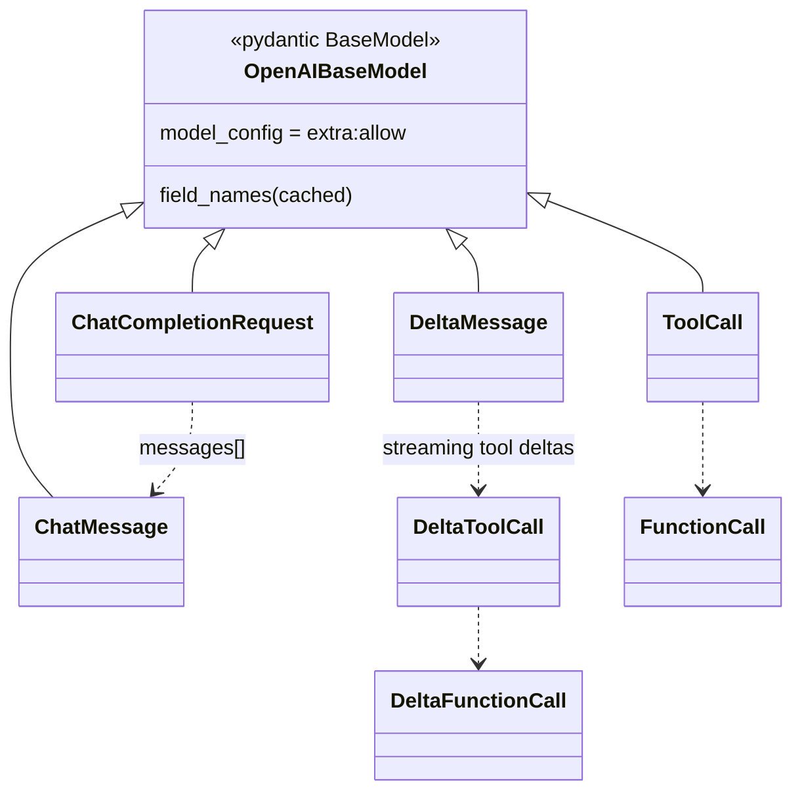

# easydel/inference/openai_api_modules — the OpenAI-compatible request/response Pydantic schema

## Overview
This module is the wire-format layer that makes EasyDeL's serving stack a drop-in OpenAI-API replacement: a set of Pydantic models mirroring the OpenAI Chat/Completions schema — [`ChatCompletionRequest`](../catalog/easydel/inference/openai_api_modules.md#ChatCompletionRequest), [`ChatMessage`](../catalog/easydel/inference/openai_api_modules.md#ChatMessage), the streaming [`DeltaMessage`](../catalog/easydel/inference/openai_api_modules.md#DeltaMessage)/[`DeltaToolCall`](../catalog/easydel/inference/openai_api_modules.md#DeltaToolCall)/[`DeltaFunctionCall`](../catalog/easydel/inference/openai_api_modules.md#DeltaFunctionCall) types, tool-calling ([`ToolCall`](../catalog/easydel/inference/openai_api_modules.md#ToolCall)/[`FunctionCall`](../catalog/easydel/inference/openai_api_modules.md#FunctionCall)/[`ExtractedToolCallInformation`](../catalog/easydel/inference/openai_api_modules.md#ExtractedToolCallInformation)), and completion/usage types. It has no performance role — it exists so an existing OpenAI client can point at an eSurge server unchanged. The one shared behavior lives in [`OpenAIBaseModel`](../catalog/easydel/inference/openai_api_modules.md#OpenAIBaseModel): permissive parsing (`extra="allow"`) so unknown fields from newer/variant clients don't 400, plus field-name caching.

## Diagram

## Design rationale (why it's built this way)
- **Permissive parsing so real clients don't break.** [`OpenAIBaseModel`](../catalog/easydel/inference/openai_api_modules.md#OpenAIBaseModel) sets `model_config = ConfigDict(extra="allow")` — unknown fields are accepted rather than rejected. Because OpenAI clients send provider-specific or newer fields, a strict schema would reject valid-enough requests; allowing extras keeps compatibility broad. A `model_validator(mode="wrap")` caches the known `field_names` (including aliases) on the class for cheap membership checks.
- **Separate streaming delta types.** Non-streaming responses use full message types; streaming uses [`DeltaMessage`](../catalog/easydel/inference/openai_api_modules.md#DeltaMessage) / [`DeltaToolCall`](../catalog/easydel/inference/openai_api_modules.md#DeltaToolCall) / [`DeltaFunctionCall`](../catalog/easydel/inference/openai_api_modules.md#DeltaFunctionCall) carrying only the incremental fields — matching OpenAI's SSE chunk format where each event contains just the diff. This maps directly to eSurge's `RequestOutput.delta_text`.
- **Tool calling as first-class types.** [`ToolCall`](../catalog/easydel/inference/openai_api_modules.md#ToolCall)/[`FunctionCall`](../catalog/easydel/inference/openai_api_modules.md#FunctionCall) model the request/response side, while [`ExtractedToolCallInformation`](../catalog/easydel/inference/openai_api_modules.md#ExtractedToolCallInformation) is the *parser* output — the engine's tool-parser turns raw model text into structured tool calls, and this type is the bridge between generated text and the API's tool-call fields.
- **Pydantic, not dataclasses.** Unlike the model-internal `@auto_pytree` dataclasses, these are Pydantic `BaseModel`s — they need validation, aliasing, and JSON (de)serialization at the HTTP boundary, which Pydantic provides; they never enter `jit`, so pytree compatibility is irrelevant here.

## Entry points
- [`ChatCompletionRequest`](../catalog/easydel/inference/openai_api_modules.md#ChatCompletionRequest) — the parsed `/v1/chat/completions` request body (messages, sampling params, tools); the server validates the incoming JSON into this.
- [`ChatMessage`](../catalog/easydel/inference/openai_api_modules.md#ChatMessage) — one conversation message (role + content) inside a request/response.
- [`DeltaMessage`](../catalog/easydel/inference/openai_api_modules.md#DeltaMessage) (+ [`DeltaToolCall`](../catalog/easydel/inference/openai_api_modules.md#DeltaToolCall)/[`DeltaFunctionCall`](../catalog/easydel/inference/openai_api_modules.md#DeltaFunctionCall)) — the streaming-chunk payloads emitted per token/step.
- [`ExtractedToolCallInformation`](../catalog/easydel/inference/openai_api_modules.md#ExtractedToolCallInformation) — the tool-parser's structured output, feeding [`ToolCall`](../catalog/easydel/inference/openai_api_modules.md#ToolCall)/[`FunctionCall`](../catalog/easydel/inference/openai_api_modules.md#FunctionCall) into the response.

## Mechanism (step-by-step)
1. **Inbound JSON validates into a request model.** The server parses the HTTP body into a [`ChatCompletionRequest`](../catalog/easydel/inference/openai_api_modules.md#ChatCompletionRequest); [`OpenAIBaseModel`](../catalog/easydel/inference/openai_api_modules.md#OpenAIBaseModel)'s `extra="allow"` accepts unknown fields, and the wrap-validator caches field names.
2. **Messages become engine input.** The [`ChatMessage`](../catalog/easydel/inference/openai_api_modules.md#ChatMessage) list is templated into a prompt for the engine; sampling params carry into the `SequenceBuffer`'s per-request sampling slots.
3. **Streaming emits deltas.** As the engine produces `delta_text`, the server wraps each increment in a [`DeltaMessage`](../catalog/easydel/inference/openai_api_modules.md#DeltaMessage) (with [`DeltaToolCall`](../catalog/easydel/inference/openai_api_modules.md#DeltaToolCall) for tool-call streaming) and serializes it as an SSE chunk.
4. **Tool calls parsed back into structure.** When the model emits tool-call syntax, the tool parser produces an [`ExtractedToolCallInformation`](../catalog/easydel/inference/openai_api_modules.md#ExtractedToolCallInformation) which populates [`ToolCall`](../catalog/easydel/inference/openai_api_modules.md#ToolCall)/[`FunctionCall`](../catalog/easydel/inference/openai_api_modules.md#FunctionCall) fields in the response.

## Key data structures
- [`OpenAIBaseModel`](../catalog/easydel/inference/openai_api_modules.md#OpenAIBaseModel) — the permissive Pydantic base with cached `field_names`.
- Request/response: [`ChatCompletionRequest`](../catalog/easydel/inference/openai_api_modules.md#ChatCompletionRequest), [`ChatMessage`](../catalog/easydel/inference/openai_api_modules.md#ChatMessage), completion/usage types.
- Streaming: [`DeltaMessage`](../catalog/easydel/inference/openai_api_modules.md#DeltaMessage), [`DeltaToolCall`](../catalog/easydel/inference/openai_api_modules.md#DeltaToolCall), [`DeltaFunctionCall`](../catalog/easydel/inference/openai_api_modules.md#DeltaFunctionCall).
- Tools: [`ToolCall`](../catalog/easydel/inference/openai_api_modules.md#ToolCall), [`FunctionCall`](../catalog/easydel/inference/openai_api_modules.md#FunctionCall), [`ExtractedToolCallInformation`](../catalog/easydel/inference/openai_api_modules.md#ExtractedToolCallInformation).

## Dynamics (design intent)
> [!inferred] This schema is the compatibility contract that lets EasyDeL slot into existing OpenAI tooling — the reason the engine bothers with streaming delta types and tool-call parsing is to be indistinguishable from the OpenAI API to a client, so the accelerator-side throughput work (eSurge) is usable without changing client code.

## Edge cases
- **Unknown fields are silently accepted** (`extra="allow"`) — a client typo in a field name won't error, it just won't take effect.
- **Streaming vs non-streaming** use different model types — a handler must emit `Delta*` types for SSE and full types otherwise.
- **Tool-call extraction depends on the model's output format** matching the configured parser — a mismatch yields no [`ExtractedToolCallInformation`](../catalog/easydel/inference/openai_api_modules.md#ExtractedToolCallInformation) and the call is lost.

## Open questions
> [!inferred] The completion/responses request variants and the exact field lists are broader than this packet's citation subgraph; this page documents the base + the cited chat/streaming/tool types.

## See also
- [easydel/inference/esurge/esurge_engine](easydel-inference-esurge-esurge_engine.md) — the engine whose `RequestOutput` these types wrap for the HTTP layer.
- [easydel/inference/esurge/runners/sequence_buffer](easydel-inference-esurge-runners-sequence_buffer.md) — where request sampling params land.

## Sources
- raw/code/EasyDeL/easydel/inference/openai_api_modules.py
