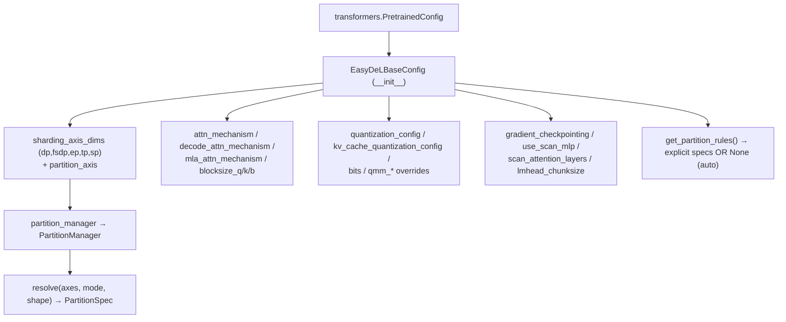

# easydel/infra/base_config — the central config that carries every sharding, kernel, and quantization knob

## Overview
[`EasyDeLBaseConfig`](../catalog/easydel/infra/base_config.md#EasyDeLBaseConfig) extends HuggingFace's `PretrainedConfig` with *everything EasyDeL needs to run a model on a mesh*: the parallelism axis sizes, the attention-kernel choice, block sizes, MoE tiling, quantization configs, gradient-checkpointing policy, and RoPE/scan flags. It is the single object threaded into every module — this is the page to read to understand "what knob controls X." From a performance standpoint it is the most important surface in the whole codebase, because almost every optimization decision (which attention kernel, how to shard, whether to quantize KV, whether to scan MLPs) is a field here read by the layers. Two methods matter above the field list: [`partition_manager`](../catalog/easydel/infra/base_config.md#EasyDeLBaseConfig.partition_manager) turns the config's `partition_axis` into the object that resolves logical→physical sharding, and [`get_partition_rules`](../catalog/easydel/infra/base_config.md#EasyDeLBaseConfig.get_partition_rules) is the per-model override point for explicit parameter sharding.

## Diagram

## Design rationale (why it's built this way)
- **One config object, read everywhere.** Because [`EasyDeLBaseConfig`](../catalog/easydel/infra/base_config.md#EasyDeLBaseConfig) subclasses `PretrainedConfig`, a model's architecture hyperparameters and EasyDeL's runtime/perf knobs live in the *same* object that gets serialized with the checkpoint — so a saved model carries its sharding/kernel intent, not just its weights. The `__init__` docstring enumerates dozens of these knobs; they're grouped by concern (sharding, attention, quantization, memory/scan) rather than separated into sub-configs.
- **Separate train vs. decode kernel selection.** `attn_mechanism` and `decode_attn_mechanism` (plus `mla_attn_mechanism`) are distinct fields — the config acknowledges that the best kernel for a 8k-token training forward is not the best for single-token decode, and lets each be chosen independently (decode falls back to `attn_mechanism` when unset). This is why `UnifiedAttention._create_attention_performer` can honor an MLA-specific mechanism.
- **Explicit partition rules preferred, auto as fallback.** [`get_partition_rules`](../catalog/easydel/infra/base_config.md#EasyDeLBaseConfig.get_partition_rules) returns `None` in the base, and the docstring says returning `None` "signals that partition rules should be resolved automatically from module-level `craft_sharding` hooks" — but also that "providing explicit partition rules is preferred ... as it gives full control." So the system supports both a per-module auto-sharding path (each layer's `craft_sharding`) and a per-model regex-based override, with the model author choosing.
- **`partition_manager` is a computed property, tolerant of dict input.** [`partition_manager`](../catalog/easydel/infra/base_config.md#EasyDeLBaseConfig.partition_manager) lazily builds a `PartitionManager` from `self.partition_axis`, constructing a default `PartitionAxis()` if unset and coercing a dict into one — so a config deserialized from JSON (where `partition_axis` is a dict) still yields a working manager.

## Entry points
- [`EasyDeLBaseConfig.__init__`](../catalog/easydel/infra/base_config.md#EasyDeLBaseConfig.__init__) — captures the full knob set (`sharding_axis_dims`, `attn_mechanism`, `blocksize_q/k/b`, `moe_tiling_size_*`, `quantization_config`, `gradient_checkpointing`, `use_scan_mlp`, `lmhead_chunksize`, ...). Reached at model construction; a subclass config for a specific architecture calls `super().__init__` with the architecture's dims plus any EasyDeL overrides.
- [`partition_manager`](../catalog/easydel/infra/base_config.md#EasyDeLBaseConfig.partition_manager) — the property every sharding-aware call site reads (attention's `shard_attention_prod`, the linears' `craft_sharding`, the caches' `init`); it yields the `PartitionManager` whose `resolve(axes, mode, shape)` produces the actual `PartitionSpec`.
- [`get_partition_rules`](../catalog/easydel/infra/base_config.md#EasyDeLBaseConfig.get_partition_rules) — the per-model override point for explicit `(regex, PartitionSpec)` parameter-sharding rules; returns `None` (auto) unless a subclass overrides it.

## Mechanism (step-by-step)
1. **Construction merges architecture + runtime knobs.** [`EasyDeLBaseConfig.__init__`](../catalog/easydel/infra/base_config.md#EasyDeLBaseConfig.__init__) sets the parallelism plan (`sharding_axis_dims` for `(dp, fsdp, ep, tp, sp)`, `-1` meaning "consume remaining devices"), the attention-kernel selections, block/tiling sizes, quantization configs, and memory knobs. A per-architecture subclass adds its model dims on top; the whole thing is one serializable object.
2. **Sharding resolves through the partition manager.** When a layer needs to shard a tensor, it reads [`partition_manager`](../catalog/easydel/infra/base_config.md#EasyDeLBaseConfig.partition_manager) (built once from `partition_axis`), which translates logical axis names (`"dp"`, `"tp"`, `"sp"`, ...) into physical mesh specs via `resolve(...)` — the config is the source of truth for that mapping, so changing `sharding_axis_dims` re-plans the whole model's parallelism without touching layer code.
3. **Parameter sharding: explicit or automatic.** If a subclass overrides [`get_partition_rules`](../catalog/easydel/infra/base_config.md#EasyDeLBaseConfig.get_partition_rules) to return `(pattern, PartitionSpec)` tuples, those regex rules assign specs to matching parameter names; if it returns `None`, the build falls back to each module's `craft_sharding` hook. The two paths are mutually exclusive per model.
4. **`__hash__ = hash_fn` makes the config a cache key.** The config is hashable ([`hash_fn`](../catalog/easydel/utils/compiling_utils.md#hash_fn)), so it can key JIT-compilation caches — two runs with identical configs (including all perf knobs) reuse compiled artifacts, and any knob change invalidates them.

## Key data structures
- The parallelism plan: `sharding_axis_dims`, `sharding_axis_names` (`("dp","fsdp","ep","tp","sp")`), `partition_axis`, `sharding_dcn_axis_dims` (multi-slice).
- Attention knobs: `attn_mechanism`, `decode_attn_mechanism`, `mla_attn_mechanism`, `blocksize_q`/`blocksize_k`/`blocksize_b`, `flash_attention_backward_pass_impl`.
- Memory/throughput knobs: `gradient_checkpointing`(+targets), `use_scan_mlp`/`scan_mlp_chunk_size`, `scan_attention_layers`, `lmhead_chunksize`, `moe_tiling_size_*`.
- Quantization: `quantization_config`, `kv_cache_quantization_config`, `bits`, `qmm_platform_override`, `qmm_tpu_path_override`, `use_qmm_best_config`.

## Dynamics (design intent)
> [!inferred] Because the config is hashable and serialized with the checkpoint, it doubles as both the compile-cache key and the reproducibility record — an experiment's exact kernel/sharding/quantization choices are recoverable from the saved config, which is why the autoresearch loop can diff configs to attribute a perf delta to a specific knob change.

## Edge cases
- **`sharding_axis_dims` with `-1`** consumes all remaining devices on that axis — exactly one axis should carry `-1`, or the mesh size is ambiguous.
- **`decode_attn_mechanism = None`** silently falls back to `attn_mechanism` — a decode-time kernel regression can hide behind an unset field.
- **`get_partition_rules` returning `None`** means the model relies entirely on per-module `craft_sharding`; mixing an explicit rule set that doesn't cover all params can leave some parameters unsharded.

## Open questions
> [!inferred] `add_basic_configurations`, `attach_custom_arguments`, and the full field-parsing logic are large adjacent methods not in this packet's citation subgraph; this page documents the config's role and its two sharding methods, not the exhaustive field semantics (see the `__init__` docstring in source for the complete knob catalog).

## See also
- [easydel/infra/base_module](easydel-infra-base_module.md) — the module base that reads this config to build/shard the model.
- [easydel/layers/attention/_unified](easydel-layers-attention-_unified.md) — reads `attn_mechanism`/`partition_manager`.
- [easydel/layers/linears/_linear](easydel-layers-linears-_linear.md) — uses `partition_manager` for `craft_sharding`.
- [easydel/infra/factory](easydel-infra-factory.md) — registers configs to model classes.

## Sources
- raw/code/EasyDeL/easydel/infra/base_config.py
