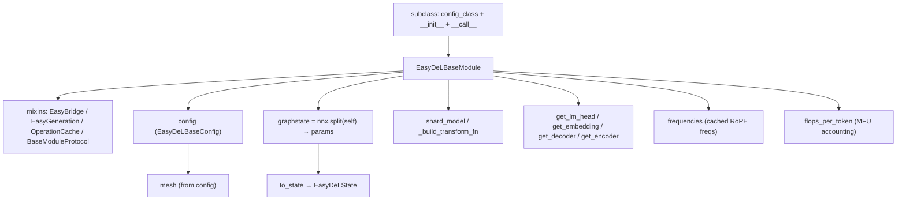

# easydel/infra/base_module — the Flax-NNX model base with sharding, state-split, and RoPE plumbing

<!-- connect:up:begin -->
> **Cross-repo concept:** part of [sharding](../../../concepts/sharding.md) across this wiki's repos.
<!-- connect:up:end -->
## Overview
[`EasyDeLBaseModule`](../catalog/easydel/infra/base_module.md#EasyDeLBaseModule) is the root class every EasyDeL model inherits from. Beyond being a Flax NNX `nn.Module`, it mixes in bridge (HuggingFace conversion), generation, and operation-cache capabilities, and it centralizes the machinery a distributed model needs but that shouldn't be re-written per architecture: pulling the device [`mesh`](../catalog/easydel/infra/base_module.md#EasyDeLBaseModule) from the config, splitting parameters out as a [`graphstate`](../catalog/easydel/infra/base_module.md#EasyDeLBaseModule) for functional transforms, sharding the whole model, computing RoPE [`frequencies`](../catalog/easydel/infra/base_module.md#EasyDeLBaseModule.frequencies) once, and offering uniform `get_lm_head`/`get_embedding`/`get_decoder` accessors so generic training/generation code can reach into any model. The single mental model: a subclass supplies `config_class`, a constructor that builds its layers, and `__call__`; everything about *running that model on a mesh* comes from this base.

## Diagram

## Design rationale (why it's built this way)
- **Config carries the mesh; the module just reads it.** [`mesh`](../catalog/easydel/infra/base_module.md#EasyDeLBaseModule) returns `self.config.mesh` — the module never constructs a mesh, keeping the single source of parallelism truth in [`EasyDeLBaseConfig`](../catalog/easydel/infra/base_config.md#EasyDeLBaseConfig). Every sharding operation on the model routes through the config's plan.
- **Params are split out for functional JAX, not held as mutable state.** [`graphstate`](../catalog/easydel/infra/base_module.md#EasyDeLBaseModule) uses `flax.nnx.split` to separate the parameter `GraphState` from the graph definition — the docstring notes this yields params "that can be manipulated, serialized, or used in functional transformations." This is the NNX idiom that lets an optimizer/`jit` treat the model params as a pytree while the module object stays as the structural definition; [`to_state`](../catalog/easydel/infra/base_module.md#EasyDeLBaseModule) packages that into an [`EasyDeLState`](../catalog/easydel/infra/base_state.md#EasyDeLState).
- **Uniform structural accessors decouple generic code from architectures.** [`get_lm_head`](../catalog/easydel/infra/base_module.md#EasyDeLBaseModule.get_lm_head), [`get_embedding`](../catalog/easydel/infra/base_module.md#EasyDeLBaseModule.get_embedding), [`get_decoder`](../catalog/easydel/infra/base_module.md#EasyDeLBaseModule.get_decoder), [`get_encoder`](../catalog/easydel/infra/base_module.md#EasyDeLBaseModule.get_encoder) all raise `NotImplementedError` in the base and are overridden per model. Generation code (weight tying, logit projection) can then call `model.get_lm_head()` without knowing the concrete class — the accessor is the contract.
- **RoPE frequencies computed once, cached on the module.** [`frequencies`](../catalog/easydel/infra/base_module.md#EasyDeLBaseModule.frequencies) delegates to `config.get_basic_frequencies()` and (with its `inv_frequencies` sibling as a `@cached_property`) is computed on first access and reused — so the RoPE table isn't recomputed every forward, and it's threaded into attention as the `frequencies=` arg.
- **Built-in MFU accounting.** [`flops_per_token`](../catalog/easydel/infra/base_module.md#EasyDeLBaseModule.flops_per_token) estimates per-token FLOPs (optionally ×3 for backward) so training loops can compute MFU directly from the model — an explicit acknowledgment that throughput measurement is a first-class concern, not an afterthought.

## Entry points
- [`EasyDeLBaseModule.__init__`](../catalog/easydel/infra/base_module.md#EasyDeLBaseModule.__init__) — every subclass must call `super().__init__(config, dtype, param_dtype, precision, rngs)` to wire up config, dtypes, and the mixins before building its layers.
- [`graphstate`](../catalog/easydel/infra/base_module.md#EasyDeLBaseModule) — reached whenever params must be extracted for an optimizer step, checkpoint, or functional transform.
- [`get_lm_head`](../catalog/easydel/infra/base_module.md#EasyDeLBaseModule.get_lm_head) / [`get_embedding`](../catalog/easydel/infra/base_module.md#EasyDeLBaseModule.get_embedding) / [`get_decoder`](../catalog/easydel/infra/base_module.md#EasyDeLBaseModule.get_decoder) / [`get_encoder`](../catalog/easydel/infra/base_module.md#EasyDeLBaseModule.get_encoder) — the structural accessors generic code calls; each raises unless the model overrides it.
- [`config`](../catalog/easydel/infra/base_module.md#EasyDeLBaseModule.config) — the per-instance [`EasyDeLBaseConfig`](../catalog/easydel/infra/base_config.md#EasyDeLBaseConfig) carrying all runtime/perf knobs.

## Mechanism (step-by-step)
1. **Subclass construction wires the base + mixins.** [`EasyDeLBaseModule.__init__`](../catalog/easydel/infra/base_module.md#EasyDeLBaseModule.__init__) stores the [`config`](../catalog/easydel/infra/base_module.md#EasyDeLBaseModule.config), dtypes and precision, initializing the `EasyBridge`/`EasyGeneration`/`OperationCache` mixins so the model gains HF-conversion, `.generate`, and op-cache behavior "for free." The subclass then builds its embed/layers/head.
2. **The mesh and sharding come from the config.** [`mesh`](../catalog/easydel/infra/base_module.md#EasyDeLBaseModule) reads `config.mesh`; `shard_model` and [`_build_transform_fn`](../catalog/easydel/infra/base_module.md#EasyDeLBaseModule) apply per-parameter shard functions (and dtype transforms) across the whole tree, so a freshly-constructed abstract model is materialized and partitioned in one pass using the config's rules.
3. **Params split via NNX for functional use.** [`graphstate`](../catalog/easydel/infra/base_module.md#EasyDeLBaseModule) returns the `nnx.split` parameter state; [`to_state`](../catalog/easydel/infra/base_module.md#EasyDeLBaseModule) bundles it (plus graphdef and step) into an [`EasyDeLState`](../catalog/easydel/infra/base_state.md#EasyDeLState) that the trainer threads through `jit`.
4. **RoPE + FLOPs are model-level services.** [`frequencies`](../catalog/easydel/infra/base_module.md#EasyDeLBaseModule.frequencies) provides the cached RoPE table passed into attention; [`flops_per_token`](../catalog/easydel/infra/base_module.md#EasyDeLBaseModule.flops_per_token) provides the per-token cost used to turn measured step time into MFU.

## Key data structures
- [`config`](../catalog/easydel/infra/base_module.md#EasyDeLBaseModule.config) — the model's [`EasyDeLBaseConfig`](../catalog/easydel/infra/base_config.md#EasyDeLBaseConfig); source of mesh, sharding rules, kernels, quantization.
- `config_class` / `base_model_prefix` / `_model_task` / `_model_type` / `_parameter_transform_rules` — class-level metadata driving config binding, checkpoint prefixing, and HF parameter conversion.
- [`graphstate`](../catalog/easydel/infra/base_module.md#EasyDeLBaseModule) (`nn.GraphState`) — the extracted parameter pytree.

## Dynamics (design intent)
> [!inferred] The NNX split/merge pattern (`graphstate` ↔ module) is what lets EasyDeL keep the ergonomic object-oriented model definition while still handing JAX a pure pytree of params for `jit`/`grad`/`pjit` — the module object is the graphdef, the `GraphState` is the carry. Sharding via [`_build_transform_fn`](../catalog/easydel/infra/base_module.md#EasyDeLBaseModule) applies as a transform over that split, so materialization, dtype casting, and partitioning are one fused traversal.

## Edge cases
- **Forgetting `super().__init__()`** leaves the mixins/config unwired — the base docstring calls this out as the required first step.
- **`get_lm_head`/`get_embedding` on a base model without a head** raise `NotImplementedError` by design — generic code must handle models that legitimately lack these.
- **`flops_per_token` "returns 1 if calculation fails"** — a silent fallback that would make MFU look absurdly low if the FLOP estimation hits an unsupported config shape.

## Open questions
> [!inferred] `shard_model`, `_build_transform_fn`, and the bridge/generation mixin internals are large and mostly outside this packet's citation subgraph; this page documents the base's role and the cited accessor/state/RoPE surface, not the full conversion or generation machinery.

## See also
- [easydel/infra/base_config](easydel-infra-base_config.md) — the config the module reads for mesh/sharding/kernels.
- [easydel/infra/base_state](easydel-infra-base_state.md) — what `to_state` produces.
- [easydel/infra/factory](easydel-infra-factory.md) — binds config classes to module classes.
- [easydel/layers/attention/_unified](easydel-layers-attention-_unified.md) — receives `frequencies` from the module.

## Sources
- raw/code/EasyDeL/easydel/infra/base_module.py
