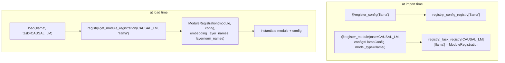

# easydel/infra/factory — the registry that binds model names/tasks to module + config classes

## Overview
This is EasyDeL's plugin registry: a global [`registry`](../catalog/easydel/infra/factory.md#registry) singleton and two decorators, [`register_config`](../catalog/easydel/infra/factory.md#register_config) and [`register_module`](../catalog/easydel/infra/factory.md#register_module), that let each of the ~90 model implementations declare "I am the module for `(task_type, model_type)`" and "I am the config for `model_type`" *at import time*. The point is decoupling: generic loading code (`AutoModelForCausalLM`-style entry points) asks the registry for the class implementing a given `model_type` under a given [`TaskType`](../catalog/easydel/infra/factory.md#TaskType) rather than importing every architecture. The registry keys modules by task so the *same* architecture name (`"llama"`) can have distinct implementations for causal-LM, sequence-classification, etc.

## Diagram

## Design rationale (why it's built this way)
- **Two-axis keying: task × model_type.** [`TaskType`](../catalog/easydel/infra/factory.md#TaskType) enumerates the model heads/roles ([`CAUSAL_LM`](../catalog/easydel/infra/factory.md#TaskType.CAUSAL_LM), `VISION_LM`, `SEQUENCE_CLASSIFICATION`, `IMAGE_CLASSIFICATION`, `SPEECH_SEQUENCE_TO_SEQUENCE`, `EMBEDDING`, `AUTO_BIND`, ...). The `_task_registry` is `dict[TaskType, dict[model_type, ModuleRegistration]]`, so one architecture string maps to different classes per task — a Llama causal-LM and a Llama sequence-classifier are separate registrations under the same `"llama"` key.
- **Registration carries loading metadata, not just the class.** `ModuleRegistration` bundles the module class, its config class, and *optional* `embedding_layer_names`/`layernorm_names` (with `*` wildcards for repeated blocks). This metadata exists so weight-loading, quantization, and analysis code can identify embeddings/norms by pattern without instantiating the model — the registry is the place that knows "this model's norms match `model.layers.*.input_layernorm`."
- **Decorator side-effects at import.** The decorators mutate the global [`registry`](../catalog/easydel/infra/factory.md#registry) when a module file is imported, so simply importing `easydel.modules` populates the whole catalog — no central manifest to keep in sync. `register_config`/`register_module` are thin module-level wrappers delegating to the singleton's methods.
- **`ConfigType` axis for configs.** Configs are registered under a `ConfigType` (currently module configs) separately from modules, so a config class can be looked up independently of any task binding.

## Entry points
- [`register_config`](../catalog/easydel/infra/factory.md#register_config) — decorator applied to a config class (`@register_config("model_type")`); records it in the config registry so `registry.get_config("model_type")` resolves.
- [`register_module`](../catalog/easydel/infra/factory.md#register_module) — decorator applied to a module class with `task_type`, `config`, `model_type` (+ optional layer-name metadata); records a `ModuleRegistration` under `_task_registry[task_type][model_type]`.
- [`registry`](../catalog/easydel/infra/factory.md#registry) — the global singleton every decorator writes to and every loader reads from (`get_config`, `get_module_registration`).
- [`TaskType`](../catalog/easydel/infra/factory.md#TaskType) / [`TaskType.CAUSAL_LM`](../catalog/easydel/infra/factory.md#TaskType.CAUSAL_LM) — the task enumeration used as the primary registry key.

## Mechanism (step-by-step)
1. **Model files register on import.** Each architecture module applies [`register_config`](../catalog/easydel/infra/factory.md#register_config) to its config class and [`register_module`](../catalog/easydel/infra/factory.md#register_module) to its task-specific module class. The decorators call the [`registry`](../catalog/easydel/infra/factory.md#registry) singleton's methods, inserting into `_config_registry` and `_task_registry` respectively.
2. **`register_module` stores a `ModuleRegistration`.** [`register_module`](../catalog/easydel/infra/factory.md#register_module)'s arguments (`task_type`, `config`, `model_type`, `embedding_layer_names`, `layernorm_names`) become a `ModuleRegistration` value keyed by `(task_type, model_type)` — capturing both the class and the metadata needed to load its weights.
3. **Loaders resolve by task + name.** Generic loading code calls the [`registry`](../catalog/easydel/infra/factory.md#registry)'s `get_module_registration(...)` with a [`TaskType`](../catalog/easydel/infra/factory.md#TaskType) (e.g. [`CAUSAL_LM`](../catalog/easydel/infra/factory.md#TaskType.CAUSAL_LM)) and a `model_type` to get the registration, then instantiates the module and its config — never importing the concrete class directly.
4. **`AUTO_BIND` / auto tasks.** [`TaskType`](../catalog/easydel/infra/factory.md#TaskType) includes `AUTO_BIND`, letting a model register a task-agnostic binding the loader can resolve when the caller doesn't pin a specific head.

## Key data structures
- [`registry`](../catalog/easydel/infra/factory.md#registry) — the global `Registry` with `_config_registry: dict[ConfigType, dict]` and `_task_registry: dict[TaskType, dict[str, ModuleRegistration]]`.
- `ModuleRegistration` (`@auto_pytree`) — `{module, config, embedding_layer_names?, layernorm_names?}`.
- [`TaskType`](../catalog/easydel/infra/factory.md#TaskType) / `ConfigType` — the two enum axes the registry is keyed on.

## Dynamics (design intent)
> [!inferred] Because registration is an import side-effect on a mutable global, the set of available models is exactly "what has been imported" — this is what makes `easydel.modules`'s `__init__` imports load-bearing, and why a model that isn't imported is invisible to the loader even if its file exists.

## Edge cases
- **Same `model_type`, different `TaskType`** are independent registrations — looking up the wrong task for a name yields a miss even though the name "exists."
- **Wildcard layer-name patterns** (`model.layers.*.input_layernorm`) must match the model's actual parameter tree; a stale pattern silently fails to identify norms/embeddings for special handling.
- **Import order** determines registration; a module never imported won't be in the registry.

## Open questions
> [!inferred] The `Registry` class's `get_config`/`get_module_registration` bodies and the full decorator implementations are adjacent but only partially in this packet's citation subgraph; this page documents the registry's shape and the cited decorator/enum/singleton surface.

## See also
- [easydel/infra/base_module](easydel-infra-base_module.md) — the module base every registered class subclasses.
- [easydel/infra/base_config](easydel-infra-base_config.md) — the config base every registered config subclasses.

## Sources
- raw/code/EasyDeL/easydel/infra/factory.py
