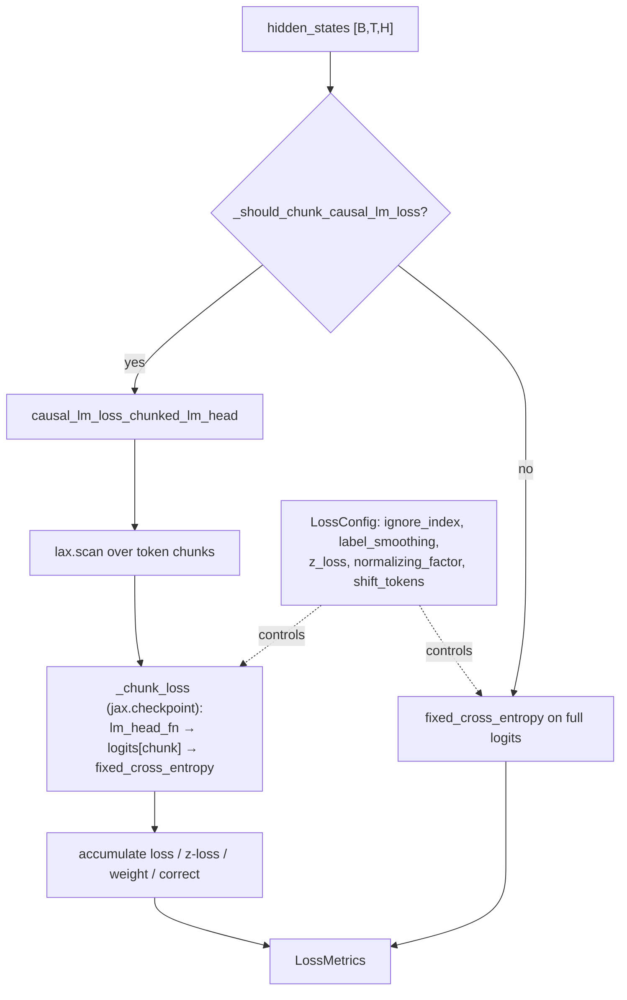

# easydel/infra/loss_utils — cross-entropy with the chunked-LM-head trick that avoids [B,T,V] logits

## Overview
This module computes every training loss, but the reason it matters for performance is one function: [`causal_lm_loss_chunked_lm_head`](../catalog/easydel/infra/loss_utils.md#causal_lm_loss_chunked_lm_head), which projects hidden states through the LM head *in token-dimension chunks* under a `jax.lax.scan`, so the full `[B, T, V]` logits tensor is never materialized — the single largest activation in a large-vocab LLM forward. The rest of the file is the configurable cross-entropy machinery ([`fixed_cross_entropy`](../catalog/easydel/infra/loss_utils.md#fixed_cross_entropy) as the entry point, [`LossConfig`](../catalog/easydel/infra/loss_utils.md#LossConfig) as the knob bag, [`LossMetrics`](../catalog/easydel/infra/loss_utils.md#LossMetrics) as the result), plus the MoE router-balancing loss [`auxiliary_load_balancing_loss_func`](../catalog/easydel/infra/loss_utils.md#auxiliary_load_balancing_loss_func) and per-task loss wrappers. The design idea: cross-entropy has several memory/precision strategies (chunked, blockwise, standard) and the config picks the right one automatically.

## Diagram

## Design rationale (why it's built this way)
- **Chunk the LM head to bound activation memory.** The LM-head projection produces `[B, T, V]` logits — for a 128k vocab and 8k tokens that dwarfs every other activation. [`causal_lm_loss_chunked_lm_head`](../catalog/easydel/infra/loss_utils.md#causal_lm_loss_chunked_lm_head) splits the sequence into equal chunks (padded with `ignore_index` labels), and a `jax.lax.scan` iteration projects one chunk's hidden states, optionally caps logits, computes [`fixed_cross_entropy`](../catalog/easydel/infra/loss_utils.md#fixed_cross_entropy) on it, and accumulates. Only one chunk's logits exist at a time.
- **`jax.checkpoint` on each chunk body.** The docstring: "Each chunk body is wrapped with `jax.checkpoint` so that backward recomputes logits per chunk instead of storing all of them." So the forward keeps no chunk logits and the backward recomputes them chunk-by-chunk — turning the biggest memory cost into recomputation, the classic memory/compute trade the whole autoresearch effort cares about. [`_chunk_loss`](../catalog/easydel/infra/loss_utils.md#causal_lm_loss_chunked_lm_head._chunk_loss) is that per-chunk body.
- **Automatic strategy selection.** [`fixed_cross_entropy`](../catalog/easydel/infra/loss_utils.md#fixed_cross_entropy) is "the main entry point"; it picks chunked / blockwise / standard based on [`LossConfig`](../catalog/easydel/infra/loss_utils.md#LossConfig), and [`_should_chunk_causal_lm_loss`](../catalog/easydel/infra/loss_utils.md#_should_chunk_causal_lm_loss) gates whether chunking applies (it also checks the module *supports* a chunked LM-head forward). The caller doesn't choose the algorithm — the config + shape do.
- **z-loss and label smoothing folded in.** [`LossConfig`](../catalog/easydel/infra/loss_utils.md#LossConfig) carries `z_loss` (penalizes large logits / keeps logsumexp small for training stability) and `label_smoothing` — regularizers that must be applied *inside* the chunked loop so they compose with chunking, not bolted on after.
- **Strategy objects for tasks.** [`CausalLMLossStrategy.compute`](../catalog/easydel/infra/loss_utils.md#CausalLMLossStrategy.compute) plus the `For*Loss` wrappers ([`ForCausalLMLoss`](../catalog/easydel/infra/loss_utils.md#ForCausalLMLoss), [`ForSequenceClassificationLoss`](../catalog/easydel/infra/loss_utils.md#ForSequenceClassificationLoss), [`ForQuestionAnsweringLoss`](../catalog/easydel/infra/loss_utils.md#ForQuestionAnsweringLoss)) give each task its own loss entry while sharing the cross-entropy core.

## Entry points
- [`fixed_cross_entropy`](../catalog/easydel/infra/loss_utils.md#fixed_cross_entropy) — the general cross-entropy entry; selects the memory strategy from [`LossConfig`](../catalog/easydel/infra/loss_utils.md#LossConfig) and returns [`LossMetrics`](../catalog/easydel/infra/loss_utils.md#LossMetrics).
- [`causal_lm_loss_chunked_lm_head`](../catalog/easydel/infra/loss_utils.md#causal_lm_loss_chunked_lm_head) — the memory-optimal causal-LM path; reached when [`_should_chunk_causal_lm_loss`](../catalog/easydel/infra/loss_utils.md#_should_chunk_causal_lm_loss) returns true and the module supports a chunked LM-head forward.
- [`auxiliary_load_balancing_loss_func`](../catalog/easydel/infra/loss_utils.md#auxiliary_load_balancing_loss_func) — the MoE router load-balancing auxiliary loss, added to the main loss for expert-parallel models.
- [`ForCausalLMLoss`](../catalog/easydel/infra/loss_utils.md#ForCausalLMLoss) / [`ForSequenceClassificationLoss`](../catalog/easydel/infra/loss_utils.md#ForSequenceClassificationLoss) / [`ForQuestionAnsweringLoss`](../catalog/easydel/infra/loss_utils.md#ForQuestionAnsweringLoss) — the per-task loss wrappers a model's head calls.

## Mechanism (step-by-step)
1. **Decide whether to chunk.** [`_should_chunk_causal_lm_loss`](../catalog/easydel/infra/loss_utils.md#_should_chunk_causal_lm_loss) checks config + shapes (and that the module supports the chunked forward) to route between the chunked path and full-logit [`fixed_cross_entropy`](../catalog/easydel/infra/loss_utils.md#fixed_cross_entropy).
2. **Chunk, scan, checkpoint.** [`causal_lm_loss_chunked_lm_head`](../catalog/easydel/infra/loss_utils.md#causal_lm_loss_chunked_lm_head) sizes chunks (via `resolve_causal_lm_chunk_token_size`, or an explicit `token_chunk_size`), pads to a multiple, and `lax.scan`s [`_chunk_loss`](../catalog/easydel/infra/loss_utils.md#causal_lm_loss_chunked_lm_head._chunk_loss): project this chunk's hidden states through `lm_head_fn`, optionally `logit_cap_fn`, run [`fixed_cross_entropy`](../catalog/easydel/infra/loss_utils.md#fixed_cross_entropy), and accumulate loss/z-loss/weight/correct — each iteration under `jax.checkpoint`.
3. **Apply normalization.** After the scan, the accumulated loss is divided by the [`LossConfig`](../catalog/easydel/infra/loss_utils.md#LossConfig)'s normalizing factor (resolved from a string via [`convert_special_loss_normalizing_factor_to_enum`](../catalog/easydel/infra/loss_utils.md#convert_special_loss_normalizing_factor_to_enum) → [`SLNF`](../catalog/easydel/infra/loss_utils.md#SLNF), or a constant), optionally by `num_items_in_batch` and by the weight sum ([`get_factor_and_weight`](../catalog/easydel/infra/loss_utils.md#get_factor_and_weight) computes the factor + per-position weights). Result is a [`LossMetrics`](../catalog/easydel/infra/loss_utils.md#LossMetrics).
4. **Add MoE aux loss when present.** For expert models, [`auxiliary_load_balancing_loss_func`](../catalog/easydel/infra/loss_utils.md#auxiliary_load_balancing_loss_func) computes the router-balancing term added to the main loss so experts don't collapse to a few.

## Key data structures
- [`LossConfig`](../catalog/easydel/infra/loss_utils.md#LossConfig) (`@auto_pytree`) — `ignore_index`, `label_smoothing`, `z_loss`, `loss_normalizing_factor`, `num_labels`, `problem_type`, `divide_weight_sum`, `shift_tokens`, chunking options.
- [`LossMetrics`](../catalog/easydel/infra/loss_utils.md#LossMetrics) (`@auto_pytree`) — the loss result bundle (loss, z-loss, accuracy, weight sums) threaded out of the compiled step.
- [`SLNF`](../catalog/easydel/infra/loss_utils.md#SLNF) — the `SpecialLossNormalizingFactor` enum for named normalization strategies.

## Dynamics (design intent)
- The chunked path is a pure memory/compute trade: forward memory drops from `O(B·T·V)` to `O(B·chunk·V)` at the cost of recomputing per-chunk logits in backward. For large-vocab models this is often what makes a longer sequence or larger batch fit at all — exactly the kind of knob the optimization loop tunes via `lmhead_chunksize` in the config.
- z-loss inside the loop keeps the logsumexp bounded per chunk, so the stabilization is consistent whether or not chunking is active.

## Edge cases
- **Module must support a chunked LM-head forward** (`_supports_chunked_causal_lm_forward`) — otherwise chunking is skipped even if config requests it, silently falling back to full logits.
- **Padding chunks with `ignore_index`** means the last chunk may be partly ignored; a chunk size that doesn't divide `T` still works but wastes some compute on padded tokens.
- **`shift_tokens`** must be True for causal LM (next-token prediction) and False for non-autoregressive tasks — getting it wrong silently mis-aligns logits and labels.

## Open questions
> [!inferred] `cross_entropy_blockwise_logits`, the custom-VJP `cross_entropy_with_logits`, and the exact chunk-size heuristics are in this file but outside this packet's citation subgraph; this page focuses on the cited chunked-LM-head + config/metrics + aux-loss surface.

## See also
- [easydel/infra/modeling_outputs](easydel-infra-modeling_outputs.md) — head outputs that feed these loss functions.
- [easydel/infra/base_config](easydel-infra-base_config.md) — `lmhead_chunksize` knob that enables the chunked path.
- [easydel/trainers/base_trainer](easydel-trainers-base_trainer.md) — the loop that calls the loss and reads `LossMetrics`.

## Sources
- raw/code/EasyDeL/easydel/infra/loss_utils.py
